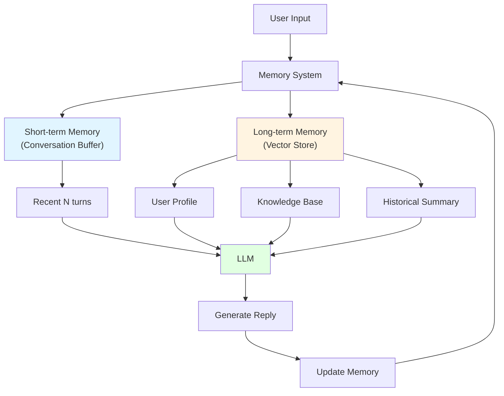

# 12.4 Memory & Storage <DifficultyBadge level="advanced" /> <CostBadge cost="$0.02" />

> Prerequisite: 12.1 RAG Basics

### Why Do We Need It? (Problem)

**Problem: Chatbot's "Goldfish Memory"**

```python
# User conversation
User: "My name is Xiaoming"
AI: "Hello, Xiaoming! Nice to meet you."

User: "I like programming"
AI: "Programming is a great hobby!"

User: "What's my name?"
AI: "Sorry, you didn't tell me your name."  # ❌ Forgot!

# Problem: LLM is stateless, doesn't automatically remember conversation history
```

**Two Types of Memory:**

| Type | Duration | Content | Storage Location |
|-----|------|-----|---------|
| **Short-term Memory** | Current conversation | Context, recent turns | Prompt |
| **Long-term Memory** | Cross-session | User preferences, knowledge base, historical summaries | Database |

### What Is It? (Concept)

**Memory Architecture:**



### Short-term Memory Implementation

**Method 1: Conversation Buffer**

```python
from langchain.memory import ConversationBufferMemory
from langchain.chains import ConversationChain
from langchain.llms import OpenAI

# Create memory
memory = ConversationBufferMemory()

# Create conversation chain
conversation = ConversationChain(
    llm=OpenAI(),
    memory=memory
)

# Conversation
conversation.predict(input="My name is Xiaoming")
# AI: "Hello, Xiaoming! Nice to meet you."

conversation.predict(input="I like programming")
# AI: "Programming is a great hobby!"

conversation.predict(input="What's my name?")
# AI: "Your name is Xiaoming." ✅ Remembered!

# View memory
print(memory.buffer)
# Human: My name is Xiaoming
# AI: Hello, Xiaoming!...
# Human: I like programming
# AI: Programming is...
# ...
```

**Method 2: Conversation Buffer Window**

```python
from langchain.memory import ConversationBufferWindowMemory

# Only keep recent K turns
memory = ConversationBufferWindowMemory(k=3)

conversation = ConversationChain(
    llm=OpenAI(),
    memory=memory
)

# Turn 1
conversation.predict(input="My name is Xiaoming")

# Turn 2
conversation.predict(input="I'm 25 years old")

# Turn 3
conversation.predict(input="I'm in Beijing")

# Turn 4
conversation.predict(input="I like programming")

# Turn 5: Only remembers recent 3 turns
conversation.predict(input="What's my name?")
# AI: "Sorry, I don't remember your name." # ❌ Turn 1 forgotten
```

**Method 3: Conversation Summary**

```python
from langchain.memory import ConversationSummaryMemory

# Automatically summarize conversation history
memory = ConversationSummaryMemory(llm=OpenAI())

conversation = ConversationChain(
    llm=OpenAI(),
    memory=memory
)

# After multiple turns
conversation.predict(input="My name is Xiaoming, 25 years old, working in Beijing, like programming")
conversation.predict(input="I'm recently learning Python")
conversation.predict(input="My goal is to become an AI engineer")

# View summary
print(memory.buffer)
# "User is a 25-year-old Beijing worker named Xiaoming who loves programming,
#  currently learning Python, with a goal to become an AI engineer."

# Next conversation
conversation.predict(input="What's my goal?")
# AI: "Your goal is to become an AI engineer." ✅ Retrieved from summary
```

### Long-term Memory Implementation

**Method 1: User Profile**

```python
import json

class UserMemory:
    def __init__(self):
        self.profile = {}
    
    def update(self, key, value):
        """Update user information"""
        self.profile[key] = value
        # Persist to database
        self.save_to_db()
    
    def get_context(self):
        """Get user context"""
        return f"""
        User information:
        - Name: {self.profile.get('name', 'Unknown')}
        - Age: {self.profile.get('age', 'Unknown')}
        - Preferences: {self.profile.get('preferences', [])}
        - History: {self.profile.get('history', [])}
        """
    
    def save_to_db(self):
        # Save to Redis/MongoDB, etc.
        pass

# Usage
memory = UserMemory()

# Extract information from conversation and update
user_input = "My name is Xiaoming, 25 years old, like programming"
memory.update("name", "Xiaoming")
memory.update("age", 25)
memory.update("preferences", ["programming"])

# Inject context in next conversation
prompt = f"""
{memory.get_context()}

User question: {new_question}
"""
```

**Method 2: Vector Memory**

```python
from langchain.memory import VectorStoreRetrieverMemory
from langchain.vectorstores import Chroma
from langchain.embeddings import OpenAIEmbeddings

# Create vector store
vectorstore = Chroma(
    embedding_function=OpenAIEmbeddings(),
    persist_directory="./user_memory"
)

# Create vector memory
memory = VectorStoreRetrieverMemory(
    retriever=vectorstore.as_retriever(search_kwargs={"k": 3})
)

# Save conversation
memory.save_context(
    {"input": "I like Python"},
    {"output": "Python is a great language!"}
)

memory.save_context(
    {"input": "I'm learning machine learning"},
    {"output": "Machine learning has great prospects!"}
)

# Retrieve relevant memory
memory.load_memory_variables({"prompt": "What programming language do I like?"})
# Returns: I like Python
```

**Method 3: Hybrid Memory**

```python
class HybridMemory:
    def __init__(self):
        # Short-term: Recent conversation
        self.buffer = ConversationBufferWindowMemory(k=5)
        
        # Medium-term: Conversation summary
        self.summary = ConversationSummaryMemory(llm=OpenAI())
        
        # Long-term: Vector storage
        self.vector = VectorStoreRetrieverMemory(
            retriever=vectorstore.as_retriever()
        )
    
    def get_memory(self, query):
        """Comprehensively retrieve memory"""
        # 1. Short-term memory (recent 5 turns)
        recent = self.buffer.load_memory_variables({})
        
        # 2. Medium-term memory (summary)
        summary = self.summary.load_memory_variables({})
        
        # 3. Long-term memory (relevant history)
        long_term = self.vector.load_memory_variables({"prompt": query})
        
        return {
            "recent": recent,
            "summary": summary,
            "long_term": long_term
        }
```

### Practice: Memory Chatbot

```python
from openai import OpenAI
from langchain.memory import ConversationBufferMemory

client = OpenAI()
memory = ConversationBufferMemory(return_messages=True)

def chat(user_input: str):
    """Chat with memory"""
    # 1. Get conversation history
    history = memory.load_memory_variables({})
    messages = history.get("history", [])
    
    # 2. Add current input
    messages.append({"role": "user", "content": user_input})
    
    # 3. Call LLM
    response = client.chat.completions.create(
        model="gpt-4.1-mini",
        messages=messages
    )
    
    assistant_reply = response.choices[0].message.content
    
    # 4. Save to memory
    memory.save_context(
        {"input": user_input},
        {"output": assistant_reply}
    )
    
    return assistant_reply

# Usage
print(chat("My name is Xiaoming"))
# "Hello, Xiaoming! Nice to meet you."

print(chat("I like programming"))
# "Programming is a great hobby!"

print(chat("What's my name?"))
# "Your name is Xiaoming." ✅
```

### Memory Storage Solutions

| Solution | Storage | Advantages | Disadvantages | Suitable for |
|-----|------|-----|------|-----|
| **In-memory** | Python variables | Fast | Lost on restart | Development/testing |
| **Redis** | In-memory database | Fast, persistent | Needs deployment | Production (short-term) |
| **MongoDB** | Document database | Flexible, scalable | Slow queries | User profiles |
| **PostgreSQL** | Relational database | Structured, reliable | Complex | Enterprise-grade |
| **Vector Database** | Chroma/Pinecone | Semantic search | High cost | Long-term memory |

### Hands-on Practice (Practice)

Complete memory chatbot implementation, supports short-term and long-term memory.

<ColabBadge path="demos/12-rag-memory/memory_chatbot.ipynb" />

### Summary (Reflection)

- **What's solved**: Understood AI memory management, implemented chatbot with memory
- **What's not solved**: How to deploy, monitor, optimize production RAG systems? — Chapter 13 introduces production deployment
- **Key Takeaways**:
  1. **Two types of memory**: Short-term (current conversation), Long-term (cross-session)
  2. **Short-term memory strategies**: Buffer (all), Window (recent K turns), Summary (summarization)
  3. **Long-term memory**: User profiles, vector storage, knowledge base
  4. **Hybrid memory**: Combine multiple strategies
  5. **Persistence**: Redis, MongoDB, vector databases

**Ecosystem Section Checkpoint:**

Chapters 9-12 completed the "Ecosystem" section:
- ✅ Chapter 9: AI Agents (single agent)
- ✅ Chapter 10: Multi-Agent (multi-agent collaboration)
- ✅ Chapter 11: MCP/A2A/ANP (interconnection protocols)
- ✅ Chapter 12: RAG & Memory (knowledge management)

**Next Step:**
Chapter 13: Production Deployment — From experiment to production

---

*Last updated: 2026-02-20*
