## 13.4 Cost Optimization & Security <DifficultyBadge level="advanced" /> <CostBadge cost="$0" />

> Prerequisites: 3.1 Token & Billing

### Why Do We Need It? (Problem)

**"Last month's AI API bill: $5000. This month: $15000. What's the budget for next month?"**

AI applications without cost control are like leaky faucets:

| Scenario | Cost Trap | Loss |
|------|---------|------|
| **Long Context Conversations** | Send complete history every time | 10-round conversation = 10x Token consumption |
| **Repeated Questions** | Same question calling LLM repeatedly | Waste 70% Tokens |
| **Batch Processing** | Call individually in real-time | 2x cost compared to batch |
| **Unoptimized Prompts** | Lengthy system prompts | 500 extra Tokens each time |

**Real-world Example:**

```
A corporate document Q&A system:
- System prompt: 3000 Tokens (includes detailed company rules)
- Send system prompt with every query
- 10,000 queries per day = 30M input Tokens
- Monthly cost: $4500 (system prompt alone)

After using Prompt Caching:
- System prompt cached, charged only once
- Monthly cost: $450 (90% reduction)
```

**Why Is AI Application Cost Hard to Control?**

- **Complex Token billing**: Input Tokens, output Tokens, cached Tokens have different prices
- **Opaque costs**: Don't know which features consume most
- **Unpredictable usage**: User behavior varies, Token consumption fluctuates
- **Non-intuitive optimization**: Don't know where to start

**Cost optimization is a core production capability.**

### What Is It? (Concept)

**Cost optimization** reduces Token consumption and API costs through technical means:


### 1. Prompt Caching (Strongest Optimization)

**Principle: Cache unchanging prefix content (like system prompts, documents) for 5 minutes, subsequent requests free or heavily discounted.**

| Provider | Cache Price | Write Price | Savings |
|--------|---------|---------|------|
| **OpenAI** | 50% of input price | 125% of input price | 50% reduction |
| **Anthropic** | 10% of input price | 125% of input price | **90% reduction** |

**Use Cases:**

- Fixed system prompts (same for every request)
- RAG retrieved documents (may be queried repeatedly within 5 minutes)
- Long context document analysis (document content unchanging)

**OpenAI Prompt Caching Example:**

```python
from openai import OpenAI

client = OpenAI()

# Long system prompt (3000 Tokens)
SYSTEM_PROMPT = """
You are a professional customer service assistant... (3000 words of rules omitted)
"""

# Using Prompt Caching
response = client.chat.completions.create(
    model="gpt-4o",  # Requires caching-capable model
    messages=[
        {
            "role": "system",
            "content": [
                {
                    "type": "text",
                    "text": SYSTEM_PROMPT,
                    "cache_control": {"type": "ephemeral"}  # Mark as cacheable
                }
            ]
        },
        {"role": "user", "content": "What is your return policy?"}
    ]
)

# First call: write cache (125% price)
# Subsequent calls within 5 min: use cache (50% price)
```

**Anthropic Prompt Caching (More Aggressive):**

```python
import anthropic

client = anthropic.Anthropic()

# Long document (10000 Tokens)
LONG_DOCUMENT = """(10,000-word document content omitted)"""

response = client.messages.create(
    model="claude-3-5-sonnet-20241022",
    max_tokens=1024,
    system=[
        {
            "type": "text",
            "text": "You are a document analysis assistant."
        },
        {
            "type": "text",
            "text": LONG_DOCUMENT,
            "cache_control": {"type": "ephemeral"}  # Cache document
        }
    ],
    messages=[
        {"role": "user", "content": "Summarize the key points of this document"}
    ]
)

# Cache hit: document part charged at only 10% price (90% reduction)
print(f"Cache read Tokens: {response.usage.cache_read_input_tokens}")
print(f"Cache write Tokens: {response.usage.cache_creation_input_tokens}")
```

**Prompt Caching Best Practices:**


### 2. Batch API (-50% Cost)

**Principle: Offline batch processing of tasks, completed within 24 hours, half the cost.**

| API Type | Cost | Latency | Use Case |
|---------|------|------|---------|
| **Real-time API** | Standard price | <5 seconds | User real-time interaction |
| **Batch API** | **-50%** | <24 hours | Data analysis, content generation, evaluation |

**OpenAI Batch API Example:**

```python
from openai import OpenAI
import json

client = OpenAI()

# 1. Prepare batch task file (JSONL format)
tasks = [
    {
        "custom_id": "task-1",
        "method": "POST",
        "url": "/v1/chat/completions",
        "body": {
            "model": "gpt-4.1-mini",
            "messages": [{"role": "user", "content": "What is Python?"}]
        }
    },
    {
        "custom_id": "task-2",
        "method": "POST",
        "url": "/v1/chat/completions",
        "body": {
            "model": "gpt-4.1-mini",
            "messages": [{"role": "user", "content": "What is JavaScript?"}]
        }
    },
    # ... up to 50000 tasks
]

# Write to file
with open("batch_tasks.jsonl", "w") as f:
    for task in tasks:
        f.write(json.dumps(task) + "\n")

# 2. Upload file
batch_file = client.files.create(
    file=open("batch_tasks.jsonl", "rb"),
    purpose="batch"
)

# 3. Create batch task
batch = client.batches.create(
    input_file_id=batch_file.id,
    endpoint="/v1/chat/completions",
    completion_window="24h"
)

print(f"Batch task created: {batch.id}")
print(f"Status: {batch.status}")

# 4. Query status
batch_status = client.batches.retrieve(batch.id)
print(f"Progress: {batch_status.request_counts.completed}/{batch_status.request_counts.total}")

# 5. Download results (after completion)
if batch_status.status == "completed":
    result_file = client.files.content(batch_status.output_file_id)
    results = [json.loads(line) for line in result_file.text.split('\n') if line]
    
    for result in results:
        print(f"Task {result['custom_id']}: {result['response']['body']['choices'][0]['message']['content']}")
```

**Use Cases:**

- Evaluation datasets (1000 test cases)
- Batch content generation (translation, summarization, classification)
- Data cleaning and annotation
- Scheduled report generation

### 3. Semantic Caching

**Principle: Don't call LLM for similar questions repeatedly, return cached answers directly.**

```python
from openai import OpenAI
import hashlib
import json

client = OpenAI()

class SemanticCache:
    def __init__(self, cache_file: str = "cache.json"):
        self.cache_file = cache_file
        self.cache = self._load_cache()
    
    def _load_cache(self) -> dict:
        try:
            with open(self.cache_file, 'r') as f:
                return json.load(f)
        except:
            return {}
    
    def _save_cache(self):
        with open(self.cache_file, 'w') as f:
            json.dump(self.cache, f, ensure_ascii=False, indent=2)
    
    def _hash_key(self, text: str) -> str:
        return hashlib.md5(text.encode()).hexdigest()
    
    def get(self, question: str) -> str | None:
        key = self._hash_key(question.lower().strip())
        return self.cache.get(key)
    
    def set(self, question: str, answer: str):
        key = self._hash_key(question.lower().strip())
        self.cache[key] = answer
        self._save_cache()

# Use semantic cache
cache = SemanticCache()

def cached_llm_call(question: str) -> tuple[str, bool]:
    """LLM call with caching"""
    # 1. Check cache
    cached_answer = cache.get(question)
    if cached_answer:
        return cached_answer, True  # Cache hit
    
    # 2. Call LLM
    response = client.chat.completions.create(
        model="gpt-4.1-mini",
        messages=[{"role": "user", "content": question}]
    )
    answer = response.choices[0].message.content
    
    # 3. Write to cache
    cache.set(question, answer)
    
    return answer, False  # Cache miss

# Test
questions = [
    "What is Python?",
    "what is python?",  # Different case, same content
    "What is JavaScript?",
]

for q in questions:
    answer, from_cache = cached_llm_call(q)
    print(f"Question: {q}")
    print(f"Answer: {answer}")
    print(f"Source: {'Cache' if from_cache else 'LLM'}")
    print()
```

### 4. Other Cost Optimization Strategies

**Strategy Comparison:**

| Strategy | Cost Savings | Implementation Difficulty | Use Case |
|------|---------|---------|---------|
| **Prompt Caching** | 50-90% | Low | Fixed system prompts |
| **Batch API** | 50% | Medium | Non-real-time tasks |
| **Semantic Caching** | 70%+ | Medium | Repeated questions |
| **Model Downgrade** | 50-90% | Low | Simple tasks with small models |
| **Limit max_tokens** | 20-50% | Low | Control output length |
| **Context Compression** | 30-50% | High | Long conversation history |

**Model Selection Strategy:**

```python
def choose_model(task_complexity: str, max_budget: float) -> str:
    """Choose model based on task complexity"""
    
    model_costs = {
        "gpt-4o": {"input": 2.5, "output": 10.0, "quality": 10},
        "gpt-4.1-mini": {"input": 0.15, "output": 0.6, "quality": 8},
        "gpt-3.5-turbo": {"input": 0.5, "output": 1.5, "quality": 7},
    }
    
    if task_complexity == "simple":
        return "gpt-4.1-mini"  # Data extraction, classification
    elif task_complexity == "medium":
        return "gpt-4.1-mini"  # Summarization, Q&A
    elif task_complexity == "complex":
        return "gpt-4o"      # Reasoning, code generation
    
    return "gpt-4.1-mini"  # Default
```

**Output Control:**

```python
# Limit output length
response = client.chat.completions.create(
    model="gpt-4.1-mini",
    messages=[{"role": "user", "content": "Explain quantum computing"}],
    max_tokens=100  # Limit output to avoid lengthy responses
)
```

### Enterprise Security & Compliance

**Data Security Measures:**

| Measure | Description | Tools |
|------|------|------|
| **Data Masking** | Remove PII before request | Presidio, regular expressions |
| **Access Control** | API Key permission management | IAM, RBAC |
| **Audit Logging** | Log all calls | LangSmith, ELK |
| **Private Deployment** | Run models locally | OpenAI Azure, AWS Bedrock |

**Enterprise Deployment Options:**

```mermaid
graph TD
    A["Enterprise Deployment"] --> B["1. API Service<br/>OpenAI/Anthropic"]
    A --> C["2. Cloud Hosted<br/>Azure OpenAI/AWS Bedrock"]
    A --> D["3. Private Deployment<br/>Self-hosted LLM"]
    
    B --> B1["✓ Quick launch<br/>✗ Data in cloud"]
    C --> C1["✓ Enterprise SLA<br/>✓ Data isolation<br/>✗ High cost"]
    D --> D1["✓ Full control<br/>✗ High ops cost<br/>✗ Performance limited"]
    
    style A fill:#c8e6c9
```



**Rate Limiting:**

```python
from time import sleep, time
from collections import deque

class RateLimiter:
    """Simple rate limiter"""
    
    def __init__(self, max_requests: int, time_window: int):
        self.max_requests = max_requests
        self.time_window = time_window  # seconds
        self.requests = deque()
    
    def allow_request(self) -> bool:
        now = time()
        
        # Clean up expired requests
        while self.requests and self.requests[0] < now - self.time_window:
            self.requests.popleft()
        
        # Check if limit exceeded
        if len(self.requests) >= self.max_requests:
            return False
        
        # Record request
        self.requests.append(now)
        return True
    
    def wait_if_needed(self):
        """Block until request can be sent"""
        while not self.allow_request():
            sleep(0.1)

# Usage: limit to 10 requests per minute
limiter = RateLimiter(max_requests=10, time_window=60)

def rate_limited_llm_call(question: str) -> str:
    limiter.wait_if_needed()
    response = client.chat.completions.create(
        model="gpt-4.1-mini",
        messages=[{"role": "user", "content": question}]
    )
    return response.choices[0].message.content
```

### Try It Out (Practice)

**Experiment: Prompt Caching Cost Comparison**

```python
from openai import OpenAI
import time

client = OpenAI()

# Long system prompt (simulate 3000 Tokens)
LONG_SYSTEM_PROMPT = """
You are a professional customer service assistant who must follow these rules:

1. Return policy:
   - 7-day no-reason return
   - Product must be in original packaging
   - Buyer pays return shipping
   (2500 words of detailed rules omitted)

2. Shipping policy: ...
3. Payment policy: ...
... (approximately 3000 Tokens total)
""" * 10  # Repeat to simulate long content

# Without Caching
def without_caching():
    """Without caching"""
    total_input_tokens = 0
    start = time.time()
    
    questions = [
        "What is your return policy?",
        "How long does shipping take?",
        "What payment methods are supported?",
    ]
    
    for q in questions:
        response = client.chat.completions.create(
            model="gpt-4.1-mini",
            messages=[
                {"role": "system", "content": LONG_SYSTEM_PROMPT},
                {"role": "user", "content": q}
            ]
        )
        total_input_tokens += response.usage.prompt_tokens
    
    duration = time.time() - start
    
    # Estimate cost (GPT-4o-mini input price: $0.15/1M tokens)
    cost = total_input_tokens * 0.15 / 1_000_000
    
    print("=== Without Prompt Caching ===")
    print(f"Total input Tokens: {total_input_tokens:,}")
    print(f"Estimated cost: ${cost:.4f}")
    print(f"Duration: {duration:.2f}s")
    
    return cost

# With Caching (simulated effect)
def with_caching():
    """With caching (simulated)"""
    system_prompt_tokens = 3000  # System prompt Token count
    user_tokens = 50  # Average user input Tokens
    questions_count = 3
    
    # First call: write cache (125% price)
    first_call_tokens = int(system_prompt_tokens * 1.25) + user_tokens
    
    # Subsequent calls: cache hit (50% price)
    cached_call_tokens = int(system_prompt_tokens * 0.5) + user_tokens
    
    total_input_tokens = first_call_tokens + cached_call_tokens * (questions_count - 1)
    
    cost = total_input_tokens * 0.15 / 1_000_000
    
    print("\n=== With Prompt Caching ===")
    print(f"First call: {first_call_tokens:,} tokens (write cache)")
    print(f"Subsequent calls: {cached_call_tokens:,} tokens/call (cache hit)")
    print(f"Total input Tokens: {total_input_tokens:,}")
    print(f"Estimated cost: ${cost:.4f}")
    
    return cost

# Compare
cost_without = without_caching()
cost_with = with_caching()

print("\n=== Comparison Results ===")
print(f"Cost saved: ${cost_without - cost_with:.4f}")
print(f"Cost reduction: {(1 - cost_with / cost_without) * 100:.1f}%")
```

<ColabBadge path="demos/13-production/cost_optimization.ipynb" />

### Summary (Reflection)

- **What It Solves**: Reduce 90% cost through Prompt Caching, Batch API, semantic caching, and other methods
- **What It Doesn't Solve**: Learned all production techniques, but how to apply to real projects? — Next chapter introduces IT department practical scenarios
- **Key Points**:
  1. **Prompt Caching is the strongest optimization**: 50-90% input cost reduction
  2. **Batch API for offline tasks**: Half cost, but high latency
  3. **Semantic caching avoids repeat calls**: Return cache for similar questions
  4. **Model selection**: Small models for simple tasks, large models for complex tasks
  5. **Enterprise deployment**: Azure OpenAI, AWS Bedrock provide data isolation

---

## 🎯 Production Chapter Checkpoint

Congratulations! You have mastered core production skills for AI applications:

### What Have You Learned?

- ✅ **Guardrails**: Defend against Prompt injection, harmful content, PII leakage
- ✅ **Evaluation**: Build LLM-as-Judge evaluation system, quantify quality
- ✅ **Observability**: Implement logs, metrics, traces to monitor operational status
- ✅ **Cost Optimization**: Reduce 90% cost through Prompt Caching

### What Projects Can You Build?

1. **Enterprise-grade AI Applications**: With security, monitoring, cost control capabilities
2. **Quality Assurance System**: Automated evaluation + continuous monitoring
3. **Cost-controlled Services**: No budget runaway situations

### What's Next?

👉 **Chapter 14: IT Department Practical Scenarios** - Apply learned techniques to real projects: internal knowledge base, code review, ops assistant

---

*Last updated: 2026-02-20*
