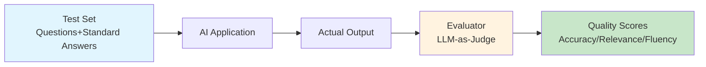
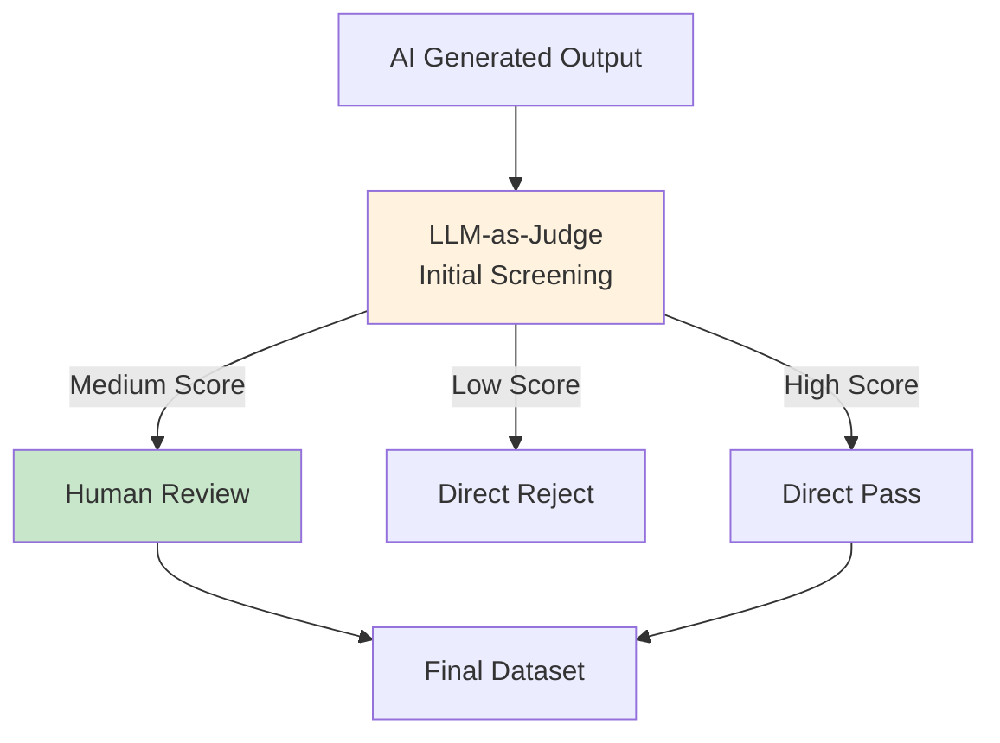
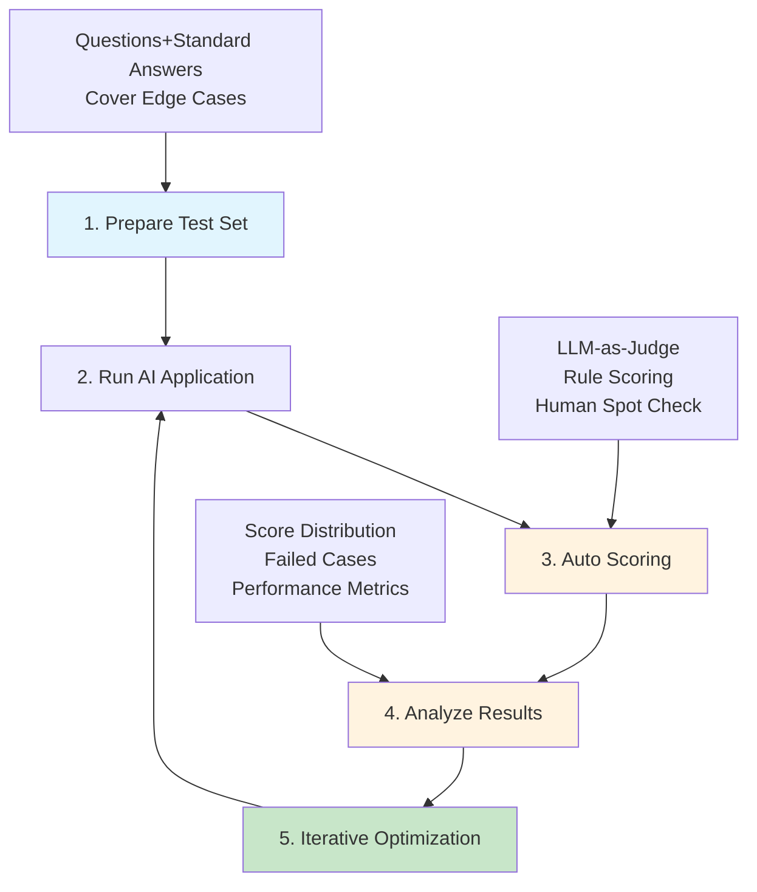

## 13.2 Evaluation <DifficultyBadge level="advanced" /> <CostBadge cost="$0.05" />

> Prerequisites: 4.1 Prompt Basics

### Why Do We Need It? (Problem)

**"Is this AI response good or not?"**

When developing AI applications, you might evaluate like this:

- Run a few test cases, "looks pretty good"
- Try it yourself a few times, "feels alright"
- After launch, receive user complaints, "why is the answer so ridiculous?"

**Problem: Gut feeling doesn't scale and can't drive continuous optimization.**

Real scenario challenges:

| Scenario | Challenge | Consequence |
|------|------|------|
| **Changed Prompt** | Don't know if new version is better | Might get worse with changes |
| **Switching Models** | GPT-4 vs Claude, which is more suitable? | Blind choice, wasted cost |
| **100 Test Cases** | Manual checking too slow | Cannot test comprehensively |
| **Quality Degradation After Launch** | No continuous monitoring | Damage done by the time issues are discovered |

**Why Do AI Applications Particularly Need Evaluation?**

Traditional software: Input → Deterministic logic → Output (can be unit tested)  
AI application: Input → **Non-deterministic** LLM → Output (**can differ each time**)

**Need automated evaluation system: quantify quality, iterate quickly, monitor continuously.**

### What Is It? (Concept)

**Evaluation** is the process of measuring AI application quality through automated methods:



**Core Evaluation Methods:**

### 1. LLM-as-Judge (Most Popular)

Use a powerful LLM (like GPT-4) to evaluate another LLM's output:

::: v-pre
```python
# Evaluation Prompt template
JUDGE_PROMPT = """
You are a strict evaluation expert. Please assess the quality of the following AI response.

Question: {question}
Reference answer: {reference}
AI response: {answer}

Evaluation dimensions (score 1-10 for each):
1. Accuracy: Is the information correct
2. Relevance: Is it on-topic
3. Completeness: Does it cover key points
4. Fluency: Is the expression clear

Output format:
\{\{
  "accuracy": <score>,
  "relevance": <score>,
  "completeness": <score>,
  "fluency": <score>,
  "overall": <total score>,
  "reason": "<brief comment>"
}}
"""
```
:::

### 2. Rule-Based Evaluation

Suitable for tasks with clear criteria:

| Task Type | Evaluation Rules | Example |
|---------|---------|------|
| **Data Extraction** | Field completeness, format correctness | Does extracted JSON contain all required fields |
| **Classification** | Accuracy, recall, F1 | Is sentiment classification correct |
| **Summarization** | ROUGE score, length | Does summary cover key information |
| **Code Generation** | Syntax correctness, test pass rate | Can generated code run |

### 3. Human Evaluation + AI Assistance

Combining manual annotation with AI evaluation:



**Mainstream Evaluation Tools:**

**1. Braintrust (Recommended)**

```python
from braintrust import Eval

# Define evaluation task
def task(input):
    return my_ai_app(input["question"])

# Define scoring function
def scorer(output, expected):
    return output.strip().lower() == expected.strip().lower()

# Run evaluation
Eval(
    "my-app-v1",
    data=[
        {"question": "What is API?", "expected": "Application Programming Interface"},
        {"question": "What is REST?", "expected": "Representational State Transfer"},
    ],
    task=task,
    scores=[scorer],
)
```

**2. DeepEval (Open Source)**

```python
from deepeval import evaluate
from deepeval.metrics import AnswerRelevancyMetric, FaithfulnessMetric
from deepeval.test_case import LLMTestCase

# Define test case
test_case = LLMTestCase(
    input="What is machine learning?",
    actual_output="Machine learning is a branch of AI...",
    expected_output="Machine learning is a technology that lets computers learn from data...",
    retrieval_context=["Definition of machine learning..."]  # Required for RAG apps
)

# Run evaluation
metrics = [AnswerRelevancyMetric(), FaithfulnessMetric()]
results = evaluate([test_case], metrics)
```

**3. OpenAI Evals (Official Tool)**

```bash
# Install
pip install evals

# Run official evaluation set
oaieval gpt-4o-mini my-eval

# Custom evaluation
# Create my_eval.jsonl
{"input": [{"role": "user", "content": "What is Python?"}], "ideal": "Python is a programming language"}

# Run
oaieval gpt-4o-mini my-eval
```

**Evaluation Workflow:**



### Try It Out (Practice)

**Experiment 1: Build LLM-as-Judge Evaluator**

::: v-pre
```python
from openai import OpenAI
import json

client = OpenAI()

# Evaluator
def judge_answer(question: str, reference: str, answer: str) -> dict:
    """Use GPT-4 to evaluate answer quality"""
    
    judge_prompt = f"""
You are a strict evaluation expert. Please assess the quality of the following AI response.

Question: {question}
Reference answer: {reference}
AI response: {answer}

Evaluation dimensions (score 1-10 for each):
1. Accuracy: Is the information correct
2. Relevance: Is it on-topic
3. Completeness: Does it cover key points
4. Fluency: Is the expression clear

Output JSON format:
\{\{
  "accuracy": <1-10>,
  "relevance": <1-10>,
  "completeness": <1-10>,
  "fluency": <1-10>,
  "overall": <average score>,
  "reason": "<brief comment>"
}}
"""
    
    response = client.chat.completions.create(
        model="gpt-4o",  # Use strong model for evaluation
        messages=[{"role": "user", "content": judge_prompt}],
        response_format={"type": "json_object"}
    )
    
    return json.loads(response.choices[0].message.content)

# Test evaluator
test_cases = [
    {
        "question": "What is REST API?",
        "reference": "REST API is a Web service architecture style based on HTTP protocol, using standard HTTP methods (GET, POST, PUT, DELETE) for resource operations.",
        "answer": "REST API is an API design style that uses HTTP methods to operate resources."
    },
    {
        "question": "What is REST API?",
        "reference": "REST API is a Web service architecture style based on HTTP protocol.",
        "answer": "Python is a programming language."  # Completely irrelevant
    },
]

for i, case in enumerate(test_cases, 1):
    print(f"\n=== Test Case {i} ===")
    print(f"Question: {case['question']}")
    print(f"Reference: {case['reference']}")
    print(f"AI Response: {case['answer']}")
    
    result = judge_answer(case['question'], case['reference'], case['answer'])
    
    print(f"\nEvaluation Results:")
    print(f"  Accuracy: {result['accuracy']}/10")
    print(f"  Relevance: {result['relevance']}/10")
    print(f"  Completeness: {result['completeness']}/10")
    print(f"  Fluency: {result['fluency']}/10")
    print(f"  Total Score: {result['overall']}/10")
    print(f"  Comment: {result['reason']}")
```
:::

**Experiment 2: Batch Evaluate Prompt Versions**

```python
from openai import OpenAI
import json
from statistics import mean

client = OpenAI()

# Two different Prompt versions
PROMPT_V1 = "Simple explanation: {question}"
PROMPT_V2 = """
You are a technical tutor who excels at explaining complex concepts in simple language.

Please explain in 2-3 sentences: {question}

Requirements:
- Easy to understand, suitable for beginners
- Use analogies or examples
- Highlight core concepts
"""

# Test dataset
test_dataset = [
    {"question": "What is Docker?", "reference": "Docker is a containerization platform that can package applications and their dependencies, ensuring consistent operation in any environment."},
    {"question": "What is closure?", "reference": "A closure is a combination of a function and variables from its outer scope, allowing the function to remember and access outer variables."},
    {"question": "What is DNS?", "reference": "DNS is the Domain Name System that converts domain names to IP addresses, allowing us to access websites with memorable URLs."},
]

def generate_answer(question: str, prompt_template: str) -> str:
    """Generate answer using specified Prompt template"""
    prompt = prompt_template.format(question=question)
    response = client.chat.completions.create(
        model="gpt-4.1-mini",
        messages=[{"role": "user", "content": prompt}],
        max_tokens=150
    )
    return response.choices[0].message.content

def simple_judge(answer: str, reference: str) -> float:
    """Simple scorer: calculate relevance score"""
    judge_prompt = f"""
Evaluate the quality of the following answer (1-10 points):

Reference answer: {reference}
Actual answer: {answer}

Output only a number (1-10).
"""
    response = client.chat.completions.create(
        model="gpt-4o",
        messages=[{"role": "user", "content": judge_prompt}],
        max_tokens=10
    )
    try:
        return float(response.choices[0].message.content.strip())
    except:
        return 5.0

# Evaluate two versions
def evaluate_prompt_version(prompt_template: str, name: str):
    """Evaluate Prompt version"""
    scores = []
    
    print(f"\n{'='*60}")
    print(f"Evaluating {name}")
    print(f"{'='*60}")
    
    for i, case in enumerate(test_dataset, 1):
        question = case['question']
        reference = case['reference']
        
        # Generate answer
        answer = generate_answer(question, prompt_template)
        
        # Score
        score = simple_judge(answer, reference)
        scores.append(score)
        
        print(f"\nQuestion {i}: {question}")
        print(f"AI Answer: {answer}")
        print(f"Score: {score}/10")
    
    avg_score = mean(scores)
    print(f"\nAverage Score: {avg_score:.1f}/10")
    
    return avg_score

# Run evaluation
v1_score = evaluate_prompt_version(PROMPT_V1, "Prompt V1 (Simple)")
v2_score = evaluate_prompt_version(PROMPT_V2, "Prompt V2 (Optimized)")

# Compare results
print(f"\n{'='*60}")
print("Comparison Results")
print(f"{'='*60}")
print(f"V1 Average Score: {v1_score:.1f}/10")
print(f"V2 Average Score: {v2_score:.1f}/10")
print(f"Improvement: {v2_score - v1_score:+.1f} points")

if v2_score > v1_score:
    print("\n✅ V2 is better than V1, recommend using V2")
elif v2_score < v1_score:
    print("\n❌ V2 is not as good as V1, recommend continuing with V1")
else:
    print("\n⚖️  Both versions perform equally")
```

**Experiment 3: Rule-Based Evaluation (Code Generation Task)**

```python
import ast
import subprocess
import tempfile
import os

def evaluate_code_generation(question: str, generated_code: str) -> dict:
    """Evaluate generated code quality"""
    
    results = {
        "syntax_valid": False,
        "runnable": False,
        "has_docstring": False,
        "has_type_hints": False,
        "score": 0
    }
    
    # 1. Syntax check
    try:
        ast.parse(generated_code)
        results["syntax_valid"] = True
        results["score"] += 25
    except SyntaxError as e:
        print(f"Syntax error: {e}")
        return results
    
    # 2. Run test
    try:
        # Create temporary file
        with tempfile.NamedTemporaryFile(mode='w', suffix='.py', delete=False) as f:
            f.write(generated_code)
            temp_file = f.name
        
        # Run code
        result = subprocess.run(
            ['python', temp_file],
            capture_output=True,
            timeout=5
        )
        
        if result.returncode == 0:
            results["runnable"] = True
            results["score"] += 25
        
        os.unlink(temp_file)
        
    except Exception as e:
        print(f"Runtime error: {e}")
    
    # 3. Check docstring
    tree = ast.parse(generated_code)
    for node in ast.walk(tree):
        if isinstance(node, (ast.FunctionDef, ast.ClassDef)):
            if ast.get_docstring(node):
                results["has_docstring"] = True
                results["score"] += 25
                break
    
    # 4. Check type annotations
    for node in ast.walk(tree):
        if isinstance(node, ast.FunctionDef):
            if node.returns or any(arg.annotation for arg in node.args.args):
                results["has_type_hints"] = True
                results["score"] += 25
                break
    
    return results

# Test
code1 = """
def fibonacci(n):
    if n <= 1:
        return n
    return fibonacci(n-1) + fibonacci(n-2)

print(fibonacci(10))
"""

code2 = """
def fibonacci(n: int) -> int:
    '''Calculate the nth term of the Fibonacci sequence
    
    Args:
        n: Non-negative integer
        
    Returns:
        Value of the nth term
    '''
    if n <= 1:
        return n
    return fibonacci(n-1) + fibonacci(n-2)

if __name__ == '__main__':
    print(fibonacci(10))
"""

print("=== Code 1 (Basic Version) ===")
result1 = evaluate_code_generation("Implement Fibonacci", code1)
print(f"Syntax correct: {'✓' if result1['syntax_valid'] else '✗'}")
print(f"Runnable: {'✓' if result1['runnable'] else '✗'}")
print(f"Has docstring: {'✓' if result1['has_docstring'] else '✗'}")
print(f"Has type hints: {'✓' if result1['has_type_hints'] else '✗'}")
print(f"Total score: {result1['score']}/100")

print("\n=== Code 2 (Complete Version) ===")
result2 = evaluate_code_generation("Implement Fibonacci", code2)
print(f"Syntax correct: {'✓' if result2['syntax_valid'] else '✗'}")
print(f"Runnable: {'✓' if result2['runnable'] else '✗'}")
print(f"Has docstring: {'✓' if result2['has_docstring'] else '✗'}")
print(f"Has type hints: {'✓' if result2['has_type_hints'] else '✗'}")
print(f"Total score: {result2['score']}/100")
```

<ColabBadge path="demos/13-production/evaluation.ipynb" />

### Summary (Reflection)

- **What It Solves**: Build automated evaluation system, quantify AI quality, quickly compare Prompt/model versions
- **What It Doesn't Solve**: With evaluation in place, how to monitor operational status after launch? — Next section introduces observability
- **Key Points**:
  1. **LLM-as-Judge is the most popular method**: Use GPT-4 to evaluate GPT-4o-mini
  2. **Evaluation dimensions**: Accuracy, relevance, completeness, fluency
  3. **Test set quality determines evaluation quality**: Cover edge cases, include difficult samples
  4. **Automated + manual spot checking**: AI evaluation + human review of high-risk outputs
  5. **Continuous evaluation**: Re-evaluate every time you change Prompt/model

---

*Last updated: 2026-02-20*
