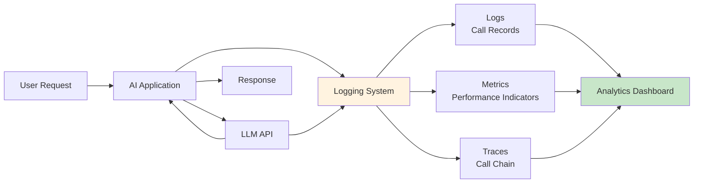
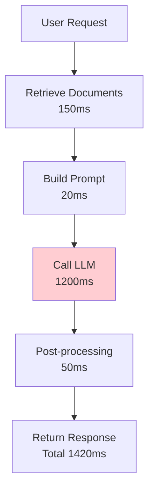
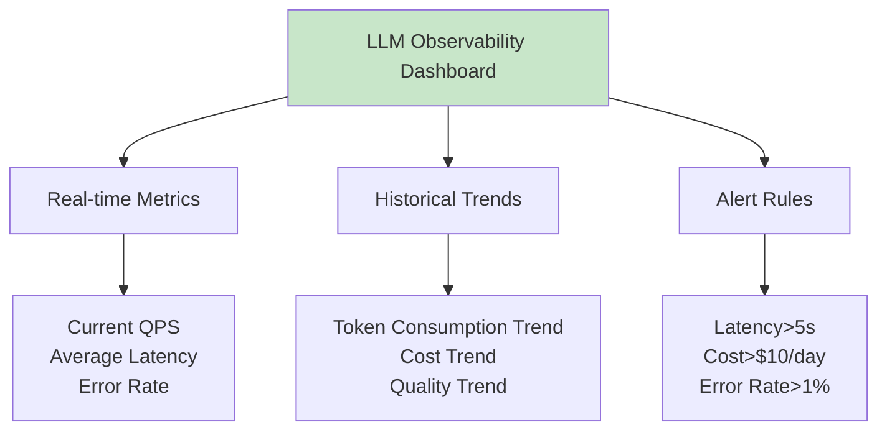

## 13.3 Observability <DifficultyBadge level="advanced" /> <CostBadge cost="$0.01" />

> Prerequisites: 7.1 Function Calling Basics

### Why Do We Need It? (Problem)

**"3 days after launch, users report declining AI response quality, but you don't know why."**

AI applications without observability are like black boxes:

| Problem | Symptom | Unknown Cause |
|------|------|---------|
| **Slower Response** | User wait time increased from 2s to 10s | Is it model slowdown or API throttling? |
| **Quality Degradation** | Users complain about inaccurate answers | Which questions went wrong? |
| **Cost Explosion** | This month's bill is 3x last month | Where is Token consumption coming from? |
| **Rising Error Rate** | API call failures | Is it timeout, throttling, or model error? |

**Real-world Example:**

```
An e-commerce customer service bot after launch:
- Day 1: 2s response time, 85% user satisfaction
- Day 7: 8s response time, 60% user satisfaction
- Day 14: Discovered some user questions triggered ultra-long context, single cost reached $0.50

No monitoring = discovered too late = damage already done
```

**Why Do AI Applications Particularly Need Observability?**

Traditional apps: Request → Response (monitor HTTP status, latency)  
AI apps: Request → LLM (**Token consumption, context length, quality scores**) → Response

**More and more complex dimensions to monitor.**

### What Is It? (Concept)

**Observability** is the ability to understand AI application operational status through logs, metrics, and traces:



**Three Pillars:**

### 1. Logs

Record detailed information for each LLM call:

```json
{
  "timestamp": "2026-02-20T10:30:15Z",
  "session_id": "sess_abc123",
  "user_id": "user_456",
  "model": "gpt-4.1-mini",
  "prompt_tokens": 150,
  "completion_tokens": 80,
  "total_tokens": 230,
  "latency_ms": 1250,
  "cost_usd": 0.0012,
  "input": "How to optimize SQL queries?",
  "output": "Key methods for optimizing SQL queries...",
  "quality_score": 8.5,
  "error": null
}
```

### 2. Metrics

Aggregate statistics:

| Metric Type | Metric Name | Purpose |
|---------|---------|------|
| **Performance Metrics** | Average response time, P95/P99 latency | Identify performance issues |
| **Cost Metrics** | Total Token consumption, daily cost | Control budget |
| **Quality Metrics** | Average quality score, error rate | Monitor output quality |
| **Usage Metrics** | Request count, active users | Understand usage patterns |

### 3. Traces

Track complete call chains:



**Mainstream Observability Tools:**

**1. LangSmith (Recommended)**

```python
from langsmith import Client
from langsmith.run_helpers import traceable

client = Client()

@traceable(run_type="llm", project_name="my-app")
def my_llm_call(question: str) -> str:
    response = openai_client.chat.completions.create(
        model="gpt-4.1-mini",
        messages=[{"role": "user", "content": question}]
    )
    return response.choices[0].message.content

# Automatically logged to LangSmith
result = my_llm_call("What is Python?")
```

**2. OpenTelemetry for LLM**

```python
from opentelemetry import trace
from opentelemetry.instrumentation.openai import OpenAIInstrumentor

# Automatically track OpenAI calls
OpenAIInstrumentor().instrument()

tracer = trace.get_tracer(__name__)

with tracer.start_as_current_span("llm_call"):
    response = client.chat.completions.create(...)
```

**3. Custom Logging System**

```python
import logging
import json
from datetime import datetime

class LLMLogger:
    def __init__(self, log_file: str = "llm_calls.jsonl"):
        self.log_file = log_file
    
    def log_call(self, **kwargs):
        log_entry = {
            "timestamp": datetime.utcnow().isoformat(),
            **kwargs
        }
        with open(self.log_file, 'a') as f:
            f.write(json.dumps(log_entry, ensure_ascii=False) + '\n')
```

**Monitoring Dashboard Example:**



**Key Monitoring Metrics:**

```python
# Core KPI
core_metrics = {
    "performance": {
        "avg_latency_ms": 1200,
        "p95_latency_ms": 2500,
        "p99_latency_ms": 4000,
        "requests_per_second": 10,
    },
    "cost": {
        "total_tokens_today": 1500000,
        "cost_usd_today": 15.00,
        "avg_cost_per_request": 0.015,
    },
    "quality": {
        "avg_quality_score": 8.2,
        "error_rate": 0.005,  # 0.5%
        "user_satisfaction": 0.85,
    },
    "usage": {
        "active_users_today": 250,
        "total_requests_today": 1000,
        "avg_requests_per_user": 4,
    }
}
```

### Try It Out (Practice)

**Experiment 1: Build Simple LLM Logging System**

```python
import json
import time
from datetime import datetime
from typing import Optional
from openai import OpenAI

client = OpenAI()

class LLMLogger:
    """LLM call logger"""
    
    def __init__(self, log_file: str = "llm_calls.jsonl"):
        self.log_file = log_file
    
    def log_call(
        self,
        input_text: str,
        output_text: str,
        model: str,
        prompt_tokens: int,
        completion_tokens: int,
        latency_ms: float,
        error: Optional[str] = None,
        **metadata
    ):
        """Log an LLM call"""
        log_entry = {
            "timestamp": datetime.utcnow().isoformat(),
            "model": model,
            "input": input_text,
            "output": output_text,
            "prompt_tokens": prompt_tokens,
            "completion_tokens": completion_tokens,
            "total_tokens": prompt_tokens + completion_tokens,
            "latency_ms": round(latency_ms, 2),
            "error": error,
            **metadata
        }
        
        # Calculate cost (example pricing)
        if model == "gpt-4o-mini":
            input_cost = prompt_tokens * 0.15 / 1_000_000
            output_cost = completion_tokens * 0.6 / 1_000_000
        else:
            input_cost = 0
            output_cost = 0
        
        log_entry["cost_usd"] = round(input_cost + output_cost, 6)
        
        # Write to log file
        with open(self.log_file, 'a', encoding='utf-8') as f:
            f.write(json.dumps(log_entry, ensure_ascii=False) + '\n')
    
    def get_metrics(self) -> dict:
        """Analyze logs and generate metrics"""
        with open(self.log_file, 'r', encoding='utf-8') as f:
            logs = [json.loads(line) for line in f]
        
        if not logs:
            return {}
        
        total_calls = len(logs)
        total_tokens = sum(log['total_tokens'] for log in logs)
        total_cost = sum(log['cost_usd'] for log in logs)
        latencies = [log['latency_ms'] for log in logs]
        errors = [log for log in logs if log['error']]
        
        return {
            "total_calls": total_calls,
            "total_tokens": total_tokens,
            "total_cost_usd": round(total_cost, 4),
            "avg_latency_ms": round(sum(latencies) / len(latencies), 2),
            "max_latency_ms": max(latencies),
            "error_count": len(errors),
            "error_rate": round(len(errors) / total_calls, 4),
        }

# Use logger
logger = LLMLogger()

def tracked_llm_call(question: str) -> str:
    """LLM call with logging"""
    start_time = time.time()
    error = None
    output_text = ""
    usage = None
    
    try:
        response = client.chat.completions.create(
            model="gpt-4.1-mini",
            messages=[{"role": "user", "content": question}],
        )
        output_text = response.choices[0].message.content
        usage = response.usage
    except Exception as e:
        error = str(e)
    
    latency_ms = (time.time() - start_time) * 1000
    
    # Log call
    logger.log_call(
        input_text=question,
        output_text=output_text,
        model="gpt-4.1-mini",
        prompt_tokens=usage.prompt_tokens if usage else 0,
        completion_tokens=usage.completion_tokens if usage else 0,
        latency_ms=latency_ms,
        error=error,
    )
    
    return output_text

# Test: simulate multiple calls
questions = [
    "What is Python?",
    "Explain what is closure",
    "Difference between Docker and VM",
    "How to optimize SQL queries",
    "What is RESTful API",
]

print("=== Executing LLM Calls ===\n")
for i, q in enumerate(questions, 1):
    print(f"{i}. {q}")
    answer = tracked_llm_call(q)
    print(f"   Answer: {answer[:100]}...\n")

# View metrics
print("\n=== Runtime Metrics ===")
metrics = logger.get_metrics()
for key, value in metrics.items():
    print(f"{key}: {value}")
```

**Experiment 2: Track RAG Call Chain**

```python
import time
from typing import List, Dict

class TraceLogger:
    """Call chain tracer"""
    
    def __init__(self):
        self.traces: List[Dict] = []
        self.current_trace: Dict = {}
    
    def start_trace(self, name: str):
        """Start a trace"""
        self.current_trace = {
            "name": name,
            "start_time": time.time(),
            "spans": []
        }
    
    def add_span(self, name: str, duration_ms: float, **metadata):
        """Add a span"""
        self.current_trace["spans"].append({
            "name": name,
            "duration_ms": round(duration_ms, 2),
            **metadata
        })
    
    def end_trace(self):
        """End trace"""
        total_duration = (time.time() - self.current_trace["start_time"]) * 1000
        self.current_trace["total_duration_ms"] = round(total_duration, 2)
        self.traces.append(self.current_trace)
        self.current_trace = {}
    
    def print_trace(self):
        """Print last trace"""
        if not self.traces:
            return
        
        trace = self.traces[-1]
        print(f"\n{'='*60}")
        print(f"Trace: {trace['name']}")
        print(f"Total Duration: {trace['total_duration_ms']}ms")
        print(f"{'='*60}")
        
        for span in trace["spans"]:
            print(f"  └─ {span['name']}: {span['duration_ms']}ms")
            if span.get('tokens'):
                print(f"     Tokens: {span['tokens']}")

# Simulate RAG system
tracer = TraceLogger()

def simulated_rag_query(question: str) -> str:
    """Simulate RAG query (with tracing)"""
    tracer.start_trace(f"RAG Query: {question[:30]}...")
    
    # Step 1: Retrieve documents
    start = time.time()
    time.sleep(0.15)  # Simulate retrieval time
    retrieved_docs = ["Doc1", "Doc2", "Doc3"]
    tracer.add_span("Retrieve Documents", (time.time() - start) * 1000, doc_count=3)
    
    # Step 2: Build Prompt
    start = time.time()
    time.sleep(0.02)  # Simulate prompt building
    prompt = f"Based on the following documents answer the question: {retrieved_docs}\n\nQuestion: {question}"
    tracer.add_span("Build Prompt", (time.time() - start) * 1000, prompt_length=len(prompt))
    
    # Step 3: Call LLM
    start = time.time()
    response = client.chat.completions.create(
        model="gpt-4.1-mini",
        messages=[{"role": "user", "content": prompt}],
    )
    llm_duration = (time.time() - start) * 1000
    answer = response.choices[0].message.content
    tracer.add_span(
        "Call LLM",
        llm_duration,
        tokens=response.usage.total_tokens,
        model="gpt-4.1-mini"
    )
    
    # Step 4: Post-processing
    start = time.time()
    time.sleep(0.05)  # Simulate post-processing
    tracer.add_span("Post-processing", (time.time() - start) * 1000)
    
    tracer.end_trace()
    return answer

# Test tracing
result = simulated_rag_query("What is vector database?")
tracer.print_trace()

print(f"\nAnswer: {result}")
```

**Experiment 3: Real-time Performance Monitoring Dashboard (Simplified)**

```python
import time
from collections import deque
from datetime import datetime, timedelta

class MetricsCollector:
    """Real-time metrics collector"""
    
    def __init__(self, window_minutes: int = 5):
        self.window = timedelta(minutes=window_minutes)
        self.data = deque()  # (timestamp, latency, tokens, cost)
    
    def record(self, latency_ms: float, tokens: int, cost_usd: float):
        """Record a call"""
        self.data.append((datetime.now(), latency_ms, tokens, cost_usd))
        self._cleanup_old_data()
    
    def _cleanup_old_data(self):
        """Clean up expired data"""
        cutoff = datetime.now() - self.window
        while self.data and self.data[0][0] < cutoff:
            self.data.popleft()
    
    def get_metrics(self) -> dict:
        """Get metrics for current window"""
        if not self.data:
            return {}
        
        latencies = [d[1] for d in self.data]
        tokens = [d[2] for d in self.data]
        costs = [d[3] for d in self.data]
        
        # Calculate QPS
        duration_seconds = (self.data[-1][0] - self.data[0][0]).total_seconds()
        qps = len(self.data) / duration_seconds if duration_seconds > 0 else 0
        
        return {
            "qps": round(qps, 2),
            "total_requests": len(self.data),
            "avg_latency_ms": round(sum(latencies) / len(latencies), 2),
            "p95_latency_ms": round(sorted(latencies)[int(len(latencies) * 0.95)], 2),
            "total_tokens": sum(tokens),
            "total_cost_usd": round(sum(costs), 4),
        }
    
    def print_dashboard(self):
        """Print dashboard"""
        metrics = self.get_metrics()
        
        print("\n" + "="*60)
        print(f"📊 Real-time Monitoring Dashboard (Last {self.window.seconds // 60} min)")
        print("="*60)
        print(f"Requests:     {metrics.get('total_requests', 0)}")
        print(f"QPS:          {metrics.get('qps', 0)}")
        print(f"Avg Latency:  {metrics.get('avg_latency_ms', 0)} ms")
        print(f"P95 Latency:  {metrics.get('p95_latency_ms', 0)} ms")
        print(f"Token Usage:  {metrics.get('total_tokens', 0):,}")
        print(f"Cost:         ${metrics.get('total_cost_usd', 0)}")
        print("="*60 + "\n")

# Use monitor
monitor = MetricsCollector(window_minutes=5)

# Simulate traffic
print("Simulating LLM call traffic...\n")
for i in range(20):
    # Simulate call
    latency = 800 + (i % 5) * 200  # 800-1600ms
    tokens = 100 + (i % 3) * 50    # 100-200 tokens
    cost = tokens * 0.15 / 1_000_000
    
    monitor.record(latency, tokens, cost)
    
    if (i + 1) % 5 == 0:
        monitor.print_dashboard()
    
    time.sleep(0.1)  # Simulate request interval
```

<ColabBadge path="demos/13-production/observability.ipynb" />

### Summary (Reflection)

- **What It Solves**: Adds logs, metrics, traces to AI applications for real-time monitoring of performance, cost, quality
- **What It Doesn't Solve**: With monitoring in place, but cost is still too high? — Next section introduces cost optimization
- **Key Points**:
  1. **Three Pillars**: Logs (detailed records), Metrics (aggregated indicators), Traces (call chains)
  2. **Key Metrics**: Latency, Token consumption, cost, quality scores, error rate
  3. **Tool Selection**: LangSmith (managed), OpenTelemetry (open source), custom logging system
  4. **Real-time Monitoring**: Set up dashboards and alert rules
  5. **Continuous Optimization**: Discover performance bottlenecks and cost anomalies from monitoring data

---

*Last updated: 2026-02-20*
