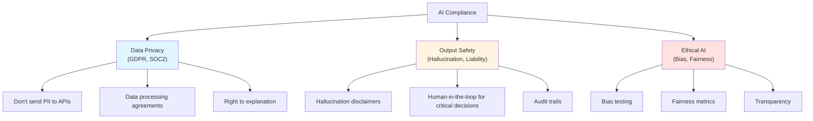

# 13.5 AI Safety & Compliance

<DifficultyBadge level="advanced" />
<CostBadge cost="$0" />

> Prerequisites: 13.1 Guardrails

### Why Do We Need It? (Problem)

Your AI chatbot just told a customer that your company offers a "lifetime money-back guarantee." You don't. The customer is now threatening to sue, citing the AI's response as a binding promise.

Welcome to AI compliance in 2026.

::: warning Real-World Horror Stories
- **Air Canada (2024)**: Chatbot promised a bereavement fare discount that didn't exist. Court ruled the airline was liable for its AI's statements.
- **Lawyer using ChatGPT (2023)**: Submitted fake case citations generated by AI. Sanctioned by the court.
- **Various companies (2025-2026)**: GDPR fines for sending user data to LLM APIs without consent.

The legal system doesn't care that "the AI made it up." You deployed it, you're responsible.
:::

### What Is It? (Concept)

**AI Safety & Compliance** covers three dimensions:



### 1. Data Privacy (GDPR / SOC2)

**The Golden Rule**: If your users' data touches an LLM API, you need consent and a Data Processing Agreement (DPA).

| Scenario | Risk Level | Action Required |
|----------|-----------|----------------|
| Internal tool, no user data | Low | Basic API agreement |
| Customer-facing chat with PII | High | DPA + consent + PII filtering |
| Healthcare / financial data | Critical | On-premise deployment or certified API |
| EU users (GDPR) | High | Explicit consent + right to delete |

**Practical Steps:**
```python
# ALWAYS filter PII before sending to external APIs
from presidio_analyzer import AnalyzerEngine
from presidio_anonymizer import AnonymizerEngine

analyzer = AnalyzerEngine()
anonymizer = AnonymizerEngine()

def sanitize_for_api(text: str) -> str:
    results = analyzer.analyze(text=text, language="en")
    anonymized = anonymizer.anonymize(text=text, analyzer_results=results)
    return anonymized.text

# Before: "My email is john@example.com and SSN is 123-45-6789"
# After:  "My email is <EMAIL> and SSN is <US_SSN>"
```

### 2. Hallucination & Legal Liability

**The 2026 International AI Safety Report** (signed by 30+ countries) highlights:

> "AI systems are rapidly becoming more capable, but evidence on their risks is slow to emerge."

**Your Compliance Checklist:**

- [ ] AI responses include disclaimer ("AI-generated, may contain errors")
- [ ] Critical decisions (medical, legal, financial) require human approval
- [ ] All AI interactions are logged with full audit trail
- [ ] Hallucination rate is measured and monitored
- [ ] Users can report incorrect AI responses
- [ ] Regular evaluation of AI output quality (see Ch13.2)

::: info Soul-Searching Question
If your AI gives medical advice and someone follows it... who's liable? The AI company? Your company? The developer who deployed it? The answer depends on your jurisdiction, your disclaimers, and how good your lawyer is.
:::

### 3. The AI Safety Checklist

Before deploying ANY AI application to production:

```
PRE-LAUNCH SAFETY CHECKLIST
═══════════════════════════

Data Privacy:
□ PII filtering implemented (input & output)
□ Data Processing Agreement with AI provider signed
□ User consent mechanism for AI processing
□ Data retention policy defined and implemented
□ Right-to-delete mechanism for AI interactions

Output Safety:
□ Guardrails deployed (Ch13.1)
□ Hallucination disclaimer visible to users
□ Human-in-the-loop for critical decisions
□ Response audit logging enabled
□ Content moderation for outputs

Legal:
□ Terms of Service updated for AI features
□ Liability disclaimers in place
□ GDPR compliance verified (if EU users)
□ Industry-specific regulations checked
□ Legal review of AI feature scope

Monitoring:
□ Quality metrics dashboard set up
□ Hallucination rate tracking
□ User feedback mechanism
□ Incident response plan for AI failures
□ Regular evaluation cadence defined
```

### Summary (Reflection)

- **What we solved**: Understood the legal, privacy, and safety requirements for deploying AI in production
- **Key takeaways**:
  1. **"The AI said it" is not a defense** — you deployed it, you're responsible
  2. **PII filtering is mandatory**, not optional, when using external APIs
  3. **Hallucination disclaimers** are the new "past performance does not guarantee future results"
  4. **Human-in-the-loop** for anything that could cause real-world harm
  5. **The checklist is your friend** — laminate it, hang it on the wall

> *"AI compliance isn't fun, isn't sexy, and won't get you promoted. But it WILL keep you out of court, which is arguably better than a promotion."*

---

*Last updated: 2026-02-22*
