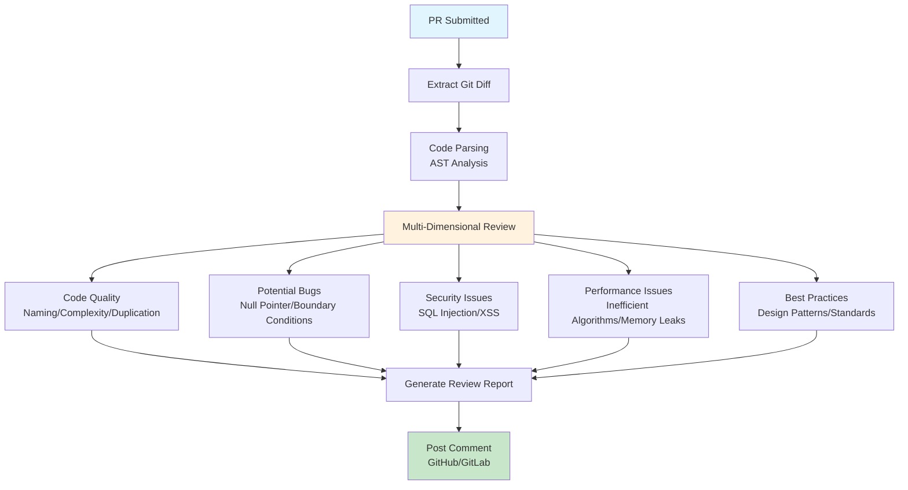

## 14.2 AI Code Review Assistant <DifficultyBadge level="advanced" /> <CostBadge cost="$0.10" />

> Comprehensive Application: Ch9 (AI Agents), Ch7 (Function Calling), Ch11 (MCP), Ch6 (Context Engineering)

### Why Do We Need It? (Problem)

**"The team has 20 PRs every day, Code Review has become a bottleneck."**

Code Review pain points:

| Scenario | Pain Point | Consequence |
|------|------|------|
| **PR Backlog** | Review not timely | Development pipeline blocked |
| **Inconsistent Review Quality** | Different reviewers different standards | Code quality varies |
| **Low-level Issues Take Time** | Naming, formatting, basic errors | Waste senior engineers' time |
| **Newcomers Unfamiliar with Standards** | Repeatedly fixing same issues | High learning cost |

**Limitations of Traditional Tools:**

- **Static Analysis Tools** (ESLint, Pylint): Only check syntax and style, cannot understand business logic
- **Manual Review**: Time-consuming, prone to fatigue, miss issues
- **Automated Testing**: Need to write test cases in advance

**What's Needed: An intelligent Code Review assistant that understands code logic, finds potential issues, gives improvement suggestions.**

### What Is It? (Concept)

**AI Code Review Assistant** is an automated code review tool based on LLM:



**Core Architecture:**

### 1. Git Diff Extraction

```python
import subprocess

def get_git_diff(base_branch: str = "main") -> str:
    """Get code changes of current branch relative to main branch"""
    result = subprocess.run(
        ["git", "diff", f"{base_branch}...HEAD"],
        capture_output=True,
        text=True
    )
    return result.stdout

def parse_diff(diff_text: str) -> list[dict]:
    """Parse diff output, extract changed files and content"""
    files = []
    current_file = None
    
    for line in diff_text.split('\n'):
        if line.startswith('diff --git'):
            if current_file:
                files.append(current_file)
            current_file = {"changes": []}
        elif line.startswith('+++'):
            current_file["file"] = line[6:]
        elif line.startswith('+') and not line.startswith('+++'):
            current_file["changes"].append(("add", line[1:]))
        elif line.startswith('-') and not line.startswith('---'):
            current_file["changes"].append(("remove", line[1:]))
    
    if current_file:
        files.append(current_file)
    
    return files
```

### 2. Multi-Dimensional Review

| Review Dimension | Check Content | Example |
|---------|---------|------|
| **Code Quality** | Naming conventions, function length, cyclomatic complexity | Function over 50 lines, unclear variable names |
| **Potential Bugs** | Null pointer, boundary conditions, exception handling | Unchecked array length, division by zero |
| **Security Issues** | SQL injection, XSS, hardcoded passwords | Concatenated SQL, unescaped user input |
| **Performance Issues** | Inefficient algorithms, repeated computation, memory leaks | O(n²) algorithm, no caching |
| **Best Practices** | Design patterns, SOLID principles, code duplication | Violating single responsibility, duplicate code |

### 3. Prompt Design

```python
CODE_REVIEW_PROMPT = """
You are a senior code review expert. Please review the following code changes.

Review dimensions:
1. **Code Quality** (1-10 score): Naming, readability, complexity
2. **Potential Bugs** (severity: high/medium/low): Logic errors, boundary conditions
3. **Security Issues** (severity: high/medium/low): Injection attacks, permission issues
4. **Performance Issues** (impact: high/medium/low): Algorithm efficiency, resource usage
5. **Best Practices**: Design patterns, code standards

File: {file_path}
Language: {language}

Code changes:
{code_diff}

Output format (JSON):
{ {
  "quality_score": <1-10>,
  "issues": [
    { {
      "severity": "high|medium|low",
      "category": "bug|security|performance|quality|practice",
      "line": <line_number>,
      "description": "<issue_description>",
      "suggestion": "<improvement_suggestion>",
      "example": "<example_code (optional)>"
    } }
  ],
  "summary": "<overall_assessment>",
  "approve": true|false
} }

Please provide a detailed review report.
"""
```

### Hands-On Practice (Practice)

**Complete Implementation: AI Code Review Tool**

```python
from openai import OpenAI
import subprocess
import json
from typing import List, Dict

client = OpenAI()

class CodeReviewer:
    """AI Code Review Tool"""
    
    def __init__(self, model: str = "gpt-4o"):
        self.client = OpenAI()
        self.model = model
    
    def get_diff(self, base_branch: str = "main") -> str:
        """Get Git Diff"""
        result = subprocess.run(
            ["git", "diff", f"{base_branch}...HEAD"],
            capture_output=True,
            text=True
        )
        return result.stdout
    
    def parse_diff(self, diff_text: str) -> List[Dict]:
        """Parse Diff, extract changed files"""
        files = []
        current_file = None
        added_lines = []
        removed_lines = []
        
        for line in diff_text.split('\n'):
            if line.startswith('diff --git'):
                if current_file:
                    current_file['added'] = '\n'.join(added_lines)
                    current_file['removed'] = '\n'.join(removed_lines)
                    files.append(current_file)
                
                current_file = {}
                added_lines = []
                removed_lines = []
            
            elif line.startswith('+++'):
                file_path = line[6:].strip()
                current_file['file'] = file_path
                current_file['language'] = self._detect_language(file_path)
            
            elif line.startswith('+') and not line.startswith('+++'):
                added_lines.append(line[1:])
            
            elif line.startswith('-') and not line.startswith('---'):
                removed_lines.append(line[1:])
        
        if current_file:
            current_file['added'] = '\n'.join(added_lines)
            current_file['removed'] = '\n'.join(removed_lines)
            files.append(current_file)
        
        return files
    
    def _detect_language(self, file_path: str) -> str:
        """Detect language from file extension"""
        ext_map = {
            '.py': 'Python',
            '.js': 'JavaScript',
            '.ts': 'TypeScript',
            '.jsx': 'React JSX',
            '.tsx': 'React TSX',
            '.java': 'Java',
            '.go': 'Go',
            '.rs': 'Rust',
            '.cpp': 'C++',
            '.c': 'C',
        }
        
        for ext, lang in ext_map.items():
            if file_path.endswith(ext):
                return lang
        
        return 'Unknown'
    
    def review_file(self, file_info: Dict) -> Dict:
        """Review single file changes"""
        prompt = f"""
You are a senior {file_info['language']} code review expert. Please review the following code changes.

Review dimensions:
1. **Code Quality** (1-10 score): Naming, readability, complexity
2. **Potential Bugs**: Logic errors, boundary conditions, exception handling
3. **Security Issues**: Injection attacks, permission vulnerabilities, sensitive info leaks
4. **Performance Issues**: Algorithm efficiency, resource usage
5. **Best Practices**: Design patterns, code standards

File: {file_info['file']}

Added code:
```{file_info['language'].lower()}
{file_info['added']}
```

Removed code:
```{file_info['language'].lower()}
{file_info['removed']}
```

Output format (JSON):
{ {
  "quality_score": <1-10>,
  "issues": [
    { {
      "severity": "high|medium|low",
      "category": "bug|security|performance|quality|practice",
      "description": "<issue_description>",
      "suggestion": "<improvement_suggestion>"
    } }
  ],
  "summary": "<overall_assessment>",
  "approve": true|false
} }

Please provide a detailed review report. If code changes are minor or have no issues, you can approve directly.
"""
        
        response = self.client.chat.completions.create(
            model=self.model,
            messages=[{"role": "user", "content": prompt}],
            response_format={"type": "json_object"},
            temperature=0.3
        )
        
        return json.loads(response.choices[0].message.content)
    
    def review_pr(self, base_branch: str = "main") -> Dict:
        """Review entire PR"""
        # 1. Get Diff
        diff_text = self.get_diff(base_branch)
        
        if not diff_text:
            return {
                "status": "no_changes",
                "message": "No code changes detected"
            }
        
        # 2. Parse Diff
        files = self.parse_diff(diff_text)
        
        # 3. Review each file
        reviews = []
        for file_info in files:
            if not file_info.get('added'):
                continue  # Skip files with only deletions
            
            print(f"Reviewing: {file_info['file']}...")
            review = self.review_file(file_info)
            reviews.append({
                "file": file_info['file'],
                **review
            })
        
        # 4. Aggregate results
        total_issues = sum(len(r['issues']) for r in reviews)
        high_severity = sum(
            1 for r in reviews for issue in r['issues'] 
            if issue['severity'] == 'high'
        )
        
        overall_approve = all(r['approve'] for r in reviews) and high_severity == 0
        
        return {
            "status": "completed",
            "overall_approve": overall_approve,
            "total_files": len(reviews),
            "total_issues": total_issues,
            "high_severity_issues": high_severity,
            "reviews": reviews
        }
    
    def format_report(self, result: Dict) -> str:
        """Format review report"""
        if result['status'] == 'no_changes':
            return result['message']
        
        report = []
        report.append("=" * 60)
        report.append("AI Code Review Report")
        report.append("=" * 60)
        report.append(f"Files reviewed: {result['total_files']}")
        report.append(f"Issues found: {result['total_issues']}")
        report.append(f"High-severity issues: {result['high_severity_issues']}")
        report.append(f"Overall review: {'✅ Approved' if result['overall_approve'] else '❌ Changes needed'}")
        report.append("")
        
        for review in result['reviews']:
            report.append("-" * 60)
            report.append(f"File: {review['file']}")
            report.append(f"Quality score: {review['quality_score']}/10")
            report.append(f"Overall assessment: {review['summary']}")
            
            if review['issues']:
                report.append(f"\nFound {len(review['issues'])} issues:")
                
                for i, issue in enumerate(review['issues'], 1):
                    severity_icon = {
                        'high': '🔴',
                        'medium': '🟡',
                        'low': '🟢'
                    }.get(issue['severity'], '⚪')
                    
                    report.append(f"\n{i}. {severity_icon} [{issue['severity'].upper()}] {issue['category']}")
                    report.append(f"   Issue: {issue['description']}")
                    report.append(f"   Suggestion: {issue['suggestion']}")
            else:
                report.append("\n✅ No issues found")
        
        report.append("\n" + "=" * 60)
        
        return "\n".join(report)

# ===== Usage Example =====

# Simulate code review (using example code)
def simulate_code_review():
    """Simulate code review (no real Git repository needed)"""
    
    reviewer = CodeReviewer()
    
    # Simulate file changes
    file_info = {
        "file": "app/user_service.py",
        "language": "Python",
        "added": """
def get_user(user_id):
    # Get user from database
    query = "SELECT * FROM users WHERE id = " + str(user_id)
    result = db.execute(query)
    return result[0]

def process_users(users):
    result = []
    for user in users:
        if user['age'] > 18:
            result.append(user['name'].upper())
    return result
""",
        "removed": """
def get_user(user_id):
    return db.query(User).filter(User.id == user_id).first()
"""
    }
    
    print("Reviewing code changes...\n")
    
    review = reviewer.review_file(file_info)
    
    # Format output
    print("=" * 60)
    print(f"File: {file_info['file']}")
    print("=" * 60)
    print(f"Quality score: {review['quality_score']}/10")
    print(f"Overall assessment: {review['summary']}")
    print(f"Approved: {'✅ Yes' if review['approve'] else '❌ No'}")
    
    if review['issues']:
        print(f"\nFound {len(review['issues'])} issues:\n")
        
        for i, issue in enumerate(review['issues'], 1):
            severity_icon = {
                'high': '🔴',
                'medium': '🟡',
                'low': '🟢'
            }.get(issue['severity'], '⚪')
            
            print(f"{i}. {severity_icon} [{issue['severity'].upper()}] {issue['category']}")
            print(f"   Issue: {issue['description']}")
            print(f"   Suggestion: {issue['suggestion']}")
            print()
    else:
        print("\n✅ No issues found")

# Run simulation
simulate_code_review()
```

**Advanced Feature: GitHub/GitLab Integration**

```python
import requests
import os

class GitHubCodeReviewer(CodeReviewer):
    """Code review tool integrated with GitHub"""
    
    def __init__(self, repo: str, token: str, *args, **kwargs):
        super().__init__(*args, **kwargs)
        self.repo = repo  # Format: owner/repo
        self.token = token
        self.api_base = "https://api.github.com"
    
    def review_pull_request(self, pr_number: int):
        """Review specified Pull Request"""
        # 1. Get PR file changes
        url = f"{self.api_base}/repos/{self.repo}/pulls/{pr_number}/files"
        headers = {"Authorization": f"token {self.token}"}
        
        response = requests.get(url, headers=headers)
        files = response.json()
        
        # 2. Review each file
        reviews = []
        for file_data in files:
            if file_data['status'] == 'removed':
                continue
            
            file_info = {
                'file': file_data['filename'],
                'language': self._detect_language(file_data['filename']),
                'added': file_data.get('patch', ''),
                'removed': ''
            }
            
            review = self.review_file(file_info)
            reviews.append({
                "file": file_data['filename'],
                **review
            })
        
        # 3. Post review comment
        self._post_review_comment(pr_number, reviews)
        
        return reviews
    
    def _post_review_comment(self, pr_number: int, reviews: List[Dict]):
        """Post review comment on PR"""
        url = f"{self.api_base}/repos/{self.repo}/pulls/{pr_number}/reviews"
        headers = {
            "Authorization": f"token {self.token}",
            "Accept": "application/vnd.github.v3+json"
        }
        
        # Build comment content
        body = "## 🤖 AI Code Review\n\n"
        
        for review in reviews:
            body += f"### {review['file']}\n"
            body += f"**Quality score**: {review['quality_score']}/10\n\n"
            
            if review['issues']:
                for issue in review['issues']:
                    severity_icon = {'high': '🔴', 'medium': '🟡', 'low': '🟢'}.get(issue['severity'], '⚪')
                    body += f"- {severity_icon} **{issue['category']}**: {issue['description']}\n"
                    body += f"  *Suggestion*: {issue['suggestion']}\n\n"
            else:
                body += "✅ No issues found\n\n"
        
        # Determine review status
        has_high_severity = any(
            issue['severity'] == 'high'
            for review in reviews
            for issue in review['issues']
        )
        
        event = "REQUEST_CHANGES" if has_high_severity else "COMMENT"
        
        data = {
            "body": body,
            "event": event
        }
        
        response = requests.post(url, headers=headers, json=data)
        
        if response.status_code == 200:
            print(f"✓ Review comment posted to PR #{pr_number}")
        else:
            print(f"✗ Failed to post comment: {response.text}")

# Usage example (requires GitHub Token)
# reviewer = GitHubCodeReviewer(
#     repo="your-org/your-repo",
#     token=os.environ["GITHUB_TOKEN"]
# )
# reviewer.review_pull_request(pr_number=123)
```

**Implementing as MCP Server**

```python
# code_review_server.py
from mcp.server import Server, stdio_server
from mcp.types import Tool, TextContent

app = Server("code-review-server")
reviewer = CodeReviewer()

@app.list_tools()
async def list_tools():
    return [
        Tool(
            name="review_code",
            description="Review code changes, find potential issues",
            inputSchema={
                "type": "object",
                "properties": {
                    "code": {"type": "string", "description": "Code to review"},
                    "language": {"type": "string", "description": "Programming language"},
                },
                "required": ["code", "language"]
            }
        )
    ]

@app.call_tool()
async def call_tool(name: str, arguments: dict):
    if name == "review_code":
        file_info = {
            "file": "code.py",
            "language": arguments["language"],
            "added": arguments["code"],
            "removed": ""
        }
        
        review = reviewer.review_file(file_info)
        
        return [TextContent(
            type="text",
            text=json.dumps(review, indent=2, ensure_ascii=False)
        )]

if __name__ == "__main__":
    stdio_server(app)
```

<ColabBadge path="demos/14-practice/code_review.ipynb" />

### Summary (Reflection)

- **What was solved**: Built AI Code Review tool, automatically detects code quality, bugs, security, and performance issues
- **What wasn't solved**: Code review done, but what about IT operations? — Next section introduces operations intelligent assistant
- **Key Points**:
  1. **Multi-dimensional review**: Quality, bugs, security, performance, best practices
  2. **Git Diff parsing**: Extract code changes, focus review scope
  3. **Severity classification**: High/medium/low, helps prioritize issues
  4. **CI/CD integration**: GitHub Actions, GitLab CI auto-trigger
  5. **MCP Server pattern**: Can be called as tool in Cline/Cursor

---

*Last updated: 2026-02-20*
