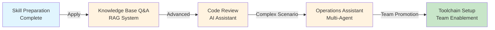
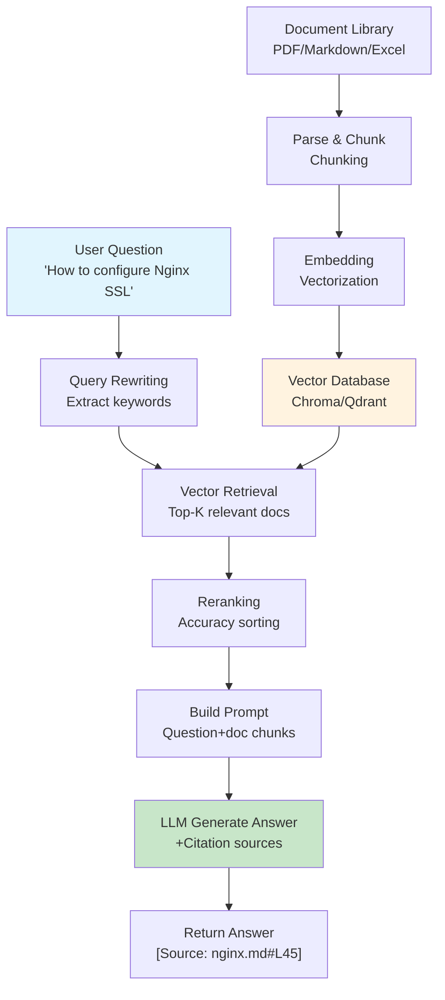

# Chapter 14: IT Department Practical Scenarios

> After completing this chapter, you will: Complete at least one deployable AI application project for your team



**Chapter Navigation:**

- **14.1 Internal Knowledge Base Q&A System**: Complete document Q&A system (RAG + citation tracing)
- **14.2 AI Code Review Assistant**: Automated code review tool
- **14.3 IT Operations Intelligent Assistant**: Log analysis + fault diagnosis Multi-Agent system
- **14.4 Team AI Toolchain Setup**: AI implementation guide from individual to team

---

## 14.1 Internal Knowledge Base Q&A System <DifficultyBadge level="intermediate" /> <CostBadge cost="$0.10" />

> Comprehensive Application: Ch4 (Prompt), Ch7 (Function Calling), Ch12 (RAG), Ch13 (Production)

### Why Do We Need It? (Problem)

**"The company has hundreds of technical documents, but finding information is like looking for a needle in a haystack."**

Pain points in IT departments:

| Scenario | Pain Point | Consequence |
|------|------|------|
| **New Employee Onboarding** | Don't know where to find docs | Repeatedly asking veterans same questions |
| **Technical Specification Query** | Documents scattered across platforms | 30 minutes to find one API description |
| **Historical Decision Query** | Project docs unmaintained | Repeating same mistakes |
| **Cross-Department Collaboration** | Unfamiliar with other teams' systems | Reinventing the wheel |

**Problems with Traditional Solutions:**

- **Full-Text Search**: Keyword matching, cannot understand semantics
- **Wiki Systems**: Need to know exact document titles
- **Manual Consultation**: Consumes expert time, inefficient

**What's Needed: An intelligent Q&A system that understands natural language questions, accurately finds answers and provides sources.**

### What Is It? (Concept)

**Knowledge Base Q&A System** is a document Q&A application based on RAG (Retrieval-Augmented Generation):



**Core Architecture:**

### 1. Document Processing Pipeline

```python
# Pseudo code
documents = load_documents(["*.pdf", "*.md", "*.xlsx"])
chunks = split_documents(documents, chunk_size=500, overlap=50)
embeddings = embed_chunks(chunks)
vector_db.store(embeddings)
```

**Chunking Strategy:**

| Document Type | Chunk Size | Strategy |
|---------|---------|------|
| **Markdown** | 500 Token | Split by heading levels |
| **PDF** | 400 Token | Split by paragraphs |
| **Code** | Function level | Split by functions/classes |
| **Excel** | Row/table | Split by table structure |

### 2. Retrieval Pipeline

```python
# User question
question = "How to configure Nginx SSL?"

# Vector retrieval (Top-5)
relevant_chunks = vector_db.search(question, top_k=5)

# Reranking (optional, improves accuracy)
reranked_chunks = reranker.rerank(question, relevant_chunks)[:3]

# Build Prompt
prompt = build_rag_prompt(question, reranked_chunks)

# Generate answer
answer = llm.generate(prompt)
```

**Key Technical Points:**

| Technology | Purpose | Tools |
|------|------|------|
| **Embedding Model** | Convert text to vectors | OpenAI text-embedding-3, BGE |
| **Vector Database** | Store and retrieve vectors | Chroma, Qdrant, Pinecone |
| **Reranking** | Accurately sort relevant docs | Cohere Rerank, BGE Reranker |
| **Citation Tracing** | Mark answer sources | Custom Prompt |
| **Hybrid Retrieval** | Vector + Keyword | BM25 + Vector |

### 3. Prompt Design

```python
RAG_PROMPT = """
You are a knowledge base Q&A assistant. Please answer user questions based on the following document snippets.

Important rules:
1. Only answer using provided document content, do not fabricate information
2. If documents don't contain the answer, clearly state "No relevant information found in documents"
3. List citation sources at the end of the answer (format: [Source: filename#line_number])
4. If multiple documents mention the same information, list all sources

Document snippets:
{documents}

User question: {question}

Answer:
"""
```

### Hands-On Practice (Practice)

**Complete Implementation: Internal Knowledge Base Q&A System**

```python
from openai import OpenAI
import chromadb
from pathlib import Path
import hashlib

client = OpenAI()

class KnowledgeBase:
    """Knowledge Base Q&A System"""
    
    def __init__(self, collection_name: str = "company_docs"):
        self.client = OpenAI()
        self.chroma_client = chromadb.Client()
        self.collection = self.chroma_client.get_or_create_collection(collection_name)
    
    def add_document(self, content: str, source: str, metadata: dict = None):
        """Add document to knowledge base"""
        # Chunk (simplified: split by paragraph)
        chunks = self._split_into_chunks(content, chunk_size=500)
        
        for i, chunk in enumerate(chunks):
            # Generate Embedding
            embedding = self._embed(chunk)
            
            # Generate unique ID
            chunk_id = hashlib.md5(f"{source}_{i}".encode()).hexdigest()
            
            # Store
            self.collection.add(
                ids=[chunk_id],
                embeddings=[embedding],
                documents=[chunk],
                metadatas=[{
                    "source": source,
                    "chunk_index": i,
                    **(metadata or {})
                }]
            )
        
        print(f"✓ Document added: {source} ({len(chunks)} chunks)")
    
    def _split_into_chunks(self, text: str, chunk_size: int) -> list[str]:
        """Simple text chunking (by word count)"""
        words = text.split()
        chunks = []
        
        for i in range(0, len(words), chunk_size):
            chunk = " ".join(words[i:i + chunk_size])
            chunks.append(chunk)
        
        return chunks
    
    def _embed(self, text: str) -> list[float]:
        """Generate Embedding"""
        response = self.client.embeddings.create(
            model="text-embedding-3-small",
            input=text
        )
        return response.data[0].embedding
    
    def search(self, question: str, top_k: int = 3) -> list[dict]:
        """Retrieve relevant documents"""
        # Query vector
        query_embedding = self._embed(question)
        
        # Vector retrieval
        results = self.collection.query(
            query_embeddings=[query_embedding],
            n_results=top_k
        )
        
        # Format results
        retrieved_docs = []
        for i in range(len(results['ids'][0])):
            retrieved_docs.append({
                "content": results['documents'][0][i],
                "source": results['metadatas'][0][i]['source'],
                "chunk_index": results['metadatas'][0][i]['chunk_index'],
                "distance": results['distances'][0][i]
            })
        
        return retrieved_docs
    
    def ask(self, question: str) -> dict:
        """Q&A interface"""
        # 1. Retrieve relevant documents
        docs = self.search(question, top_k=3)
        
        if not docs:
            return {
                "answer": "Sorry, no relevant information found in the knowledge base.",
                "sources": []
            }
        
        # 2. Build Prompt
        docs_text = "\n\n".join([
            f"[Document {i+1}] Source: {doc['source']}\n{doc['content']}"
            for i, doc in enumerate(docs)
        ])
        
        prompt = f"""
You are a knowledge base Q&A assistant. Please answer user questions based on the following document snippets.

Important rules:
1. Only answer using provided document content, do not fabricate information
2. If documents don't contain the answer, clearly state "No relevant information found in documents"
3. List citation sources at the end of the answer (format: [Source: filename])

Document snippets:
{docs_text}

User question: {question}

Answer:
"""
        
        # 3. Call LLM
        response = self.client.chat.completions.create(
            model="gpt-4.1-mini",
            messages=[{"role": "user", "content": prompt}],
            temperature=0.3  # Lower randomness, increase accuracy
        )
        
        answer = response.choices[0].message.content
        
        return {
            "answer": answer,
            "sources": [{"source": doc['source'], "snippet": doc['content'][:100]} for doc in docs]
        }

# ===== Usage Example =====

# 1. Create knowledge base
kb = KnowledgeBase()

# 2. Add documents (simulating company technical docs)
kb.add_document(
    content="""
Nginx SSL Configuration Guide

1. Generate SSL Certificate
Use Let's Encrypt to generate free certificate:
sudo certbot --nginx -d yourdomain.com

2. Configure Nginx
Edit /etc/nginx/sites-available/default:

server {
    listen 443 ssl;
    server_name yourdomain.com;
    
    ssl_certificate /etc/letsencrypt/live/yourdomain.com/fullchain.pem;
    ssl_certificate_key /etc/letsencrypt/live/yourdomain.com/privkey.pem;
    
    ssl_protocols TLSv1.2 TLSv1.3;
    ssl_ciphers HIGH:!aNULL:!MD5;
}

3. Restart Nginx
sudo systemctl restart nginx

Note: Ensure firewall opens port 443.
""",
    source="nginx-ssl.md",
    metadata={"category": "Operations", "author": "Zhang San"}
)

kb.add_document(
    content="""
Python FastAPI Deployment Guide

1. Install Dependencies
pip install fastapi uvicorn

2. Create Application
# main.py
from fastapi import FastAPI

app = FastAPI()

@app.get("/")
def read_root():
    return {"message": "Hello World"}

3. Run Service
uvicorn main:app --host 0.0.0.0 --port 8000

4. Production Deployment
Use Gunicorn + Uvicorn:
gunicorn main:app --workers 4 --worker-class uvicorn.workers.UvicornWorker

Recommended to use Supervisor for process management.
""",
    source="fastapi-deployment.md",
    metadata={"category": "Backend", "author": "Li Si"}
)

kb.add_document(
    content="""
Company API Gateway Usage Guidelines

1. Authentication Method
All API requests must include Authorization header:
Authorization: Bearer <your_token>

2. Rate Limiting Rules
- Regular users: 100 req/min
- VIP users: 1000 req/min
- Over limit returns 429 status code

3. Common Error Codes
- 401: Unauthorized, invalid Token
- 403: Forbidden access, insufficient permissions
- 429: Too many requests, rate limit triggered
- 500: Server error

4. Contact Information
For issues contact: api-support@company.com
""",
    source="api-gateway.md",
    metadata={"category": "Standards", "author": "Wang Wu"}
)

# 3. Test Q&A
print("="*60)
print("Knowledge Base Q&A System Test")
print("="*60)

questions = [
    "How to configure Nginx SSL?",
    "How to deploy FastAPI to production?",
    "What's the API rate limit?",
    "How to connect to database?",  # Question not in knowledge base
]

for q in questions:
    print(f"\nQuestion: {q}")
    print("-"*60)
    
    result = kb.ask(q)
    
    print(f"Answer: {result['answer']}")
    print(f"\nCitation sources:")
    for source in result['sources']:
        print(f"  - {source['source']}: {source['snippet']}...")
```

**Enhanced Feature: Hybrid Retrieval**

```python
from rank_bm25 import BM25Okapi

class HybridKnowledgeBase(KnowledgeBase):
    """Hybrid Retrieval: Vector Retrieval + BM25 Keyword Retrieval"""
    
    def __init__(self, *args, **kwargs):
        super().__init__(*args, **kwargs)
        self.bm25_corpus = []
        self.bm25_metadata = []
        self.bm25_index = None
    
    def add_document(self, content: str, source: str, metadata: dict = None):
        """Add document (also build BM25 index)"""
        super().add_document(content, source, metadata)
        
        # Add to BM25 index
        chunks = self._split_into_chunks(content, chunk_size=500)
        for i, chunk in enumerate(chunks):
            self.bm25_corpus.append(chunk.split())
            self.bm25_metadata.append({"source": source, "chunk_index": i, "content": chunk})
        
        # Rebuild BM25 index
        self.bm25_index = BM25Okapi(self.bm25_corpus)
    
    def search(self, question: str, top_k: int = 3) -> list[dict]:
        """Hybrid retrieval: Vector + BM25"""
        # 1. Vector retrieval
        vector_results = super().search(question, top_k=top_k * 2)
        
        # 2. BM25 retrieval
        bm25_scores = self.bm25_index.get_scores(question.split())
        top_bm25_indices = sorted(range(len(bm25_scores)), key=lambda i: bm25_scores[i], reverse=True)[:top_k * 2]
        
        bm25_results = [
            {
                "content": self.bm25_metadata[i]["content"],
                "source": self.bm25_metadata[i]["source"],
                "chunk_index": self.bm25_metadata[i]["chunk_index"],
                "score": bm25_scores[i]
            }
            for i in top_bm25_indices
        ]
        
        # 3. Merge results (simple strategy: take union then sort by score)
        combined = {}
        
        for doc in vector_results:
            key = f"{doc['source']}_{doc['chunk_index']}"
            combined[key] = doc
        
        for doc in bm25_results:
            key = f"{doc['source']}_{doc['chunk_index']}"
            if key not in combined:
                combined[key] = doc
        
        # Return Top-K
        return list(combined.values())[:top_k]
```

<ColabBadge path="demos/14-practice/knowledge_base.ipynb" />

### Summary (Reflection)

- **What was solved**: Built complete knowledge base Q&A system with document upload, vector retrieval, citation tracing
- **What wasn't solved**: Document Q&A is done, but how to automate code review? — Next section introduces AI Code Review Assistant
- **Key Points**:
  1. **RAG is core architecture**: Retrieval + generation, avoids model hallucination
  2. **Embedding + Vector Database**: Semantic search is smarter than keyword search
  3. **Citation tracing is important**: Let users know answer sources, build trust
  4. **Hybrid retrieval improves accuracy**: Vector retrieval + BM25 keyword retrieval
  5. **Prompt design is key**: Clearly tell the model "don't fabricate"

> *"The gap between 'I know about AI' and 'I shipped an AI product' is roughly the same as the gap between 'I watched a cooking show' and 'I opened a restaurant.' This chapter is your restaurant. Welcome to the kitchen."*

---

*Last updated: 2026-02-20*
