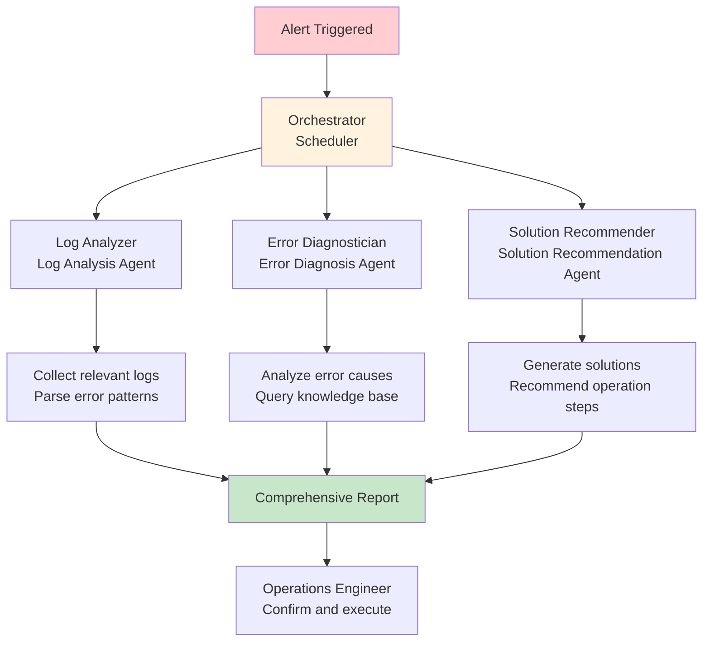

## 14.3 IT Operations Intelligent Assistant <DifficultyBadge level="advanced" /> <CostBadge cost="$0.20" />

> Comprehensive Application: Ch10 (Multi-Agent), Ch11 (MCP), Ch8 (Multimodal)

### Why Do We Need It? (Problem)

**"At 3 AM the server alerts, operations engineer needs to quickly locate the issue."**

IT operations pain points:

| Scenario | Pain Point | Consequence |
|------|------|------|
| **Emergency Failure** | Logs scattered across multiple systems | Slow issue location, long MTTR |
| **Experience Dependency** | Beginners don't know where to start | Missing golden time for fault handling |
| **Repetitive Issues** | Same alerts repeatedly appear | Low efficiency of manual troubleshooting |
| **Knowledge Loss** | Old employees leave with experience | Team capability declines |

**Real Case:**

```
E-commerce platform evening peak alert:
- Alert info: API response time exceeds 5 seconds
- Logs scattered in: Application logs, Nginx logs, database logs, monitoring system
- Traditional process: Ops engineer manually checks 4 systems, takes 20 minutes to locate slow database query

After using AI assistant:
- Input: Alert information
- AI automatically:
  1. Collect relevant logs
  2. Analyze error patterns
  3. Locate slow query SQL
  4. Give optimization suggestions
- Location time: 3 minutes
```

**What's Needed: Intelligent operations assistant that can automatically analyze logs, diagnose faults, give solutions.**

### What Is It? (Concept)

**IT Operations Intelligent Assistant** is a fault diagnosis system based on Multi-Agent:



**Multi-Agent Architecture:**

### 1. Log Analyzer (Log Analysis Agent)

**Responsibilities: Collect and analyze logs, extract key information.**

```python
class LogAnalyzerAgent:
    """Log Analysis Agent"""
    
    def __init__(self, llm):
        self.llm = llm
        self.system_prompt = """
You are a log analysis expert. Your tasks are:
1. Parse log files, extract error information
2. Identify error patterns (e.g., frequently occurring exceptions, time patterns)
3. Extract key metrics (e.g., error count, impact scope)

Output format:
- Error summary
- Key timestamps
- Affected components
- Error frequency statistics
"""
    
    def analyze(self, logs: str) -> dict:
        """Analyze logs"""
        prompt = f"{self.system_prompt}\n\nLog content:\n{logs}"
        
        response = self.llm.generate(prompt)
        
        return {
            "summary": response,
            "timestamp": datetime.now()
        }
```

### 2. Error Diagnostician (Error Diagnosis Agent)

**Responsibilities: Diagnose root cause based on error information.**

```python
class ErrorDiagnosticianAgent:
    """Error Diagnosis Agent"""
    
    def __init__(self, llm, knowledge_base):
        self.llm = llm
        self.kb = knowledge_base
        self.system_prompt = """
You are a fault diagnosis expert. Your tasks are:
1. Analyze error patterns, infer root cause
2. Query historical cases, find similar issues
3. Assess issue severity and impact scope

Output format:
- Root cause analysis
- Similar historical cases
- Severity assessment (high/medium/low)
- Possible trigger conditions
"""
    
    def diagnose(self, error_summary: str) -> dict:
        """Diagnose error"""
        # Query knowledge base
        similar_cases = self.kb.search(error_summary, top_k=3)
        
        prompt = f"""
{self.system_prompt}

Current error:
{error_summary}

Similar historical cases:
{similar_cases}

Please provide diagnosis results.
"""
        
        response = self.llm.generate(prompt)
        
        return {
            "diagnosis": response,
            "similar_cases": similar_cases
        }
```

### 3. Solution Recommender (Solution Recommendation Agent)

**Responsibilities: Generate solutions and operation steps.**

```python
class SolutionRecommenderAgent:
    """Solution Recommendation Agent"""
    
    def __init__(self, llm):
        self.llm = llm
        self.system_prompt = """
You are an operations solution expert. Your tasks are:
1. Propose solutions based on diagnosis results
2. Give detailed operation steps
3. Mark risk points and precautions

Output format:
- Recommended solutions (priority sorted)
- Operation steps (executable commands)
- Risk warnings
- Expected effects
"""
    
    def recommend(self, diagnosis: str) -> dict:
        """Recommend solutions"""
        prompt = f"{self.system_prompt}\n\nDiagnosis results:\n{diagnosis}"
        
        response = self.llm.generate(prompt)
        
        return {
            "solutions": response
        }
```

### 4. Orchestrator (Scheduler)

**Responsibilities: Coordinate multiple Agents, generate comprehensive report.**

```python
class OpsOrchestrator:
    """Operations Assistant Scheduler"""
    
    def __init__(self):
        self.log_analyzer = LogAnalyzerAgent(llm)
        self.diagnostician = ErrorDiagnosticianAgent(llm, kb)
        self.solution_recommender = SolutionRecommenderAgent(llm)
    
    def handle_alert(self, alert: dict) -> dict:
        """Handle alert"""
        # Step 1: Analyze logs
        log_analysis = self.log_analyzer.analyze(alert['logs'])
        
        # Step 2: Diagnose error
        diagnosis = self.diagnostician.diagnose(log_analysis['summary'])
        
        # Step 3: Recommend solutions
        solutions = self.solution_recommender.recommend(diagnosis['diagnosis'])
        
        # Generate comprehensive report
        return {
            "alert": alert,
            "log_analysis": log_analysis,
            "diagnosis": diagnosis,
            "solutions": solutions,
            "timestamp": datetime.now()
        }
```

**Tool Integration (MCP):**

Tools available to operations assistant:

| Tool | Function | Example |
|------|------|------|
| **Log Fetcher** | Fetch logs from log system | `fetch_logs(service='api', time_range='1h')` |
| **Metrics Reader** | Read monitoring metrics | `get_metrics(service='db', metric='cpu')` |
| **Command Executor** | Execute operations commands (needs approval) | `restart_service(name='nginx')` |
| **Knowledge Base** | Query historical cases | `search_cases(query='timeout')` |

### Hands-On Practice (Practice)

**Complete Implementation: IT Operations Intelligent Assistant**

```python
from openai import OpenAI
from datetime import datetime
import json

client = OpenAI()

class OpsAssistant:
    """IT Operations Intelligent Assistant"""
    
    def __init__(self):
        self.client = OpenAI()
        self.knowledge_base = self._load_knowledge_base()
    
    def _load_knowledge_base(self) -> dict:
        """Load knowledge base (historical cases)"""
        return {
            "timeout": {
                "symptoms": "API response timeout, logs show connection timeout",
                "root_cause": "Database connection pool exhausted",
                "solution": "Increase connection pool size or optimize slow queries"
            },
            "oom": {
                "symptoms": "Service crash, logs show OutOfMemoryError",
                "root_cause": "Memory leak or insufficient heap memory configuration",
                "solution": "Analyze heap dump file or increase -Xmx parameter"
            },
            "high_cpu": {
                "symptoms": "CPU usage sustained at 100%",
                "root_cause": "Infinite loop or inefficient algorithm",
                "solution": "Use profiler to locate hot code"
            }
        }
    
    def analyze_logs(self, logs: str) -> dict:
        """Step 1: Analyze logs"""
        prompt = f"""
You are a log analysis expert. Please analyze the following logs and extract key information.

Log content:
{logs}

Output JSON format:
{ {
  "error_type": "<error_type>",
  "error_message": "<error_message>",
  "affected_components": ["<component1>", "<component2>"],
  "error_count": <error_count>,
  "first_occurrence": "<first_occurrence_time>",
  "pattern": "<error_pattern_description>"
} }
"""
        
        response = self.client.chat.completions.create(
            model="gpt-4.1-mini",
            messages=[{"role": "user", "content": prompt}],
            response_format={"type": "json_object"}
        )
        
        return json.loads(response.choices[0].message.content)
    
    def diagnose_error(self, log_analysis: dict) -> dict:
        """Step 2: Diagnose error"""
        # Query knowledge base
        similar_cases = self._search_knowledge_base(log_analysis['error_type'])
        
        prompt = f"""
You are a fault diagnosis expert. Please diagnose root cause based on log analysis results and historical cases.

Log analysis:
{json.dumps(log_analysis, ensure_ascii=False, indent=2)}

Similar historical cases:
{json.dumps(similar_cases, ensure_ascii=False, indent=2)}

Output JSON format:
{ {
  "root_cause": "<root_cause>",
  "severity": "high|medium|low",
  "impact_scope": "<impact_scope>",
  "possible_triggers": ["<trigger_condition1>", "<trigger_condition2>"],
  "confidence": <0-100>
} }
"""
        
        response = self.client.chat.completions.create(
            model="gpt-4o",  # Use stronger model for diagnosis
            messages=[{"role": "user", "content": prompt}],
            response_format={"type": "json_object"}
        )
        
        return json.loads(response.choices[0].message.content)
    
    def recommend_solution(self, diagnosis: dict) -> dict:
        """Step 3: Recommend solutions"""
        prompt = f"""
You are an operations solution expert. Please propose solutions based on diagnosis results.

Diagnosis results:
{json.dumps(diagnosis, ensure_ascii=False, indent=2)}

Output JSON format:
{ {
  "solutions": [
    { {
      "priority": 1,
      "description": "<solution_description>",
      "steps": ["<step1>", "<step2>"],
      "risks": ["<risk1>"],
      "estimated_time": "<estimated_time>"
    } }
  ],
  "preventive_measures": ["<preventive_measure1>", "<preventive_measure2>"]
} }
"""
        
        response = self.client.chat.completions.create(
            model="gpt-4o",
            messages=[{"role": "user", "content": prompt}],
            response_format={"type": "json_object"}
        )
        
        return json.loads(response.choices[0].message.content)
    
    def _search_knowledge_base(self, error_type: str) -> list:
        """Search knowledge base"""
        results = []
        error_type_lower = error_type.lower()
        
        for key, case in self.knowledge_base.items():
            if key in error_type_lower or error_type_lower in case['symptoms'].lower():
                results.append(case)
        
        return results
    
    def handle_incident(self, alert_info: dict) -> dict:
        """Handle incident (main process)"""
        print("\n" + "="*60)
        print("Operations Assistant Started")
        print("="*60)
        
        # Step 1: Log analysis
        print("\n[1/3] Analyzing logs...")
        log_analysis = self.analyze_logs(alert_info['logs'])
        print(f"✓ Detected error type: {log_analysis['error_type']}")
        print(f"✓ Affected components: {', '.join(log_analysis['affected_components'])}")
        
        # Step 2: Error diagnosis
        print("\n[2/3] Diagnosing root cause...")
        diagnosis = self.diagnose_error(log_analysis)
        print(f"✓ Root cause: {diagnosis['root_cause']}")
        print(f"✓ Severity: {diagnosis['severity'].upper()}")
        print(f"✓ Confidence: {diagnosis['confidence']}%")
        
        # Step 3: Solution recommendation
        print("\n[3/3] Generating solutions...")
        solutions = self.recommend_solution(diagnosis)
        print(f"✓ Generated {len(solutions['solutions'])} solutions")
        
        # Generate report
        report = {
            "alert": alert_info,
            "log_analysis": log_analysis,
            "diagnosis": diagnosis,
            "solutions": solutions,
            "timestamp": datetime.now().isoformat()
        }
        
        print("\n" + "="*60)
        print("Fault Diagnosis Report")
        print("="*60)
        
        return report
    
    def format_report(self, report: dict):
        """Format output report"""
        print(f"\nAlert time: {report['alert']['timestamp']}")
        print(f"Alert service: {report['alert']['service']}")
        
        print(f"\nLog Analysis:")
        print(f"  Error type: {report['log_analysis']['error_type']}")
        print(f"  Error message: {report['log_analysis']['error_message']}")
        print(f"  Error count: {report['log_analysis']['error_count']}")
        
        print(f"\nRoot Cause:")
        print(f"  {report['diagnosis']['root_cause']}")
        print(f"  Severity: {report['diagnosis']['severity'].upper()}")
        print(f"  Impact scope: {report['diagnosis']['impact_scope']}")
        
        print(f"\nRecommended Solutions:")
        for i, solution in enumerate(report['solutions']['solutions'], 1):
            print(f"\n  Solution {i} (Priority {solution['priority']}):")
            print(f"  {solution['description']}")
            print(f"  Operation steps:")
            for j, step in enumerate(solution['steps'], 1):
                print(f"    {j}. {step}")
            if solution.get('risks'):
                print(f"  ⚠️  Risk warning: {', '.join(solution['risks'])}")
            print(f"  ⏱️  Estimated time: {solution['estimated_time']}")
        
        print(f"\nPreventive Measures:")
        for measure in report['solutions']['preventive_measures']:
            print(f"  - {measure}")

# ===== Usage Example =====

assistant = OpsAssistant()

# Simulate alert scenario 1: Database connection timeout
alert_1 = {
    "timestamp": "2026-02-20 03:15:30",
    "service": "api-server",
    "severity": "high",
    "message": "API response time exceeds 5 seconds",
    "logs": """
[2026-02-20 03:15:28] ERROR: API request /api/users failed
[2026-02-20 03:15:28] ERROR: Database connection timeout after 5000ms
[2026-02-20 03:15:28] ERROR: Connection pool exhausted (50/50 connections in use)
[2026-02-20 03:15:29] ERROR: Retry failed, returning 504 Gateway Timeout
[2026-02-20 03:15:30] WARN: Connection pool size: 50, waiting threads: 120
"""
}

print("\n" + "#"*60)
print("Scenario 1: Database Connection Timeout")
print("#"*60)

report_1 = assistant.handle_incident(alert_1)
assistant.format_report(report_1)

# Simulate alert scenario 2: Out of memory
alert_2 = {
    "timestamp": "2026-02-20 10:45:12",
    "service": "worker-service",
    "severity": "critical",
    "message": "Service crashed and restarted",
    "logs": """
[2026-02-20 10:45:10] ERROR: java.lang.OutOfMemoryError: Java heap space
[2026-02-20 10:45:10] ERROR: at com.company.worker.DataProcessor.process(DataProcessor.java:156)
[2026-02-20 10:45:10] ERROR: Unable to create new native thread
[2026-02-20 10:45:11] FATAL: JVM crashed, generating heap dump to /tmp/heapdump.hprof
[2026-02-20 10:45:12] INFO: Service restarting...
"""
}

print("\n\n" + "#"*60)
print("Scenario 2: Out of Memory")
print("#"*60)

report_2 = assistant.handle_incident(alert_2)
assistant.format_report(report_2)
```

**Advanced Feature: Auto-Execution (Requires Approval)**

```python
class AutomatedOpsAssistant(OpsAssistant):
    """Automated Operations Assistant (supports auto-execution)"""
    
    def __init__(self, *args, **kwargs):
        super().__init__(*args, **kwargs)
        self.safe_commands = {
            "restart_service": self._restart_service,
            "scale_up": self._scale_up,
            "clear_cache": self._clear_cache,
        }
    
    def execute_solution(self, solution: dict, auto_approve: bool = False) -> dict:
        """Execute solution (requires approval)"""
        if not auto_approve:
            print(f"\n🔐 Manual approval required: {solution['description']}")
            approval = input("Execute? (yes/no): ")
            if approval.lower() != 'yes':
                return {"status": "cancelled", "message": "User cancelled operation"}
        
        # Parse steps, extract executable commands
        for step in solution['steps']:
            if step.startswith("Command:"):
                command = step.split("Command:", 1)[1].strip()
                print(f"\nExecuting: {command}")
                
                # Check if safe command
                cmd_name = command.split()[0]
                if cmd_name in self.safe_commands:
                    result = self.safe_commands[cmd_name](command)
                    print(f"Result: {result}")
                else:
                    print(f"⚠️  Unsafe command, requires manual execution")
        
        return {"status": "completed"}
    
    def _restart_service(self, command: str) -> str:
        """Restart service (simulated)"""
        # Actual implementation should call K8s API, Systemd etc.
        return "Service restarted (simulated)"
    
    def _scale_up(self, command: str) -> str:
        """Scale up (simulated)"""
        return "Added 2 instances (simulated)"
    
    def _clear_cache(self, command: str) -> str:
        """Clear cache (simulated)"""
        return "Redis cache cleared (simulated)"
```

<ColabBadge path="demos/14-practice/ops_assistant.ipynb" />

### Summary (Reflection)

- **What was solved**: Built Multi-Agent operations assistant, automatically analyzes logs, diagnoses faults, recommends solutions
- **What wasn't solved**: Personal capability improved, but how to get the whole team using it? — Next section introduces team toolchain setup
- **Key Points**:
  1. **Multi-Agent collaboration**: Log analysis + diagnosis + solution recommendation
  2. **Knowledge base is important**: Historical cases improve diagnosis accuracy
  3. **Human-machine collaboration**: AI recommends, human approves execution
  4. **Scalability**: Integrate more operations tools through MCP
  5. **Security first**: Sensitive operations must be manually approved

---

*Last updated: 2026-02-20*
