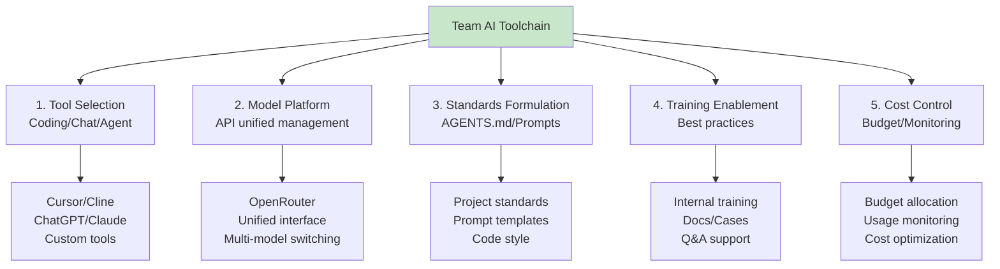
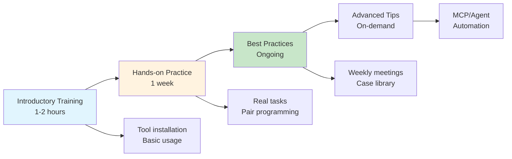

## 14.4 Team AI Toolchain Setup <DifficultyBadge level="intermediate" /> <CostBadge cost="$0" />

> Comprehensive Application: Ch5 (AI Coding Tools), Ch6 (Context Engineering), Ch2 (AI Landscape)

### Why Do We Need It? (Problem)

**"I learned AI, but other team members don't know how to use it, how to promote it?"**

Individual to team gap:

| Stage | Challenge | Consequence |
|------|------|------|
| **Individual Use** | Self-exploration, efficiency improvement | Team efficiency varies |
| **Promotion Stage** | Don't know where to start | Promotion fails, tool wasted |
| **Tool Selection** | Too many options, don't know which fits | Tool conflicts, high learning cost |
| **Unified Standards** | Everyone uses differently | Cannot collaborate, hard to share knowledge |
| **Cost Control** | Bills out of control | Budget overrun, project suspended |

**Real Case:**

```
A startup's AI implementation failure case:
1. Bought 10 ChatGPT Plus accounts, but only 3 people using them
2. Everyone uses different tools: Cursor, Cline, GitHub Copilot
3. No unified Prompt standards, code style messy
4. No cost monitoring, spent $2000 in first month
5. Gave up after 3 months, returned to traditional development

Failure reason: Lack of systematic implementation plan.
```

**What's Needed: Team-level AI toolchain, including tool selection, standards formulation, training plan, cost control.**

### What Is It? (Concept)

**Team AI Toolchain** is a complete system supporting team AI capabilities:



**Core Elements:**

### 1. Tool Selection Matrix

| Tool Type | Tool Name | Use Case | Cost | Recommendation |
|---------|---------|---------|------|---------|
| **AI Coding** | Cursor | Main development tool | $20/month/person | ⭐⭐⭐⭐⭐ |
| **AI Coding** | GitHub Copilot | VS Code users | $10/month/person | ⭐⭐⭐⭐ |
| **AI Coding** | Cline (MCP) | Advanced automation | $0 (needs API) | ⭐⭐⭐⭐ |
| **Chat Assistant** | ChatGPT Plus | General Q&A | $20/month/person | ⭐⭐⭐⭐⭐ |
| **Chat Assistant** | Claude Pro | Long text processing | $20/month/person | ⭐⭐⭐⭐ |
| **API Platform** | OpenRouter | Unified API entry | Pay as you go | ⭐⭐⭐⭐⭐ |
| **Team Collaboration** | Custom Slack Bot | Internal Q&A | Development cost | ⭐⭐⭐ |

**Recommended Configuration Plans:**

**Small Team (5-10 people):**
- Coding: Cursor (all members)
- Chat: ChatGPT Plus (2-3 for tech leads)
- API: OpenRouter (team account, on-demand use)
- Monthly cost: ~$150

**Medium Team (10-50 people):**
- Coding: Cursor (dev) + GitHub Copilot (ops)
- Chat: ChatGPT Plus (tech backbone) + custom internal Bot (all members)
- API: OpenRouter + Azure OpenAI (enterprise account)
- Monthly cost: ~$800

**Large Team (50+ people):**
- Coding: Unified purchase Cursor enterprise edition
- Chat: Custom enterprise platform + ChatGPT Plus (management)
- API: Azure OpenAI (private deployment)
- Monthly cost: Negotiated pricing

### 2. Unified API Platform: OpenRouter

**Why OpenRouter?**

```python
# Problem: Team uses multiple models, code hard to unify
# OpenAI
from openai import OpenAI
client1 = OpenAI(api_key="sk-...")

# Anthropic
import anthropic
client2 = anthropic.Anthropic(api_key="sk-ant-...")

# Google
import google.generativeai as genai
genai.configure(api_key="...")

# Each model API different, switching difficult
```

**Solution: OpenRouter Unified Interface**

```python
# Unified OpenAI SDK, switch models via base_url
from openai import OpenAI

client = OpenAI(
    base_url="https://openrouter.ai/api/v1",
    api_key="sk-or-..."  # OpenRouter API Key
)

# Easily switch models
response = client.chat.completions.create(
    model="anthropic/claude-3.5-sonnet",  # or openai/gpt-4o
    messages=[{"role": "user", "content": "Hello"}]
)
```

**OpenRouter Advantages:**

| Advantage | Description |
|------|------|
| **Unified Interface** | All models use same code |
| **Cost Optimization** | Auto-select cheapest provider |
| **Fallback Strategy** | Main model fails auto-switch to backup |
| **Usage Tracking** | Unified cost monitoring |
| **No Multiple Accounts** | One Key access all models |

### 3. Project Standards: AGENTS.md

**Why AGENTS.md?**

Make AI understand your project, generate code that meets standards.

**AGENTS.md Template:**

```markdown
# Project AI Development Guide

## Project Overview
- **Project Name**: Internal Knowledge Base System
- **Tech Stack**: Python 3.11, FastAPI, PostgreSQL, Redis, React
- **Deployment Environment**: Docker + K8s

## Code Standards

### Python Code Style
- Use Black formatting (line length 88)
- Use Ruff for Linting
- Type annotations must be complete
- Docstrings use Google style

### Naming Conventions
- Filenames: snake_case (user_service.py)
- Class names: PascalCase (UserService)
- Function names: snake_case (get_user_by_id)
- Constants: UPPER_SNAKE_CASE (MAX_RETRY_COUNT)

### Directory Structure
```
project/
├── app/
│   ├── api/           # API routes
│   ├── models/        # Data models
│   ├── services/      # Business logic
│   ├── utils/         # Utility functions
│   └── tests/         # Tests
```

## AI Usage Rules

### Code Generation Requirements
1. Must include type annotations
2. Must include docstrings
3. Must include error handling
4. Must include unit tests

### Prohibited Operations
- ❌ Don't hardcode sensitive info (passwords, API Keys)
- ❌ Don't use deprecated libraries
- ❌ Don't ignore exceptions (no empty except)
- ❌ Don't use `import *`

### Common Prompt Templates

#### Generate API Endpoint
```
Generate a FastAPI endpoint implementing user creation functionality.

Requirements:
- Path: POST /api/users
- Request body: UserCreate model (username, email, password)
- Response: UserResponse model (id, username, email, created_at)
- Include parameter validation and error handling
- Use SQLAlchemy to write to database
- Include unit tests
```

#### Code Review
```
Review the following code, focusing on:
1. Whether it meets project standards (AGENTS.md)
2. Whether there are potential Bugs
3. Whether there are security issues
4. Whether there are performance issues

Code:
[paste code]
```

## Dependencies

### Required Dependencies
- FastAPI: Web framework
- SQLAlchemy: ORM
- Pydantic: Data validation
- pytest: Testing framework

### Prohibited Dependencies
- Flask (use FastAPI instead)
- requests (use httpx instead)

## Security Standards
- Passwords use bcrypt encryption
- Sensitive config uses environment variables
- API requires JWT authentication
- Input must be validated and escaped

## Testing Requirements
- Unit test coverage > 80%
- Each API endpoint must have integration tests
- Use pytest fixtures to manage test data

---
Last updated: 2026-02-20
```

**Usage:**

```python
# Using AGENTS.md in Cursor/Cline
# 1. Create file: .cursor/AGENTS.md or project root
# 2. AI will auto-read and follow standards
# 3. Auto-apply standards when generating code

# Cline auto-reads AGENTS.md from project
# Cursor needs to reference in Rules for AI
```

### 4. Team Training Plan

**Training Phases:**



**Training Content Outline:**

**Lesson 1: Tool Installation and Basic Usage (1 hour)**
- Cursor/Cline installation configuration
- First AI-assisted coding task
- Prompt basic techniques
- Common troubleshooting

**Lesson 2: Hands-on Practice (1 week)**
- Everyone completes 1 real requirement
- Pair programming, mutual Review
- Record problems encountered and solutions
- Weekend summary sharing

**Lesson 3: Best Practices (Ongoing)**
- Weekly tech sharing meeting (30 minutes)
- Internal case library building
- Prompt template sharing
- Q&A support

**Lesson 4: Advanced Tips (On-demand)**
- MCP Server development
- Multi-Agent applications
- Automation workflows
- Performance optimization

### 5. Cost Control Plan

**Budget Allocation:**

| Item | Monthly Budget | Description |
|------|--------|------|
| **Cursor Subscription** | $20 × people | Coding tool |
| **ChatGPT Plus** | $20 × key people | Q&A tool |
| **API Usage** | $200-500 | Custom apps |
| **Testing/Evaluation** | $50-100 | Quality assurance |
| **Reserve Fund** | $100 | Handle overage |

**Monitoring Metrics:**

```python
# Team AI usage dashboard
metrics = {
    "daily_usage": {
        "cursor_completions": 1500,
        "api_calls": 500,
        "cost_usd": 15.50
    },
    "top_users": [
        {"name": "Zhang San", "cost": 5.20},
        {"name": "Li Si", "cost": 3.80},
    ],
    "top_models": [
        {"model": "gpt-4o-mini", "calls": 400, "cost": 8.00},
        {"model": "claude-3.5-sonnet", "calls": 100, "cost": 7.50},
    ],
    "alerts": [
        "⚠️  Li Si today's usage exceeds quota by 150%"
    ]
}
```

**Cost Optimization Strategies:**

1. **Task Classification**: Simple tasks use GPT-4o-mini, complex tasks use GPT-4o
2. **Prompt Caching**: Fixed prompts enable caching
3. **Batch API**: Non-realtime tasks use Batch (-50% cost)
4. **Regular Review**: Monthly check usage, optimize inefficient calls

### Hands-On Practice (Practice)

**Experiment: Build Team AI Toolchain**

**Step 1: Create Project AGENTS.md**

```markdown
# Project Name: Team Task Management System

## Tech Stack
- Backend: Python 3.11 + FastAPI
- Database: PostgreSQL
- Frontend: React + TypeScript

## Code Standards

### Python
- Formatting: Black (line length 88)
- Linting: Ruff
- Type annotations: Must be complete

### API Design
- RESTful style
- Response format: `{"data": {...}, "error": null}`
- Error format: `{"data": null, "error": {"code": "...", "message": "..."}}`

## AI Usage Rules

### Code Generation Template
```python
from fastapi import APIRouter, Depends, HTTPException
from pydantic import BaseModel
from typing import List

router = APIRouter(prefix="/api/tasks", tags=["tasks"])

class TaskCreate(BaseModel):
    title: str
    description: str

class TaskResponse(BaseModel):
    id: int
    title: str
    description: str
    created_at: str

@router.post("/", response_model=TaskResponse)
async def create_task(task: TaskCreate):
    """Create task
    
    Args:
        task: Task creation data
        
    Returns:
        Created task object
        
    Raises:
        HTTPException: Creation failed
    """
    # TODO: Implement logic
    pass
```

### Must Follow
1. All functions include docstrings
2. All parameters include type annotations
3. Errors must throw HTTPException
4. Database operations must use transactions

---
Last updated: 2026-02-20
```

**Step 2: Configure Unified API (OpenRouter)**

```python
# config/ai.py
from openai import OpenAI

def get_ai_client(model: str = "gpt-4o-mini"):
    """Get AI client (unified interface)"""
    return OpenAI(
        base_url="https://openrouter.ai/api/v1",
        api_key="sk-or-..."  # Team shared Key
    )

# Usage example
client = get_ai_client()

response = client.chat.completions.create(
    model="openai/gpt-4o-mini",  # or switch to anthropic/claude-3.5-sonnet
    messages=[{"role": "user", "content": "Hello"}]
)
```

**Step 3: Build Prompt Template Library**

```python
# prompts/templates.py

PROMPTS = {
    "generate_api": """
Generate a FastAPI endpoint implementing {feature} functionality.

Requirements:
- Path: {method} {path}
- Request body: {request_model}
- Response: {response_model}
- Include parameter validation and error handling
- Use SQLAlchemy for database operations
- Include docstrings and type annotations
- Follow project standards (see AGENTS.md)

Generate complete code.
""",
    
    "code_review": """
Review the following code, checking:
1. Whether it meets AGENTS.md standards
2. Whether type annotations are complete
3. Whether error handling is reasonable
4. Whether there are security issues
5. Whether there are performance issues

Code:
```python
{code}
```

Give detailed review comments.
""",
    
    "generate_test": """
Generate pytest unit tests for the following function.

Function code:
```python
{function_code}
```

Requirements:
- Cover normal cases and edge cases
- Use pytest fixtures
- Include exception tests
- Code coverage > 80%

Generate complete test code.
""",
}

def get_prompt(template_name: str, **kwargs) -> str:
    """Get filled prompt"""
    template = PROMPTS[template_name]
    return template.format(**kwargs)

# Usage example
prompt = get_prompt(
    "generate_api",
    feature="user creation",
    method="POST",
    path="/api/users",
    request_model="UserCreate",
    response_model="UserResponse"
)
```

**Step 4: Cost Monitoring Script**

```python
# monitor/ai_usage.py
import json
from datetime import datetime, timedelta
from collections import defaultdict

class AIUsageMonitor:
    """AI usage monitoring"""
    
    def __init__(self, log_file: str = "ai_usage.jsonl"):
        self.log_file = log_file
    
    def log_usage(self, user: str, model: str, tokens: int, cost: float):
        """Record usage"""
        entry = {
            "timestamp": datetime.now().isoformat(),
            "user": user,
            "model": model,
            "tokens": tokens,
            "cost": cost
        }
        
        with open(self.log_file, 'a') as f:
            f.write(json.dumps(entry) + '\n')
    
    def get_daily_report(self, date: str = None) -> dict:
        """Get daily report"""
        if not date:
            date = datetime.now().strftime("%Y-%m-%d")
        
        with open(self.log_file, 'r') as f:
            logs = [json.loads(line) for line in f]
        
        # Filter today's data
        daily_logs = [
            log for log in logs
            if log['timestamp'].startswith(date)
        ]
        
        # Statistics
        user_stats = defaultdict(lambda: {"tokens": 0, "cost": 0})
        model_stats = defaultdict(lambda: {"calls": 0, "cost": 0})
        
        for log in daily_logs:
            user = log['user']
            model = log['model']
            
            user_stats[user]['tokens'] += log['tokens']
            user_stats[user]['cost'] += log['cost']
            
            model_stats[model]['calls'] += 1
            model_stats[model]['cost'] += log['cost']
        
        total_cost = sum(log['cost'] for log in daily_logs)
        
        return {
            "date": date,
            "total_cost": round(total_cost, 2),
            "total_calls": len(daily_logs),
            "user_stats": dict(user_stats),
            "model_stats": dict(model_stats),
            "alerts": self._check_alerts(user_stats, total_cost)
        }
    
    def _check_alerts(self, user_stats: dict, total_cost: float) -> list:
        """Check alerts"""
        alerts = []
        
        # Check daily total cost
        if total_cost > 100:
            alerts.append(f"⚠️  Daily cost ${total_cost:.2f} exceeds budget $100")
        
        # Check individual usage
        for user, stats in user_stats.items():
            if stats['cost'] > 20:
                alerts.append(f"⚠️  {user} daily cost ${stats['cost']:.2f} exceeds personal quota $20")
        
        return alerts

# Usage example
monitor = AIUsageMonitor()

# Record usage
monitor.log_usage(
    user="Zhang San",
    model="gpt-4.1-mini",
    tokens=500,
    cost=0.05
)

# Get report
report = monitor.get_daily_report()
print(f"Today's cost: ${report['total_cost']}")
print(f"Call count: {report['total_calls']}")

if report['alerts']:
    print("\nAlerts:")
    for alert in report['alerts']:
        print(f"  {alert}")
```

**Step 5: Training Documentation Generator**

```python
# training/doc_generator.py

def generate_onboarding_doc() -> str:
    """Generate new employee AI tools onboarding doc"""
    doc = """
# Team AI Tools Usage Guide

## 1. Tool Installation

### Cursor (Main Coding Tool)
1. Visit https://cursor.com to download
2. Register with team email
3. Configure team OpenRouter Key in Settings → API Keys

### ChatGPT (Q&A Tool)
- Key personnel: Company provides Plus account
- Other personnel: Use internal Slack Bot (@ai-bot)

## 2. Quick Start

### First AI-Assisted Coding Task
1. Open Cursor, press Ctrl+K
2. Input: `Generate a FastAPI route implementing user list query`
3. Review generated code, press Tab to accept
4. Verify code meets AGENTS.md standards

### Common Shortcuts
- `Ctrl+K`: Generate code
- `Ctrl+L`: Chat window
- `Ctrl+I`: Inline edit
- `Cmd+/`: Quick Q&A

## 3. Best Practices

### Writing Good Prompts
✅ Good Prompt:
```
Generate a FastAPI endpoint implementing user creation functionality.

Requirements:
- Path: POST /api/users
- Request body: UserCreate model (username, email, password)
- Response: UserResponse model
- Include parameter validation
- Use SQLAlchemy to write to database
```

❌ Bad Prompt:
```
Write a user creation API
```

### Code Review Workflow
1. After generating code, let AI self-review
2. Check if it meets AGENTS.md standards
3. Run tests
4. Manual review before submission

## 4. Precautions

### Security Standards
- ❌ Don't let AI generate code with real passwords, API Keys
- ❌ Don't send production environment config to AI
- ✅ Sensitive info use placeholders, manually replace

### Cost Control
- Personal daily quota: $20
- Overage will receive email reminder
- Simple tasks prefer GPT-4o-mini

## 5. Get Help

- Technical issues: Slack #ai-help channel
- Account issues: Contact IT department
- Best practices: Check internal Wiki

---
Last updated: 2026-02-20
"""
    return doc

# Generate documentation
print(generate_onboarding_doc())
```

<ColabBadge path="demos/14-practice/team_toolchain.ipynb" />

### Summary (Reflection)

- **What was solved**: Established team-level AI toolchain, including tool selection, standards formulation, training, cost control
- **Chapter summary**: Completed 4 practical projects, from knowledge base to code review to operations to team implementation
- **Key Points**:
  1. **Tool selection**: Cursor + ChatGPT + OpenRouter is high cost-performance combination
  2. **AGENTS.md is core**: Make AI understand project standards, generate compliant code
  3. **Prompt template library**: Reuse best practices, improve team efficiency
  4. **Cost monitoring**: Budget allocation + usage monitoring + alert mechanism
  5. **Training enablement**: Introductory training + hands-on practice + continuous sharing

---

## 🎓 Practical Section Checkpoint

Congratulations! You've completed 4 complete IT department practical projects:

### What Did You Learn?

- ✅ **Internal Knowledge Base Q&A System**: RAG + vector retrieval + citation tracing
- ✅ **AI Code Review Assistant**: Multi-dimensional code review + GitHub integration
- ✅ **IT Operations Intelligent Assistant**: Multi-Agent collaboration + log analysis + fault diagnosis
- ✅ **Team AI Toolchain Setup**: Tool selection + standards + training + cost control

### What Can You Do?

1. **Independent Development**: Complete AI applications from requirements to deployment
2. **Team Collaboration**: Establish team-level AI development standards and processes
3. **Continuous Optimization**: Closed-loop system of monitoring, evaluation, cost control

### Your AI Capability Level

After 14 chapters of learning, you've grown from **AI Beginner** to **AI Application Developer**:

- ✅ Understand LLM principles and Prompt Engineering
- ✅ Proficiently use AI coding tools (Cursor/Cline)
- ✅ Master Function Calling and Agents development
- ✅ Can build RAG and Multi-Agent systems
- ✅ Have production and team implementation capabilities

### Continue Improving

**Advanced Directions:**
1. **Deep dive into MCP ecosystem**: Develop more MCP Servers
2. **Multi-Agent applications**: Build complex Agent collaboration systems
3. **Fine-tuning**: Fine-tune models for specific tasks
4. **AI productization**: Complete path from tool to product

**Learning Resources:**
- OpenAI Cookbook: https://cookbook.openai.com
- LangChain Docs: https://python.langchain.com
- Anthropic Claude Docs: https://docs.anthropic.com
- This course GitHub: https://github.com/your-org/ai-first-app

---

## 🎉 Course Conclusion

Thank you for completing the "AI First Application Development in Practice" course!

**You now have:**
- ✅ Solid AI application development foundation
- ✅ Complete production capabilities
- ✅ Practical experience and best practices

**Next Steps:**
- 🚀 Apply what you learned to real projects
- 🤝 Share knowledge with your team
- 📈 Continue learning latest technologies

**Remember: AI technology evolves rapidly, continuous learning and practice are key.**

Wish you go further on the AI First path!

---

*Last updated: 2026-02-20*
