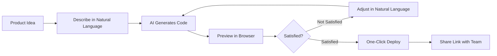

---
prev:
  text: '15.2 Platform Deep Dive'
  link: '/15-ai-workflow/platforms'
next:
  text: 'A. Glossary'
  link: '/appendix/'
---

# 16.1 Everyone Can Code

::: info Extended Chapter
This chapter is extended content that explores the impact of AI on organizations and roles. It does not depend on the previous hands-on programming chapters, and anyone can read it directly.
:::

> "The most dangerous programmer in the world is a product manager with Cursor." — Last words of an anonymous engineer

## Introduction: The Democratization of Code

In a 2026 office, something happened that collectively broke traditional developers: Sales rep Amy wrote a customer follow-up automation script using ChatGPT, Operations manager Bob built an event registration system with Replit, Legal counsel Carol generated a contract review tool with AI, and even the receptionist David created a visitor check-in app using v0.dev.

Meanwhile, the development team's backlog had accumulated 347 requirements, the oldest dating back to March 2024: "Can we add an export button to the report?"

This isn't science fiction—it's the reality revealed by Anthropic's "2026 Agentic Coding Trends Report": **Programming capabilities are spreading from development departments throughout entire organizations**. As AI becomes everyone's programming assistant, we're witnessing a quiet revolution—or rather, an "uprising" that makes programmers tremble.

::: warning Friendly Reminder
This article isn't encouraging everyone to write code (although you certainly can), but rather exploring what happens to organizational structures, collaboration models, and developer roles when non-technical people gain programming abilities. If you're a developer, we recommend taking a deep breath before continuing.
:::

## Who's Using AI to Code? What Are They Building?

### Real-World Case Collection

**Scenario 1: The Product Manager's Counterattack**

Product Manager Wang (pseudonym) was tired of waiting for development schedules. His requirement for a "user feedback collection form" had been sitting in the backlog for two months, and competitors were already on their third iteration.

One afternoon, he opened Cursor and typed:

```
Create a user feedback form including:
- Satisfaction rating (1-5 stars)
- Feature suggestions (text box)
- Contact information (optional)
- Send email notification to feedback@company.com after submission
- Store data in Google Sheets
```

40 minutes later, a complete feedback system went live. Tech stack? He didn't know and didn't care. As long as it works.

**Scenario 2: The Designer's Dimensional Strike**

Designer Zhang's old workflow: Draw prototype in Figma → Wait for development implementation → Find 37 inconsistencies with the design → Back-and-forth debates → Compromise → Launch → Dissatisfaction.

New workflow: Draw prototype in Figma → Export to v0.dev → AI generates interactive React components → Fine-tune styles → Deploy → Show developers the finished product → "Make it like this."

Developers: "......" (speechless)

**Scenario 3: The Data Analyst's Liberation**

Analyst Li used to need: Write SQL queries → Export CSV → Create pivot tables in Excel → Manually draw charts → Copy to PPT → Repeat weekly.

Now she tells ChatGPT Code Interpreter: "Create an auto-updating sales dashboard using this CSV file, including trend charts, regional comparisons, and year-over-year growth rates."

10 minutes later, an interactive dashboard is generated with auto-refresh functionality.

**Scenario 4: The Operations Automation Empire**

Operations assistant Chen's daily work included: sending yesterday's data report at 9 AM, updating event pages every Wednesday, generating monthly analysis reports at the start of each month.

He used Replit Agent to create three automation scripts:

1. Scheduled data scraping and email sending (Python + cron)
2. Event page content management system (Next.js)
3. Monthly report generator (calls Claude API to analyze data and generate reports)

Now he arrives at the office at 10 AM because "the scripts have already finished running."

::: tip Data Support
According to the Anthropic report, between 2025-2026:
- AI programming tool usage among non-technical teams grew by 312%
- Average development cycle for internal tools shortened from 6 weeks to 3 days
- 43% of "small applications" are now directly implemented by the requesting party
:::

## Product Managers: From "Requirement Submitters" to "Solution Implementers"

### What PMs Are Building

1. **MVP Prototypes**: No longer PowerPoint prototypes, but actual runnable products
2. **Internal Tools**: CRM plugins, data dashboards, A/B testing panels
3. **User Research Tools**: Survey forms, interview recording systems, user journey visualization
4. **Competitive Analysis Automation**: Scrape competitor data, price monitoring, feature comparison tables

### The Typical "Vibe Coding" Process



::: warning PM Please Note
You can now write code, but that doesn't mean you should rewrite the entire product. Remember:
- **Boundary Awareness**: Small tools can be done yourself, core systems still need professional teams
- **Communication Upgrade**: You can now read code, but don't dictate during Code Review
- **Own Your Responsibility**: The code you write, you maintain (at least for the first three months)
:::

## Designers: From "Drawing Pictures" to "Making It Real"

### v0.dev Changes the Game Rules

Traditional design deliverables: Figma file + annotations + a bunch of "please implement according to design" notes.

AI era design deliverables: Runnable React components + Tailwind CSS styles + responsive layout + interactive animations.

**Real Case:**

A designer used v0.dev to create a "login page generator":

- Input: Brand colors, Logo, Slogan
- Output: 10 styles of complete login pages (with form validation, error messages, Loading states)
- Time: 5 minutes

Previously, developers needed 2 days to implement this, now designers directly deliver finished code.

### Figma AI + Frontend Framework Combo

1. **Figma AI generates design drafts** → Describe product requirements, automatically generate multiple design options
2. **Figma to Code plugin** → One-click export to React/Vue/HTML code
3. **v0.dev optimization** → AI refactors code, optimizes performance and accessibility
4. **Direct deployment** → Vercel/Netlify one-click launch

Developers: "So what do you still need me for?"

Designers: "Help me see why this API isn't calling through."

::: tip Designer's New Skill Tree
- **Basic HTML/CSS**: Know what div, class, responsive design are
- **Component Thinking**: Understand component reuse, Props passing
- **Developer Language**: Can say "this component needs loading and error states"
- **Git Basics**: Know how to commit code (though often forget to write commit messages)
:::

## Data Analysts: Farewell to SQL Hell

### From "Data Fetchers" to "Insight Providers"

Traditional data analyst time allocation:
- 70% writing SQL queries
- 20% cleaning data
- 10% actual analysis

AI era data analyst time allocation:
- 10% conversational queries ("help me find user groups with highest repurchase rate last month")
- 10% reviewing AI-generated query logic
- 80% deep analysis and business recommendations

### ChatGPT Code Interpreter's Magic

**Scenario: CEO Suddenly Wants a Complex Report**

Before:
1. Understand requirements (1 hour)
2. Write SQL queries (3 hours, stuck on JOIN statements)
3. Export data (10 minutes)
4. Excel processing (2 hours)
5. Create charts (1 hour)
6. Write analysis report (2 hours)
**Total: 9+ hours**

Now:
1. Upload data file to ChatGPT
2. Input: "Create an analysis report including the following dimensions: user growth trends, retention rate analysis, revenue source distribution, regional differences. Generate visualization charts and 3 key insights."
3. Review AI's analysis logic
4. Export interactive HTML report
**Total: 30 minutes**

::: details Real Conversation Example
**Analyst:** "Help me analyze this user behavior dataset, find common characteristics of churned users"

**AI:** (generates code and executes analysis)

**AI:** "I found 4 significant characteristics: 1) Less than 3 logins in first week; 2) Did not complete onboarding tasks; 3) Did not add friends; 4) Concentrated on low-end Android devices. Recommend optimizing onboarding process. Here's the detailed data distribution chart..."

**Analyst:** "Generate a PPT format report including these charts and recommendations"

**AI:** "Generated, containing 8 pages: executive summary, data overview, 4 characteristic analyses, visualization charts, improvement recommendations."

**CEO:** "Little Wang is so efficient, promotion and raise!"

**Little Wang internally:** "Thanks Claude."
:::

## Operations Team: Automate Everything Automatable

### Operations Personnel's AI Toolkit

1. **Zapier + AI**: No-code automation workflows
   - Example: New customer registration → AI generates welcome email (personalized content) → Send → Record to CRM

2. **Replit Agent**: Conversational application development
   - Example: "Create an event registration system including forms, payment, email notifications, and admin backend"

3. **ChatGPT + Python**: Data processing automation
   - Example: Daily automatic scraping of competitor prices, generate comparison table, send to Slack

4. **AI Content Generator**: Batch content creation
   - Example: Input product parameters, output 100 different style ad copy

### Case: How an Operations Person Freed Themselves

Li is an e-commerce operations person, used to daily:
- 9:00 - Manually update product inventory to website
- 10:00 - Organize yesterday's sales data
- 11:00 - Create daily report for boss
- 14:00 - Reply to customer inquiry emails
- 16:00 - Update promotional event pages
- 18:00 - Prepare tomorrow's social media content

Now she uses AI tools to build an automated system:
- **Inventory sync script** (Python): Automatically sync ERP and website inventory every hour
- **Data dashboard** (Retool + AI): Real-time display of key metrics, no manual organization needed
- **Report bot** (Claude API): Automatically generate and email report at 8:30 AM daily
- **Customer service AI** (custom GPT): Automatically reply to 80% of common questions
- **Content management system** (Replit): Edit content in advance, auto-publish on schedule

Result: She now arrives at the office at noon, "handling the 20% of complex problems AI can't solve."

::: tip Golden Rules of Operations Automation
1. **Repetitive work first**: Things done more than 10 times should be automated
2. **Start small**: Automate one small process first, expand after success
3. **Keep human review**: AI generates content, humans do final check
4. **Document everything**: Write clearly what each automation script does for easy handoff
:::

## Professional Developers' New Role: From Builders to Architects and Reviewers

### "Is My Job Being Taken?"

Short answer: No.

Long answer: Your job content has changed.

**Developers before:**
- 90% writing business code (CRUD, forms, pages)
- 10% architecture design and problem solving

**Developers now:**
- 30% reviewing code written by non-professionals
- 30% designing system architecture and technical solutions
- 20% solving complex technical problems
- 20% establishing development standards and best practices

### Specifically, What Do You Do?

#### 1. **Architect Role**

Non-developer: "I made a user management system with AI!"

Developer: "Great, but did you consider:
- What password encryption algorithm?
- How to do session management?
- GDPR compliance issues?
- Will it crash with 1000 concurrent users?
- Data backup strategy?"

Non-developer: "......"

**Your value:** Design scalable, secure, maintainable system architectures.

#### 2. **Code Reviewer**

Non-developer submitted a "perfectly working" script:

```python
# Their code
password = "admin123"  # Hard-coded password
db_data = requests.get(f"http://api.com/users?id={user_input}").json()  # SQL injection risk
for i in range(10000):  # O(n²) complexity
    for j in range(10000):
        # Some inefficient operations
```

Your review comments:
- ❌ Hard-coded password → Use environment variables
- ❌ SQL injection risk → Parameterized queries
- ❌ Performance issue → Algorithm optimization
- ❌ Missing error handling → Add try-catch
- ❌ No logging → Add logging

**Your value:** Ensure code quality, security, and performance.

#### 3. **Technical Debt Manager**

Characteristics of code written by non-developers:
- ✅ Functionality works
- ❌ No tests
- ❌ Hard-coding everywhere
- ❌ No documentation
- ❌ No one can understand it three months later

Your work:
1. Establish code standards and templates
2. Provide reusable component libraries
3. Regular refactoring and optimization
4. Training and guidance

#### 4. **Security Gatekeeper**

Common security mistakes by non-technical people:
- Validating permissions on frontend (not validating on backend)
- Committing API keys to GitHub
- Storing sensitive data unencrypted
- Using outdated dependency libraries (with known vulnerabilities)
- Missing input validation

Your checklist:
- [ ] Authentication and authorization
- [ ] Data encryption (in transit and at rest)
- [ ] Input validation and SQL injection protection
- [ ] XSS and CSRF protection
- [ ] Dependency library security audit
- [ ] Logging and monitoring

::: tip Developer Mindset Shift
**Old thinking:** "Why are they writing code when they don't understand technology? What kind of mess is this code!"

**New thinking:** "Great, they solved their own problems, I can focus on more challenging things. Let me help them optimize the code and establish some standards."

From "gatekeeper" to "enabler," from "sole builder" to "chief quality officer."
:::

## Risks and Guardrails: Not Everyone Should Write All Code

### Real Disaster Cases

**Case 1: Sales Director's "Little Tool"**

A sales director used AI to make a "customer data analysis tool" that directly connected to the production database with no access control. Result:
- Intern accidentally deleted 3,000 customer records
- Sales data leaked to competitors (tool had no access logs)
- Database crashed several times due to inefficient queries

**Loss:** Estimated $500,000 + customer trust crisis

**Case 2: Marketing Department's "Automation Script"**

Marketing department used ChatGPT to write a "bulk email sending script," result:
- No rate limiting, triggered ESP's anti-spam mechanism
- Company domain blacklisted
- 30,000 emails sent to wrong customers (variable name typo)

**Loss:** Brand reputation damage + 2 weeks to restore domain reputation

**Case 3: Finance's "Auto-Reconciliation System"**

Finance staff used AI to build an auto-reconciliation system, but:
- Floating-point calculation precision issues led to incorrect amounts
- No transaction processing, data inconsistent when system crashed
- Audit discovered $12,847 in "mysterious discrepancies"

**Loss:** Failed audit + CFO held accountable

::: danger Danger Zone: Do Not Enter Without Permission
The following types of systems must be handled by professional development teams:

1. **Financial transaction systems**: Anything involving money, not even a penny can be wrong
2. **User authentication and authorization**: Security is professional work
3. **Production database operations**: One DELETE without WHERE, entire company doomed
4. **External API services**: Performance, security, SLA guarantees
5. **Compliance-related systems**: GDPR, HIPAA, SOC 2, etc., legal liability is serious
6. **High-concurrency systems**: Can't handle traffic, loses real money

These can't be solved by AI-generated code, they require deep professional knowledge.
:::

### Establishing Safety Guardrails

#### 1. **Permission Tiering System**

| Role | Can Do | Cannot Do |
|------|--------|-----------|
| **Non-technical Staff** | Personal tools, data analysis scripts, prototypes | Access production database, deploy to production environment |
| **Technical Leaders** | Internal tools, automation processes | Modify core systems, bypass Code Review |
| **Professional Developers** | Most development work | Directly modify production database, skip tests |
| **Senior Engineers** | Core system development | Single-person decision on architecture changes |

#### 2. **Code Review Process**

All code, regardless of who wrote it, must go through:
1. **Automated checks**: Linter, security scanning, test coverage
2. **Peer review**: At least one developer Review
3. **Security review** (if involving sensitive data): Information security team review
4. **Launch approval**: Technical lead approval

#### 3. **Environment Isolation**

```
Development Environment (Dev)
  ↓ Tests passed
Testing Environment (Staging)
  ↓ Review passed
Production Environment (Production) ← Strict access control
```

Non-technical staff: Can only access Dev environment

Technical staff: Dev + Staging

Senior engineers: Dev + Staging + Production (with audit logs)

#### 4. **Technical Debt Management**

Establish "AI-generated code" labeling system:
- 🤖 **AI Generated**: Completely generated by AI, needs review
- 🔍 **AI Assisted**: AI assisted, humans significantly modified
- 👨‍💻 **Human Written**: Written from scratch by humans

Regularly (monthly) review AI-generated code, optimize or refactor.

::: tip A Good Analogy
AI programming tools are like **power tools**:

- **Power drills** make renovation simple, but you wouldn't let untrained people tear down load-bearing walls
- **Chainsaws** make carpentry efficient, but you wouldn't let novices cut precision equipment in operating rooms

AI democratizes programming, but that doesn't mean all programming should be democratized.

The key is: **Choose the right people and tools based on task risk**.
:::

## How IT Teams Should Respond to This Change

### Strategy 1: Embrace Rather Than Resist

**Wrong approach:** "Ban non-technical people from using AI programming tools!"

**Result:** They use it secretly, IT team completely loses control.

**Right approach:** "We provide officially supported AI programming platforms with training and best practices."

**Result:** IT team takes initiative, can monitor and guide.

### Strategy 2: Establish "AI Programming Center of Excellence"

A cross-functional team responsible for:

1. **Tool Evaluation and Recommendation**
   - Evaluate various AI programming tools (Cursor, Replit, v0.dev, Copilot)
   - Recommend appropriate tools based on different roles
   - Unified procurement and license management

2. **Best Practices and Training**
   - Write "Non-technical Personnel AI Programming Guide"
   - Hold monthly training workshops
   - Build internal case library

3. **Code Review and Support**
   - Provide "AI Code Clinic" (fixed time weekly to help review code)
   - Establish Slack channel for quick Q&A
   - Code templates and component libraries

4. **Security and Compliance**
   - Develop AI programming security standards
   - Automated security scanning
   - Regular security audits

### Strategy 3: Provide "Paved Roads and Guardrails"

**Paved Roads:** Make the right way the easiest way

- **Template library**: "Want to make a data dashboard? Use this template, authentication and database connection already configured"
- **Component library**: "Need a form? Import our FormBuilder, automatically handles validation and errors"
- **Deployment platform**: "Code ready? Push to internal platform, automatic testing and deployment"

**Guardrails:** Prevent dangerous operations

- **Automatic scanning**: Automatically detect hard-coded passwords, SQL injection risks when submitting code
- **Permission restrictions**: Code from non-technical staff cannot access production database by default
- **Resource quotas**: Prevent inefficient code from exhausting server resources

### Strategy 4: Redefine Development Team KPIs

**Old KPIs:**
- Number of requirements completed
- Lines of code
- Bug fix speed

**New KPIs:**
- **Enablement metrics**: How many requirements helped other teams achieve
- **Code quality**: Number of issues found and fixed in Review
- **Architecture robustness**: System scalability, security score
- **Knowledge dissemination**: Number of trainings, documentation quality

From "deliverer" to "enabler."

::: warning IT Leader's Challenge
The biggest challenge isn't technical, it's **cultural transformation**:

- From "we're the only ones who can write code" to "we help everyone write code safely"
- From "protecting our territory" to "expanding technology's influence"
- From "requirement implementer" to "platform and tool provider"

Leadership needed: Open mindset + Systems thinking + Service awareness
:::

## Organizational Change: When Every Department Has "Half a Developer"

### New Collaboration Model

**Traditional Model:**

```
Business Department → Requirements Doc → Dev Team → Development → Testing → Launch → Business Acceptance
           ↑_______Feedback Loop (cycle: weeks to months)_________|
```

**AI Era Model:**

```
Business Department → AI Rapid Prototype → Dev Team Review & Optimize → Launch
           ↑____Feedback Loop (cycle: hours to days)_____|
```

### Real Case: Two Implementation Paths for One Feature

**Feature requirement:** Customer visit logging function (sales staff record customer visits)

#### Traditional Path (6 weeks)

1. **Week 1:** Requirements discussion meeting, PM writes PRD
2. **Week 2:** Development evaluates technical solution, UI design drafts
3. **Week 3-4:** Development implements frontend and backend
4. **Week 5:** Testing finds issues, rework
5. **Week 6:** Launch, sales team: "Hmm, this isn't what I wanted..."

#### AI Era Path (3 days)

1. **Day 1 Morning:** Sales manager makes prototype with Replit, gives team to try
2. **Day 1 Afternoon:** Collect feedback, AI adjusts prototype
3. **Day 2:** Dev team Review, optimize performance and security
4. **Day 3:** Tests passed, launch

**Key difference:** Requirements verified before implementation, because "prototype" is "product."

### Subtle Changes in Organizational Structure

#### Emerging New Roles

1. **Citizen Developer**
   - Definition: Employee with non-technical background who can implement solutions with AI tools
   - Skills: Natural language programming, basic debugging, product thinking
   - Responsibilities: Rapid prototyping, internal tools, automation scripts

2. **Tech Enabler**
   - Definition: Professional developer role focused on enabling others
   - Skills: Architecture design, Code Review, teaching ability
   - Responsibilities: Review code, provide training, establish standards

3. **AI Coding Coach**
   - Definition: Expert helping non-technical people better use AI tools
   - Skills: AI tool proficiency, programming basics, communication ability
   - Responsibilities: Training, Q&A, best practice promotion

#### Differentiation of Traditional Development Teams

A 10-person development team might become:

- **3 people - Core system development**: Responsible for complex, critical systems
- **2 people - Platform engineering**: Maintain internal development platform and tools
- **2 people - Code review and quality**: Review all code, ensure quality
- **2 people - Technical enablement**: Training, support other departments
- **1 person - Architecture and planning**: Technical direction, architecture decisions

### New Paradigm for Cross-Departmental Collaboration

**Case: A Complete Product Iteration**

**Background:** E-commerce company wants to add "shopping cart recommendation" feature

**Participants:**
- **Product Manager:** Create UI prototype with v0.dev
- **Data Analyst:** Analyze user behavior with ChatGPT, generate recommendation algorithm
- **Designer:** Optimize visuals based on prototype
- **Backend Developer:** Implement recommendation engine API and performance optimization
- **Frontend Developer:** Review PM's code, refactor and optimize
- **QA:** Write automated tests

**Result:**
- Development cycle shortened from 4 weeks to 1 week
- Product better meets expectations (because PM implemented core interactions themselves)
- Dev team focuses on high-value work (algorithm optimization, performance tuning)

::: tip Keys to Success
- **Clear responsibility boundaries**: Who's responsible for what, who to find when problems occur
- **Continuous communication**: 15-minute daily standup, sync progress
- **Mutual respect**: Developers respect business expertise, business respects technical complexity
- **Common goal**: Not "your code" vs "my code," but "our product"
:::

## Reality Check: This Isn't Utopia

### Challenges That Still Exist

1. **Skill Ceiling**
   - AI can help you write CRUD applications, but complex algorithms, performance optimization, distributed systems still require professional knowledge
   - Non-technical people struggle to judge "can this solution handle 1 million users"

2. **Maintenance Nightmare**
   - 6 months later, the PM who wrote the code left, leaving behind 15 "AI-generated legacy systems"
   - No one understands it, no one dares touch it, eventually dev team rewrites

3. **Security Risks**
   - AI doesn't understand security best practices, generated code may have vulnerabilities
   - Non-technical people understand even less, leading to security debt accumulation

4. **Variable Quality**
   - Some people use AI to write elegant code
   - Some write "works if it runs" spaghetti code
   - Technical debt snowballs

### This Isn't a Silver Bullet

Problems AI programming tools can't solve:

- ❌ **Architecture design**: How to split systems, tech stack selection, scalability considerations
- ❌ **Performance optimization**: Why slow? How to optimize? Requires deep understanding
- ❌ **Debugging complex bugs**: Cross-system, sporadic, production-environment-only issues
- ❌ **Technical decisions**: Should we refactor? Which framework? How to trade-off?
- ❌ **Team collaboration**: Code conflict resolution, architecture consistency, technical debt management

::: warning Pragmatic Advice
**For non-technical people:**
- ✅ Use AI tools for small internal tools, prototypes, automation scripts
- ✅ Proactively seek dev team's Code Review
- ✅ Learn basic programming concepts (variables, loops, functions)
- ❌ Don't touch production database, authentication systems, finance-related code
- ❌ Don't bypass Code Review and deploy directly
- ❌ Don't think "it runs" equals "it's done well"

**For professional developers:**
- ✅ Embrace change, from "monopoly" to "enablement"
- ✅ Establish standards and guardrails, not just ban everything
- ✅ View this as opportunity: escape repetitive work, focus on high-value tasks
- ❌ Don't despise non-professional code (remember what your first code looked like)
- ❌ Don't refuse to Review (this is key to quality assurance)
- ❌ Don't cling to old role definitions (world is changing, roles are changing)
:::

## Future Outlook: The Office 5 Years from Now

### A Day in 2031

**9:00 AM - Marketing Department**

Marketing Manager Alice: "We need an event page with countdown, registration form, payment integration."

AI Assistant: "Generated, using your brand template, integrated Stripe payment, deployed to landing.company.com/summer-event. Should I generate matching email templates and social media materials?"

Alice: "Generate them. Also help me predict conversion rate for this event."

AI: "Based on historical data, estimated conversion rate 8.3%, recommend optimizing headline and CTA button position. I've generated A/B test versions."

**10:00 AM - Development Team**

Tech Lead Bob: "Today we need to Review 12 applications submitted by other departments this week."

AI Assistant: "I've completed preliminary review:
- 6 passed automated checks, recommend approval
- 4 have minor performance issues, I've generated optimization suggestions
- 2 have security risks, flagged as high priority for manual review"

Bob: "Focus on those 2 security risks." (20-minute review completed, provides modification suggestions)

**2:00 PM - Sales Department**

Sales Director Carol: "I need a customer health score system, calculated based on interaction frequency, contract amount, support ticket count."

AI Assistant: "Created, integrated into your CRM. Here's the scoring logic, please confirm if it meets expectations."

Carol: "Good, but I want to add 'number of decision-maker contacts' dimension."

AI: "Added, recalculated all customer scores. Found 23 high-risk customers, sent reminders to corresponding sales."

**4:00 PM - Product Team**

Product Manager David: "Our new feature is ready, dev team reviewed it for me, deploy it."

AI Assistant: "Deploying... Complete. Enabled 1% canary release, monitoring... No anomalies detected, gradually expanding to 100%."

**6:00 PM - CEO**

CEO: "Give me today's company panoramic report."

AI Assistant: "
- 📈 Marketing new event launched, expected to add 500 customers
- 🛡️ Dev team reviewed 12 applications, blocked 2 security risks
- 💰 Sales identified 23 high-risk customers, action taken
- 🚀 Product new feature successfully launched, 87% positive user feedback
- 💡 Company-wide saved approximately 120 development hours this week through AI tools"

CEO: "Good. Can we reduce engineering team to 5 people next year?"

AI Assistant: "Not recommended. Engineering team's value lies in architecture design, quality assurance, and technical debt management, which AI and non-technical people cannot replace. Recommend maintaining current team size but transforming to 'platform engineering' model."

CEO: "Makes sense."

::: tip Characteristics of This Future
1. **AI is infrastructure**: Like water and electricity, everywhere
2. **Everyone can program**: But not everyone is a programmer
3. **Professional developers more important**: Role upgraded, not replaced
4. **Speed greatly improved**: From idea to implementation, measured in hours
5. **Quality still key**: Automated review + human oversight
:::

## Summary: A Quiet Revolution

### Core Insights

1. **Democratization of programming capability is inevitable**
   - AI tools enable non-technical people to implement simple to medium complexity solutions
   - This isn't a threat, but liberation of entire organizational productivity

2. **Professional developers' role is upgrading, not disappearing**
   - From "requirement implementer" to "architect, reviewer, enabler"
   - Liberated from repetitive work, focus on high-value tasks

3. **Organizations need new collaboration models**
   - Establish clear boundaries and guardrails
   - Cultivate "citizen developer" culture
   - Dev teams provide "platforms and tools" rather than "all code"

4. **Risks are real**
   - Security, quality, maintainability issues cannot be ignored
   - Need institutional, process, and cultural safeguards
   - Not all code should be written by all people

5. **The future belongs to those who adapt to change**
   - Non-technical people embracing AI tools will gain superpowers
   - Developers transforming into "enablers" will be more valuable
   - Those resisting change will be marginalized

### Action Recommendations

**If you're non-technical:**
1. Start learning an AI programming tool (recommended: ChatGPT, Cursor, Replit)
2. Start with small projects: automate a repetitive task
3. Proactively seek dev team's guidance and Code Review
4. Learn basic programming concepts (don't need mastery, but understand)
5. Remember boundaries: do small tools yourself, find professional teams for core systems

**If you're a professional developer:**
1. Embrace change, redefine your value
2. Learn how to Review and guide non-professional code
3. Build "paved roads and guardrails," make the right way the easy way
4. Focus on deep skills: architecture, performance, security, complex problem solving
5. Cultivate communication and teaching ability, become "tech enabler"

**If you're a manager:**
1. Develop AI programming tool usage policies and standards
2. Invest in building "AI Programming Center of Excellence"
3. Redefine dev team's roles and KPIs
4. Train everyone in basic programming and AI tool usage
5. Establish code review and security assurance mechanisms

::: tip One-Line Summary
**AI democratizes programming, but professional developers become more important—because when everyone can write code, we need people who ensure this code is good, safe, and maintainable.**
:::

## Further Reading

- 📄 [Anthropic 2026 Agentic Coding Trends Report](https://www.anthropic.com)
- 🛠️ [v0.dev](https://v0.dev) - Vercel's AI website generator
- 🛠️ [Replit Agent](https://replit.com) - Conversational application development
- 📚 ["Platform Engineering" concept](https://platformengineering.org)
- 🎓 [Future of Low-Code/No-Code + AI](https://github.com/awesome-no-code)

---

**Next Chapter:** We'll enter the appendix section, organizing key terminology from this guide for quick reference.

**Previous Chapter:** Review AI workflow and detailed comparison of mainstream platforms.
