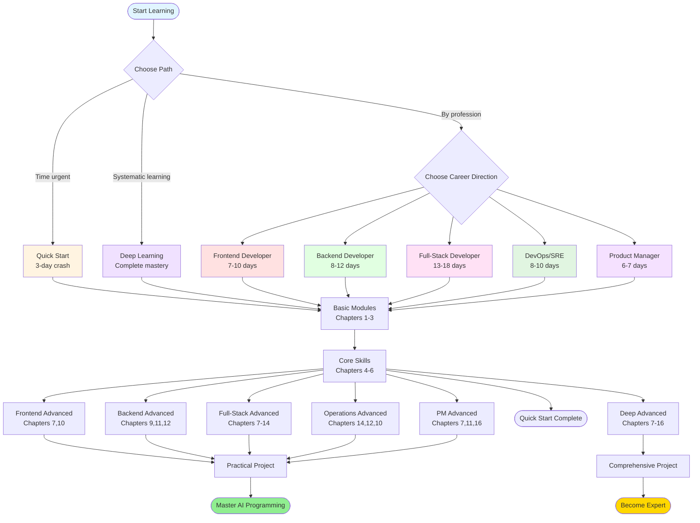

---
prev:
  text: 'E. 2026 Annual Buzzwords'
  link: '/appendix/buzzwords-2026'
---

# F. Learning Roadmap

## How to Use This Guide

This chapter provides customized learning paths based on different roles and learning objectives. Each path is carefully designed to ensure you master core AI-assisted programming skills in the most efficient way.

**Selection advice:**
- If you're a beginner, it's recommended to complete the "Quick Start" path first, then choose the corresponding professional path based on your career direction
- If you want systematic in-depth learning, you can choose the "Deep Learning" path
- If you have limited time, you can jump directly to chapters most relevant to your work

---

## Path 1: Frontend Developer 🎨

**Suitable for:** React/Vue/Angular developers, UI/UX engineers

**Learning objectives:** Master using AI tools to rapidly develop modern frontend applications, improve component development and debugging efficiency

**Recommended learning sequence:**

### Phase 1: Basic Cognition (1-2 days)
1. **Chapter 1: Introduction to AI Programming** - Understand basic concepts of AI-assisted programming
2. **Chapter 2: Tool Selection** - Choose AI tools suitable for frontend development (recommended: Cursor, GitHub Copilot)
3. **Chapter 3: Prompt Engineering Basics** - Learn how to write effective prompts

### Phase 2: Practical Skills (3-5 days)
4. **Chapter 4: Code Generation** - Focus on component generation, style generation
5. **Chapter 5: Code Completion and Refactoring** - Master auto-completion and code optimization techniques
6. **Chapter 7: UI/UX Development** - Learn to use AI to quickly implement design mockups
8. **Chapter 8: Testing and Debugging** - Learn automated test generation (Jest, Vitest)

### Phase 3: Advanced Optimization (2-3 days)
9. **Chapter 10: Performance Optimization** - Learn to use AI to analyze and optimize frontend performance
10. **Chapter 13: Multilingual Development** - If involved in internationalization projects
11. **Appendix B: Prompt Template Library** - Bookmark commonly used frontend development templates

**Practical project suggestions:**
- Use AI to assist in developing a complete React/Vue component library
- Refactor a functional module of an existing project with AI
- Use AI to generate responsive layouts and animation effects

---

## Path 2: Backend Developer ⚙️

**Suitable for:** Node.js/Python/Java/Go backend engineers, API developers

**Learning objectives:** Use AI tools to improve API development, database design, and system architecture capabilities

**Recommended learning sequence:**

### Phase 1: Basic Preparation (1-2 days)
1. **Chapter 1: Introduction to AI Programming**
2. **Chapter 2: Tool Selection** - Choose tools supporting backend languages
3. **Chapter 3: Prompt Engineering Basics**

### Phase 2: Core Skills (4-6 days)
4. **Chapter 4: Code Generation** - Focus on API endpoints, data model generation
5. **Chapter 5: Code Completion and Refactoring** - Learn to refactor complex business logic
6. **Chapter 6: Documentation Generation** - Auto-generate API documentation (OpenAPI/Swagger)
7. **Chapter 9: Database and SQL** - Learn database design, query optimization
8. **Chapter 8: Testing and Debugging** - Unit testing, integration testing generation

### Phase 3: System Design (3-4 days)
9. **Chapter 11: Architecture Design** - Use AI for system architecture design
10. **Chapter 10: Performance Optimization** - Backend performance analysis and optimization
11. **Chapter 12: Security Best Practices** - Learn secure coding and vulnerability fixing
12. **Chapter 14: DevOps Integration** - CI/CD process optimization

**Practical project suggestions:**
- Use AI to design and implement a RESTful API service
- Use AI to optimize existing project database query performance
- Let AI help you refactor a complex business logic module

---

## Path 3: Full-Stack Developer 🚀

**Suitable for:** Full-stack engineers, indie developers, startup technical leads

**Learning objectives:** Comprehensively master AI-assisted full-stack development, from frontend to backend, from development to deployment

**Recommended learning sequence:**

### Phase 1: Global Cognition (2-3 days)
1. **Chapter 1: Introduction to AI Programming**
2. **Chapter 2: Tool Selection** - Choose comprehensive tools supporting multiple languages
3. **Chapter 3: Prompt Engineering Basics**
4. **Chapter 11: Architecture Design** - Establish systems thinking first

### Phase 2: Frontend Skills (3-4 days)
5. **Chapter 4: Code Generation** - Frontend component development
6. **Chapter 7: UI/UX Development**
7. **Chapter 5: Code Completion and Refactoring**

### Phase 3: Backend Skills (3-4 days)
8. **Chapter 4: Code Generation** - Backend API development (reread, focus on backend part)
9. **Chapter 9: Database and SQL**
10. **Chapter 12: Security Best Practices**

### Phase 4: Integration and Deployment (2-3 days)
11. **Chapter 8: Testing and Debugging** - Full-stack testing strategy
12. **Chapter 14: DevOps Integration**
13. **Chapter 10: Performance Optimization** - Full-stack performance optimization

### Phase 5: Advanced Topics (3-4 days)
14. **Chapter 6: Documentation Generation**
15. **Chapter 13: Multilingual Development**
16. **Chapter 15: Team Collaboration**
17. **Appendix A: Tool Comparison Matrix** - Choose best tool combination for team

**Practical project suggestions:**
- Use AI to develop a complete SaaS application from scratch
- Use AI to refactor frontend and backend architecture of an old project
- Let AI help you implement complete process from development to deployment

---

## Path 4: DevOps / SRE 🔧

**Suitable for:** Operations engineers, SRE, platform engineers

**Learning objectives:** Use AI to optimize deployment processes, infrastructure management, and system monitoring

**Recommended learning sequence:**

### Phase 1: Basic Understanding (1 day)
1. **Chapter 1: Introduction to AI Programming**
2. **Chapter 2: Tool Selection** - Choose tools supporting scripts and configuration files
3. **Chapter 3: Prompt Engineering Basics**

### Phase 2: Core Areas (3-4 days)
4. **Chapter 14: DevOps Integration** - Core chapter, focus on learning
5. **Chapter 4: Code Generation** - Focus on script, configuration file generation
6. **Chapter 12: Security Best Practices** - Infrastructure security
7. **Chapter 10: Performance Optimization** - System performance monitoring and optimization

### Phase 3: Practical Application (2-3 days)
8. **Chapter 9: Database and SQL** - Database operations
9. **Chapter 8: Testing and Debugging** - Infrastructure testing
10. **Chapter 6: Documentation Generation** - Operations documentation automation
11. **Chapter 15: Team Collaboration** - DevOps culture and collaboration

### Phase 4: Advanced Topics (2 days)
12. **Chapter 11: Architecture Design** - Understand cloud architecture design
13. **Chapter 13: Multilingual Development** - If need to maintain multilingual projects

**Practical project suggestions:**
- Use AI to write Kubernetes configuration files and Helm Charts
- Let AI help you optimize CI/CD Pipeline
- Use AI to generate monitoring alert rules and automated response scripts

---

## Path 5: Product Manager 📊

**Suitable for:** Product managers, project managers, technical PMs

**Learning objectives:** Understand AI programming capability boundaries, better collaborate with technical teams, quickly validate product prototypes

**Recommended learning sequence:**

### Phase 1: Concept Understanding (1 day)
1. **Chapter 1: Introduction to AI Programming** - Understand possibilities and limitations of AI programming
2. **Chapter 2: Tool Selection** - Understand tools team can use
3. **Chapter 3: Prompt Engineering Basics** - Learn how to communicate with AI

### Phase 2: Practical Skills (2-3 days)
4. **Chapter 7: UI/UX Development** - Learn rapid prototyping
5. **Chapter 4: Code Generation** - Understand feature development complexity
6. **Chapter 6: Documentation Generation** - Auto-generate requirements docs, API docs
7. **Chapter 15: Team Collaboration** - How to promote AI tools in teams

### Phase 3: Technical Insights (2 days)
8. **Chapter 11: Architecture Design** - Understand technical architecture decisions
9. **Chapter 10: Performance Optimization** - Understand performance metrics and optimization directions
10. **Chapter 12: Security Best Practices** - Understand security requirements

### Phase 4: Strategic Thinking (1 day)
11. **Chapter 16: Future Trends** - Understand future directions of AI programming
12. **Appendix E: 2026 Annual Buzzwords** - Maintain technical sensitivity

**Practical project suggestions:**
- Use AI tools to build product prototypes yourself to validate ideas
- Use AI to generate product requirement documents and technical specifications
- Learn to use AI tools to communicate more efficiently with development teams

---

## Path 6: Quick Start (3-day crash course) ⚡

**Suitable for:** All developers wanting to quickly get started with AI programming

**Learning objectives:** Master core skills of AI-assisted programming in 3 days, immediately boost work efficiency

### Day 1: Basic Cognition and Tool Preparation
- **Morning (2-3 hours)**
  - Chapter 1: Introduction to AI Programming (understand basic concepts)
  - Chapter 2: Tool Selection (choose and install a tool)
- **Afternoon (2-3 hours)**
  - Chapter 3: Prompt Engineering Basics (focus on learning)
  - Practice: Write 10 prompts for different scenarios

### Day 2: Core Skills Practice
- **Morning (3 hours)**
  - Chapter 4: Code Generation (focus on learning, practice more)
  - Practice: Generate a complete small functional module
- **Afternoon (2-3 hours)**
  - Chapter 5: Code Completion and Refactoring
  - Chapter 8: Testing and Debugging (quick browse)
  - Practice: Refactor a piece of your own code

### Day 3: Advanced Techniques and Best Practices
- **Morning (2-3 hours)**
  - Chapter 7: UI/UX Development or Chapter 9: Database and SQL (choose one based on your direction)
  - Practice: Complete a small practical project
- **Afternoon (2 hours)**
  - Chapter 15: Team Collaboration (quick browse)
  - Appendix B: Prompt Template Library (bookmark for later)
  - Summary and review

**After 3 days you will be able to:**
- Proficiently use AI tools to write code
- Improve development efficiency by at least 30%
- Independently solve common problems in daily development

---

## Path 7: Deep Learning (Systematic Complete Learning) 🎓

**Suitable for:** Developers wanting to systematically master all AI programming skills, technical team leaders

**Learning objectives:** Complete learning of all content in this guide, become an AI-assisted programming expert

**Recommended learning sequence (estimated 3-4 weeks):**

### Week 1: Basics and Core Skills
1. Chapter 1: Introduction to AI Programming
2. Chapter 2: Tool Selection
3. Chapter 3: Prompt Engineering Basics
4. Chapter 4: Code Generation
5. Chapter 5: Code Completion and Refactoring
6. Chapter 6: Documentation Generation

**This week's task:** Complete 5 small practical projects, each using different AI tools

### Week 2: Professional Domain Deepening
7. Chapter 7: UI/UX Development
8. Chapter 8: Testing and Debugging
9. Chapter 9: Database and SQL
10. Chapter 10: Performance Optimization

**This week's task:** Use AI to refactor core modules of a medium-sized project

### Week 3: Architecture and Engineering
11. Chapter 11: Architecture Design
12. Chapter 12: Security Best Practices
13. Chapter 13: Multilingual Development
14. Chapter 14: DevOps Integration

**This week's task:** From scratch, use AI to design and implement a complete system

### Week 4: Team and Strategy
15. Chapter 15: Team Collaboration
16. Chapter 16: Future Trends
17. Appendix A: Tool Comparison Matrix
18. Appendix B: Prompt Template Library
19. Appendix C: Common Questions
20. Appendix D: Resource List
21. Appendix E: 2026 Annual Buzzwords

**This week's task:** 
- Develop team AI programming promotion plan
- Write team prompt standards and best practices documentation
- Share learning insights, drive team growth

**After completion you will be able to:**
- Become team's AI programming expert and promoter
- Deeply understand capability boundaries and best practices of AI programming
- Develop AI tool and process standards suitable for team

---

## Learning Path Visualization

The flowchart below shows the relationships between different learning paths and recommended routes:

---

## Learning Recommendations

### 1. Develop Personalized Plan
- Adjust learning pace based on your current skill level
- Don't skip basic chapters (1-3), they are foundation for subsequent learning
- Flexibly adjust learning focus based on actual project needs

### 2. Learn While Practicing
- After completing each chapter, immediately apply in actual projects
- Build your own prompt template library
- Record learning notes and best practices

### 3. Continuous Iteration
- AI tools develop rapidly, regularly review and update knowledge
- Follow resources in Appendix D, maintain learning
- Join communities, exchange experiences with other developers

### 4. Evaluate Results
- Complete at least 3 actual projects using knowledge from this guide
- Measure actual improvement in development efficiency (recommended target: 30-50%)
- Team learning can organize regular sharing sessions

---

## Next Steps

After choosing a learning path that suits you, it's recommended to:

1. **First step:** Go to [Chapter 1: 3-Minute AI Experience](/01-first-experience/) to start learning
2. **Tool preparation:** Check [Chapter 5: AI Programming Tools Landscape](/05-ai-coding-tools/) to choose suitable tools
3. **Practice exercises:** Use [Appendix C: Resource Index](/appendix/resources) to get more learning materials
4. **Problem solving:** Check [Appendix D: FAQ](/appendix/faq) when encountering issues

Remember: AI is an assistive tool, core programming abilities and systems thinking are still most important. Happy learning! 🚀
