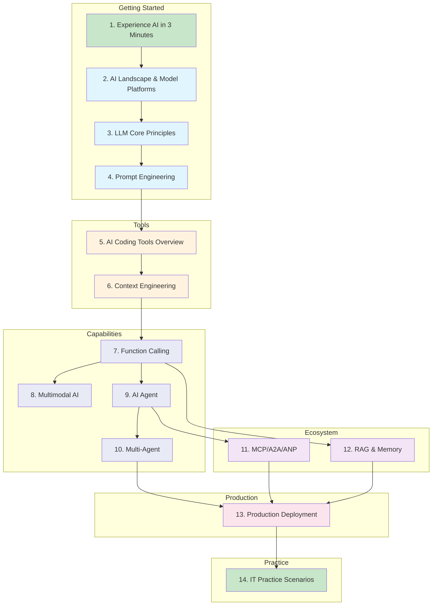

## Learning Roadmap

## Three Learning Paths

### ⚡ Fast Track (7 Lessons, ~3 Hours) {#fast-track}

Quickly run through the entire AI development workflow, suitable for colleagues with limited time who want to get started quickly:

**1.1 First AI Conversation** → **4.1 Prompt Basics** → **5.1 IDE Tools** → **7.1 Function Calling** → **9.2 ReAct Agent** → **12.1 RAG Basics** → **14.1 Knowledge Base Practice**

### 🎯 Role-Based Paths

Choose key chapters based on your role:

<RolePaths />

### 📚 Complete Path

Complete all 14 chapters and 46 sections, from beginner to expert. Read in chapter order.

---

::: info About This Guide
This guide is based on the AI technology ecosystem as of **February 2026**. The AI field evolves rapidly, and some content may change with version updates. Each section is marked with the last update date, and core demos are tied to specific package versions.
:::
