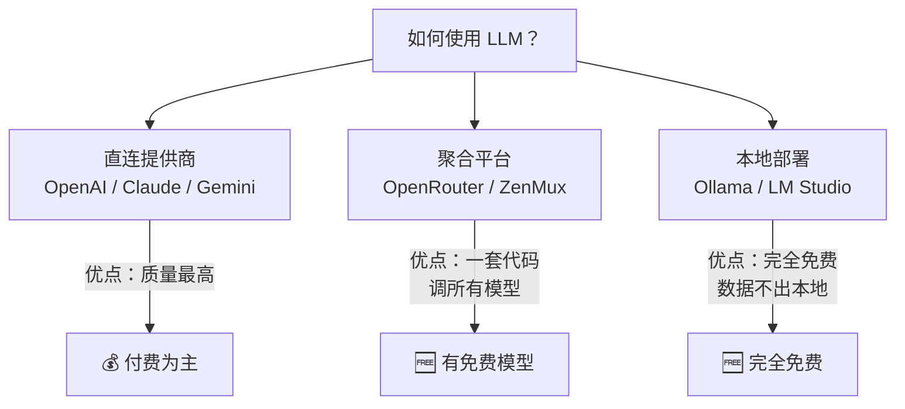

# 1.2 免费方案与零成本起步 <DifficultyBadge level="beginner" /> <CostBadge cost="$0" />

> 前置知识：[1.1 你的第一次 AI 对话](/01-first-experience/)

### 为什么需要它？（Problem）

上一节我们用 OpenAI API 完成了第一次 AI 对话。但你可能马上发现了一个残酷的现实：

- **"什么？调 API 要充钱？我还在学习阶段，就想随便玩玩..."**
- **"公司网络访问 OpenAI 慢得像龟速，经常超时..."**
- **"老板说数据敏感，不能发到国外的云服务，让我本地部署..."**

别慌，**穷有穷的玩法，富有富的活法**。这一节我们就来看看如何**一分钱不花，照样玩转 AI 编程**。

### 它是什么？（Concept）

**LLM 的使用方式就像吃饭：** 可以去高档餐厅（OpenAI）、可以去自助餐厅（聚合平台）、也可以在家自己做（本地部署）。

LLM 的使用方式可以分为三类：



| 方案 | 费用 | 优点 | 适合场景 |
|------|------|------|---------|
| **Google AI Studio** | 免费额度充足（AI 的口粮管够） | Gemini 模型，Google 品质 | 学习阶段首选 |
| **OpenRouter 免费模型** | $0 | 一套 API 调多家免费模型 | 想体验多种 AI 大脑型号 |
| **DeepSeek** | 极低（约 OpenAI 1/10） | 国产模型，中文能力强 | 预算敏感、中文场景 |
| **Ollama（本地）** | $0 | 数据不出本地，完全离线 | 数据敏感、无网环境 |

::: tip 冷知识
OpenAI 的 API 每百万 Token（AI 的口粮）收费 $0.15，听起来很便宜？其实一本小说大约 10 万 Token。换句话说，你让 GPT-4o-mini 读 10 本小说，只需要 $0.15。**比买奶茶便宜多了。**
:::

**一句话总结：** 免费方案不是"穷人替代品"，而是"聪明人的选择"——学习阶段用免费的，生产环境再上付费的。

### 动手试试（Practice）

好了，理论够了，**是时候白嫖一波了**。下面介绍 4 种零成本/低成本方案，挨个试试，总有一款适合你。

#### 方案 1：Google AI Studio（推荐入门首选）

**为什么推荐？** 因为 Google 财大气粗，免费额度给得超大方。而且 Gemini 模型质量不错，不是那种"免费就是垃圾"的套路。

```bash
pip install google-genai
```

```python
from google import genai

client = genai.Client(api_key="YOUR_GOOGLE_API_KEY")
response = client.models.generate_content(
    model="gemini-2.0-flash",
    contents="用一句话解释什么是 API",
)
print(response.text)
```

::: tip 获取 API Key
前往 [Google AI Studio](https://aistudio.google.com/apikey) 免费获取，无需信用卡（VIP 门禁卡）。连银行卡都不用绑，这波真的不亏。
:::

**一句话总结：** Google AI Studio = 免费 + 大方 + 质量好，学习阶段的最佳选择。

#### 方案 2：OpenRouter 免费模型

**OpenRouter 是什么？** 想象一个"AI 超市"，里面有 OpenAI、Claude、Gemini、DeepSeek 等各种 AI 大脑型号。你只需要一张会员卡（API Key），就能随意挑选。

OpenRouter 是一个模型聚合平台，提供多种免费模型。最妙的是，它兼容 OpenAI 的 API 格式——**只需改两行代码**：

```python
from openai import OpenAI

client = OpenAI(
    base_url="https://openrouter.ai/api/v1",
    api_key="YOUR_OPENROUTER_API_KEY",
)
response = client.chat.completions.create(
    model="deepseek/deepseek-chat-v3-0324:free",
    messages=[{"role": "user", "content": "用一句话解释什么是 API"}],
)
print(response.choices[0].message.content)
```

::: tip 获取 API Key
前往 [OpenRouter](https://openrouter.ai/keys) 注册，免费模型不需要充值。**真·白嫖神器**。
:::

::: warning 翻车现场
看到 `model="deepseek/deepseek-chat-v3-0324:free"` 里的 `:free` 了吗？**别删！** 删了就变成付费版了。
**血泪教训：** 有同学手贱删了 `:free`，第二天收到账单，哭晕在厕所。
:::

**一句话总结：** OpenRouter = AI 超市，一张卡刷遍所有模型，免费款也不少。

#### 方案 3：DeepSeek（极低成本）

**DeepSeek 是什么？** 国产 AI 模型界的"拼多多"——**不是质量差，而是价格便宜到离谱**。质量能打，中文特别强，价格只有 OpenAI 的 1/10。

DeepSeek 是国产高质量模型，价格仅为 OpenAI 的约 1/10，中文能力出色：

```python
from openai import OpenAI

client = OpenAI(
    base_url="https://api.deepseek.com",
    api_key="YOUR_DEEPSEEK_API_KEY",
)
response = client.chat.completions.create(
    model="deepseek-chat",
    messages=[{"role": "user", "content": "用一句话解释什么是 API"}],
)
print(response.choices[0].message.content)
```

::: tip 价格对比（AI 的口粮成本）
- OpenAI GPT-4o-mini：$0.15 / 百万输入 Token
- DeepSeek Chat：约 ¥0.1 / 百万输入 Token（不到 OpenAI 的 1/10）

**换算成人话：** 你用 GPT-4o-mini 花 $1，用 DeepSeek 只需要 ¥0.67（约 $0.09）。省下的钱够买杯咖啡了。
:::

**一句话总结：** DeepSeek = 便宜 + 中文强 + 质量好，预算敏感用户的福音。

#### 方案 4：Ollama 本地运行（完全免费）

**Ollama 是什么？** 想象你在自己家里养了一只"AI 宠物"——不需要联网，不需要充钱，**就是有点吃内存**。

Ollama 让你在自己的电脑上运行开源 LLM，数据完全不出本地：

```bash
# 1. 安装 Ollama（macOS）
brew install ollama

# 2. 启动并下载模型（首次需下载，约 4GB）
ollama run qwen2.5:7b
```

安装后，Ollama 自动提供兼容 OpenAI 格式的本地 API：

```python
from openai import OpenAI

client = OpenAI(
    base_url="http://localhost:11434/v1",
    api_key="ollama",
)
response = client.chat.completions.create(
    model="qwen2.5:7b",
    messages=[{"role": "user", "content": "用一句话解释什么是 API"}],
)
print(response.choices[0].message.content)
```

::: warning 硬件要求（你的电脑够不够格）
- 7B 模型（AI 的大脑型号）：至少 8GB 内存
- 14B 模型：至少 16GB 内存
- 70B 模型：需要 64GB+ 内存或专业 GPU

**翻译成人话：** 普通笔记本电脑只能跑 7B 模型（够用了），想跑大模型？去买台服务器吧。
:::

**一句话总结：** Ollama = 完全免费 + 数据不出本地 + 需要硬件，适合数据敏感场景。

#### 核心发现：统一的 API 格式

**等等，你发现了吗？** 上面 4 种方案的代码几乎一模一样——都用 `OpenAI` 客户端，只是改了 `base_url` 和 `api_key`。

这不是巧合，**这是行业标准的力量**。OpenAI 的 Chat Completions API 格式已成为事实上的行业标准，几乎所有平台都兼容。这意味着你可以**写一套代码，随时切换模型提供商**。

**换个比喻：** 就像手机充电接口统一了 USB-C，你不用担心换手机还得换充电器。AI API 也是一样——**学一套，到处用**。

```python
import os
from openai import OpenAI

PROVIDERS = {
    "openai":    {"base_url": "https://api.openai.com/v1",       "model": "gpt-4.1-mini"},
    "deepseek":  {"base_url": "https://api.deepseek.com",        "model": "deepseek-chat"},
    "openrouter":{"base_url": "https://openrouter.ai/api/v1",    "model": "deepseek/deepseek-chat-v3-0324:free"},
    "ollama":    {"base_url": "http://localhost:11434/v1",        "model": "qwen2.5:7b"},
}

provider = os.getenv("LLM_PROVIDER", "openrouter")
config = PROVIDERS[provider]

client = OpenAI(base_url=config["base_url"], api_key=os.getenv("LLM_API_KEY", "ollama"))
response = client.chat.completions.create(
    model=config["model"],
    messages=[{"role": "user", "content": "用一句话解释什么是 API"}],
)
print(response.choices[0].message.content)
```

::: tip 冷知识
为什么所有平台都兼容 OpenAI 的 API 格式？因为 OpenAI 是最早做出 GPT-3 API 的公司，率先定义了标准。后来者为了方便开发者迁移，都选择了兼容。**这就是先发优势——制定规则的人，永远占便宜。**
:::

<ColabBadge path="demos/01-first-experience/free_options.ipynb" />

**一句话总结：** 统一的 API 格式 = 学一套代码，调所有模型，换提供商只需改两行。

### 小结（Reflection）

**你刚刚完成了什么？**
- ✅ 掌握了 4 种零成本/低成本方案（Google AI Studio、OpenRouter、DeepSeek、Ollama）
- ✅ 理解了"AI 的口粮"（Token）、"VIP 门禁卡"（API Key）、"AI 的大脑型号"（Model）
- ✅ 发现了 API 格式统一的秘密——**学一套，到处用**

**还有什么没解决？**
- ❓ 模型这么多（GPT-4、Claude、Gemini...），能力差异大，怎么选？
- ❓ 每个模型都有什么特点？适合什么场景？
- ❓ 怎么系统了解 AI 全景？

别急，**第 2 章 AI 全景与模型平台** 会带你全面了解各大 AI 模型的江湖地位。

**一句话总结：** 免费方案不是"穷人替代品"，而是"聪明人的选择"——学习阶段白嫖，生产环境再付费。

---

## 入门篇检查点（第 1 章部分）

完成以下任务，确认第 1 章核心知识已掌握（**不做完这些，别说你学过 AI 编程**）：

- [ ] 用至少 2 种不同方案（如 OpenAI + Ollama，或 Google AI Studio + OpenRouter）完成 AI 对话
- [ ] 实现一个支持多轮对话的简单脚本（让 AI "记住"上下文）
- [ ] 能说出 `system/user/assistant` 三种角色的作用（提示：AI 的"人设"、"你的话"、"AI 的回复"）

**完成了？恭喜你，已经超过 80% 的入门者了！** 🎉

---

*最后更新：2026-02-20*
