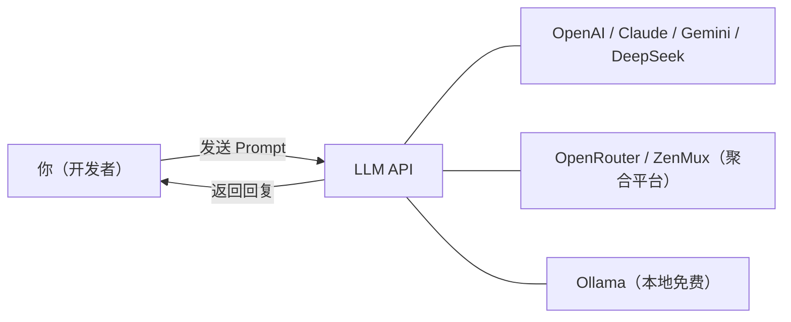
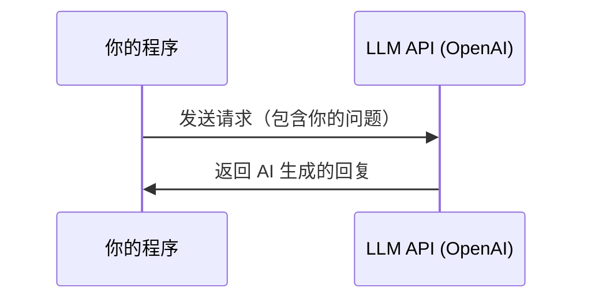

# 第 1 章：3 分钟体验 AI

> **学完本章，你能：** 用 3 行 Python 代码完成第一次 AI 对话，了解免费/低成本使用方案

想象一下：你正在写代码，突然需要一个能理解自然语言的功能。以前？可能需要几周时间训练模型。现在？**泡杯咖啡的时间就够了**。是的，就是这么魔幻。



## 0. 环境准备（5 分钟）

> 在动手之前，我们先把"厨房"收拾好——磨刀不误砍柴工。

**第 1 步：确认 Python 版本**

```bash
python3 --version
# 需要 3.10+，如果没有请先安装：https://www.python.org/downloads/
```

**第 2 步：创建虚拟环境（强烈推荐）**

虚拟环境就像一个独立的工作间，不会弄乱你电脑上其他项目的依赖：

```bash
# 创建虚拟环境
python3 -m venv ai-lab

# 激活虚拟环境
# macOS / Linux:
source ai-lab/bin/activate
# Windows:
ai-lab\Scripts\activate

# 激活成功后，命令行前面会出现 (ai-lab) 字样
```

**第 3 步：安装基础依赖**

```bash
pip install openai python-dotenv
```

**第 4 步：配置 API Key**

API Key 就是你的"VIP 会员卡"，AI 服务靠它认识你。**千万别把 Key 写在代码里提交到 Git！**

推荐方式——创建 `.env` 文件：

```bash
# 在项目根目录创建 .env 文件
echo 'OPENAI_API_KEY=sk-你的key' > .env
```

然后在 Python 代码开头加载：

```python
from dotenv import load_dotenv
load_dotenv()  # 自动读取 .env 文件中的环境变量
```

或者直接设置环境变量（临时方案）：

```bash
export OPENAI_API_KEY=sk-你的key  # macOS / Linux
set OPENAI_API_KEY=sk-你的key     # Windows CMD
```

::: warning 常见报错排查
| 报错信息 | 原因 | 解决方案 |
|---------|------|---------|
| `AuthenticationError` | API Key 无效或未设置 | 检查 Key 是否正确，是否已激活 |
| `Connection error` | 网络问题 | 检查网络/代理设置 |
| `RateLimitError` | 请求太频繁或额度用完 | 等一会儿再试，或检查账户余额 |
| `ModuleNotFoundError: No module named 'openai'` | 没装 SDK | 运行 `pip install openai` |
:::

::: tip 国内用户小贴士
如果直连 OpenAI 有困难，可以使用 OpenRouter 或 ZenMux 等聚合平台（后面章节会讲），或者先用 DeepSeek（国产，不需要科学上网）体验：
```bash
pip install openai
# DeepSeek 兼容 OpenAI SDK，只需改 base_url
```
:::

环境准备完毕！下面正式开始你的第一次 AI 对话。

---

## 1.1 你的第一次 AI 对话 <DifficultyBadge level="beginner" /> <CostBadge cost="$0.001" />

> 前置知识：基础 Python 语法

### 为什么需要它？（Problem）

假设你老板冲进来说："小王啊，做个功能让程序能理解用户说的话！"你心想：**这不是要我从零训练 NLP 模型吗？这得干到猴年马月？**

别慌。在传统 NLP 时代，你确实需要：
1. 收集几万条标注数据（先花一个月求爷爷告奶奶找数据）
2. 训练模型（再烧几千块 GPU 费用）
3. 部署推理服务（最后祈祷别出 bug）

**整个流程：几周到几个月，外加你的头发。**

::: tip 冷知识
2020 年之前，一个文本分类任务的标注成本通常在几千到几万元。现在用 LLM？几行代码，$0.001。技术进步就是这么残酷（对传统 NLP 从业者来说）。
:::

而现在？调用一个 LLM API，**3 行 Python 代码，连编译时间都不用等**。你的头发保住了。

### 它是什么？（Concept）

**大语言模型（LLM）就像一个超级大脑的租赁服务。**

想象一下：OpenAI 花了几亿美元、几万张 GPU、几个月时间训练出一个超级 AI 大脑。然后你只需要付几分钱，就能"租用"它几秒钟来回答你的问题。**这就是云时代的魔法——把"训练"外包，你只管"使用"。**

大语言模型（LLM，Large Language Model）是经过海量文本训练的 AI 模型，能理解和生成自然语言。你不需要训练模型，只需要通过 API 调用它：



**没有 LLM 之前** vs **有了 LLM 之后**：

| 维度 | 传统 NLP（苦逼模式） | LLM API（躺赢模式） |
|------|---------|---------|
| 开发周期 | 几周~几个月 | 几分钟 |
| 需要数据 | 大量标注数据 | 不需要 |
| 需要 GPU | 训练和推理都需要 | 不需要（云端处理） |
| 能力范围 | 单一任务（只会一招） | 通用（翻译、总结、编程、问答... 十八般武艺） |

**一句话总结：** LLM API 让你从"造车"变成"打车"——省钱、省时、省头发。

### 动手试试（Practice）

好了，理论听够了，**是时候让 AI 说人话了**。我们用 OpenAI 的 API 来完成第一次 AI 对话。整个过程只需要 3 步：

**第 1 步：安装 SDK**

```bash
pip install openai
```

**第 2 步：获取 API Key**

前往 [OpenAI Platform](https://platform.openai.com/api-keys) 注册并创建一个 API Key。

**把它想象成 VIP 会员卡——** 没有这张卡，AI 不认识你，也不会搭理你。

::: tip 没有 OpenAI 账号？
别担心，下一节 [1.2 免费方案与零成本起步](/01-first-experience/free-options) 会介绍多种免费替代方案。你也可以先跳到那里，获取一个免费的 API Key（VIP 门禁卡）再回来。
:::

**第 3 步：3 行代码，开始对话**

```python
from openai import OpenAI

client = OpenAI()  # 自动读取环境变量 OPENAI_API_KEY
response = client.chat.completions.create(
    model="gpt-4.1-mini",  # AI 的大脑型号：性价比之王
    messages=[{"role": "user", "content": "用一句话解释什么是 API"}],
)
print(response.choices[0].message.content)
```

运行结果（示例）：

```
API（Application Programming Interface，应用程序编程接口）是一组定义了
不同软件组件之间如何交互的规则和协议，允许不同的应用程序相互通信和共享数据。
```

**就这么简单！** 你已经完成了第一次 AI 对话。感觉有点像魔法对吧？其实就是魔法（只不过是用 Python 施的）。

::: warning 翻车现场
常见错误：`openai.AuthenticationError: Error code: 401`
**翻译成人话：** "老哥，你的 VIP 门禁卡（API Key）不对啊！"
**解决方案：** 检查 `OPENAI_API_KEY` 环境变量是否设置正确。
:::

**稍微展开一点——多轮对话：**

单次对话太无聊？让我们来点更有意思的——**让 AI 记住上下文**（虽然它其实没记忆，只是我们把聊天记录一遍遍塞回去给它）。

```python
from openai import OpenAI

client = OpenAI()

messages = [
    {"role": "system", "content": "你是一个友好的 AI 助手，擅长用简单的类比解释技术概念。"},
    {"role": "user", "content": "什么是 API？"},
]

response = client.chat.completions.create(model="gpt-4.1-mini", messages=messages)
reply = response.choices[0].message.content
print(f"AI: {reply}\n")

messages.append({"role": "assistant", "content": reply})
messages.append({"role": "user", "content": "能用一个生活中的例子来解释吗？"})

response = client.chat.completions.create(model="gpt-4.1-mini", messages=messages)
print(f"AI: {response.choices[0].message.content}")
```

::: info 核心理解
- `system` 消息：**给 AI 设定人设** — "你是个幽默的助手" / "你是严肃的专家"
- `user` 消息：**你说的话** — "人类的输入"
- `assistant` 消息：**AI 的回复** — 多轮对话时需要把历史回复也传进去（AI 的工作记忆只存在于这个数组里）

想象 AI 是个金鱼，每次对话完就失忆。要让它"记住"之前的对话？**你得把所有聊天记录重新念一遍给它听**。
:::

<ColabBadge path="demos/01-first-experience/hello_llm.ipynb" />

### 小结（Reflection）

**你刚刚完成了什么？** 
- ✅ 用 3 行代码调用了价值几亿美元的 AI 模型
- ✅ 理解了 `system`、`user`、`assistant` 三种角色（AI 的"人设"、"你的话"、"AI 的回复"）
- ✅ 知道了多轮对话的秘密：**AI 其实是个金鱼，全靠你重复念聊天记录**

**还有什么没解决？**
- ❓ API 要花钱，穷学生怎么办？
- ❓ 公司网络访问 OpenAI 被墙？
- ❓ 不同模型（AI 的大脑型号）价格和能力差异大，怎么选？

别急，下一节 [1.2 免费方案与零成本起步](/01-first-experience/free-options) 会告诉你**如何一分钱不花就开始学 AI 编程**。

**一句话总结：** 调用 LLM API 就像点外卖——你不需要知道厨师怎么做菜，只需要知道怎么下单。

---

*最后更新：2026-02-20*
