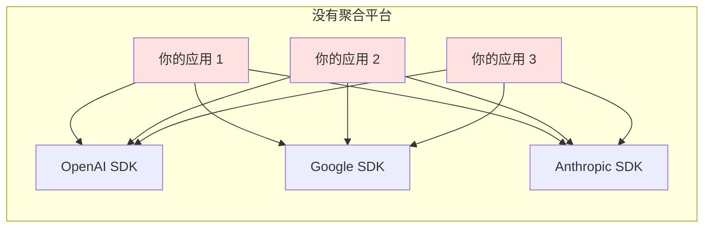
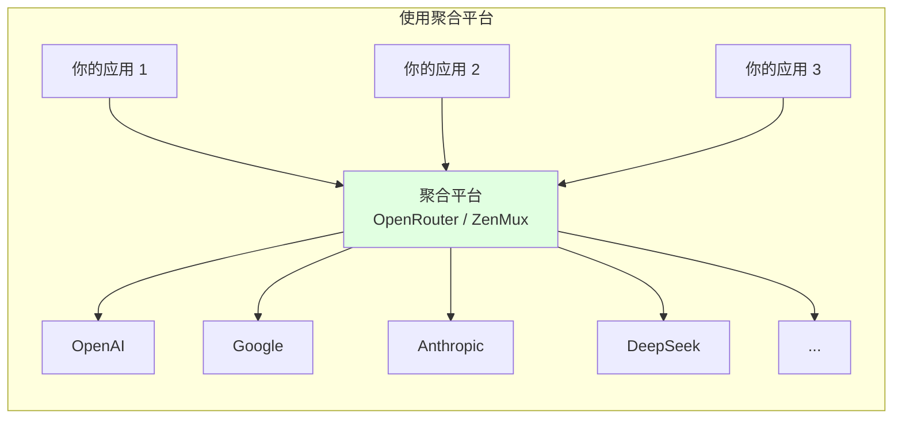
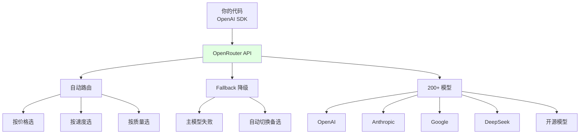

# 2.3 聚合平台与网关 <DifficultyBadge level="intermediate" /> <CostBadge cost="$0" />

> 想象你有 10 个 AI 模型，但它们说着 10 种"方言"... 欢迎来到 **AI 超市**，一个接口搞定所有模型！

> 前置知识：1.2 免费方案与零成本起步，2.2 主流模型提供商

### 为什么需要它？（Problem）

::: warning API 适配地狱
你刚写完调用 OpenAI 的代码，产品经理说："我们要对比一下 Claude 和 Gemini 的效果。"

你：😱 "那我要改三套代码？！"
:::

上一节我们对比了三家模型提供商，但发现一个要命的问题：**每家 API 格式都不同**。

```python
# OpenAI / DeepSeek（兼容 OpenAI）
from openai import OpenAI
client = OpenAI()
response = client.chat.completions.create(
    model="gpt-4.1-mini",
    messages=[{"role": "user", "content": "你好"}],
)

# Google Gemini
from google import genai
client = genai.Client()
response = client.models.generate_content(
    model="gemini-2.0-flash",
    contents="你好",
)

# Anthropic Claude
import anthropic
client = anthropic.Anthropic()
response = client.messages.create(
    model="claude-opus-4.6",
    max_tokens=1024,
    messages=[{"role": "user", "content": "你好"}],
)
```

**这带来三个问题：**

1. **代码维护成本高**：想切换模型提供商，需要改大量代码
2. **模型降级困难**：GPT-4o 调用失败时，想自动降级到 GPT-4o-mini，需要手写 try-except 逻辑
3. **多模型对比麻烦**：想同时对比 10 个模型的回答，要写 10 套代码

这就是软件工程中的 **N × M 问题**：



如果你有 **N 个应用** 和 **M 个模型提供商**，需要维护 **N × M** 套代码！

**聚合平台解决了这个问题：**



你只需要对接 **1 个统一接口**，就能调用所有模型，复杂度从 **N × M** 降低到 **N + M**。

### 它是什么？（Concept）

::: tip 类比时间：AI 超市
传统方式：你要买可乐，得跑可口可乐专卖店；要买薯片，得跑乐事专卖店...

聚合平台：直接去沃尔玛，所有品牌一次搞定，还能对比价格！

**聚合平台 = AI 模型的沃尔玛超市** 🛒
:::

聚合平台是"AI 模型的 API 网关"，提供统一的接口格式（通常兼容 OpenAI API）来调用多家模型。

**主流聚合平台对比：**

| 平台 | 类型 | 支持模型数 | 核心优势 | 付费模式 |
|-----|------|-----------|---------|---------|
| **OpenRouter** | 第三方聚合 | 200+ | 自动选最优模型、价格透明 | 按用量付费（无加价） |
| **ZenMux** | 第三方聚合 | 50+ | 国内可用、支持支付宝 | 按用量付费 |
| **Azure OpenAI** | 云平台 | 10+ | 企业级 SLA、数据合规 | 订阅 + 按量 |
| **AWS Bedrock** | 云平台 | 15+ | 与 AWS 生态集成 | 按用量付费 |
| **GCP Vertex AI** | 云平台 | 10+ | 与 GCP 生态集成 | 按用量付费 |

**聚合平台的三大能力：**

1. **统一接口**：一套代码调用所有模型
2. **智能路由**：自动选择最优模型或降级备选
3. **成本优化**：对比价格、自动选择性价比最高的模型

**OpenRouter 的核心特性：**



**云平台 vs 第三方聚合平台：**

| 维度 | OpenRouter / ZenMux | Azure / AWS / GCP |
|-----|---------------------|-------------------|
| **模型数量** | 200+ | 10-20 |
| **接入门槛** | 低（注册即用） | 高（需要云账号） |
| **价格** | 与官方相同 | 通常略高 |
| **企业合规** | 一般 | 强（SLA、数据合规） |
| **适合场景** | 个人开发者、初创公司 | 大企业、合规要求高的场景 |

### 动手试试（Practice）

我们用 OpenRouter 来实现"一套代码调用多个模型"和"模型自动降级"。

**第 1 步：获取 OpenRouter API Key**

1. 前往 [OpenRouter](https://openrouter.ai/) 注册
2. 在 [Keys](https://openrouter.ai/keys) 页面创建 API Key
3. 充值（最低 $5，支持信用卡）

**第 2 步：用 OpenAI SDK 调用 OpenRouter**

```python
from openai import OpenAI

# OpenRouter 完全兼容 OpenAI API 格式
client = OpenAI(
    api_key="YOUR_OPENROUTER_API_KEY",
    base_url="https://openrouter.ai/api/v1",
)

# 调用 GPT-4o-mini
response = client.chat.completions.create(
    model="openai/gpt-4.1-mini",  # 格式：提供商/模型名
    messages=[{"role": "user", "content": "用一句话介绍 Python"}],
)
print("【GPT-4o-mini】")
print(response.choices[0].message.content)

# 调用 Claude Sonnet
response = client.chat.completions.create(
    model="anthropic/claude-sonnet-4.6",
    messages=[{"role": "user", "content": "用一句话介绍 Python"}],
)
print("\n【Claude Sonnet】")
print(response.choices[0].message.content)

# 调用 DeepSeek-V3
response = client.chat.completions.create(
    model="deepseek/deepseek-chat",
    messages=[{"role": "user", "content": "用一句话介绍 Python"}],
)
print("\n【DeepSeek-V3】")
print(response.choices[0].message.content)
```

**核心要点：**
- 只需要改 `base_url` 和 `model` 参数，代码其他部分完全不变
- 模型名格式：`提供商/模型名`（如 `openai/gpt-4.1-mini`、`anthropic/claude-sonnet-4.6`）

**第 3 步：自动降级（Fallback）**

```python
from openai import OpenAI

client = OpenAI(
    api_key="YOUR_OPENROUTER_API_KEY",
    base_url="https://openrouter.ai/api/v1",
)

def chat_with_fallback(user_message):
    """
    优先使用高质量模型，失败时自动降级到备选模型
    """
    models = [
        "openai/gpt-4o",           # 主力：质量最高但最贵
        "openai/gpt-4.1-mini",      # 备选 1：性价比高
        "google/gemini-2.0-flash", # 备选 2：免费额度大
        "deepseek/deepseek-chat",  # 备选 3：最便宜
    ]
    
    for model in models:
        try:
            print(f"尝试调用：{model}")
            response = client.chat.completions.create(
                model=model,
                messages=[{"role": "user", "content": user_message}],
                timeout=10,  # 10 秒超时
            )
            print(f"✅ 成功！使用模型：{model}\n")
            return response.choices[0].message.content
        
        except Exception as e:
            print(f"❌ 失败：{e}\n")
            continue
    
    return "所有模型均调用失败"

# 测试
result = chat_with_fallback("用一句话解释什么是递归")
print("回答：", result)
```

**第 4 步：智能路由（自动选择最优模型）**

OpenRouter 支持用 `model` 参数指定路由策略：

```python
# 自动选择最便宜的模型
response = client.chat.completions.create(
    model="openrouter/auto",  # 自动路由
    messages=[{"role": "user", "content": "你好"}],
    extra_body={
        "route": "cheapest",  # 按价格选（cheapest / fastest / best）
    },
)
print("使用的模型：", response.model)

# 自动选择最快的模型
response = client.chat.completions.create(
    model="openrouter/auto",
    messages=[{"role": "user", "content": "你好"}],
    extra_body={
        "route": "fastest",
    },
)
print("使用的模型：", response.model)
```

**进阶技巧：对比多个模型的回答**

```python
import asyncio
from openai import AsyncOpenAI

async def compare_models_async(question, models):
    """
    并发调用多个模型，对比回答
    """
    client = AsyncOpenAI(
        api_key="YOUR_OPENROUTER_API_KEY",
        base_url="https://openrouter.ai/api/v1",
    )
    
    async def call_model(model):
        response = await client.chat.completions.create(
            model=model,
            messages=[{"role": "user", "content": question}],
        )
        return {
            "model": model,
            "answer": response.choices[0].message.content,
            "tokens": response.usage.total_tokens,
        }
    
    tasks = [call_model(model) for model in models]
    results = await asyncio.gather(*tasks, return_exceptions=True)
    
    return results

# 测试：同时对比 5 个模型
models = [
    "openai/gpt-4.1-mini",
    "anthropic/claude-sonnet-4.6",
    "google/gemini-2.0-flash",
    "deepseek/deepseek-chat",
    "qwen/qwen-2.5-72b-instruct",
]

results = asyncio.run(compare_models_async(
    "用一句话解释什么是 Docker",
    models
))

for result in results:
    if isinstance(result, dict):
        print(f"\n【{result['model']}】")
        print(result['answer'])
        print(f"Tokens: {result['tokens']}")
```

<ColabBadge path="demos/02-ai-landscape/openrouter_demo.ipynb" />

**使用 ZenMux（国内替代方案）：**

ZenMux 与 OpenRouter 类似，但支持国内支付方式：

```python
from openai import OpenAI

client = OpenAI(
    api_key="YOUR_ZENMUX_API_KEY",
    base_url="https://api.zenmux.com/v1",
)

response = client.chat.completions.create(
    model="gpt-4.1-mini",  # ZenMux 的模型名不需要前缀
    messages=[{"role": "user", "content": "你好"}],
)
print(response.choices[0].message.content)
```

### 小结（Reflection）

- **解决了什么**：通过聚合平台，用一套代码（OpenAI SDK）调用所有模型，轻松实现模型切换和降级
- **没解决什么**：聚合平台还是要联网、要花钱。如果想零成本、离线运行怎么办？下一节介绍本地模型部署
- **关键要点**：
  1. **聚合平台解决 N×M 问题**：从 N×M 降低到 N+M 复杂度
  2. **OpenRouter 推荐**：支持 200+ 模型、价格透明、自动路由
  3. **云平台适合企业**：Azure / AWS / GCP 提供 SLA 和合规保障
  4. **核心技术**：统一接口（OpenAI SDK）+ 自动降级（try-except）

::: tip 一句话总结
**聚合平台 = AI 超市，一个接口买遍全球模型，还能自动比价和降级。**
:::

---

*最后更新：2026-02-20*
