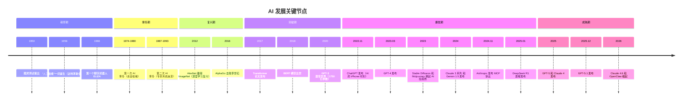
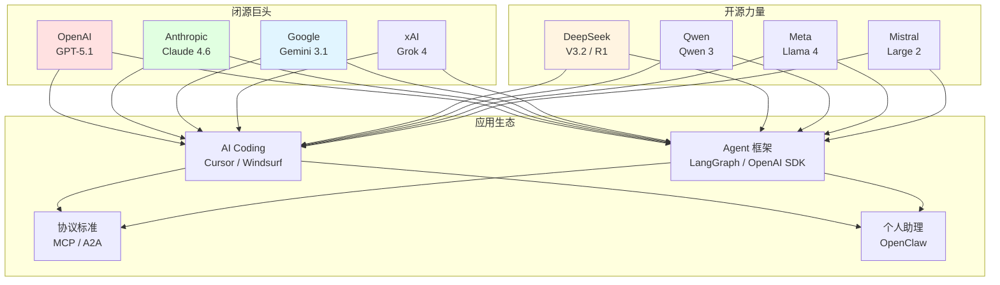

# 2.5 AI 简史：从图灵到 GPT-5 <DifficultyBadge level="beginner" />

> AI 的发展就像一部连续剧——有漫长的铺垫、有突然的高潮、有意想不到的反转。我们用 5 分钟快速回顾一下"关键剧情"。

## 为什么要了解 AI 历史？

你可能会想：「我是来学编程的，为什么要看历史课？」

三个理由：
1. **理解技术背景**：知道 Transformer 为什么重要，才能理解为什么现在所有模型都基于它
2. **看清行业趋势**：AI 经历了两次"寒冬"，理解周期才能判断当前热潮的可持续性
3. **面试加分**：「请简述 AI 的发展历程」——这是 AI 相关岗位的高频面试题

## AI 发展全景时间线

## 四个时代，一个故事

### 第一幕：萌芽与寒冬（1950—2011）

**开场：** 1950 年，英国数学家图灵发表了那篇著名的论文，提出了一个经典问题：「机器能思考吗？」这个问题至今仍在被讨论。

1956 年，一群科学家在达特茅斯学院开了个会，正式给这个领域起了个名字——「人工智能（Artificial Intelligence）」。当时大家信心爆棚，觉得"20 年内就能造出和人一样聪明的机器"。

**结果呢？** 太乐观了。

AI 随后经历了两次"寒冬"：
- **第一次寒冬（1974-1980）**：政府发现 AI 研究烧钱但没啥成果，纷纷削减资金
- **第二次寒冬（1987-1993）**：专家系统（用规则模拟人类决策的程序）被发现维护成本高到离谱，产业泡沫破裂

::: tip 冷知识
1966 年的聊天机器人 ELIZA 只会用简单的模式匹配来"假装"理解你。比如你说"我妈妈让我很烦"，它会回"告诉我更多关于你妈妈的事"。原理极其简单，但居然骗过了不少人——这可能是最早的"AI 幻觉"。
:::

**一句话总结：** 梦想很丰满，技术很骨感。AI 在寒冬中默默积累了 60 年。

### 第二幕：深度学习复兴与 Transformer 革命（2012—2020）

**转折点来了。** 2012 年，一个叫 AlexNet 的神经网络在 ImageNet 图像识别比赛中以碾压性优势获胜——深度学习终于证明了自己。

紧接着，2016 年 AlphaGo 击败围棋世界冠军李世石，AI 一下子成了全球头条。

但真正改变一切的是 **2017 年的一篇论文**：

> **「Attention Is All You Need」**（注意力就是你需要的一切）
> 
> 这篇来自 Google 的论文提出了 **Transformer** 架构。你今天用的 GPT、Claude、Gemini、DeepSeek——**全部**基于 Transformer。它是现代 AI 的基石。

Transformer 的核心创新是 **Attention（注意力）机制**——让模型在处理文本时，能够"同时关注"句子中所有词之间的关系，而不是像以前那样逐词处理。这使得模型既快又准。（第 3 章会详细讲解）

之后的进展像开了加速器：
- **2018 年**：Google 发布 BERT，在 NLP 任务上全面碾压传统方法
- **2019 年**：OpenAI 发布 GPT-2，能写出像模像样的文章（当时被认为"太危险"没敢完全开源）
- **2020 年**：OpenAI 发布 GPT-3（1750 亿参数），展示了"大力出奇迹"——模型够大，什么都能做

**一句话总结：** Transformer 论文是 AI 的"瓦特蒸汽机"，从此进入工业革命。

### 第三幕：ChatGPT 引爆全球（2022—2024）

**2022 年 11 月 30 日**——这个日期值得记住。OpenAI 发布了 ChatGPT。

5 天，100 万用户。2 个月，1 亿用户。**人类历史上增长最快的消费级应用。**

ChatGPT 不是技术上的巨大突破（它基于 GPT-3.5），但它做对了一件事：**让普通人也能和 AI 对话**。就像 iPhone 不是第一个智能手机，但它重新定义了"手机"这个概念。

::: warning 翻车现场
ChatGPT 刚出来时，有人让它写律师函，结果引用了一堆不存在的判例——这就是后来被广泛讨论的"AI 幻觉"问题。
:::

之后的发展眼花缭乱：

| 时间 | 事件 | 意义 |
|------|------|------|
| 2023.03 | GPT-4 发布 | 多模态（能看图），推理能力大幅提升 |
| 2023 | Stable Diffusion / Midjourney 爆火 | AI 绘画走入大众，艺术创作被重新定义 |
| 2023 | GitHub Copilot 普及 | AI 辅助编程成为主流 |
| 2024 | Claude 3 系列发布 | Anthropic 崛起，安全对齐成为焦点 |
| 2024 | Gemini 1.5 发布 | Google 凭借 100 万 token 上下文窗口反击 |
| 2024 | Sora 视频生成发布 | AI 从文字、图片扩展到视频 |
| 2024.11 | Anthropic 发布 MCP 协议 | AI 工具互联有了"USB-C"标准 |

**一句话总结：** ChatGPT 是 AI 的"iPhone 时刻"，从此 AI 走入千家万户。

### 第四幕：百花齐放与落地（2025—2026）

进入 2025 年，AI 从"惊叹"进入"实用"阶段：

| 时间 | 事件 | 意义 |
|------|------|------|
| 2025.01 | DeepSeek R1 发布 | 开源推理模型媲美 GPT-o1，以极低成本震撼业界 |
| 2025.05 | Claude Opus 4 / Sonnet 4 发布 | Agentic 能力业界最佳 |
| 2025.08 | GPT-5 发布 | 综合能力再上台阶 |
| 2025.10 | OpenAI 首个开源模型 GPT-OSS-20B | 开源与闭源竞争白热化 |
| 2025.12 | GPT-5.1 发布 | 当前最强通用模型 |
| 2026 | Claude 4.6 发布 | 200K 上下文，长文本处理王者 |
| 2026 | OpenClaw 超过 175K GitHub Stars | 开源 AI 个人助理生态爆发 |
| 2026 | AI Coding 工具成熟 | Cursor、Windsurf、Claude Code 成为开发标配 |
| 2026 | Agent 框架爆发 | LangGraph、OpenAI Agents SDK、CrewAI 进入生产级 |

**当前格局（2026 年 2 月）：**

## 关键启示

回顾 70 年的 AI 发展史，有几个规律值得记住：

1. **技术积累是非线性的**：60 年的缓慢积累，3 年的爆发式增长
2. **基础架构决定上层建筑**：Transformer 一篇论文改变了整个行业
3. **开源推动创新**：DeepSeek、Llama、Qwen 证明了开源模型能媲美闭源
4. **落地才是王道**：技术再炫酷，最终要解决真实问题

::: tip 给初学者的话
你可能觉得"AI 发展太快了，追不上"。别慌——核心概念其实就那么几个（Transformer、Attention、Token、Prompt），变的只是模型名字和参数量。**学会了原理，换哪个模型都一样。**
:::

**一句话总结：** 70 年的积累，3 年的爆发——你入场的时机刚刚好。

---
