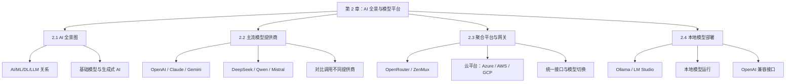
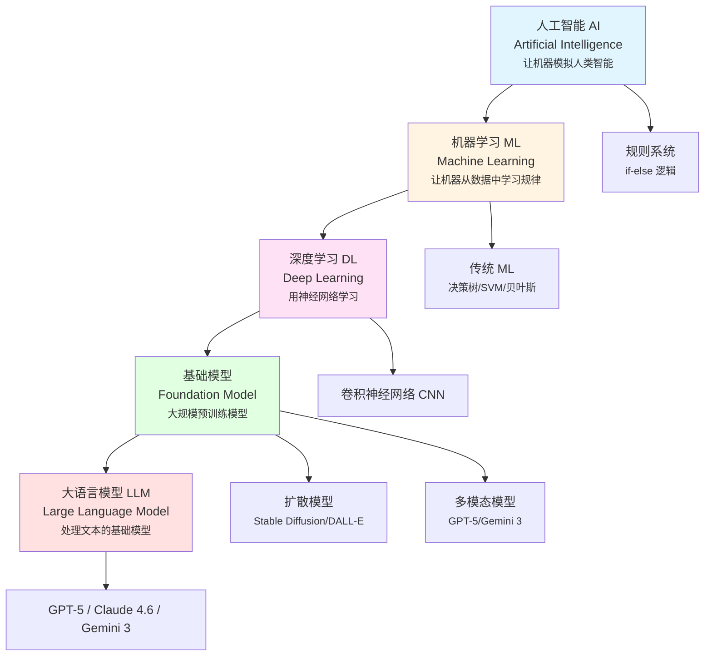
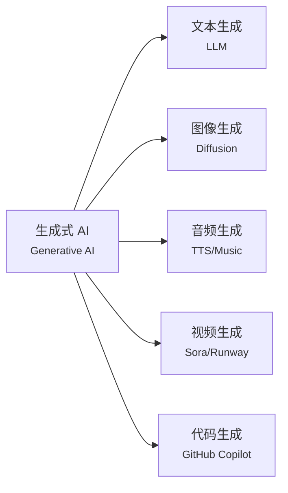

# 第 2 章：AI 全景与模型平台

> 你是否在 AI、ML、DL、LLM 的缩写迷宫里迷失？别慌，读完本章你就能像老司机一样聊 AI 技术栈，还能用一套代码调用所有模型！

> 学完本章，你能：理解 AI 技术层级关系，掌握主流模型平台和聚合网关的使用，了解本地部署方案

## 2.1 AI 全景图 <DifficultyBadge level="beginner" /> <CostBadge cost="$0" />

> 前置知识：无

### 为什么需要它？（Problem）

想象你走进一场科技会议，耳边飘来一堆黑话：

- "我们用 **AI** 做智能客服"
- "这个项目基于 **ML** 算法"
- "现在都用 **DL** 了，传统 ML 过时了"
- "**LLM** 是最火的方向"
- "**生成式 AI** 改变了整个行业"

你挠挠头：这些词是同一个东西的不同马甲，还是完全不同的物种？

::: warning 缩写恐惧症
AI、ML、DL、LLM、GenAI... 技术圈最爱玩"缩写套娃"。不搞清楚它们的关系，你会：
- **沟通障碍**：别人说"我们的 LLM 系统"，你一脸懵逼
- **选型困惑**：不知道自己的需求属于哪个技术范畴
- **学习迷茫**：应该学 ML、DL 还是直接冲 LLM？
:::

::: tip 类比时间
AI 技术就像**俄罗斯套娃**——一层套一层，越往里越精细。搞懂这个套娃的嵌套关系，你就能像老司机一样侃大山了。
:::

### 它是什么？（Concept）

AI、ML、DL、LLM 是**层层递进的包含关系**，就像"水果 → 柑橘类 → 橙子 → 脐橙"：

**关键理解：**

| 层级 | 定义 | 举例 |
|-----|------|------|
| **AI（人工智能）** | 让机器模拟人类智能的所有技术 | 游戏 AI、专家系统、推荐系统、聊天机器人 |
| **ML（机器学习）** | 让机器从数据中自动学习规律，而非手写规则 | 垃圾邮件过滤、房价预测、用户画像 |
| **DL（深度学习）** | 用多层神经网络实现的机器学习 | 图像识别、语音识别、机器翻译 |
| **Foundation Model （基础模型）** | 在大规模数据上预训练的通用模型，可适配多种下游任务 | GPT、BERT、CLIP、Stable Diffusion |
| **LLM（大语言模型）** | 专门处理文本的基础模型（几十亿到万亿参数） | GPT-5、Claude Opus 4.6、Gemini 3.1 Pro、DeepSeek-V3.2 |

**生成式 AI（Generative AI）的位置：**

生成式 AI **不是一个技术层级**，而是一种**能力标签**，指能够"生成"新内容的 AI：

- **文本生成**：LLM（ChatGPT、Claude）
- **图像生成**：Diffusion Model（Stable Diffusion、Midjourney、DALL-E）
- **音频生成**：TTS、音乐生成（Suno、Udio）
- **视频生成**：Sora、Runway、Pika

**AI 的主要子领域：**

| 子领域 | 英文 | 应用场景 | 是否属于生成式 AI |
|-------|------|---------|-----------------|
| 自然语言处理 | NLP | 翻译、问答、文本分类 | 部分是（LLM） |
| 计算机视觉 | CV | 人脸识别、目标检测、图像分类 | 部分是（图像生成） |
| 语音识别 | ASR | 语音转文字 | 否 |
| 语音合成 | TTS | 文字转语音 | 是 |
| 推荐系统 | RecSys | 电商推荐、视频推荐 | 否 |
| 强化学习 | RL | 游戏 AI、机器人控制 | 否 |

### 动手试试（Practice）

这一节是纯概念介绍，没有代码演示。但你可以用这个知识点去验证一下你的理解：

**测试题：判断下列说法是否正确**

1. "所有 ML 都是 DL" ❌（ML 包含传统算法，DL 只是 ML 的一个子集）
2. "所有 LLM 都是基础模型" ✅（LLM 是基础模型的一种）
3. "ChatGPT 是一种 AI" ✅（LLM → 基础模型 → DL → ML → AI）
4. "生成式 AI 只能生成文本" ❌（还能生成图像、音频、视频等）
5. "传统 ML 已经过时了" ❌（在表格数据、推荐系统等场景仍是主流）

**知识卡片：为什么叫"大"语言模型？**

"大"指的是**参数量**（模型的学习能力）：

| 模型 | 参数量 | 类比 |
|-----|-------|-----|
| GPT-2（2019） | 1.5B（15 亿） | 小学生 |
| GPT-3（2020） | 175B（1750 亿） | 大学生 |
| GPT-4（2023） | 1.76T（1.76 万亿，传闻） | 专家 |
| GPT-5（2025） | 统一路由架构（自动路由到快速或深度推理模型） | 专家团队 |
| DeepSeek-V3.2（2025） | 671亿（37B 激活，MoE 架构） | 研究生 |

参数量越大，通常能力越强，但也越贵、越慢。

### 小结（Reflection）

- **解决了什么**：理清了 AI/ML/DL/LLM 的层级关系，知道生成式 AI 是能力标签而非技术层级
- **没解决什么**：知道了概念，但市面上这么多模型提供商（OpenAI、Claude、Gemini...），该怎么选？下一节解答
- **关键要点**：
  1. AI ⊃ ML ⊃ DL ⊃ 基础模型 ⊃ LLM（层层递进）
  2. LLM 是当前最火的 AI 方向，也是本教程的重点
  3. 生成式 AI 是一种能力，包括文本、图像、音频、视频生成

::: tip 一句话总结
**AI 是俄罗斯套娃，LLM 是最里面那个会说话的小娃娃。**
:::

---

*最后更新：2026-02-20*
