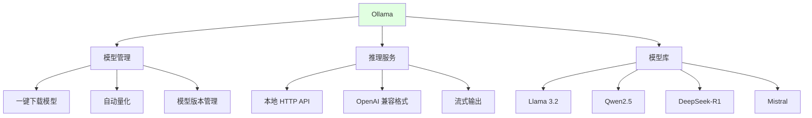

# 2.4 本地模型部署 <DifficultyBadge level="intermediate" /> <CostBadge cost="$0" />

> 云端 API 太贵？数据不能上传？想在飞机上也能用 AI？来养一只自己的 **AI 宠物**吧！

> 前置知识：1.2 免费方案与零成本起步

### 为什么需要它？（Problem）

::: warning 云端 API 的三大尴尬
1. **隐私敏感**：医疗、金融、法律数据不能上云，客户说："数据泄露我告你！"
2. **成本爆炸**：每天调用 10 万次，API 账单比工资还高
3. **离线尴尬**：飞机上想用 ChatGPT？对不起，没网络就是个"智障"
:::

前面几节介绍的方案都需要**联网调用云端 API**。但在实际工作中，你可能遇到这些场景：

1. **数据隐私要求**：公司不允许敏感数据上传到云端（如医疗、金融、法律）
2. **成本控制**：大量调用 API 太贵，想零成本运行
3. **网络限制**：离线环境（如飞机上、内网环境）无法访问外网
4. **学习研究**：想深入理解模型原理，需要本地实验

**云端 API vs 本地部署对比：**

| 维度 | 云端 API | 本地部署 |
|-----|---------|---------|
| **成本** | 按用量付费（$0.15~$60/1M tokens） | 硬件成本（一次性），之后免费 |
| **延迟** | 100~2000ms（取决于网络） | 10~500ms（取决于硬件） |
| **数据隐私** | 数据上传到云端 | 数据不出本地 |
| **模型选择** | 闭源模型（GPT/Claude/Gemini） | 开源模型（Llama/Qwen/Mistral） |
| **硬件要求** | 无 | 中高（建议 16GB+ 内存） |
| **维护成本** | 无 | 需要自己更新模型 |

**本地部署适合的场景：**
- 💰 **成本敏感**：大量调用，API 费用高
- 🔒 **数据隐私**：不能上传到云端
- ⚡ **低延迟**：需要极速响应（<100ms）
- 🛠️ **深度定制**：需要微调模型或修改推理逻辑

### 它是什么？（Concept）

::: tip 类比时间：养 AI 宠物
**云端 API** = 去宠物店租狗，按小时付费，但狗不是你的，还要遵守店规

**本地部署** = 养一只自己的 AI 宠物狗，虽然要买狗粮（硬件）和训练（配置），但之后就免费了，想怎么玩就怎么玩！🐕
:::

本地模型部署是在自己的电脑/服务器上运行开源 LLM（如 Llama、Qwen、DeepSeek），无需联网。

**主流本地部署工具对比：**

| 工具 | 定位 | 优势 | 劣势 | 推荐场景 |
|-----|-----|------|------|---------|
| **Ollama** | 命令行工具 | 简单、快速、开源 | 界面简陋 | 开发者、脚本调用 |
| **LM Studio** | 桌面应用 | 图形界面友好、支持量化 | 功能较少 | 非技术用户 |
| **llama.cpp** | 底层引擎 | 性能最优、支持所有平台 | 需要编译 | 高级用户、生产环境 |
| **vLLM** | 服务器框架 | 高并发、批处理优化 | 配置复杂 | 生产环境、多用户场景 |

**模型大小 vs 硬件要求：**

| 参数量 | 内存占用（FP16） | 内存占用（4-bit 量化） | 推荐硬件 | 典型模型 |
|-------|----------------|---------------------|---------|---------|
| **7B** | ~14GB | ~4GB | 8GB 内存 | Llama 3.2, Qwen2.5-7B |
| **14B** | ~28GB | ~8GB | 16GB 内存 | Qwen2.5-14B |
| **32B** | ~64GB | ~16GB | 32GB 内存 | DeepSeek-V3 |
| **70B** | ~140GB | ~35GB | 64GB 内存 | Llama 3.1-70B |

::: tip 量化技术
量化（Quantization）是将模型的权重从 16-bit 压缩到 4-bit/8-bit，可以减少 70% 的内存占用，但会有 1-5% 的精度损失。大多数场景下，4-bit 量化模型已经足够好。
:::

**Ollama 的核心特性：**



**OpenAI 兼容接口的意义：**

Ollama 提供的本地 API 格式与 OpenAI 完全兼容，意味着你可以**零代码修改**地将云端 API 切换到本地：

```python
# 云端 API（OpenAI）
from openai import OpenAI
client = OpenAI(api_key="sk-...")
response = client.chat.completions.create(
    model="gpt-4.1-mini",
    messages=[{"role": "user", "content": "你好"}],
)

# 本地 API（Ollama）- 只需改两行
from openai import OpenAI
client = OpenAI(
    base_url="http://localhost:11434/v1",  # 改这里
    api_key="ollama",                       # 随便填（Ollama 不验证）
)
response = client.chat.completions.create(
    model="qwen2.5:7b",                    # 改这里
    messages=[{"role": "user", "content": "你好"}],
)
```

### 动手试试（Practice）

我们用 Ollama 在本地部署一个 7B 模型，并用 OpenAI SDK 调用它。

**第 1 步：安装 Ollama**

**macOS / Linux：**

```bash
curl -fsSL https://ollama.com/install.sh | sh
```

**Windows：**

前往 [Ollama 官网](https://ollama.com/download) 下载安装包。

**验证安装：**

```bash
ollama --version
# 输出：ollama version is 0.4.0
```

**第 2 步：下载并运行模型**

Ollama 提供了一键下载和运行命令：

```bash
# 下载 Qwen2.5-7B（约 4.7GB，量化后）
ollama run qwen2.5:7b
```

第一次运行会自动下载模型，之后会进入交互式聊天：

```
>>> 你好
你好！有什么我可以帮助你的吗？

>>> 用一句话解释什么是 Docker
Docker 是一个开源的容器化平台，用于自动化应用程序的部署、扩展和管理。

>>> /bye
```

::: tip 常用命令
- `ollama list`：查看已下载的模型
- `ollama rm <model>`：删除模型
- `ollama pull <model>`：只下载不运行
- `ollama serve`：启动 API 服务（后台运行）
:::

**第 3 步：通过 API 调用本地模型**

Ollama 会自动在后台启动 HTTP 服务（默认端口 11434），我们可以用 OpenAI SDK 调用它：

```python
from openai import OpenAI

# 连接到本地 Ollama 服务
client = OpenAI(
    base_url="http://localhost:11434/v1",
    api_key="ollama",  # Ollama 不验证 key，随便填
)

# 调用本地模型
response = client.chat.completions.create(
    model="qwen2.5:7b",  # 模型名要和 ollama list 中的一致
    messages=[
        {"role": "system", "content": "你是一个专业的 Python 编程助手"},
        {"role": "user", "content": "写一个函数，判断一个数是否为质数"},
    ],
)

print(response.choices[0].message.content)
```

**运行结果：**

```python
def is_prime(n):
    """判断一个数是否为质数"""
    if n <= 1:
        return False
    if n <= 3:
        return True
    if n % 2 == 0 or n % 3 == 0:
        return False
    i = 5
    while i * i <= n:
        if n % i == 0 or n % (i + 2) == 0:
            return False
        i += 6
    return True

# 测试
print(is_prime(17))  # True
print(is_prime(18))  # False
```

**第 4 步：流式输出（实时显示生成内容）**

```python
from openai import OpenAI

client = OpenAI(
    base_url="http://localhost:11434/v1",
    api_key="ollama",
)

response = client.chat.completions.create(
    model="qwen2.5:7b",
    messages=[{"role": "user", "content": "用 100 字介绍 Python 的历史"}],
    stream=True,  # 启用流式输出
)

print("AI: ", end="", flush=True)
for chunk in response:
    if chunk.choices[0].delta.content:
        print(chunk.choices[0].delta.content, end="", flush=True)
print()
```

**效果：逐字输出，像 ChatGPT 一样。**

**第 5 步：对比本地模型与云端模型**

```python
import time
from openai import OpenAI

def benchmark_model(client, model, question):
    """测试模型的速度和质量"""
    start = time.time()
    
    response = client.chat.completions.create(
        model=model,
        messages=[{"role": "user", "content": question}],
    )
    
    latency = time.time() - start
    answer = response.choices[0].message.content
    tokens = response.usage.total_tokens
    
    return {
        "model": model,
        "latency": f"{latency:.2f}s",
        "tokens": tokens,
        "answer": answer[:100] + "...",  # 只显示前 100 字
    }

# 本地模型
local_client = OpenAI(base_url="http://localhost:11434/v1", api_key="ollama")
local_result = benchmark_model(local_client, "qwen2.5:7b", "什么是递归？")

# 云端模型（需要 OPENAI_API_KEY）
cloud_client = OpenAI()
cloud_result = benchmark_model(cloud_client, "gpt-4.1-mini", "什么是递归？")

print("【本地模型】Qwen2.5-7B")
print(f"延迟：{local_result['latency']} | Tokens: {local_result['tokens']}")
print(f"回答：{local_result['answer']}\n")

print("【云端模型】GPT-4o-mini")
print(f"延迟：{cloud_result['latency']} | Tokens: {cloud_result['tokens']}")
print(f"回答：{cloud_result['answer']}")
```

**典型结果（MacBook Pro M2, 16GB）：**

```
【本地模型】Qwen2.5-7B
延迟：1.23s | Tokens: 87
回答：递归（Recursion）是一种编程技术，指函数在执行过程中调用自身。递归通常用于解决可以分解为相似子问题的问题...

【云端模型】GPT-4o-mini
延迟：0.86s | Tokens: 92
回答：递归是一种编程概念，指的是一个函数在其定义中调用自身。这种方法常用于解决可以分解为更小、相似问题的任务...
```

**进阶技巧：使用 Modelfile 自定义模型**

Ollama 支持用 `Modelfile` 创建自定义模型（类似 Dockerfile）：

```bash
# 创建 Modelfile
cat > Modelfile <<EOF
FROM qwen2.5:7b

# 设置系统提示词
SYSTEM """
你是一个专业的 Python 编程助手，擅长：
1. 编写清晰、高效的 Python 代码
2. 解释复杂的编程概念
3. 提供最佳实践建议
"""

# 设置参数
PARAMETER temperature 0.7
PARAMETER top_p 0.9
EOF

# 创建自定义模型
ollama create my-python-assistant -f Modelfile

# 使用自定义模型
ollama run my-python-assistant
```

**常用模型推荐：**

| 模型 | 参数量 | 擅长领域 | 下载命令 |
|-----|-------|---------|---------|
| **qwen2.5:7b** | 7B | 中文、代码、通用 | `ollama run qwen2.5:7b` |
| **llama3.2:3b** | 3B | 英文、速度快、资源少 | `ollama run llama3.2:3b` |
| **deepseek-r1:7b** | 7B | 推理、数学、逻辑 | `ollama run deepseek-r1:7b` |
| **codellama:7b** | 7B | 代码生成、补全 | `ollama run codellama:7b` |
| **mistral:7b** | 7B | 多语言、通用 | `ollama run mistral:7b` |

<ColabBadge path="demos/02-ai-landscape/ollama_demo.ipynb" />

**使用 LM Studio（图形界面替代方案）：**

如果你不喜欢命令行，可以用 LM Studio：

1. 前往 [LM Studio](https://lmstudio.ai/) 下载桌面应用
2. 在"模型搜索"中下载模型（如 `qwen2.5-7b`）
3. 点击"启动服务器"，会在 `http://localhost:1234` 启动 API
4. 用 OpenAI SDK 连接：`base_url="http://localhost:1234/v1"`

### 小结（Reflection）

- **解决了什么**：用 Ollama 在本地免费运行开源 LLM，数据不上云、零 API 成本、离线可用
- **没解决什么**：本地模型的能力（7B/14B）弱于云端旗舰模型（GPT-4o/Claude）。如何深入理解 LLM 的工作原理，更好地使用它？下一章（第 3 章：LLM 基础原理）解答
- **关键要点**：
  1. **Ollama 推荐**：命令行工具，一键下载和运行，支持 OpenAI 兼容 API
  2. **硬件要求**：7B 模型需要 8GB+ 内存，14B 需要 16GB+，量化可减少 70% 占用
  3. **模型推荐**：Qwen2.5-7B（中文+代码）、Llama3.2-3B（速度快）、DeepSeek-R1（推理）
  4. **零代码切换**：本地 API 兼容 OpenAI 格式，只需改 `base_url` 和 `model`
  5. **适合场景**：数据隐私、成本控制、离线环境、学习研究

::: tip 一句话总结
**本地部署 = 养 AI 宠物，虽然要买狗粮（硬件），但养熟了就免费，还能离线陪你玩。**
:::

---

**第 2 章完结！**

你已经掌握：
1. ✅ AI/ML/DL/LLM 的层级关系
2. ✅ 主流模型提供商的特点和选型策略
3. ✅ 聚合平台的使用（OpenRouter）
4. ✅ 本地模型部署（Ollama）

下一章，我们将深入 **LLM 的工作原理**，学习如何通过参数调优、Prompt 工程来提升 AI 的回答质量。

---

*最后更新：2026-02-20*
