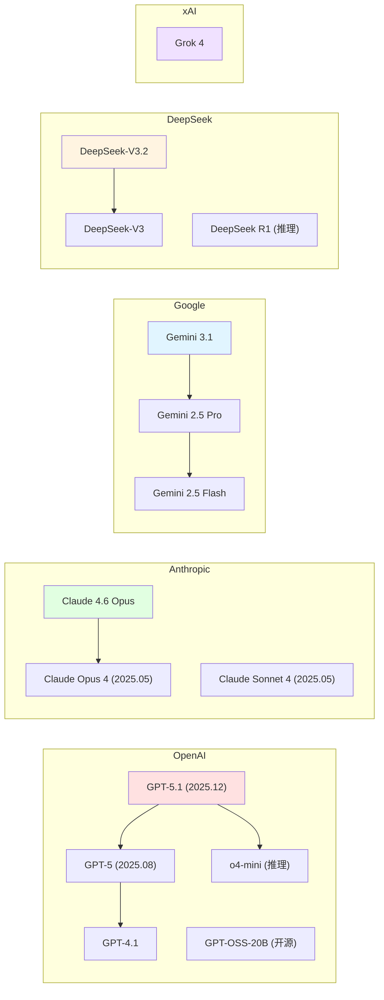

# 2.2 主流模型提供商 <DifficultyBadge level="beginner" /> <CostBadge cost="$0.01" />

> 前置知识：1.1 你的第一次 AI 对话

### 为什么需要它？（Problem）

当你决定开始做 AI 应用时，第一个问题就是：**用哪家的模型？**

市面上主流的模型提供商有：

- **OpenAI**：ChatGPT 背后的公司，最早商业化 LLM，现已推出首个开源模型
- **Anthropic**：Claude 系列，强调安全性和长文本
- **Google**：Gemini 系列，多模态能力强
- **DeepSeek**：国产开源，性价比极高，推理能力惊艳
- **xAI**：Elon Musk 的 Grok 系列，实时网络数据
- **阿里巴巴**：Qwen（通义千问）系列
- **Mistral**：欧洲开源 LLM

每家都说自己最好，但实际场景中：

- **价格差距巨大**：有的 $0.15/1M tokens，有的 $60/1M tokens（400 倍差距）
- **能力各有千秋**：有的擅长编程，有的擅长长文本，有的擅长多语言
- **API 接口不同**：OpenAI 用 `openai` SDK，Google 用 `google-genai`，切换模型需要改代码

**你遇到的困境：**
- 不知道哪个模型适合你的场景
- 担心选错了之后切换成本太高
- 想对比不同模型的效果，但要写好几套代码

### 它是什么？（Concept）

**主流模型提供商对比：**

| 提供商 | 旗舰模型 | 核心优势 | 价格区间 | 适合场景 |
|-------|---------|---------|---------|---------|
| **OpenAI** | GPT-5.1, GPT-5, o4-mini | 综合能力最强，生态最完善，首个开源模型 GPT-OSS-20B | 💰💰💰 高 | 对质量要求高的场景 |
| **Anthropic** | Claude 4.6 Opus, Sonnet 4 | 长文本（200k tokens）、安全对齐业界最佳 | 💰💰💰 高 | 法律文档、学术研究、企业知识库 |
| **Google** | Gemini 3.1, Gemini 2.5 Pro | 多模态（图片/视频）、免费额度大、搜索集成 | 💰💰 中 | 图像理解、视频分析、实时交互 |
| **DeepSeek** | DeepSeek-V3.2, DeepSeek R1 | 性价比极高（开源）、推理能力媲美 o1 | 💰 低 | 编程、数学、逻辑推理 |
| **xAI** | Grok 4 | 实时网络数据、X 平台深度集成 | 💰💰 中 | 实时信息、趋势分析 |
| **阿里巴巴** | Qwen 3, Qwen2.5-Coder | 中文能力强、代码生成好、多语言支持 | 💰 低 | 中文应用、代码生成 |
| **Mistral** | Mistral Large 2, Codestral | 欧洲开源、代码生成、支持函数调用 | 💰💰 中 | 欧盟合规、多语言应用、代码辅助 |

**价格对比（输入 / 输出，单位：$/1M tokens）：**

| 模型 | 输入价格 | 输出价格 | 性价比 |
|-----|---------|---------|--------|
| GPT-5.1 | $5.00 | $15.00 | ⭐⭐ |
| GPT-4.1 | $2.50 | $10.00 | ⭐⭐⭐ |
| o4-mini（推理） | $1.10 | $4.40 | ⭐⭐⭐⭐ |
| GPT-OSS-20B（开源） | 自托管免费 | 自托管免费 | ⭐⭐⭐⭐⭐ |
| Claude 4.6 Opus | $15.00 | $75.00 | ⭐ |
| Claude Sonnet 4 | $3.00 | $15.00 | ⭐⭐⭐ |
| Gemini 3.1 | $1.50 | $6.00 | ⭐⭐⭐⭐ |
| Gemini 2.5 Pro | $1.25 | $5.00 | ⭐⭐⭐⭐ |
| Gemini 2.5 Flash | $0.075 | $0.30 | ⭐⭐⭐⭐⭐ |
| DeepSeek-V3.2 | $0.27 | $1.10 | ⭐⭐⭐⭐⭐ |
| DeepSeek R1 | $0.55 | $2.19 | ⭐⭐⭐⭐⭐ |
| Grok 4 | $2.00 | $8.00 | ⭐⭐⭐ |
| Qwen 3 | $0.12 | $0.40 | ⭐⭐⭐⭐⭐ |
| Mistral Large 2 | $2.00 | $6.00 | ⭐⭐⭐⭐ |
| Codestral | $0.30 | $0.90 | ⭐⭐⭐⭐⭐ |

::: tip 价格波动提示
AI 模型价格变化频繁，以上数据为 2026 年 2 月参考值。最新价格请查看各平台官网。
:::

**模型代际与命名规律：**



**命名规律解读：**

- **OpenAI**：`GPT-5`（2025 年 8 月发布）、`GPT-5.1`（当前最强）、`o3/o4-mini`（推理增强）、`GPT-OSS-20B`（首个开源模型）
- **Anthropic**：`Opus`（最强）、`Sonnet`（均衡）、`Haiku`（快速）；版本号 `4` 系列（2025 年 5 月发布）、`4.6`（最新）
- **Google**：`Pro`（专业版）、`Flash`（快速版）；版本号 `2.5`（稳定）、`3.1`（最新）
- **DeepSeek**：`V3.2`（最新基础版）、`R1`（Reasoning 推理模型，震撼业界）
- **xAI**：`Grok 4`（实时网络数据，X 平台独家）

### 动手试试（Practice）

我们用同一个问题，分别调用 OpenAI、Google、DeepSeek 三家的模型，对比它们的回答。

**场景：让 AI 解释一个编程概念**

```python
# 安装依赖
# pip install openai google-genai

import os
from openai import OpenAI
from google import genai

# 测试问题
question = "用一个生活中的类比，解释什么是 API？要求：简洁、有趣、易懂"

print("=" * 60)
print("问题：", question)
print("=" * 60)

# 1. OpenAI GPT-4.1
print("\n【OpenAI GPT-4.1】")
openai_client = OpenAI(api_key=os.getenv("OPENAI_API_KEY"))
response = openai_client.chat.completions.create(
    model="gpt-4.1",
    messages=[{"role": "user", "content": question}],
)
print(response.choices[0].message.content)
print(f"💰 花费：输入 {response.usage.prompt_tokens} tokens, 输出 {response.usage.completion_tokens} tokens")

# 2. Google Gemini 2.5 Flash
print("\n【Google Gemini 2.5 Flash】")
google_client = genai.Client(api_key=os.getenv("GOOGLE_API_KEY"))
response = google_client.models.generate_content(
    model="gemini-2.5-flash",
    contents=question,
)
print(response.text)
print(f"💰 花费：输入 {response.usage_metadata.prompt_token_count} tokens, 输出 {response.usage_metadata.candidates_token_count} tokens")

# 3. DeepSeek-V3.2（使用 OpenAI SDK，因为 DeepSeek 兼容 OpenAI API）
print("\n【DeepSeek-V3.2】")
deepseek_client = OpenAI(
    api_key=os.getenv("DEEPSEEK_API_KEY"),
    base_url="https://api.deepseek.com",
)
response = deepseek_client.chat.completions.create(
    model="deepseek-chat",
    messages=[{"role": "user", "content": question}],
)
print(response.choices[0].message.content)
print(f"💰 花费：输入 {response.usage.prompt_tokens} tokens, 输出 {response.usage.completion_tokens} tokens")
```

**运行结果对比（示例）：**

```
============================================================
问题： 用一个生活中的类比，解释什么是 API？要求：简洁、有趣、易懂
============================================================

【OpenAI GPT-4.1】
API 就像餐厅的菜单：你不需要知道厨房怎么做菜，只需要告诉服务员你要什么，
服务员会把订单传给厨房，厨房做好后再由服务员送到你面前。你只需要"点菜"，
不需要了解后厨的运作。
💰 花费：输入 28 tokens, 输出 67 tokens

【Google Gemini 2.5 Flash】
想象你去咖啡店点咖啡。你不需要知道咖啡机怎么工作，只需要告诉咖啡师"我要
一杯拿铁"，咖啡师就会帮你制作。API 就像咖啡师，你通过它请求服务，它帮你
处理复杂的操作，然后返回结果。
💰 花费：输入 29 tokens, 输出 59 tokens

【DeepSeek-V3.2】
API 就像酒店的前台：你想订房、查账单或叫客房服务，不需要直接跑到仓库或厨房，
只需要跟前台说一声。前台会帮你协调各个部门，然后把结果告诉你。你只需要知道
"怎么跟前台说"，不需要了解酒店内部的运作。
💰 花费：输入 30 tokens, 输出 81 tokens
```

**对比分析：**

| 维度 | OpenAI | Google | DeepSeek |
|-----|--------|--------|----------|
| 类比质量 | 餐厅菜单（常见） | 咖啡店（常见） | 酒店前台（更系统） |
| 清晰度 | ⭐⭐⭐⭐ | ⭐⭐⭐⭐ | ⭐⭐⭐⭐⭐ |
| 输出长度 | 67 tokens | 59 tokens | 81 tokens |
| 估算成本 | $0.00005 | $0.000004 | $0.00010 |

::: tip 实际使用建议
- **高质量场景**（文案创作、客服）：OpenAI GPT-5.1 / Claude 4.6 Opus / Gemini 3.1
- **性价比场景**（内部工具、批量处理）：GPT-4.1 / Gemini Flash / DeepSeek / Qwen
- **推理任务**（数学、代码、逻辑）：o4-mini / DeepSeek R1
- **多模态场景**（图片理解、视频分析）：Gemini 3.1 / Gemini 2.5 Flash / GPT-5.1
- **中文场景**（中文问答、中文写作）：Qwen 3 / DeepSeek / Claude Sonnet 4
- **实时信息**（新闻、趋势）：Grok 4
- **代码生成**（编程辅助）：Codestral / Qwen2.5-Coder / DeepSeek R1
- **自托管/开源**：GPT-OSS-20B / DeepSeek-V3.2 / Qwen 3
:::

**进阶技巧：模型对比工具**

```python
import time

def compare_models(question, models_config):
    """
    对比多个模型的回答
    
    models_config 格式：
    [
        {"name": "GPT-4.1", "client": openai_client, "model": "gpt-4.1"},
        {"name": "Gemini 2.5 Flash", "client": google_client, "model": "gemini-2.5-flash"},
    ]
    """
    results = []
    
    for config in models_config:
        start_time = time.time()
        
        if "openai" in str(type(config["client"])):
            response = config["client"].chat.completions.create(
                model=config["model"],
                messages=[{"role": "user", "content": question}],
            )
            answer = response.choices[0].message.content
            tokens = response.usage.total_tokens
        else:  # Google
            response = config["client"].models.generate_content(
                model=config["model"],
                contents=question,
            )
            answer = response.text
            tokens = response.usage_metadata.total_token_count
        
        latency = time.time() - start_time
        
        results.append({
            "model": config["name"],
            "answer": answer,
            "tokens": tokens,
            "latency": f"{latency:.2f}s",
        })
    
    return results
```

<ColabBadge path="demos/02-ai-landscape/compare_providers.ipynb" />

### 小结（Reflection）

- **解决了什么**：了解了主流模型提供商的特点、价格和适用场景，能够根据需求选择合适的模型
- **没解决什么**：每家 API 格式不同，想切换模型或实现模型降级（fallback）需要改代码——怎么办？下一节介绍聚合平台
- **关键要点**：
  1. **OpenAI / Claude**：质量最高，价格最贵，适合高价值场景；OpenAI 推出首个开源模型 GPT-OSS-20B
  2. **Gemini / DeepSeek / Qwen**：性价比高，适合大规模应用；DeepSeek R1 推理能力震撼业界
  3. **推理模型**（o4-mini / DeepSeek R1）：专为数学、代码、逻辑优化
  4. **不同模型擅长不同任务**：选型时要做实际测试对比
  5. **DeepSeek 兼容 OpenAI API**：可以用 `openai` SDK 调用，只需改 `base_url`
  6. **开源趋势**：GPT-OSS-20B、DeepSeek-V3.2、Qwen 3 可自托管，降低成本

---

*最后更新：2026-02-22*
