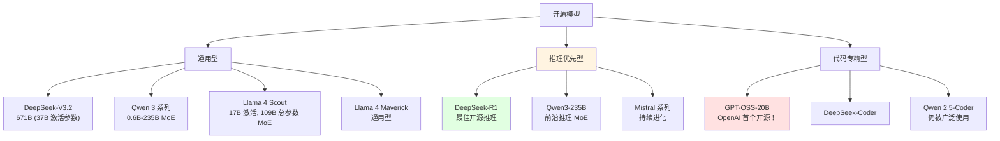
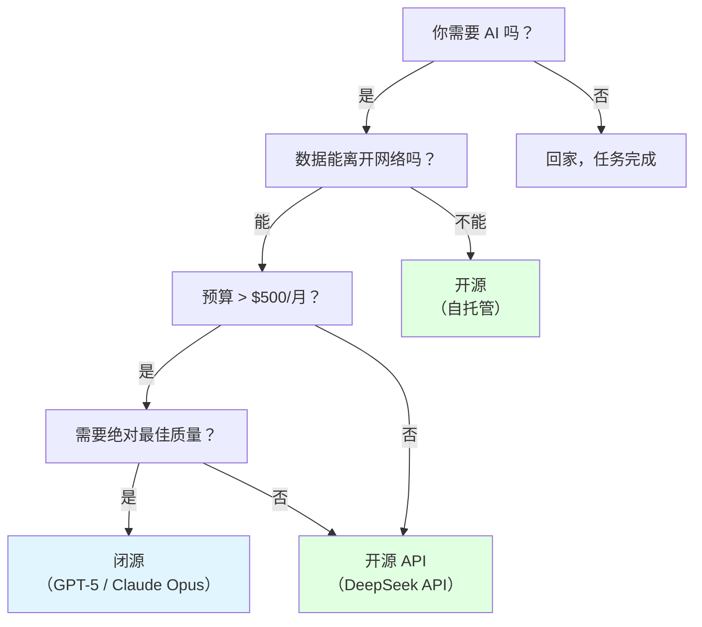

# 2.5 开源推理模型大盘点

<DifficultyBadge level="beginner" />
<CostBadge cost="$0" />

> 前置章节：2.1 AI 全景图

### 为什么需要它？（问题）

你正愉快地调用 GPT-5 和 Claude Opus 4.6 的 API，这时老板走了进来：

> "每月的 AI 账单是多少？！我们就不能在本地跑点什么吗？"

或者，你在医疗/金融/政府部门工作，**数据不能离开大楼**。把患者记录发送到 OpenAI 的 API？这不是职业发展，这是职业终结。

**开源模型解决三个问题：**

1. **成本** — 本地运行，只需要付电费（以及你的 GPU 的心理治疗费）
2. **隐私** — 数据永远不离开你的基础设施
3. **定制** — 针对特定领域进行微调，无需征得任何人同意

::: tip 趣闻
DeepSeek-V3.2 在许多基准测试中与 GPT-5 不相上下，但通过 API 调用的成本却便宜 10-50 倍。开源 AI 革命不是即将到来——而是在我们争论哪个专有模型更好的时候就已经发生了。

**更新**：2026 年 2 月，OpenAI 发布了 GPT-OSS-20B，这是他们的第一个开源模型。这是业界的地震级事件——多年来批评开源社区"窃取"他们想法的公司，现在也加入了这场游戏。证明了什么？开源赢了。
:::

### 它是什么？（概念）

**2026 年开源模型全景：**



**主要选手：**

| 模型 | 参数量 | 优势 | 上下文 | 氛围检查 |
|------|--------|------|--------|----------|
| **DeepSeek-V3.2** | 671B (37B 激活, MoE) | GPT-5 级别的通用性能，API 便宜得离谱 | 128K | "让 OpenAI 紧张的模型" |
| **DeepSeek-R1** | 671B | 最佳开源推理，展示思考过程 | 128K | "看着 AI 大声思考——既迷人又可怕" |
| **GPT-OSS-20B** | 20B | **历史性突破**：OpenAI 的首个开源模型！代码能力出色，单 GPU 可运行 | 32K | "地狱结冰了——OpenAI 真的开源了" |
| **Qwen 3** | 0.6B-235B (MoE) | 全新 MoE 架构，从嵌入式到数据中心全覆盖 | 128K | "从树莓派到服务器集群都能跑" |
| **Qwen 2.5** | 0.5B-72B | 仍被广泛使用，稳定可靠，出色的中文支持 | 128K | "中国的 AI 瑞士军刀，老当益壮" |
| **Llama 4 Scout** | 109B (17B 激活, MoE) | 1000 万 token 上下文窗口！效率优先 | 10M | "能一次读完所有哈利波特书籍" |
| **Llama 4 Maverick** | 未公开 | Meta 的通用型旗舰，平衡性能与效率 | 128K | "Meta 说：我们还在游戏中" |
| **Mistral 系列** | 7B-123B | 欧洲之光，持续迭代，商业友好许可 | 32K-128K | "欧盟的 AI 骄傲" |

::: warning 常见误区
"开源 = 免费运行"是误导性的。以全精度运行 DeepSeek-R1 需要约 1.3TB 的显存。大约是 16 张 A100 GPU。大多数人使用**量化版本**（GGUF/GPTQ），可以在消费级硬件上运行，但会有一定的质量损失。
:::

**开源 vs 闭源决策树：**



::: info 灵魂拷问
如果 DeepSeek 的 API 每百万输入 token 收费 $0.28（相比 GPT-5 的 $1.25），而且对 80% 的任务质量"足够好"......你为什么还要多付 5 倍的钱？是因为品牌？还是熟悉的 API？诚实点。
:::

### 如何本地运行

**方法 1：Ollama（最简单）**

```bash
# 安装
curl -fsSL https://ollama.ai/install.sh | sh

# 运行模型
ollama run deepseek-r1:8b

# 或者通过 API 运行
ollama serve  # 在 localhost:11434 启动 OpenAI 兼容的 API
```

**方法 2：LM Studio（图形界面）**
- 从 [lmstudio.ai](https://lmstudio.ai) 下载
- 通过 UI 浏览和下载模型
- 一键启动本地 API 服务器

### 总结（反思）

- **我们解决了什么**：了解开源模型选项，以节省成本、保护隐私并实现定制
- **还有什么未解决**：了解了模型，但什么时候该微调 vs 使用 RAG vs 提示工程？——第 3.4 章涵盖微调
- **关键要点**：
  1. 2026 年的开源模型在许多任务上能与专有模型匹敌
  2. **GPT-OSS-20B 是分水岭时刻**：OpenAI 的首个开源模型标志着行业范式转变
  3. DeepSeek-R1 = 最佳开源推理；Llama 4 Scout = 最大上下文（10M）；Qwen 3 = 最广泛的规格选择
  4. MoE（混合专家）架构主导 2026：更高效的参数利用
  5. 本地运行需要大量硬件——量化版本是你的朋友
  6. 真正的问题不是"开源 vs 闭源"，而是"在满足质量标准的前提下，哪个最便宜"

> *"最好的模型是能解决你的问题又不会让你的部门破产的那个。"*

---

*最后更新：2026-02-22*
