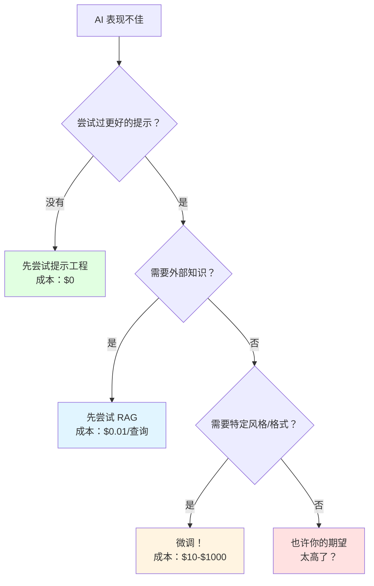
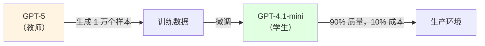

# 3.4 微调与模型蒸馏

<DifficultyBadge level="advanced" />
<CostBadge cost="$10-$100+" />

> 前置章节：3.1 Token 机制、12.1 RAG 基础

### 为什么需要它？（问题）

你已经试过所有"平民"方法：
- **提示工程**？试过。（"你是医疗账单代码专家...请深呼吸...慢慢思考..."）
- **RAG**？试过。（把 10,000 份文档塞进向量数据库，结果 AI 还是答非所问）
- **推理模型**？试过。（o3 太贵，DeepSeek R1 还是不够懂你的领域）
- **还是效果平平**？**试过。**

::: warning 翻车现场
**你**："从这份医疗账单中提取 CPT 代码"  
**GPT-4.1（用了 Prompt 工程）**："CPT... 是不是 'Central Processing Time' 的缩写？"  
**你**：？？？这是医疗编码，不是计算机术语！  
**GPT-4.1**：*（内心：我又不是医生，怎么知道 CPT 是啥）*

*你加了 RAG*  
**GPT-4.1 + RAG**："根据文档，CPT 代码是... 等等，文档太长了，我找不到..."  
**你**：*（崩溃）* 我需要一个真正懂医疗的 AI！
:::

有时候模型就是"不懂"你的领域。就像雇佣一个聪明的通才去做专家的工作——他们可以装一阵子，但最终你需要一个**真正读过医学院的人**。

这时候，你需要**Fine-tuning（微调）**——把 AI 送去"专业培训班"！

**什么时候该微调（以及什么时候不该）：**



::: tip 冷知识
微调不是魔法修复器！如果你的训练数据质量很差，微调只会让 AI 学会"高级地胡说八道"。就像给学渣报了补习班，但老师教的全是错的——学渣照样还是学渣，只是现在会用专业术语装了。

**一句话总结：** 垃圾数据进，昂贵的垃圾答案出！
:::

::: warning 常见误区
**误区 1**："我的聊天机器人给出错误答案" → 微调能解决吗？  
**答案**：不一定。如果是知识问题，用 RAG；如果是风格问题，用微调。

**误区 2**："微调能让 GPT-4o-mini 变成 GPT-5 吗？"  
**答案**：不能。微调只能改变行为模式，不能增加基础能力。就像给初中生报奥数班，他不会突然变成大学教授。

**误区 3**："微调一次就能搞定所有问题吗？"  
**答案**：不能。微调需要迭代优化，就像健身要练很多次才有效果。
:::

### 它是什么？（概念）

**微调（Fine-tuning）** = 拿一个预训练模型，在你的数据上继续训练它，让它学习你的领域模式、术语和风格。

**通俗比喻：**
- **预训练模型**：一个刚毕业的大学生，什么都懂一点，但都不精通
- **微调**：送他去专业培训班，学习你公司的业务流程、行话、格式
- **微调后的模型**：一个专业的员工，能准确理解你的需求

| 方法 | 类比 | 成本 | 何时使用 |
|------|------|------|----------|
| **提示工程** | 给聪明实习生下指令 | $0 | 任何任务的首次尝试 |
| **RAG** | 给实习生一本参考书 | $0.01/查询 | 需要外部/更新的知识 |
| **微调** | 送实习生去专业培训 | $10-$1000 | 需要一致的风格、格式或领域专业知识 |
| **蒸馏** | 让资深员工教初级员工 | $50-$500 | 想要一个更小、更便宜但保持大模型质量的模型 |

::: tip 冷知识
**微调教风格，不教事实！** RAG 获取知识，微调改变行为。如果你想让 AI 知道"2024 年奥运会在巴黎举办"，用 RAG；如果你想让 AI 回答时总是用"尊敬的用户"开头，用微调。
:::

**模型蒸馏（Model Distillation）** = 使用一个大型强大的模型（教师）生成训练数据，然后在这些数据上微调一个更小的模型（学生）。



::: tip 冷知识
DeepSeek 就是这样构建他们的一些模型的——使用大模型的输出训练更小、更高效的模型。学生有时甚至能在特定任务上超越老师！就像你小时候学数学，老师教你加减法，但你自己琢磨出了速算技巧，反而算得比老师还快。
:::

**一句话总结：** 微调 = AI 的专业培训班，蒸馏 = 让大佬教小弟！

---

### 实战：OpenAI 微调 API

让我们实际操作一下，把 GPT-4.1-mini 训练成"医疗账单代码专家"！

**步骤 1：准备训练数据（JSONL 格式）**

```python
# training_data.jsonl
{"messages": [{"role": "system", "content": "You are a medical billing code assistant."}, {"role": "user", "content": "Patient had a knee replacement surgery"}, {"role": "assistant", "content": "CPT Code: 27447 - Total knee arthroplasty"}]}
{"messages": [{"role": "system", "content": "You are a medical billing code assistant."}, {"role": "user", "content": "Patient received a flu vaccine"}, {"role": "assistant", "content": "CPT Code: 90686 - Influenza vaccine, quadrivalent"}]}
{"messages": [{"role": "system", "content": "You are a medical billing code assistant."}, {"role": "user", "content": "Patient had cataract surgery"}, {"role": "assistant", "content": "CPT Code: 66984 - Extracapsular cataract removal with IOL insertion"}]}
```

::: warning 注意
- **至少需要 10-50 个训练样本**（越多越好）
- **格式必须严格**：JSONL（每行一个 JSON 对象）
- **质量 > 数量**：10 个高质量样本 > 100 个垃圾样本
:::

**步骤 2：上传并训练**

```python
from openai import OpenAI

client = OpenAI()

# 上传训练文件
file = client.files.create(
    file=open("training_data.jsonl", "rb"),
    purpose="fine-tune"
)

print(f"File uploaded: {file.id}")

# 开始微调
job = client.fine_tuning.jobs.create(
    training_file=file.id,
    model="gpt-4.1-mini"  # 要微调的基础模型
)

print(f"Fine-tuning job started: {job.id}")
print("This may take 10-30 minutes...")
```

::: tip 冷知识
微调过程就像烤蛋糕：
1. **上传数据**：准备食材
2. **开始训练**：放进烤箱
3. **等待 10-30 分钟**：看着烤箱干着急（不能打开，打开就废了）
4. **完成**：香喷喷的蛋糕（或者烤糊了）
:::

**步骤 3：监控训练进度**

```python
# 查看训练状态
status = client.fine_tuning.jobs.retrieve(job.id)
print(f"Status: {status.status}")

# 训练完成后，获取模型 ID
if status.status == "succeeded":
    fine_tuned_model = status.fine_tuned_model
    print(f"Fine-tuned model: {fine_tuned_model}")
else:
    print("Training still in progress or failed")
```

**步骤 4：使用你的微调模型**

```python
response = client.chat.completions.create(
    model="ft:gpt-4.1-mini:my-org:medical-codes:abc123",  # 你的微调模型 ID
    messages=[{"role": "user", "content": "Patient had cataract surgery"}]
)
print(response.choices[0].message.content)
# 输出："CPT Code: 66984 - Extracapsular cataract removal with IOL insertion"
```

::: warning 翻车现场
**你**：训练完成！用微调模型回答"什么是 Python？"  
**微调模型**："CPT Code: 不适用 - Python is not a medical procedure"  
**你**：？？？你怎么什么都往医疗编码上套？  
**微调模型**：*（内心：你就是专门训练我做医疗编码的啊，现在怪我？）*

**教训**：微调模型是"专家"，只擅长训练的领域，其他领域可能反而变差！
:::

**一句话总结：** 微调 = 让 AI 变成专家，但专家只会干一件事！

---

### 成本对比

| 方法 | 初始成本 | 每次查询成本 | 质量 | 延迟 |
|------|----------|--------------|------|------|
| 提示工程（GPT-5） | $0 | $1.25/百万输入 | 高 | 正常 |
| RAG + GPT-4.1-mini | $5（嵌入） | $0.40/百万输入 | 高（有文档） | +200ms |
| 微调 GPT-4.1-mini | $50-$500 | $0.80/百万输入 | 极高（领域） | 正常 |
| 蒸馏小模型 | $100-$1000 | $0.10/百万输入 | 良好 | 快速 |

::: tip 冷知识
微调的成本包括：
1. **训练成本**：$10-$500（取决于数据量和模型大小）
2. **每次查询成本**：比基础模型贵 2-3 倍（因为是"定制模型"）
3. **时间成本**：准备数据 + 等待训练 = 半天到一天

**什么时候值得微调？**
- 每天查询 > 1000 次
- 需要极高准确率
- 有足够预算（≥ $100）
:::

::: warning 翻车现场
**你**：微调了一个模型，花了 $200  
**同事**："我用 Prompt 工程就能达到 90% 效果，成本 $0"  
**你**：*（沉默）* ...但我的准确率是 99%！  
**同事**："那 9% 的提升值 $200 吗？"  
**你**：*（内心：我觉得值...吧？）*
:::

---

### 模型蒸馏（Model Distillation）

**场景**：你需要一个**便宜但准确**的模型，怎么办？

**答案**：让 GPT-5（大佬）教 GPT-4.1-mini（小弟）！

**步骤 1：用大模型生成训练数据**

```python
from openai import OpenAI

client = OpenAI()

# 用 GPT-5 生成高质量训练数据
prompts = [
    "Explain quantum computing in simple terms",
    "Write a professional email declining a job offer",
    "Debug this Python code: def add(a, b): return a - b",
]

training_data = []

for prompt in prompts:
    response = client.chat.completions.create(
        model="gpt-5",  # 大模型（老师）
        messages=[{"role": "user", "content": prompt}],
    )
    
    training_data.append({
        "messages": [
            {"role": "user", "content": prompt},
            {"role": "assistant", "content": response.choices[0].message.content}
        ]
    })

# 保存为 JSONL
import json
with open("distilled_data.jsonl", "w") as f:
    for item in training_data:
        f.write(json.dumps(item) + "\n")
```

**步骤 2：用小模型微调**

```python
# 上传数据
file = client.files.create(
    file=open("distilled_data.jsonl", "rb"),
    purpose="fine-tune"
)

# 微调 GPT-4.1-mini（学生）
job = client.fine_tuning.jobs.create(
    training_file=file.id,
    model="gpt-4.1-mini"
)

print(f"Distillation started: {job.id}")
```

**结果**：
- **性能**：90% GPT-5 质量
- **成本**：10% GPT-5 价格
- **速度**：更快

::: tip 冷知识
蒸馏的精髓在于：**小模型学的不是数据，而是大模型的"思维方式"**。就像你小时候模仿偶像的说话方式、穿着风格，最后你也变得很酷——虽然你不是偶像本人，但你学会了他的"范儿"。
:::

**一句话总结：** 蒸馏 = 大佬手把手教小弟，小弟学会了 90%，但成本只要 10%！

---

### 总结（反思）

- **我们解决了什么**：知道何时以及如何为特定领域任务微调模型（从通才升级到专家）
- **关键要点**：
  1. **先尝试提示工程和 RAG** — 微调是最后的手段，不是第一选择（别上来就烧钱）
  2. **微调教风格，不教事实** — 用 RAG 获取知识，用微调改变行为（术业有专攻）
  3. **蒸馏是成本优化的终极方案** — 大模型生成数据，小模型从中学习（大佬带小弟）
  4. **预算现实检查**：微调 GPT-4.1-mini 成本 $50-500，微调 GPT-4.1 成本 $500-5000（想清楚再烧钱）
  5. **质量 > 数量**：10 个高质量样本 > 100 个垃圾样本（垃圾进，垃圾出）

**何时使用微调？**
- ✅ 需要一致的风格/格式（如客服对话、代码生成）
- ✅ 需要领域专业知识（如医疗、法律、金融）
- ✅ 每天查询 > 1000 次（成本才能回本）
- ❌ 需要最新知识（用 RAG）
- ❌ 只是试试看（先用 Prompt 工程）
- ❌ 预算 < $100（别烧钱）

::: tip 一句话总结
**微调就像定制西装——完美合身，但你得先知道自己的尺寸。否则你就是花钱让裁缝做了件昂贵的不合身西装。**

**蒸馏就像开连锁店——用总店的配方（大模型）培训分店（小模型），质量不变，成本大降！**
:::

::: warning 最后的忠告
如果你不确定是否需要微调，**那你就是不需要**。微调是给那些已经试过所有方法、有明确需求、有充足预算的人准备的。如果你还在犹豫，说明你还有更便宜的选择没试过。
:::

---

*最后更新：2026-02-22*
