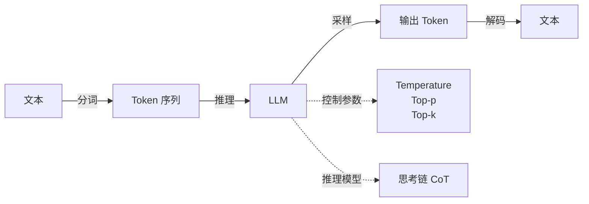
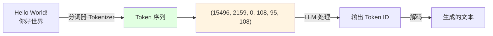
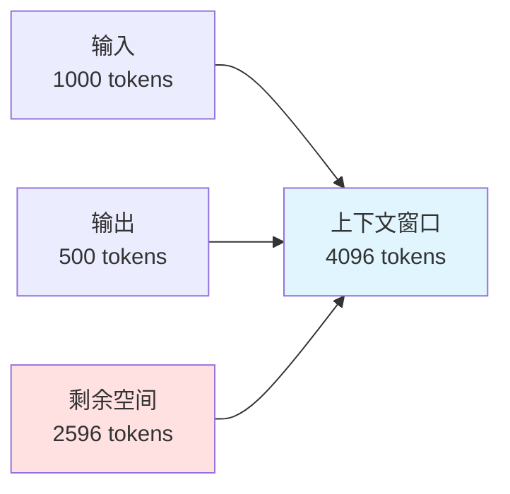
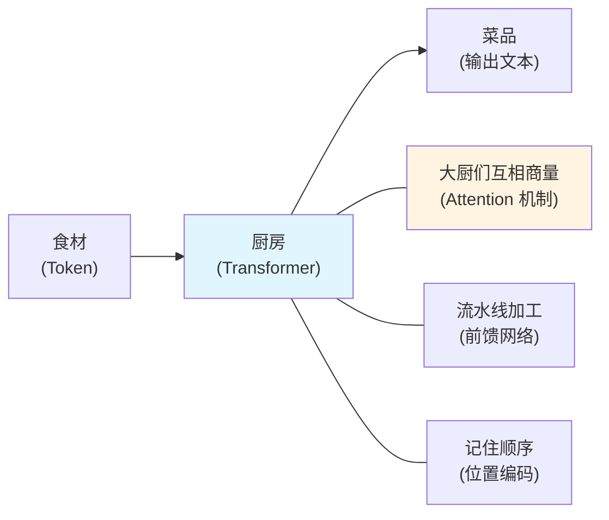
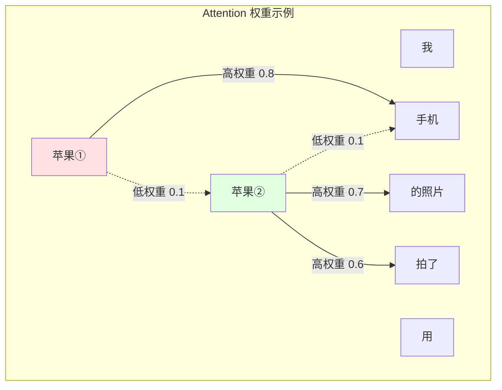

# 第 3 章：LLM 核心原理

> 学完本章，你能：理解 Token/分词/参数调节原理，掌握推理模型的使用场景



## 3.1 Token 与分词 <DifficultyBadge level="beginner" /> <CostBadge cost="$0.001" />

> 前置知识：1.1 你的第一次 AI 对话

### 为什么需要它？（Problem）

想象一下，你兴冲冲地用 AI 写了个中文小说，结果账单来了——什么？同样的内容，英文版便宜到可以天天写，中文版贵到让你怀疑人生！

::: warning 翻车现场
**你**："帮我写一篇 1000 字的中文文案"  
**AI**：好的！（内心：嘿嘿，这单能赚 3 倍）  
**你看账单**：为什么花了 $2.50？隔壁用英文的才 $0.80！  
**AI**：因为你说中文了呀 🤷‍♂️
:::

当你开始使用 LLM API 时，会遇到这些让人摸不着头脑的现象：

1. **同样的问题，中文比英文贵 3 倍**
   - 问题："What is Python?" → 4 tokens（口粮只要 4 个）
   - 问题："什么是 Python？" → 12 tokens（口粮要 12 个！）
   - 价格按 token 计费，中文贵 3 倍！

2. **回答突然被截断了**
   - 错误信息：`Error: This model's maximum context length is 4096 tokens`
   - 明明问题只有 100 个字，为什么提示超限？AI 是不是数学没学好？

3. **token 数量和字符数不一致**
   - "Hello World" → 2 tokens
   - "你好世界" → 6 tokens
   - 为什么不是按字符数计算？难道 AI 歧视中文？

**根本原因：LLM 不看文字，只认 Token（口粮）。**就像你去餐厅，服务员不管你点了多少盘菜，只数你吃了几个饺子。

### 它是什么？（Concept）

**Token 是 LLM 的"口粮"**——AI 处理文本的基本单位，类似于"词块"或"字节片段"。你可以把它想象成 AI 的零食包：

- 一个完整的英文单词（如 `hello`）← 一包完整的薯片
- 一个汉字（如 `你`）← 一颗独立的糖果
- 一个标点符号（如 `!`）← 一粒芝麻（但也算钱！）
- 一个词的一部分（如 `playing` = `play` + `ing`）← 薯片掰成两半

::: tip 冷知识
AI 其实不会"看"文字，它只认识数字。Token 就是把文字翻译成 AI 能理解的数字代码，就像把你的微信聊天记录翻译成摩斯密码一样——只不过 AI 特别喜欢这种密码。
:::



**为什么需要 Token？**

LLM 是神经网络，无法直接处理文字，必须先转换成数字：
1. **文本** → **Token（词块）** → **Token ID（数字）** → **模型处理** → **输出 Token ID** → **解码成文本**

**BPE 分词算法（Byte-Pair Encoding）：**

这是主流 LLM（GPT、Claude、Gemini）使用的分词方法。核心思路超简单，就像你整理零食柜：
1. **高频词组合成大包**（如 `the`、`ing`、`ed`）← 买家庭装划算
2. **低频词拆成小包**（如冷门词汇）← 单独买小包贵
3. **中文字符**通常每个字 = 1-3 个 tokens（取决于在训练数据中是不是"网红"）

::: tip 冷知识：为什么中文更贵？
想象 GPT 是个美国小孩，从小吃英文"零食"长大。看到 `the` 就认识（1 个 token），看到 `世界` 就懵了（要拆成 2 个 token）。不是 AI 歧视中文，是它小时候英文吃得多，中文零食见得少！

**好消息：** Qwen、DeepSeek 等是"中国胃"，专门吃中文零食长大的，中文 token 数量接近英文。用它们能省不少钱！
:::

**示例：英文 vs 中文 Token 数量差异**

| 文本 | Token 数量 | 拆分结果 |
|-----|----------|---------|
| `Hello World` | 2 | `["Hello", " World"]` |
| `你好世界` | 6 | `["你", "好", "世", "界"]` |
| `What is API?` | 4 | `["What", " is", " API", "?"]` |
| `什么是 API？` | 8 | `["什", "么", "是", " API", "？"]` |

::: warning 翻车现场
**程序员**："写个函数计算两个数的和"（中文 prompt）  
**AI**：好的！*消耗 15 tokens*  
**程序员**："write a function to sum two numbers"（英文 prompt）  
**AI**：好的！*消耗 7 tokens*  
**程序员看账单**：？？？为什么中文版贵一倍？  
**AI**：因为你的中文 prompt 被我"嚼"成了更多块 😋
:::

**一句话总结：** Token 就是 AI 的口粮，英文是大包零食，中文是散装小粒，吃同样饱，中文要买更多包！

**上下文窗口（Context Window）：**

LLM 的"工作记忆"（或者说"胃容量"），包括输入和输出的总 token 数。你可以把它想象成 AI 的胃：



- 你问了 1000 tokens → AI 的胃已经装了 1000 份口粮
- AI 回答了 500 tokens → 又吃了 500 份
- 胃容量剩 2596 tokens → 再吃就撑了！

::: warning 翻车现场
**你**："把这篇 10 万字小说总结一下"  
**AI**：`Error: This model's maximum context length is 4096 tokens`  
**你**：？？？才 10 万字啊！  
**AI**：10 万字 = 约 20 万 tokens，我的胃只能装 4096 个，麻烦你先减个肥...
:::

**一句话总结：** 上下文窗口就是 AI 的胃容量，输入+输出不能超标，不然 AI 会"撑"到报错！

**不同模型的上下文窗口：**

| 模型 | 上下文窗口 | 适合场景 |
|-----|----------|---------|
| GPT-5 | 400k tokens | 长文档分析、代码库理解 |
| GPT-4.1-mini | 1M tokens | 日常对话、短文本处理 |
| Claude Opus 4.6 | 200k tokens | 学术论文、法律文档 |
| Gemini 2.5 Pro | 1M tokens | 超长文本、整本书分析 |
| DeepSeek-V3.2 | 128k tokens | 代码生成、长对话 |

**Token 计费逻辑：**

```
成本 = (输入 token 数 × 输入价格) + (输出 token 数 × 输出价格)
```

示例：GPT-4.1-mini 价格
- 输入：$0.40 / 1M tokens（进门费便宜）
- 输出：$1.60 / 1M tokens（**输出贵 4 倍**！）

```python
# 假设对话：
# 输入：1000 tokens
# 输出：500 tokens

cost = (1000 * 0.40 + 500 * 1.60) / 1_000_000
print(f"成本：${cost:.6f}")  # $0.001200
```

::: warning 省钱秘籍
输出 token 通常比输入贵 3-5 倍！所以：
- ❌ 别让 AI 写长篇大论（贵）
- ✅ 让 AI 给精简答案（便宜）
- ❌ 别让 AI 写整本小说（破产）
- ✅ 让 AI 写大纲然后你自己扩展（省钱）

**一句话总结：** AI 说话越多，你花钱越多。想省钱就让 AI 闭嘴！
:::

### 动手试试（Practice）

我们用 `tiktoken` 库来可视化分词过程，理解 token 的工作原理。

**第 1 步：安装 tiktoken**

```bash
pip install tiktoken
```

**第 2 步：可视化分词**

```python
import tiktoken

# 加载 GPT-4o 的分词器
encoding = tiktoken.encoding_for_model("gpt-4o")

# 测试文本
texts = [
    "Hello World!",
    "你好世界",
    "What is API?",
    "什么是 API？",
    "The quick brown fox jumps over the lazy dog",
    "人工智能正在改变世界",
]

print("=" * 80)
print("文本分词对比")
print("=" * 80)

for text in texts:
    # 编码成 token
    tokens = encoding.encode(text)
    
    # 解码每个 token
    token_strings = [encoding.decode([token]) for token in tokens]
    
    print(f"\n文本: {text}")
    print(f"Token 数量: {len(tokens)}")
    print(f"Token 列表: {token_strings}")
    print(f"Token ID: {tokens}")
```

**运行结果：**

```
================================================================================
文本分词对比
================================================================================

文本: Hello World!
Token 数量: 3
Token 列表: ['Hello', ' World', '!']
Token ID: [9906, 4435, 0]

文本: 你好世界
Token 数量: 6
Token 列表: ['你', '好', '世', '界']
Token ID: [108, 95, 108, 244]

文本: What is API?
Token 数量: 4
Token 列表: ['What', ' is', ' API', '?']
Token ID: [3923, 374, 5446, 30]

文本: 什么是 API？
Token 数量: 8
Token 列表: ['什', '么', '是', ' API', '？']
Token ID: [108, 245, 108, 120, 101, 5446, 108, 253]
```

**第 3 步：估算 API 成本**

```python
def estimate_cost(text, model="gpt-4.1-mini"):
    """
    估算调用 API 的成本
    """
    encoding = tiktoken.encoding_for_model("gpt-4o")
    
    input_tokens = len(encoding.encode(text))
    
    # 假设输出是输入的 1.5 倍（实际情况取决于问题）
    output_tokens = int(input_tokens * 1.5)
    
    # GPT-4.1-mini 价格（$/1M tokens）
    input_price = 0.40
    output_price = 1.60
    
    cost = (input_tokens * input_price + output_tokens * output_price) / 1_000_000
    
    return {
        "input_tokens": input_tokens,
        "output_tokens": output_tokens,
        "total_tokens": input_tokens + output_tokens,
        "cost": cost,
    }

# 测试
question = "请用 200 字总结这篇文章的核心观点..."

result = estimate_cost(question)
print(f"输入 tokens: {result['input_tokens']}")
print(f"预估输出 tokens: {result['output_tokens']}")
print(f"总 tokens: {result['total_tokens']}")
print(f"预估成本: ${result['cost']:.6f}")
```

**第 4 步：测试上下文窗口限制**

```python
from openai import OpenAI

client = OpenAI()

# 构造一个超长输入（模拟超过上下文窗口）
long_text = "这是一段很长的文本。" * 5000  # 约 30k 中文 tokens

try:
    response = client.chat.completions.create(
        model="gpt-4.1-mini",  # 上下文窗口 1M tokens
        messages=[{"role": "user", "content": long_text}],
    )
    print("调用成功")
except Exception as e:
    print(f"调用失败：{e}")
    # 输出：Error: This model's maximum context length is 16384 tokens
```

**第 5 步：优化 Token 使用**

```python
def truncate_to_token_limit(text, max_tokens=1000, model="gpt-4.1"):
    """
    将文本截断到指定 token 数量
    """
    encoding = tiktoken.encoding_for_model(model)
    tokens = encoding.encode(text)
    
    if len(tokens) <= max_tokens:
        return text
    
    # 截断并解码
    truncated_tokens = tokens[:max_tokens]
    return encoding.decode(truncated_tokens) + "..."

# 测试
long_article = "这是一篇很长的文章..." * 1000
truncated = truncate_to_token_limit(long_article, max_tokens=500)

print(f"原始长度：{len(long_article)} 字符")
print(f"截断后长度：{len(truncated)} 字符")
```

<ColabBadge path="demos/03-llm-fundamentals/tokenization.ipynb" />

---

## Transformer：AI 的大脑结构

> 你已经知道 Token 是 AI 的"口粮"了。但 AI 拿到这些口粮后，是怎么"消化"的？答案就是 **Transformer**——一种 2017 年诞生的神经网络架构，目前几乎所有主流 LLM（GPT、Claude、Gemini、DeepSeek）都基于它。

### 类比：如果 Token 是食材，Transformer 就是厨房



你不需要知道厨房里每根电线怎么接的——只需要理解三个核心概念。

### 核心 1：Attention（注意力）——大厨们的圆桌会议

**问题：** 看这句话——

> "我用**苹果**手机拍了一张**苹果**的照片"

同一个"苹果"出现了两次，但含义完全不同。人类一眼就能分辨，AI 怎么做到的？

**答案：Attention 机制。**

Attention 的核心思想极其简单：**每个词在理解自己的意思时，会"看一眼"句子里的其他词。**

就像一群大厨围着圆桌讨论菜谱：
- 第一个"苹果"看了看旁边的"手机"，说：「哦，我是电子产品的苹果」
- 第二个"苹果"看了看旁边的"照片"和"拍"，说：「我是水果苹果」



**每个词分配给其他词不同的"注意力权重"**——权重高的词对理解当前词的含义影响更大。这就是 Self-Attention（自注意力）。

### 核心 2：编码器与解码器——翻译官的工作方式

最初的 Transformer 有两部分：

| 组件 | 作用 | 类比 |
|------|------|------|
| **Encoder（编码器）** | 理解输入文本 | 翻译官**听完**整句话 |
| **Decoder（解码器）** | 生成输出文本 | 翻译官**逐词翻译** |

但重点来了——**GPT 只用了 Decoder 部分**。

为什么？因为 GPT 的任务是"给定前面的文字，预测下一个词"。它不需要先"听完整句话"，只需要从左到右，一个词一个词地生成。

```
输入: "今天天气"
GPT 预测: "今天天气" → "真" → "好" → "啊" → [结束]
```

这就是为什么 ChatGPT 的回答是一个字一个字蹦出来的——它确实在一个 Token 一个 Token 地生成。

### 核心 3：为什么 Transformer 是革命性的

在 Transformer 之前，处理文本的主流技术是 RNN（循环神经网络）。两者的核心区别：

| 对比 | RNN（旧技术） | Transformer（新技术） |
|------|------------|-------------------|
| 处理方式 | 串行，逐词处理 | **并行**，所有词同时处理 |
| 速度 | 慢（必须等前一个词处理完） | **快**（可以用 GPU 并行加速） |
| 长距离依赖 | 差（容易"忘记"前面说的话） | **好**（Attention 能直接"看到"任意距离的词） |
| 训练效率 | 低 | **高**（这就是为什么模型能做到千亿参数） |

::: tip 一句话类比
RNN 像**传话游戏**：第一个人说的话传到最后一个人，早就变味了。
Transformer 像**群聊**：所有人同时看到消息，直接交流，信息不失真。
:::

正是因为 Transformer 的并行能力，才让"大力出奇迹"成为可能——把模型从几百万参数堆到几千亿参数，性能就一路飙升。没有 Transformer，就没有 GPT，没有 Claude，没有你现在用的所有 AI。

### 你需要记住的

| 概念 | 一句话解释 |
|------|----------|
| **Transformer** | 2017 年诞生的神经网络架构，所有现代 LLM 的基础 |
| **Attention** | 让每个词"看"其他词来理解含义，是 Transformer 的核心 |
| **Decoder-only** | GPT 的架构选择——只负责"生成下一个词" |
| **并行计算** | Transformer 比 RNN 快的关键原因 |

**一句话总结：** Transformer = 一群能互相商量的翻译官，各自负责理解句子的不同部分，然后集体决策下一个词是什么。

::: tip 想深入了解？
Transformer 的数学细节（Q/K/V 矩阵、多头注意力等）属于进阶内容，日常使用 AI 不需要掌握。如果你感兴趣，推荐阅读 Jay Alammar 的 [The Illustrated Transformer](https://jalammar.github.io/illustrated-transformer/)——用可视化的方式讲解，非常直观。
:::

---

### 小结（Reflection）

- **解决了什么**：理解了为什么中文比英文贵、为什么回答被截断、如何估算 API 成本
- **没解决什么**：知道了 token 数量，但还不知道如何控制 AI 回答的"创意度"和"确定性"——下一节介绍推理参数（也就是 AI 的"创意旋钮"）
- **关键要点**：
  1. **Token 是 AI 的口粮**，不是字符或单词
  2. **中文 token 数通常是英文的 2-4 倍**，用 Qwen/DeepSeek 能省钱
  3. **上下文窗口 = AI 的胃容量**：输入 + 输出不能超过最大 token 数，不然 AI 会"撑"到报错
  4. **输出比输入贵 3-5 倍**：想省钱就让 AI 少说话！
  5. **用 tiktoken 预估成本**：在调用 API 前先算一算，避免账单爆炸

**一句话总结：** Token 就是 AI 的货币，掌握了 Token 就掌握了省钱大法！

---

*最后更新：2026-02-20*
