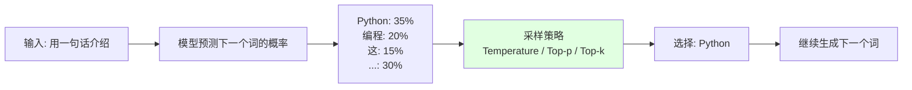

# 3.2 推理参数详解 <DifficultyBadge level="intermediate" /> <CostBadge cost="$0.01" />

> 前置知识：1.1 你的第一次 AI 对话，3.1 Token 与分词

### 为什么需要它？（Problem）

你有没有试过用同样的 prompt 问 AI 三遍，结果每次回答都不一样？就像你问三遍"今天吃啥"，AI 分别回答"火锅""寿司""螺蛳粉"——这家伙是有多纠结啊！

::: warning 翻车现场
**程序员**："用一句话介绍 Python"（连续问 3 次）  
**AI 第 1 次**："Python 是一种高级、解释型、通用的编程语言，以简洁易读的语法著称。"  
**AI 第 2 次**："Python 是一门简洁、易学且功能强大的编程语言，广泛应用于 Web 开发、数据科学和自动化。"  
**AI 第 3 次**："Python 是一种广泛使用的高级编程语言，以其简洁的语法和强大的库支持而闻名。"  
**程序员**：？？？你到底是哪个人格在回答我？
:::

```python
from openai import OpenAI

client = OpenAI()

prompt = "用一句话介绍 Python"

for i in range(3):
    response = client.chat.completions.create(
        model="gpt-4.1-mini",
        messages=[{"role": "user", "content": prompt}],
    )
    print(f"第 {i+1} 次：{response.choices[0].message.content}")
```

**运行结果：**

```
第 1 次：Python 是一种高级、解释型、通用的编程语言，以简洁易读的语法著称。
第 2 次：Python 是一门简洁、易学且功能强大的编程语言，广泛应用于 Web 开发、数据科学和自动化。
第 3 次：Python 是一种广泛使用的高级编程语言，以其简洁的语法和强大的库支持而闻名。
```

**为什么每次回答不一样？如何控制这种"随机性"？**

在实际应用中，你会遇到这些需求：

| 场景 | 需求 | 示例 |
|-----|------|------|
| **结构化数据提取** | 确定性、稳定输出 | 从发票中提取金额、日期 |
| **创意写作** | 多样性、创新性 | 生成广告文案、故事续写 |
| **代码生成** | 准确性、可靠性 | 生成 SQL 查询、API 调用 |
| **头脑风暴** | 发散性思维 | 产品命名、营销创意 |

这就需要用**推理参数（Inference Parameters）**来精确控制 AI 的行为。把它想象成调音台上的旋钮——**Temperature 是"创意旋钮"，Top-p 是"筛选漏斗"**！

### 它是什么？（Concept）

推理参数控制 LLM 在生成文本时的"采样策略"，决定下一个 token 的选择方式。简单来说，就是**控制 AI 有多"疯"**。

**核心概念：LLM 生成文本的过程**



LLM 不是"背诵答案"，而是**逐个 token 地预测概率分布，然后采样选择**。就像抽奖一样，但你可以控制中奖概率！

::: tip 冷知识
AI 其实每次都在"赌博"！Temperature=0 就是"作弊模式"（每次选概率最高的），Temperature=1.5 就是"梭哈模式"（什么都敢选）。你说 AI 是不是很赌狗？
:::

**主要推理参数：**

| 参数 | 作用 | 取值范围 | 默认值 | 效果 |
|-----|------|---------|-------|------|
| **Temperature** | 控制随机性（创意旋钮） | 0 ~ 2 | 1 | 越低越确定，越高越随机 |
| **Top-p** | 核采样（筛选漏斗） | 0 ~ 1 | 1 | 只考虑累积概率 top-p 的 token |
| **Top-k** | 限制候选词数量 | 1 ~ 100+ | - | 只考虑概率最高的 k 个 token |
| **Frequency Penalty** | 惩罚重复词 | -2 ~ 2 | 0 | 减少词汇重复 |
| **Presence Penalty** | 惩罚已出现的词 | -2 ~ 2 | 0 | 鼓励引入新话题 |

---

### 1. Temperature（温度 = 创意旋钮）

**Temperature 控制概率分布的"平坦度"**，就像调节火锅的辣度：
- `temperature = 0`：微辣（几乎确定性输出，选概率最高的）
- `temperature = 1`：中辣（按原始概率分布采样，正常随机）
- `temperature > 1`：变态辣（更随机、更"疯狂"的输出，可能说胡话）

::: warning 翻车现场
**你**：Temperature=0，"介绍一下 Python"  
**AI**："Python 是一种高级编程语言。"（连问 100 次都是这句）

**你**：Temperature=2，"介绍一下 Python"  
**AI**："Python，诞生于 1991 年的蟒蛇般优雅的语言，如同咖啡因般让程序员上瘾，是宇宙中最性感的代码艺术！"  
**你**：？？？你吃错药了吗？
:::

**数学原理：**

假设模型预测下一个 token 的概率分布为 $P(w_i)$，应用 temperature 后：

$$P_{\text{new}}(w_i) = \frac{\exp(\log P(w_i) / T)}{\sum_j \exp(\log P(w_j) / T)}$$

**直观理解：用表格对比不同 temperature**

假设模型预测下一个词的概率：

| 词 | 原始概率 | T=0.1 | T=0.7 | T=1.0 | T=1.5 |
|----|---------|-------|-------|-------|-------|
| Python | 40% | ~100% | 55% | 40% | 30% |
| 编程 | 30% | ~0% | 28% | 30% | 28% |
| 语言 | 20% | ~0% | 13% | 20% | 24% |
| 其他 | 10% | ~0% | 4% | 10% | 18% |

**一句话总结：** Temperature 越低，AI 越"稳重"；越高，AI 越"疯癫"！

**代码示例：对比不同 temperature**

```python
from openai import OpenAI

client = OpenAI()

prompt = "用一句话介绍 Python"

temperatures = [0, 0.3, 0.7, 1.0, 1.5]

for temp in temperatures:
    response = client.chat.completions.create(
        model="gpt-4.1-mini",
        messages=[{"role": "user", "content": prompt}],
        temperature=temp,
    )
    print(f"\nTemperature = {temp}")
    print(response.choices[0].message.content)
```

**典型输出：**

```
Temperature = 0
Python 是一种高级、解释型、通用的编程语言，以简洁易读的语法著称。

Temperature = 0.3
Python 是一种高级编程语言，以简洁的语法和强大的库支持而闻名。

Temperature = 0.7
Python 是一门简洁、易学且功能强大的编程语言，广泛用于 Web 开发和数据科学。

Temperature = 1.0
Python 是一种广受欢迎的高级编程语言，以其易读性和丰富的生态系统著称。

Temperature = 1.5
Python，诞生于 1991 年的优雅语言，融合了简洁语法与无限可能，是开发者的瑞士军刀！
```

**使用建议：**

| 场景 | 推荐 Temperature | 原因 |
|-----|----------------|------|
| 数据提取、分类 | 0 ~ 0.3 | 需要确定性、可复现的输出 |
| 代码生成 | 0 ~ 0.5 | 避免随机错误 |
| 客服对话 | 0.5 ~ 0.7 | 兼顾自然性和准确性 |
| 创意写作 | 0.8 ~ 1.2 | 鼓励多样性和创新 |
| 头脑风暴 | 1.2 ~ 1.5 | 产生意想不到的想法 |

::: tip 冷知识
Temperature=0 并不是完全没有随机性！某些模型实现中，T=0 只是"接近 0"（比如 0.0001），所以理论上还是有极小概率会变化。但实际使用中，T=0 基本等于"确定性输出"。
:::

---

### 2. Top-p（核采样 = 筛选漏斗）

**Top-p 限制采样范围**：只考虑累积概率达到 p 的最小词集合。想象你在自助餐挑菜，Top-p 就是"只选前 90% 的热门菜，剩下的难吃菜不要"。

**工作原理：**

1. 将所有候选词按概率从高到低排序
2. 累加概率，直到总和达到 p
3. 只从这些词中采样（其他词直接丢弃）

**示例：**

假设预测概率：

| 词 | 概率 | 累积概率 |
|----|------|---------|
| Python | 40% | 40% |
| 编程 | 30% | 70% |
| 语言 | 20% | 90% |
| 其他 | 10% | 100% |

- `top_p = 0.5`：只考虑 "Python"（累积 40% < 50%，需要加上"编程"才到 70% > 50%）
- `top_p = 0.9`：考虑 "Python"、"编程"、"语言"（累积 90%）
- `top_p = 1.0`：考虑所有词

::: warning 翻车现场
**你**：Top-p=0.1，"续写：深夜，侦探推开了门，发现"  
**AI**："里面是一具尸体。"（每次都是尸体，毫无新意）

**你**：Top-p=1.0，"续写：深夜，侦探推开了门，发现"  
**AI**："里面居然是一只会说话的紫色大象，正在用筷子吃意大利面！"  
**你**：？？？这是推理小说还是儿童童话？
:::

**一句话总结：** Top-p 是"筛选漏斗"，只留下高概率词，过滤掉胡说八道！

**代码示例：**

```python
from openai import OpenAI

client = OpenAI()

prompt = "续写故事：深夜，侦探推开了那扇神秘的门，发现"

top_ps = [0.1, 0.5, 0.9, 1.0]

for top_p in top_ps:
    response = client.chat.completions.create(
        model="gpt-4.1-mini",
        messages=[{"role": "user", "content": prompt}],
        temperature=1.0,
        top_p=top_p,
    )
    print(f"\nTop-p = {top_p}")
    print(response.choices[0].message.content)
```

**使用建议：**

| 场景 | 推荐 Top-p | 原因 |
|-----|-----------|------|
| 事实性回答 | 0.1 ~ 0.3 | 只选高概率词，减少"胡说" |
| 通用对话 | 0.7 ~ 0.9 | 平衡自然性和准确性 |
| 创意生成 | 0.95 ~ 1.0 | 允许低概率词，增加多样性 |

::: tip Temperature vs Top-p
- **Temperature**：改变整个概率分布的形状（像调火锅辣度）
- **Top-p**：截断低概率词，不改变分布形状（像过滤难吃的菜）
- **通常一起用**：`temperature=0.7, top_p=0.9` 是常见组合（"中辣 + 只选前 90% 热门菜"）
:::

---

### 3. Top-k

**Top-k 限制候选词数量**：只考虑概率最高的 k 个词。就像你去奶茶店，Top-k=3 就是"只看前 3 名热门饮品，其他不看"。

**示例：**

假设预测概率：

| 词 | 概率 |
|----|------|
| Python | 40% |
| 编程 | 30% |
| 语言 | 20% |
| 代码 | 5% |
| 工具 | 5% |

- `top_k = 1`：只考虑 "Python"（确定性，每次都选最高概率）
- `top_k = 3`：只考虑 "Python"、"编程"、"语言"
- `top_k = 5`：考虑所有 5 个词

**一句话总结：** Top-k 是"只看排行榜前 K 名"，懒人选择法！

::: warning OpenAI API 不支持 Top-k
OpenAI 的 API 没有提供 `top_k` 参数，但 Google Gemini、Hugging Face 等支持。想用 Top-k？换个模型吧！
:::

---

### 4. Frequency Penalty & Presence Penalty（惩罚重复词）

这两个参数用于减少重复，就像老师批评学生"别老是说'然后然后然后'"。

**Frequency Penalty（频率惩罚）：**
- 根据词在已生成文本中的**出现次数**进行惩罚
- 取值范围：`-2.0 ~ 2.0`
- 正值：减少重复；负值：鼓励重复

**Presence Penalty（存在惩罚）：**
- 根据词是否**曾经出现过**进行惩罚（不管出现几次）
- 取值范围：`-2.0 ~ 2.0`
- 正值：鼓励引入新话题；负值：鼓励围绕同一话题

::: warning 翻车现场
**你**：Frequency Penalty=0，"列出 10 种编程语言"  
**AI**："Python、Java、C++、Python、JavaScript、Python、Go、Python、Ruby、Python"  
**你**：？？？你是 Python 推销员吗？

**你**：Frequency Penalty=1.5，"列出 10 种编程语言"  
**AI**："Python、Java、C++、JavaScript、Go、Ruby、Rust、Swift、Kotlin、TypeScript"  
**你**：这才对嘛！
:::

**一句话总结：** Frequency Penalty = 反复唠叨罚款，Presence Penalty = 换个话题奖励！

**代码示例：**

```python
from openai import OpenAI

client = OpenAI()

prompt = "列出 10 种编程语言"

# 无惩罚
response = client.chat.completions.create(
    model="gpt-4.1-mini",
    messages=[{"role": "user", "content": prompt}],
)
print("【无惩罚】")
print(response.choices[0].message.content)

# 高频率惩罚（减少重复）
response = client.chat.completions.create(
    model="gpt-4.1-mini",
    messages=[{"role": "user", "content": prompt}],
    frequency_penalty=1.5,
)
print("\n【Frequency Penalty = 1.5】")
print(response.choices[0].message.content)

# 高存在惩罚（鼓励新话题）
response = client.chat.completions.create(
    model="gpt-4.1-mini",
    messages=[{"role": "user", "content": prompt}],
    presence_penalty=1.5,
)
print("\n【Presence Penalty = 1.5】")
print(response.choices[0].message.content)
```

---

### 常用参数组合

| 场景 | Temperature | Top-p | Frequency Penalty | Presence Penalty |
|-----|------------|-------|------------------|------------------|
| **数据提取** | 0 | 0.1 | 0 | 0 |
| **客服对话** | 0.7 | 0.9 | 0.3 | 0.3 |
| **代码生成** | 0.2 | 0.5 | 0 | 0 |
| **创意写作** | 1.0 | 0.95 | 0.5 | 0.8 |
| **头脑风暴** | 1.2 | 1.0 | 1.0 | 1.5 |

::: tip 冷知识：调参就像调鸡尾酒
- **数据提取** = 纯净水（0 度创意，0 随机）
- **客服对话** = 可乐（微甜，适中）
- **创意写作** = 果汁（有点甜，有点酸）
- **头脑风暴** = Long Island Ice Tea（什么都加，管它好不好喝）
:::

### 动手试试（Practice）

创建一个交互式工具，实时调整参数观察效果。

```python
from openai import OpenAI

client = OpenAI()

def test_parameters(prompt, temperature=0.7, top_p=1.0, freq_penalty=0, pres_penalty=0):
    """
    测试不同参数组合的效果
    """
    response = client.chat.completions.create(
        model="gpt-4.1-mini",
        messages=[{"role": "user", "content": prompt}],
        temperature=temperature,
        top_p=top_p,
        frequency_penalty=freq_penalty,
        presence_penalty=pres_penalty,
    )
    return response.choices[0].message.content

# 测试：对比极端参数
prompt = "用一句话介绍人工智能"

print("=== 确定性（T=0） ===")
for i in range(3):
    print(f"{i+1}. {test_parameters(prompt, temperature=0)}")

print("\n=== 随机性（T=1.5） ===")
for i in range(3):
    print(f"{i+1}. {test_parameters(prompt, temperature=1.5)}")
```

<ColabBadge path="demos/03-llm-fundamentals/parameters.ipynb" />

### 小结（Reflection）

- **解决了什么**：学会控制 AI 回答的确定性 vs 创意性，根据场景选择合适的参数（调音台技能 +1）
- **没解决什么**：即使调参，普通模型在复杂推理任务（数学、逻辑）上还是容易出错——下一节介绍推理模型（AI 的"学霸模式"）
- **关键要点**：
  1. **Temperature = 0**：确定性输出，适合数据提取、代码生成（AI 的"稳重模式"）
  2. **Temperature = 0.7~1.0**：平衡创意和准确性，适合对话、写作（AI 的"正常模式"）
  3. **Temperature > 1.0**：高创意、高随机性，适合头脑风暴（AI 的"疯癫模式"）
  4. **Top-p**：通常设 0.9，与 temperature 配合使用（筛选漏斗）
  5. **Frequency/Presence Penalty**：减少重复，鼓励多样性（反复唠叨罚款）

**一句话总结：** 推理参数就是 AI 的"调音台"，Temperature 是创意旋钮，Top-p 是筛选漏斗，调好了就是大师，调不好就是鬼畜！

---

*最后更新：2026-02-20*
