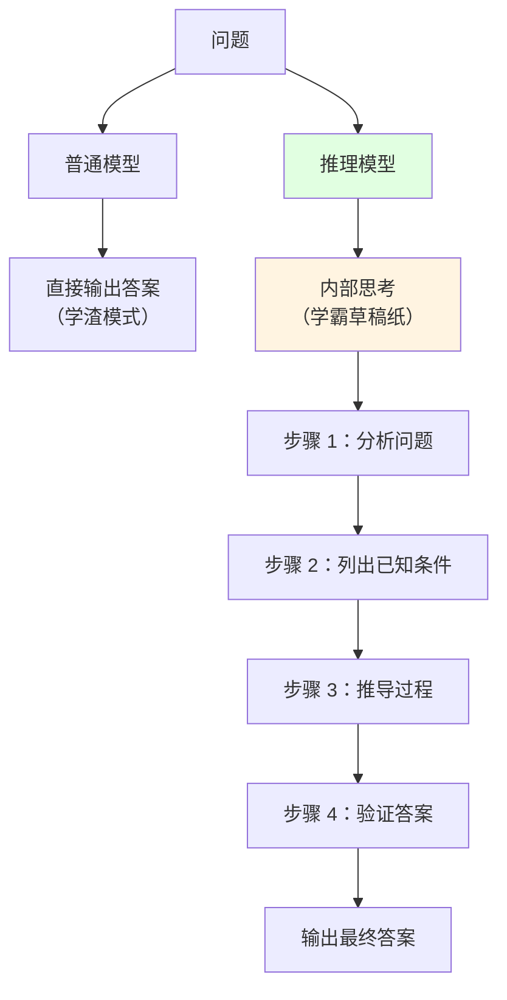
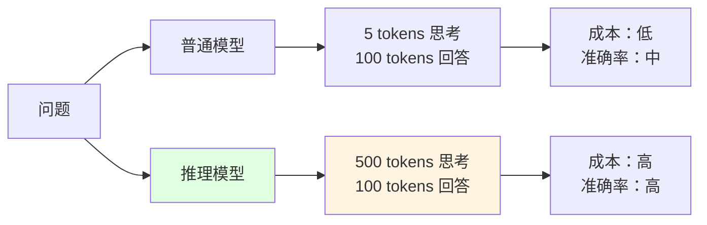

# 3.3 推理模型与思考链 <DifficultyBadge level="intermediate" /> <CostBadge cost="$0.05" />

> 前置知识：3.1 Token 与分词，3.2 推理参数详解

### 为什么需要它？（Problem）

你以为调好了 Temperature 和 Top-p，AI 就能搞定一切了？Too young, too simple! 当你让 GPT-4o-mini 做数学题时，它经常翻车翻得你怀疑人生。

::: warning 翻车现场
**你**："小明有 15 个苹果，给了小红 1/3，又买了 8 个，再给小刚剩余的 1/4，还剩多少？"  
**GPT-4o-mini**："15 × 1/3 = 5，剩 10 个。买 8 个后有 18 个。18 × 1/4 = 4.5，最后剩... 呃... 13.5 个？"  
**你**："对是对，但你为什么要停顿一下？你是不是偷偷用计算器了？"  
**GPT-4o-mini**：*（内心：我算得好辛苦啊，别为难我了）*
:::

**测试：让 GPT-4o-mini 解决一道数学题**

```python
from openai import OpenAI

client = OpenAI()

question = """
小明有 15 个苹果，他把 1/3 给了小红，然后又买了 8 个。
之后他把剩余苹果的 1/4 给了小刚。
请问小明现在还有多少个苹果？
"""

response = client.chat.completions.create(
    model="gpt-4.1-mini",
    messages=[{"role": "user", "content": question}],
)

print("【GPT-4o-mini 的回答】")
print(response.choices[0].message.content)
```

**典型错误回答：**

```
小明有 15 个苹果，给了小红 5 个（15 × 1/3），剩下 10 个。
买了 8 个后有 18 个。
给了小刚 4.5 个（18 × 1/4），最后剩下 13.5 个。
```

**正确答案应该是：**
1. 15 × 1/3 = 5，给小红后剩 10 个
2. 买 8 个后：10 + 8 = 18 个
3. 18 × 1/4 = 4.5，给小刚后剩：18 - 4.5 = **13.5 个**（这个答案其实是对的）

但如果问题更复杂，普通模型就开始胡言乱语了。

**问题的根本原因：**

普通 LLM 是"快思考"（System 1，像你看到 2+2 秒答 4），倾向于**一步到位直接给答案**，不擅长：
- 多步推理（需要逐步分解）
- 复杂数学计算（1+1=2 没问题，123×456 就懵了）
- 逻辑链条长的问题（超过 3 步就容易绕晕）
- 需要"先想再答"的场景（比如奥数题、推理谜题）

**推理模型（Reasoning Models）解决了这个问题**，通过"慢思考"（System 2，像你做高考数学压轴题）的方式，先内部推理，再给出答案。就像考试时，学霸会先在草稿纸上打草稿，而学渣直接在答题卡上瞎写。

### 它是什么？（Concept）

**推理模型（Reasoning Models）** 是专门优化了复杂推理能力的 LLM，核心特点：
1. **先想后答**：内部生成"思考过程"，再输出最终答案（就像学霸先打草稿）
2. **推理时计算（Inference-Time Compute）**：花更多时间推理，提升准确率（慢慢想，不着急）
3. **思考链（Chain-of-Thought, CoT）**：逐步分解问题，像人类一样"打草稿"



::: tip 冷知识
普通 AI 就像你考试时"凭直觉"答题，推理模型就像你认真打草稿、验算、再抄到答题卡上。虽然慢，但准确率高多了！
:::

**主流推理模型对比：**

| 模型 | 提供商 | 核心特点 | 价格 | 开源 |
|-----|-------|---------|------|------|
| **o1** | OpenAI | 第一代推理模型，思考预算固定 | 💰💰💰 高 | ❌ |
| **o3** | OpenAI | 第二代，支持可调节思考预算 | 💰💰💰 超高 | ❌ |
| **DeepSeek R1** | DeepSeek | 开源推理模型，性价比极高 | 💰 低 | ✅ |
| **Claude Extended Thinking** | Anthropic | 扩展思考模式（Opus 4.6） | 💰💰💰 高 | ❌ |
| **Gemini 2.5 Flash Thinking** | Google | 实验性推理模式 | 💰 低 | ❌ |

**推理模型 vs 普通模型：**

| 维度 | 普通模型 | 推理模型 |
|-----|---------|---------|
| **推理方式** | 快思考（一步到位） | 慢思考（先想后答） |
| **擅长任务** | 对话、写作、翻译 | 数学、逻辑、编程、策略 |
| **速度** | 快（1-3 秒） | 慢（5-30 秒） |
| **成本** | 低 | 高（3-10 倍） |
| **思考过程** | 不可见 | 部分可见（取决于模型） |

::: warning 翻车现场
**你**：用 o1 解决简单问题"什么是 Python？"  
**o1**：*（内部思考 10 秒）* "让我先分析一下这个问题的核心..."  
**你**：？？？你是不是脑子转不过来了？这么简单的问题用得着想 10 秒吗？  
**o1**：*（委屈）* 我只是想给你最完美的答案嘛...  
**账单**：$0.05  
**你**：我去！回答个"什么是 Python"花了 5 分钱？？？
:::

**一句话总结：** 推理模型 = AI 的"学霸模式"，慢但准，贵但值！

**推理时计算（Inference-Time Compute）：**

这是推理模型的核心概念：**在推理阶段花更多计算资源**，类似于：
- 考试时，简单题快速作答（普通模型）
- 难题先打草稿、验算、再写答案（推理模型）



**思考预算（Thinking Budget）：**

o3 模型支持调节"思考时间"（就像考试时你决定在这道题上花多少时间）：
- **Low**：快速推理，适合简单问题（5 分钟搞定）
- **Medium**：平衡推理，通用场景（15 分钟认真做）
- **High**：深度推理，复杂问题（1 小时死磕到底，成本极高）

::: tip 冷知识
o3 High 模式下，AI 可能会"思考" 30 秒以上，消耗几千个 tokens 的"草稿纸"！就像高考数学压轴题，学霸会写满整张草稿纸。
:::

---

### 何时使用推理模型？

| 场景 | 推荐模型 | 原因 |
|-----|---------|------|
| **数学题** | DeepSeek R1 / o1 | 需要多步计算和验证 |
| **编程竞赛** | o3 / DeepSeek R1 | 需要算法设计和优化 |
| **逻辑推理** | o1 / Claude Extended Thinking | 需要严密的推理链 |
| **策略规划** | o3 / DeepSeek R1 | 需要权衡多个因素 |
| **科学研究** | o3 / Claude Opus 4.6 | 需要深度分析 |
| **日常对话** | ❌ 不推荐 | 浪费成本和时间 |
| **简单文案** | ❌ 不推荐 | 普通模型足够 |

::: tip 选择建议
- **成本敏感 + 复杂推理**：DeepSeek R1（开源、便宜）
- **追求极致准确率**：o3 High（最贵但最强）
- **平衡场景**：o1 / DeepSeek R1
:::

::: warning 翻车现场
**你**：用 o3 High 写个"Hello World"  
**o3**：*（内部思考 20 秒）* "首先，我需要理解 'Hello World' 的历史背景..."  
**账单**：$1.50  
**你**：？？？写个 Hello World 花了 1.5 美元？我直接自己写不香吗？
:::

### 动手试试（Practice）

我们用 DeepSeek R1 和 GPT-4o-mini 对比，看推理模型的"思考过程"。

**第 1 步：准备 API Keys**

```python
import os
from getpass import getpass

if not os.environ.get("OPENAI_API_KEY"):
    os.environ["OPENAI_API_KEY"] = getpass("OpenAI API Key: ")

if not os.environ.get("DEEPSEEK_API_KEY"):
    os.environ["DEEPSEEK_API_KEY"] = getpass("DeepSeek API Key: ")
```

**第 2 步：测试普通模型**

```python
from openai import OpenAI

openai_client = OpenAI()

question = """
有 3 个开关和 3 盏灯在不同房间。你只能进入灯房间一次。
如何确定每个开关控制哪盏灯？
"""

response = openai_client.chat.completions.create(
    model="gpt-4.1-mini",
    messages=[{"role": "user", "content": question}],
)

print("【GPT-4o-mini（普通模型）】")
print(response.choices[0].message.content)
print(f"\nTokens: {response.usage.total_tokens}")
```

**第 3 步：测试推理模型**

```python
# DeepSeek R1 是推理模型
deepseek_client = OpenAI(
    api_key=os.environ["DEEPSEEK_API_KEY"],
    base_url="https://api.deepseek.com",
)

response = deepseek_client.chat.completions.create(
    model="deepseek-reasoner",  # DeepSeek R1 推理模型
    messages=[{"role": "user", "content": question}],
)

print("\n【DeepSeek R1（推理模型）】")
print(response.choices[0].message.content)
print(f"\nTokens: {response.usage.total_tokens}")

# DeepSeek R1 会返回思考过程（如果有）
if hasattr(response.choices[0].message, "reasoning_content"):
    print("\n【思考过程】")
    print(response.choices[0].message.reasoning_content)
```

**典型输出对比：**

**GPT-4o-mini（普通模型）：**
```
打开开关 1 和开关 2，等待 10 分钟。
关闭开关 2，进入房间：
- 亮着的灯 → 开关 1
- 热的但不亮的灯 → 开关 2
- 冷的且不亮的灯 → 开关 3

Tokens: 87
```

**DeepSeek R1（推理模型）：**
```
【思考过程】（内部推理，部分可见）
首先，我需要理解问题的约束：只能进入房间一次，但可以控制开关多次。
关键是利用"时间"和"温度"这两个额外维度...

【最终答案】
1. 打开开关 1，等待 5-10 分钟（让灯泡发热）
2. 关闭开关 1，立即打开开关 2
3. 进入房间检查：
   - 正在亮的灯 → 开关 2
   - 热但不亮的灯 → 开关 1
   - 冷且不亮的灯 → 开关 3

Tokens: 523（包含思考过程）
```

::: tip 观察要点
- **普通模型**：直接给答案，快但可能不完整（像学渣直接蒙答案）
- **推理模型**：先分析问题、列举约束、推导逻辑，再给答案（像学霸先打草稿）
- **Token 数量**：推理模型消耗更多 tokens（3-5 倍），但准确率更高（草稿纸是要花钱的）
:::

**第 4 步：测试数学推理**

```python
math_question = """
一个水池有一个进水管和一个出水管。
单独开进水管 6 小时可以注满，单独开出水管 10 小时可以放空。
如果同时打开两个管子，多久可以注满？
"""

# 普通模型
response_normal = openai_client.chat.completions.create(
    model="gpt-4.1-mini",
    messages=[{"role": "user", "content": math_question}],
)

# 推理模型
response_reasoning = deepseek_client.chat.completions.create(
    model="deepseek-reasoner",
    messages=[{"role": "user", "content": math_question}],
)

print("【GPT-4o-mini】")
print(response_normal.choices[0].message.content)

print("\n【DeepSeek R1】")
print(response_reasoning.choices[0].message.content)
```

**正确答案：**
- 进水速度：1/6 池/小时
- 出水速度：1/10 池/小时
- 净速度：1/6 - 1/10 = 5/30 - 3/30 = 2/30 = 1/15 池/小时
- 注满时间：1 ÷ (1/15) = **15 小时**

推理模型通常会给出正确的逐步推导过程（像学霸的草稿纸，每一步都清清楚楚）。

::: warning 翻车现场（普通模型的数学灾难）
**你**："一个水池进水管 6 小时注满，出水管 10 小时放空，同时开多久注满？"  
**GPT-4o-mini**："6 + 10 = 16 小时"  
**你**：？？？你是怎么把加法和物理混一起的？  
**GPT-4o-mini**：*（内心：数学好难啊，我就是个语言模型，别为难我）*
:::

---

### 思考链（Chain-of-Thought, CoT）提示技巧

即使是普通模型，也可以通过 Prompt 技巧激发"思考链"（就像你告诉学渣"认真打草稿"）：

**技巧 1：要求"逐步思考"**

```python
question = "小明有 15 个苹果，给了小红 1/3，又买了 8 个，再给小刚 1/4，还剩多少？"

# 普通 Prompt
response_normal = openai_client.chat.completions.create(
    model="gpt-4.1-mini",
    messages=[{"role": "user", "content": question}],
)

# CoT Prompt
response_cot = openai_client.chat.completions.create(
    model="gpt-4.1-mini",
    messages=[
        {
            "role": "user",
            "content": f"{question}\n\n请逐步思考，列出每一步的计算过程。"
        }
    ],
)

print("【普通 Prompt】")
print(response_normal.choices[0].message.content)

print("\n【CoT Prompt】")
print(response_cot.choices[0].message.content)
```

**技巧 2：提供示例（Few-Shot CoT）**

```python
few_shot_prompt = """
示例：
问题：小红有 10 个橘子，吃了 2 个，又买了 5 个，还剩多少？
思考过程：
1. 初始：10 个
2. 吃了 2 个：10 - 2 = 8 个
3. 买了 5 个：8 + 5 = 13 个
答案：13 个

现在解决：
问题：小明有 15 个苹果，给了小红 1/3，又买了 8 个，再给小刚剩余的 1/4，还剩多少？
"""

response = openai_client.chat.completions.create(
    model="gpt-4.1-mini",
    messages=[{"role": "user", "content": few_shot_prompt}],
)

print(response.choices[0].message.content)
```

::: tip 冷知识
Few-Shot CoT 就像给学渣看"标准答案"，然后让他模仿。虽然不如推理模型强，但效果也不错！成本还便宜很多。
:::

**一句话总结：** 普通模型 + CoT Prompt ≈ 推理模型的低配版，省钱又实用！

---

### 成本对比

| 场景 | 普通模型 | 推理模型 | 成本差距 |
|-----|---------|---------|---------|
| 简单对话 | $0.0001 | $0.0005 | 5x |
| 复杂推理 | $0.0003 | $0.002 | 7x |
| 数学证明 | $0.0005 | $0.01 | 20x |

::: warning 成本提示
推理模型的 token 消耗包括"思考过程"（草稿纸也要花钱），通常是最终答案的 3-10 倍。
仅在需要高准确率的复杂任务中使用！日常对话用推理模型就是烧钱！
:::

::: warning 翻车现场
**你**：用 o3 High 做 100 道数学题  
**账单**：$150  
**你**：？？？我是不是应该直接请个家教？
:::

<ColabBadge path="demos/03-llm-fundamentals/reasoning-models.ipynb" />

### 小结（Reflection）

- **解决了什么**：学会在复杂推理任务中使用推理模型，提升准确率（从学渣升级到学霸）
- **没解决什么**：即使用了推理模型，如何通过更好的 Prompt 来引导 AI？——下一章（第 4 章：Prompt 工程）详解
- **关键要点**：
  1. **推理模型 = 慢思考 + 思考链**：先推理再回答（学霸草稿纸模式）
  2. **适合场景**：数学、逻辑、编程、策略规划（需要"打草稿"的任务）
  3. **不适合场景**：日常对话、简单文案（浪费成本，大材小用）
  4. **推荐模型**：DeepSeek R1（性价比）、o3（最强但最贵）
  5. **CoT Prompt**：普通模型也可以用"逐步思考"提示提升推理能力（低配版学霸）
  6. **成本**：推理模型贵 3-20 倍，谨慎使用（草稿纸也要花钱）

**一句话总结：** 推理模型 = AI 的学霸模式，慢但准，贵但值。日常聊天别用，数学题必用！

---

**第 3 章完结！**

你已经掌握：
1. ✅ Token 与分词原理，理解为什么中文贵、如何估算成本（AI 的口粮学）
2. ✅ 推理参数（Temperature、Top-p 等），控制 AI 的创意度和确定性（AI 的调音台）
3. ✅ 推理模型的使用场景，何时用"慢思考"模式（AI 的学霸模式）

下一章，我们将学习 **Prompt 工程**，掌握如何编写高质量的 Prompt，让 AI 更准确地理解你的意图（成为 AI 驯兽师）。

---

*最后更新：2026-02-20*
