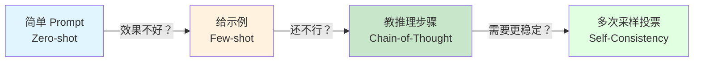
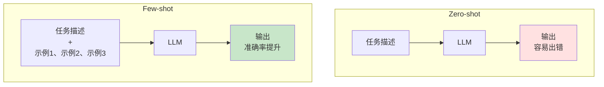
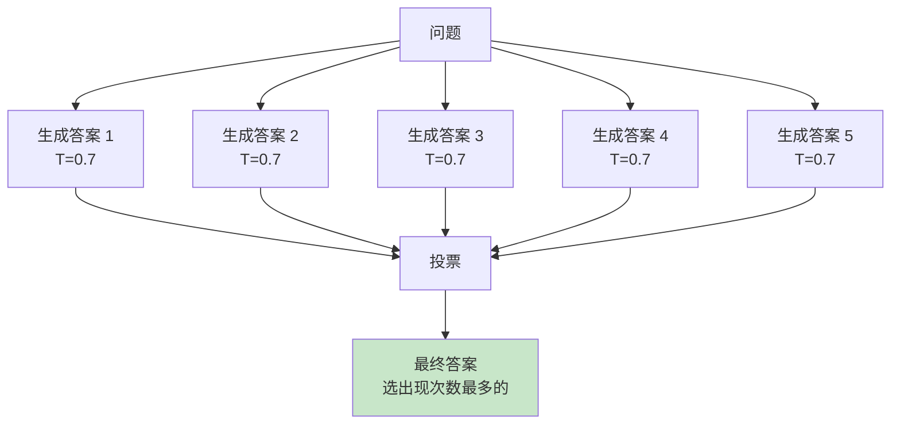
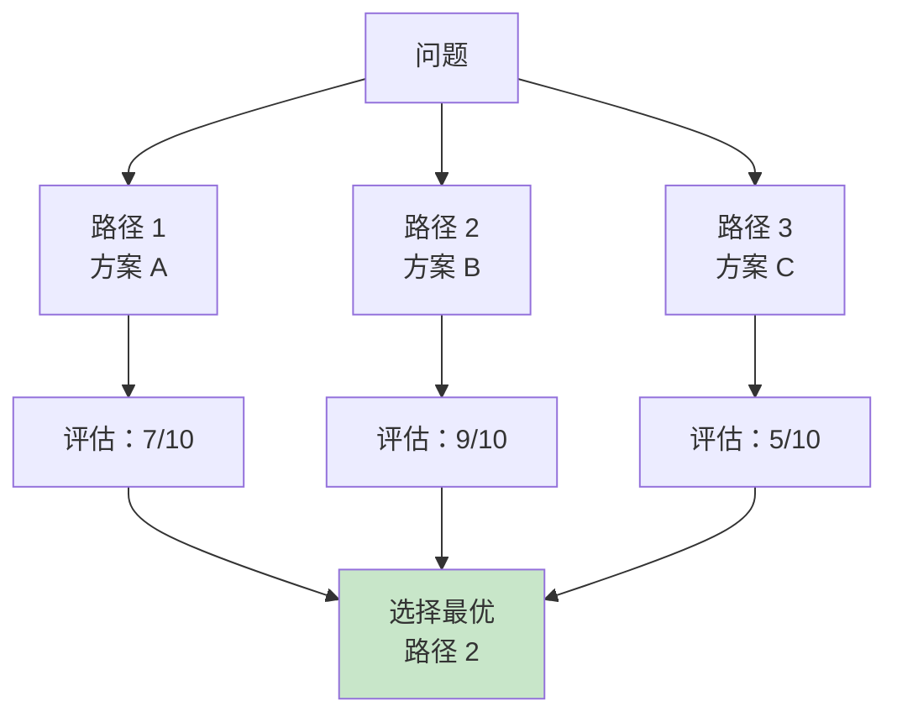

# 4.2 进阶 Prompt 技巧 <DifficultyBadge level="intermediate" /> <CostBadge cost="$0.02" />

> 前置知识：4.1 Prompt 基础

会了基础 Prompt，你以为自己已经是"驯 AI 高手"了？别急，AI 还有很多"小脾气"——它会算错数学题、分不清边界情况、推理时"跳步"... 就像是个聪明但粗心的助手，需要你"手把手教"它怎么思考！

### 为什么需要它？（Problem）

当你开始用 AI 处理更复杂的任务时，会遇到这些问题：

**问题 1：AI 不会举一反三**

```python
# 任务：提取用户评论的情感
prompt = "判断这条评论是正面还是负面：'这个产品太棒了！'"
# AI 回复：正面

# 换一条
prompt = "判断这条评论是正面还是负面：'还行吧，凑合用'"
# AI 回复：正面（❌ 错误！应该是中性）
```

**问题 2：AI 在数学推理上容易出错**

```python
prompt = "小明有 15 个苹果，给了小红 3 个，又买了 8 个，现在有几个？"
# AI 回复：20 个（❌ 正确答案是 20，但很多时候会算错）

prompt = "一个数乘以 3 再加 7 等于 28，这个数是多少？"
# AI 回复：9（❌ 正确答案是 7，经常算错）
```

**问题 3：复杂任务容易"跑偏"**

```python
prompt = "帮我设计一个电商系统的数据库"
# AI 回复：直接输出建表 SQL（❌ 没有先分析需求）
```

**根本原因：简单的 Prompt 没有提供足够的"思考框架"。**

::: warning 翻车现场
- **情感分类翻车**："还行吧" → AI 判断为"正面"（明明是中性啊喂！）
- **数学推理翻车**："3x + 7 = 28，x = ?" → AI 答"9"（明明是 7！）
- **复杂任务翻车**："设计数据库" → AI 直接甩 SQL（需求都没分析就开始写？）

**AI 的通病：没有"思考的草稿纸"，容易跳步、猜测、犯低级错误。**
:::

::: tip 一句话总结
**进阶技巧 = 给 AI 提供"思考模板"，教它如何一步步推理！**
:::

进阶技巧通过**给出示例**、**引导思考过程**来解决这些问题。

### 它是什么？（Concept）

进阶 Prompt 技巧是一组"教 AI 如何思考"的方法。



**四种核心技巧：**

| 技巧 | 场景 | 原理 | 成本 |
|-----|------|------|------|
| **Few-shot** | 分类、格式化 | 给 2-5 个示例 | 中 |
| **Chain-of-Thought (CoT)** | 数学、逻辑推理 | 要求写出推理步骤 | 高 |
| **Self-Consistency** | 需要高准确率 | 生成多个答案投票 | 很高 |
| **Tree-of-Thought (ToT)** | 复杂规划 | 探索多条推理路径 | 极高 |

---

## 技巧 1：Few-shot Prompting（给示例学习）

**原理：通过 2-5 个示例"教"AI 任务的模式。**

把 Few-shot 理解为**"手把手示范"**：就像教小孩写作业，你先做几道例题，TA 看懂规律后就能举一反三。AI 也一样，给它看几个正确答案，它就知道该怎么做了！

**Zero-shot vs Few-shot 对比：**



**实战案例：情感分类**

**❌ Zero-shot（效果不稳定）：**

```python
prompt = "判断评论情感（正面/负面/中性）：'还行吧，凑合用'"
```

**✅ Few-shot（准确率提升）：**

```python
prompt = """
判断评论的情感倾向（正面/负面/中性）。

示例：
评论：这个产品太棒了！用了一周非常满意。
情感：正面

评论：质量太差了，用了两天就坏了，非常失望。
情感：负面

评论：还行吧，凑合用，没什么特别的。
情感：中性

现在判断这条：
评论：价格有点贵，但质量确实不错。
情感：
"""
```

**Few-shot 的最佳实践：**

::: tip 给示例的艺术
| 原则 | 说明 |
|-----|------|
| **示例数量** | 通常 3-5 个足够，太多会浪费 token（AI：范例太多我也记不住啊） |
| **示例质量** | 覆盖不同类型的输入（边界情况）——把"刁钻"的例子也加进去 |
| **格式一致** | 输入输出格式严格对齐（AI：你自己都不统一，让我怎么学？） |
| **顺序影响** | 最后一个示例影响最大（放最典型的）——AI 有"近因效应" |

**一句话总结：Few-shot = 给 AI 上岗培训，示例越典型，效果越好！**
:::

---

## 技巧 2：Chain-of-Thought (CoT)（思考链）

**原理：让 AI"把思考过程写出来"，逐步推理。**

想象 AI 做数学题：直接问答案，它容易跳步算错；但如果要求它"列式 → 计算 → 验证"，准确率暴增！就像学生考试，**要求写出解题步骤能减少粗心错误**。

**为什么有效？**
- LLM 一次生成一个 token，复杂计算需要"草稿纸"（不能直接心算！）
- 显式的推理步骤减少跳步错误（AI：我也要打草稿啊）

**对比效果：**

**❌ 直接提问（容易算错）：**

```python
prompt = "一个数乘以 3 再加 7 等于 28，这个数是多少？"
# AI 回复：9（❌ 错误）
```

**✅ Chain-of-Thought（准确率大幅提升）：**

```python
prompt = """
一个数乘以 3 再加 7 等于 28，这个数是多少？

请一步步思考：
1. 列出方程
2. 逐步求解
3. 验证答案
"""
# AI 回复：
# 1. 设这个数为 x，方程：3x + 7 = 28
# 2. 移项：3x = 28 - 7 = 21
# 3. 求解：x = 21 / 3 = 7
# 4. 验证：3×7 + 7 = 21 + 7 = 28 ✓
# 答案：7
```

**CoT 的两种形式：**

| 形式 | 说明 | 示例 |
|-----|------|------|
| **Zero-shot CoT** | 只加一句"让我们一步步思考" | "Let's think step by step." |
| **Few-shot CoT** | 给出示例，每个示例包含推理过程 | 见下方代码 |

**Few-shot CoT 示例：**

```python
prompt = """
请解决数学问题，并写出推理步骤。

问题：小明有 15 个苹果，给了小红 3 个，又买了 8 个，现在有几个？
推理：
- 初始：15 个
- 给出：15 - 3 = 12 个
- 买入：12 + 8 = 20 个
答案：20 个

问题：一件衣服原价 200 元，打 8 折后又减 20 元，最终多少钱？
推理：
- 打折：200 × 0.8 = 160 元
- 再减：160 - 20 = 140 元
答案：140 元

现在解决这个问题：
问题：一个数乘以 3 再加 7 等于 28,这个数是多少？
推理：
"""
```

**CoT 适用场景：**

::: tip 什么时候用 CoT？
| 场景 | 效果 | 备注 |
|-----|------|------|
| 数学计算 | ⭐⭐⭐⭐⭐ | 必用！准确率提升 50%+ |
| 逻辑推理 | ⭐⭐⭐⭐⭐ | 复杂推理的救星 |
| 多步骤任务 | ⭐⭐⭐⭐ | 避免跳步 |
| 代码调试 | ⭐⭐⭐⭐ | 让 AI 列出排查步骤 |
| 简单分类 | ⭐⭐ | 浪费 token，没必要 |

**一句话总结：越复杂的任务，越需要 CoT——给 AI 一张草稿纸！**
:::

---

## 技巧 3：Self-Consistency（自洽性）

**原理：生成多个答案，投票选最常见的。**

想象你不确定一道题的答案，怎么办？**多做几遍，看看哪个答案出现次数最多！** Self-Consistency 就是这个思路：让 AI 回答 5 次，如果 4 次都说"答案是 7"，那八成是对的。

::: tip 为什么要投票？
AI 有时会"犹豫"或"猜测"，单次回答可能不稳定。通过多次生成 + 投票，能**过滤掉偶然错误**，大幅提升准确率！

**类比：** 就像多找几个医生会诊，诊断结果更可靠。
:::



**代码实现：**

```python
from openai import OpenAI
from collections import Counter

client = OpenAI()

def self_consistency(question: str, n: int = 5) -> str:
    """
    Self-Consistency: 生成多个答案并投票
    """
    prompt = f"{question}\n\n让我们一步步思考。"
    
    answers = []
    for i in range(n):
        response = client.chat.completions.create(
            model="gpt-4.1-mini",
            messages=[{"role": "user", "content": prompt}],
            temperature=0.7,  # 提高多样性
        )
        answer = response.choices[0].message.content
        
        # 提取最终答案（通常在最后一行）
        final_answer = answer.strip().split('\n')[-1]
        answers.append(final_answer)
        
        print(f"答案 {i+1}: {final_answer}")
    
    # 投票
    counter = Counter(answers)
    most_common = counter.most_common(1)[0]
    
    print(f"\n投票结果：{dict(counter)}")
    print(f"最终答案：{most_common[0]} (出现 {most_common[1]}/{n} 次)")
    
    return most_common[0]

# 测试
question = "一个数乘以 3 再加 7 等于 28，这个数是多少？"
self_consistency(question, n=5)
```

**优缺点：**

::: warning 成本警告
| 优点 | 缺点 |
|-----|------|
| ✅ 准确率大幅提升（特别是数学题） | ❌ API 成本翻 5-10 倍（钱包：我不答应） |
| ✅ 适合高风险场景（医疗、金融） | ❌ 响应时间变慢（要等 5 次调用） |
| ✅ 可以发现模型"犹豫"的情况 | ❌ 不适合开放式问题（每次答案都不同） |

**一句话总结：Self-Consistency = 花钱买准确率，适合关键场景！**
:::

**适用场景：选择题、计算题、需要高准确率的任务。**

---

## 技巧 4：Tree-of-Thought (ToT)（思维树）

**原理：探索多条推理路径，评估每条路径的质量，选择最优解。**

想象你在选技术方案：直接选一个可能不是最优的，但如果**列出 3 个方案 → 逐个评估优劣 → 选最好的**，决策质量会高很多。ToT 就是给 AI 做"头脑风暴 + 方案评审"！

::: tip ToT 的威力
CoT = 单线程思考（一条路走到底）  
ToT = 多线程思考（探索多条路，选最优）

**适合场景：** 系统设计、技术选型、复杂规划——需要"深度思考"的任务。
:::



**简化实现（适合规划类任务）：**

```python
from openai import OpenAI

client = OpenAI()

def tree_of_thought(problem: str):
    """
    Tree-of-Thought: 生成多个方案并评估
    """
    # 第 1 步：生成多个方案
    prompt1 = f"""
{problem}

请提出 3 种不同的解决方案，每个方案用一段话描述核心思路。

方案 1：
方案 2：
方案 3：
"""
    
    response = client.chat.completions.create(
        model="gpt-4.1-mini",
        messages=[{"role": "user", "content": prompt1}],
        temperature=0.8,
    )
    solutions = response.choices[0].message.content
    print("=== 生成的方案 ===")
    print(solutions)
    
    # 第 2 步：评估每个方案
    prompt2 = f"""
{problem}

这是生成的 3 个方案：
{solutions}

请逐个评估方案的可行性，给出 1-10 分的评分和理由，最后推荐最优方案。

评估格式：
方案 1：[评分] 分 - [理由]
方案 2：[评分] 分 - [理由]
方案 3：[评分] 分 - [理由]

推荐：方案 X，因为...
"""
    
    response = client.chat.completions.create(
        model="gpt-4.1-mini",
        messages=[{"role": "user", "content": prompt2}],
        temperature=0.3,
    )
    evaluation = response.choices[0].message.content
    print("\n=== 方案评估 ===")
    print(evaluation)

# 测试
problem = "设计一个企业内部的知识库系统，需要支持文档搜索、版本管理、权限控制。"
tree_of_thought(problem)
```

**ToT 适用场景：**
- 系统设计
- 技术选型
- 复杂规划任务
- 需要对比多种方案的场景

::: warning 成本警告
ToT 需要多次 API 调用，成本较高。只在真正需要"深度思考"的场景使用。

**记住：** 不是所有任务都需要开"头脑风暴会议"，简单问题用简单方法！
:::

::: tip 一句话总结
**ToT = AI 开策划会，生成多方案 + 评审打分，适合复杂决策！**
:::

---

### 动手试试（Practice）

**实验：对比 Zero-shot vs Few-shot vs CoT**

```python
from openai import OpenAI

client = OpenAI()

# 测试任务：情感分类
test_case = "价格有点贵，但质量确实不错，总体还算满意。"

# Zero-shot
prompt_zero = f"判断评论情感（正面/负面/中性）：{test_case}"

response = client.chat.completions.create(
    model="gpt-4.1-mini",
    messages=[{"role": "user", "content": prompt_zero}],
)
print("=== Zero-shot ===")
print(response.choices[0].message.content)

# Few-shot
prompt_few = f"""
判断评论情感（正面/负面/中性）。

示例：
评论：这个产品太棒了！
情感：正面

评论：质量太差，非常失望。
情感：负面

评论：还行吧，凑合用。
情感：中性

现在判断：
评论：{test_case}
情感：
"""

response = client.chat.completions.create(
    model="gpt-4.1-mini",
    messages=[{"role": "user", "content": prompt_few}],
)
print("\n=== Few-shot ===")
print(response.choices[0].message.content)

# Chain-of-Thought
prompt_cot = f"""
判断评论情感（正面/负面/中性）。

示例：
评论：这个产品太棒了！
分析：用词"太棒了"表达强烈正面情绪，"非常满意"确认正面评价。
情感：正面

评论：质量太差，非常失望。
分析：用词"太差"和"失望"都是负面词汇，没有正面内容。
情感：负面

评论：还行吧，凑合用。
分析：用词"还行"和"凑合"表示勉强接受，不是明确的正面或负面。
情感：中性

现在判断：
评论：{test_case}
分析：
"""

response = client.chat.completions.create(
    model="gpt-4.1-mini",
    messages=[{"role": "user", "content": prompt_cot}],
)
print("\n=== Chain-of-Thought ===")
print(response.choices[0].message.content)
```

<ColabBadge path="demos/04-prompt-engineering/advanced_techniques.ipynb" />

### 小结（Reflection）

::: tip 一句话总结
**Few-shot = 手把手示范，CoT = 给草稿纸，Self-Consistency = 多次投票，ToT = 开策划会！**
:::

- **解决了什么**：通过 Few-shot / CoT / Self-Consistency 提升复杂任务的准确率，特别是分类、推理场景
- **没解决什么**：AI 的回复是自然语言，但你的程序需要 JSON 这样的结构化数据——下一节介绍结构化输出
- **关键要点**：
  1. **Few-shot**：给 3-5 个示例，适合分类、格式化任务
  2. **Chain-of-Thought**：加"让我们一步步思考"，数学推理准确率提升 30%-50%
  3. **Self-Consistency**：生成 5-10 个答案投票，适合高风险场景
  4. **Tree-of-Thought**：探索多条路径，适合规划、设计任务
  5. **成本权衡**：进阶技巧会显著增加 token 消耗和响应时间

::: warning 成本提醒
进阶技巧 = 花钱买质量，根据任务重要性选择合适的方法！
- 简单任务：Zero-shot 够用
- 中等任务：Few-shot / CoT
- 关键任务：Self-Consistency / ToT
:::

---

*最后更新：2026-02-20*
