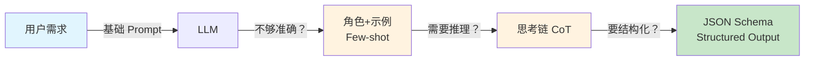
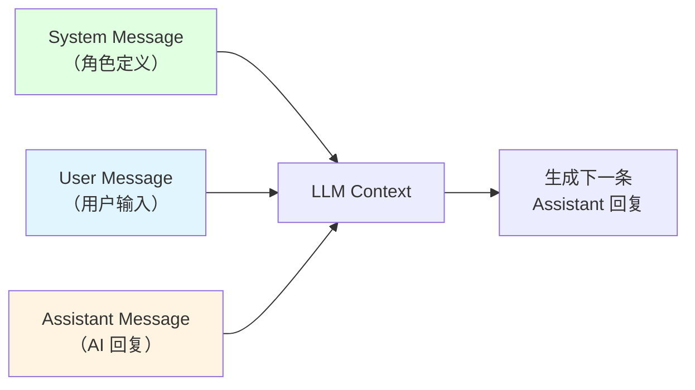
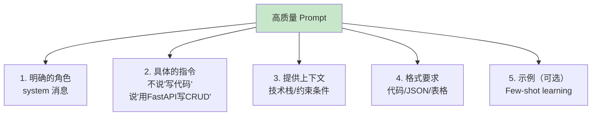

# 第 4 章：Prompt Engineering

> 学完本章，你能：掌握 Prompt 基础技巧和进阶方法，能可靠获取结构化输出



**章节导览：**

- **4.1 Prompt 基础**：掌握 System/User/Assistant 角色，写出高质量 Prompt
- **4.2 进阶技巧**：Few-shot、Chain-of-Thought、Self-consistency，让模型更聪明
- **4.3 结构化输出**：让 LLM 输出可靠的 JSON，无缝对接你的代码

---

## 4.1 Prompt 基础 <DifficultyBadge level="beginner" /> <CostBadge cost="$0.01" />

> 前置知识：1.1 你的第一次 AI 对话

你知道吗？Prompt 就像是**给 AI 下单的菜单**——你说"来份炒饭"，可能端上来的是蛋炒饭、也可能是扬州炒饭；但如果你说"要一份扬州炒饭，加虾仁、火腿、青豆，不要葱，米饭要软糯的"，厨师就知道怎么做了！

### 为什么需要它？（Problem）

**同样的问题，不同人提问，效果天差地别：**

**差的 Prompt：**

```
写一个用户管理系统
```

**AI 回复：**
> "好的，我可以帮你设计一个用户管理系统。你需要什么功能呢？"

**好的 Prompt：**

```
你是一个资深的 Python 后端工程师。

请生成一个用户管理系统的 API 代码，要求：
- 使用 FastAPI 框架
- 实现 CRUD 功能（创建、读取、更新、删除用户）
- 用户字段：id, username, email, created_at
- 包含输入验证和错误处理
- 添加详细的注释

输出格式：完整可运行的代码，不要省略。
```

**AI 回复：**
> [直接输出完整的 FastAPI 代码，包含所有 CRUD 接口、Pydantic 模型、验证逻辑]

**差距的根源：Prompt 是 LLM 的"任务书"，质量决定输出。**

::: warning 翻车现场
常见"惨案"：
1. **太模糊**："写代码"、"优化性能"——AI：我是写个 Hello World 还是重构整个项目？🤔
2. **缺少上下文**：不说明使用场景、技术栈、约束条件——AI：用 Java 还是 Python？要不我用汇编写？
3. **没有示例**：复杂任务没有提供输入/输出示例——AI：我猜一猜你要什么... 猜错了别怪我哦
4. **忽略角色**：没有用 system 消息定义 AI 的专业身份——AI：我是该当教授还是当段子手？
:::

::: tip 一句话总结
**Prompt 写得好，AI 才能跑。详细的指令 = 靠谱的输出！**
:::

### 它是什么？（Concept）

**Prompt 是你给 LLM 的指令**，由三种角色的消息组成。想象一下：

- **System Message** = 给 AI 发的"工牌"：你是专家/导师/助手？
- **User Message** = 你的任务单：我要做什么？
- **Assistant Message** = AI 的工作记录：上次聊了啥？

这就像是开会：System 定义谁参会（技术专家还是产品经理），User 提需求，Assistant 记录讨论历史。



**三种角色的作用：**

| 角色 | 作用 | 示例 |
|-----|------|------|
| **system** | 设定 AI 的身份、专业领域、回复风格 | "你是一个资深 Python 开发者，擅长写简洁高效的代码" |
| **user** | 用户的问题或指令 | "帮我写一个快速排序算法" |
| **assistant** | AI 的历史回复（用于多轮对话） | "好的，这是快速排序的实现..." |

**为什么需要 system 消息？**

System 消息相当于"岗位说明书"，让 AI 进入特定的专业角色。对比效果：

::: tip System 消息的魔力
同样的问题，不同的 System 角色，回答风格天差地别！
- 无 System = 教科书模式（无聊但正确）
- System: 专家 = 学术派（严谨但难懂）  
- System: 导师 = 接地气（生动易懂）

**记住：给 AI 发工牌，它才知道该怎么表现！**
:::

**没有 system 消息：**

```python
messages = [
    {"role": "user", "content": "解释什么是闭包"}
]
```

**AI 回复：**
> "闭包是函数和其周围状态的引用捆绑在一起的组合..."（教科书式定义，抽象）

**有 system 消息：**

```python
messages = [
    {"role": "system", "content": "你是一个耐心的编程导师，擅长用生活中的例子解释技术概念，目标受众是初学者。"},
    {"role": "user", "content": "解释什么是闭包"}
]
```

**AI 回复：**
> "想象你在一个咖啡店工作，你的工作是记录每个顾客的订单编号。每次有新顾客来，编号就 +1...
> 
> 闭包就像这个场景：函数记住了外部的'编号计数器'，即使咖啡店打烊了（外部函数执行完），这个计数器依然存在..."

**高质量 Prompt 的要素：**



**常见 Prompt 技巧：**

| 技巧 | 说明 | 示例 |
|-----|------|------|
| **具体化** | 避免模糊词，给出明确指标 | ❌ "写简洁的代码" → ✅ "函数不超过20行，变量名用英文" |
| **给出约束** | 明确不要什么 | "不要使用第三方库，只用 Python 标准库" |
| **分步指令** | 复杂任务拆解成步骤 | "第一步：提取字段；第二步：验证格式；第三步：保存数据库" |
| **输出格式** | 明确返回结构 | "以 JSON 格式返回，包含 name、age、email 字段" |
| **思考过程** | 要求先分析再回答 | "先分析这段代码的时间复杂度，再提出优化建议" |

**常见陷阱：**

::: warning 避坑指南
| 陷阱 | 问题 | 改进 |
|-----|------|------|
| **命令式 vs 描述式** | "生成代码"（太直接） | "你是后端专家，帮我用 FastAPI 实现..."（有角色感） |
| **一次问太多** | 一个 prompt 问 10 个问题（AI 会懵） | 拆分成多轮对话（一次一个重点） |
| **忽略格式** | 不说明输出格式（返回一坨文字） | "以 Markdown 表格形式输出"（结构清晰） |
| **过度依赖** | 把所有逻辑交给 AI（容易跑偏） | 给出清晰的业务规则和边界条件（AI 不会读心术） |
:::

::: tip 一句话总结
**把 AI 当新员工：给角色、给范例、给约束，它才能干好活！**
:::

### 动手试试（Practice）

我们通过对比实验，看看不同 Prompt 的效果差异。

**实验 1：对比"差 Prompt" vs "好 Prompt"**

```python
from openai import OpenAI

client = OpenAI()

# 差的 Prompt
bad_prompt = "写一个函数计算斐波那契数列"

response = client.chat.completions.create(
    model="gpt-4.1-mini",
    messages=[{"role": "user", "content": bad_prompt}],
)
print("=== 差的 Prompt ===")
print(response.choices[0].message.content)

# 好的 Prompt
good_prompt = """
你是一个 Python 算法专家，擅长写高性能代码。

任务：实现斐波那契数列计算函数

要求：
1. 使用动态规划（避免递归）
2. 时间复杂度 O(n)，空间复杂度 O(1)
3. 函数签名：def fibonacci(n: int) -> int
4. 包含参数验证（n >= 0）
5. 添加类型注解和文档字符串
6. 包含 3 个测试用例

输出：完整的 Python 代码，可直接运行。
"""

response = client.chat.completions.create(
    model="gpt-4.1-mini",
    messages=[{"role": "user", "content": good_prompt}],
)
print("\n=== 好的 Prompt ===")
print(response.choices[0].message.content)
```

**实验 2：System 消息的魔力**

```python
from openai import OpenAI

client = OpenAI()

question = "解释什么是 API"

# 没有 system 消息
response1 = client.chat.completions.create(
    model="gpt-4.1-mini",
    messages=[{"role": "user", "content": question}],
)
print("=== 无 System 消息（默认） ===")
print(response1.choices[0].message.content)

# 技术专家角色
response2 = client.chat.completions.create(
    model="gpt-4.1-mini",
    messages=[
        {"role": "system", "content": "你是一个严谨的计算机科学教授，用学术语言解释概念。"},
        {"role": "user", "content": question},
    ],
)
print("\n=== System: 技术专家 ===")
print(response2.choices[0].message.content)

# 幽默导师角色
response3 = client.chat.completions.create(
    model="gpt-4.1-mini",
    messages=[
        {"role": "system", "content": "你是一个幽默的编程导师，喜欢用类比和笑话解释技术概念，目标受众是小学生。"},
        {"role": "user", "content": question},
    ],
)
print("\n=== System: 幽默导师 ===")
print(response3.choices[0].message.content)
```

**实验 3：Prompt 模板实战**

为常见任务创建可复用的 Prompt 模板：

```python
from openai import OpenAI

client = OpenAI()

# 代码审查模板
def code_review_prompt(code: str, language: str = "Python"):
    return f"""
你是一个资深的 {language} 代码审查专家，擅长发现代码中的问题并提出改进建议。

请审查以下代码，并按这个结构输出：

1. **代码质量评分**（1-10 分）
2. **发现的问题**（按严重程度排序）
   - 每个问题说明：问题 + 影响 + 建议修改
3. **优点**
4. **改进后的代码**（可选，如果有重大问题）

代码：
```{language.lower()}
{code}
```

请给出详细分析。
"""

# 测试
code = '''
def process_users(users):
    result = []
    for user in users:
        if user['age'] > 18:
            result.append(user['name'])
    return result
'''

response = client.chat.completions.create(
    model="gpt-4.1-mini",
    messages=[{"role": "user", "content": code_review_prompt(code)}],
)
print(response.choices[0].message.content)
```

**实验 4：多轮对话中的上下文管理**

```python
from openai import OpenAI

client = OpenAI()

# 初始化对话
messages = [
    {"role": "system", "content": "你是一个 Python 编程助手，擅长调试代码。"}
]

def chat(user_input):
    messages.append({"role": "user", "content": user_input})
    response = client.chat.completions.create(
        model="gpt-4.1-mini",
        messages=messages,
    )
    reply = response.choices[0].message.content
    messages.append({"role": "assistant", "content": reply})
    return reply

# 第一轮：提出问题
print("用户: 这段代码有什么问题？\n```python\nfor i in range(10):\n  print(i)\ntime.sleep(1)\n```")
print(f"AI: {chat('这段代码有什么问题？\\n```python\\nfor i in range(10):\\n  print(i)\\ntime.sleep(1)\\n```')}\n")

# 第二轮：追问（AI 会记住前面的代码）
print("用户: 那我应该怎么导入 time 模块？")
print(f"AI: {chat('那我应该怎么导入 time 模块？')}\n")

# 第三轮：继续追问
print("用户: 有没有更优雅的写法？")
print(f"AI: {chat('有没有更优雅的写法？')}")
```

<ColabBadge path="demos/04-prompt-engineering/prompt_basics.ipynb" />

### 小结（Reflection）

::: tip 一句话总结
**System 消息 = 工牌，User 消息 = 任务单，越详细越靠谱！**
:::

- **解决了什么**：学会写高质量 Prompt，通过 system 消息控制 AI 角色，理解三种消息类型的作用
- **没解决什么**：简单的 Prompt 可以应对常规任务，但复杂任务（分类、推理）怎么办？——下一节介绍进阶技巧
- **关键要点**：
  1. **System 消息定义角色**：专家 vs 导师 vs 助手，效果完全不同
  2. **具体化指令**：不说"写代码"，说"用 FastAPI 实现 CRUD"
  3. **提供上下文**：技术栈、约束条件、输出格式
  4. **多轮对话需要手动管理历史消息**：API 是无状态的
  5. **用模板提高效率**：为常见任务建立可复用的 Prompt 模板

::: warning 成本提示
多轮对话会累积 token 数量，定期清理历史消息可以节省成本！
:::

---

*最后更新：2026-02-20*
