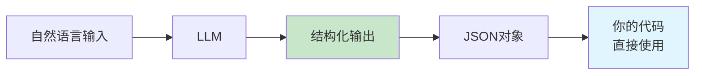
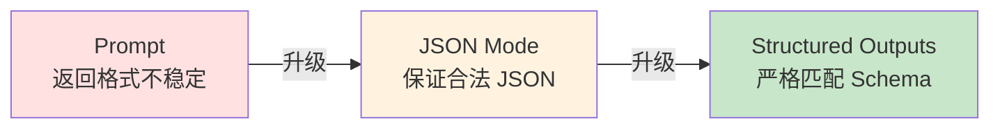
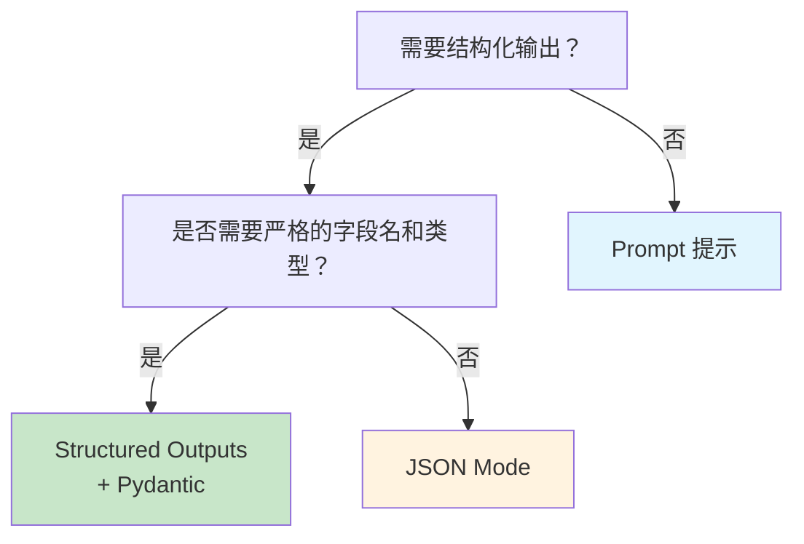

# 4.3 结构化输出 <DifficultyBadge level="intermediate" /> <CostBadge cost="$0.01" />

> 前置知识：4.1 Prompt 基础

AI 给你的回复很智能，但你的代码想直接用它？那可就尴尬了——有时是一段话，有时是表格，有时是 JSON... **就像点外卖，你要的是打包好的盒饭，结果送来的是散装菜**。这一节教你如何让 AI 输出"标准格式的数据"！

### 为什么需要它？（Problem）

当你用 AI 构建应用时，会遇到这样的尴尬：

**场景：提取发票信息**

```python
from openai import OpenAI

client = OpenAI()

invoice_text = """
发票抬头：北京科技有限公司
金额：¥12,580.00
日期：2026-02-15
发票号：20260215001
"""

response = client.chat.completions.create(
    model="gpt-4.1-mini",
    messages=[
        {"role": "user", "content": f"从发票中提取：公司名、金额、日期、发票号\n\n{invoice_text}"}
    ],
)

print(response.choices[0].message.content)
```

**AI 可能返回：**

```
公司名称：北京科技有限公司
金额是 12580 元
日期为 2026 年 2 月 15 日
发票号码：20260215001
```

**问题：**
1. ❌ 格式不统一（有的加"是"，有的不加）
2. ❌ 金额格式乱（"12580 元" vs "¥12,580.00"）
3. ❌ 无法直接用代码解析（你想要 JSON！）

::: warning 翻车现场
**你想要的：** `{"company": "北京科技", "amount": 12580}`  
**AI 给你的：** "公司名称是北京科技有限公司，金额大概是 12580 元吧..."

**程序员：** 我要结构化数据，不是写作文啊！😭
:::

**你真正需要的是：**

```json
{
  "company": "北京科技有限公司",
  "amount": 12580.00,
  "date": "2026-02-15",
  "invoice_number": "20260215001"
}
```

**传统做法的痛点：**

::: warning 避坑指南
| 方法 | 问题 |
|-----|------|
| **Prompt 提示** | "请以 JSON 格式返回" → AI 可能返回 ```json...```、可能缩进错乱、可能字段名不一致（心情好就听话） |
| **正则表达式** | 需要写一堆复杂正则去解析自然语言，易出错（正则地狱） |
| **手动解析** | 代码量大，维护成本高（写到怀疑人生） |

**一句话总结：传统方法 = 求 AI 别犯错，但 AI：我偏要试试！**
:::

**根本需求：让 LLM 输出可靠的、格式严格的结构化数据。**

---

### 它是什么？（Concept）

结构化输出是一组技术，确保 LLM 返回的内容符合你指定的格式（JSON Schema）。

想象 AI 是个厨师：
- **传统方式**：你说"做个菜"，厨师自由发挥（可能是川菜、可能是粤菜）
- **结构化输出**：你给厨师一张标准菜谱，TA 必须按菜谱做（保证每次都一样）



**三种方案对比：**

::: tip 方案选择指南
| 方案 | 原理 | 可靠性 | 成本 | 推荐度 |
|-----|------|-------|------|--------|
| **Prompt 提示** | 在 prompt 中说明"返回 JSON" | ⭐⭐（看心情） | 低 | 适合原型 |
| **JSON Mode** | 强制模型返回有效 JSON | ⭐⭐⭐⭐（稳定） | 低 | 适合快速开发 |
| **Structured Outputs** | 严格按 JSON Schema 生成 | ⭐⭐⭐⭐⭐（完美） | 低 | **生产环境首选** |

**一句话总结：Prompt = 口头约定，JSON Mode = 格式保证，Structured Outputs = 合同约束！**
:::

**演进路径：**



---

## 方案 1：Prompt 提示（基础）

**做法：在 prompt 中明确要求返回 JSON 格式。**

```python
from openai import OpenAI
import json

client = OpenAI()

invoice_text = """
发票抬头：北京科技有限公司
金额：¥12,580.00
日期：2026-02-15
发票号：20260215001
"""

prompt = f"""
从发票中提取信息，以 JSON 格式返回。

要求字段：
- company: 公司名称
- amount: 金额（数字，不带符号）
- date: 日期（YYYY-MM-DD 格式）
- invoice_number: 发票号

发票内容：
{invoice_text}

请直接返回 JSON，不要其他文字。
"""

response = client.chat.completions.create(
    model="gpt-4.1-mini",
    messages=[{"role": "user", "content": prompt}],
)

result = response.choices[0].message.content
print("AI 返回：")
print(result)

# 尝试解析
try:
    data = json.loads(result)
    print("\n解析成功：")
    print(data)
except json.JSONDecodeError as e:
    print(f"\n解析失败：{e}")
```

**潜在问题：**

::: warning 翻车现场
| 问题 | 示例 |
|-----|------|
| 返回 Markdown 代码块 | ```json\n{...}\n```（需要手动去掉）|
| 字段名不一致 | `companyName` vs `company`（AI：我觉得驼峰好看）|
| 多余的说明文字 | "好的，这是提取的信息：{...}"（AI：我要礼貌一点）|
| 格式错误 | 单引号而非双引号（Python 能解析，JavaScript 就炸了）|

**一句话总结：Prompt 提示 = 靠 AI 自觉，但 AI 经常不自觉！**
:::

**改进：更严格的 Prompt**

```python
prompt = f"""
从发票中提取信息，输出必须是**纯 JSON 对象**，不要 Markdown 代码块，不要任何说明文字。

JSON Schema:
{ {
  "company": "string",
  "amount": number,
  "date": "string (YYYY-MM-DD)",
  "invoice_number": "string"
} }

发票内容：
{invoice_text}
"""
```

::: tip 适用场景
- 快速原型
- 对准确性要求不高的场景
- 不支持 JSON Mode 的模型
:::

---

## 方案 2：JSON Mode（推荐）

**原理：OpenAI 在模型层面强制输出有效 JSON。**

```python
from openai import OpenAI
import json

client = OpenAI()

invoice_text = """
发票抬头：北京科技有限公司
金额：¥12,580.00
日期：2026-02-15
发票号：20260215001
"""

response = client.chat.completions.create(
    model="gpt-4.1-mini",
    messages=[
        {
            "role": "system",
            "content": "你是一个数据提取助手，输出格式为 JSON。"
        },
        {
            "role": "user",
            "content": f"""
从发票中提取信息，返回 JSON 对象，字段：company, amount, date, invoice_number。

发票内容：
{invoice_text}
"""
        }
    ],
    response_format={"type": "json_object"},  # 关键：启用 JSON Mode
)

result = response.choices[0].message.content
print("AI 返回：")
print(result)

# 解析 JSON
data = json.loads(result)  # 保证能解析成功
print("\n提取的数据：")
print(f"公司：{data['company']}")
print(f"金额：{data['amount']}")
print(f"日期：{data['date']}")
print(f"发票号：{data['invoice_number']}")
```

**JSON Mode 的优势：**

::: tip JSON Mode 的好处
| 特性 | 说明 |
|-----|------|
| ✅ 保证有效 JSON | 不会出现格式错误（语法一定正确） |
| ✅ 不返回 Markdown | 直接是 JSON 字符串（省去正则处理） |
| ✅ 无需复杂 Prompt | 简化提示词（不用写一堆"不要这样不要那样"） |
| ⚠️ 不保证字段名 | 可能返回 `companyName` 而非 `company`（AI：我喜欢驼峰命名） |

**一句话总结：JSON Mode = 保证格式正确，但不保证字段名（基本够用）！**
:::

::: warning 注意
JSON Mode 只保证 **有效的 JSON 格式**，不保证字段名称和结构完全匹配你的预期。如果需要严格匹配，使用 Structured Outputs。
:::

---

## 方案 3：Structured Outputs（最强）

**原理：用 JSON Schema 明确定义输出结构，模型保证 100% 匹配。**

想象你在工厂下订单：
- **JSON Mode** = 告诉工厂"做个手机"（保证是手机，但可能颜色、配置不一样）
- **Structured Outputs** = 给工厂一张详细图纸（尺寸、颜色、配置，一模一样）

::: tip Structured Outputs 的威力
**特性：**
- ✅ 严格匹配 JSON Schema（字段名、类型、必填项，100% 匹配）
- ✅ 支持嵌套对象、数组、枚举（复杂结构也能搞定）
- ✅ 与 Pydantic 无缝集成（Python 开发者的福音）

**一句话总结：Structured Outputs = 给 AI 签合同，一个字都不能错！**
:::

**基础用法：定义 JSON Schema**

```python
from openai import OpenAI
import json

client = OpenAI()

invoice_text = """
发票抬头：北京科技有限公司
金额：¥12,580.00
日期：2026-02-15
发票号：20260215001
"""

# 定义 JSON Schema
invoice_schema = {
    "type": "object",
    "properties": {
        "company": {"type": "string", "description": "公司名称"},
        "amount": {"type": "number", "description": "金额（数字）"},
        "date": {"type": "string", "description": "日期，格式 YYYY-MM-DD"},
        "invoice_number": {"type": "string", "description": "发票号"}
    },
    "required": ["company", "amount", "date", "invoice_number"],
    "additionalProperties": False
}

response = client.chat.completions.create(
    model="gpt-4o-2024-08-06",  # 必须是支持 Structured Outputs 的模型
    messages=[
        {
            "role": "system",
            "content": "你是一个数据提取助手。"
        },
        {
            "role": "user",
            "content": f"从发票中提取信息：\n\n{invoice_text}"
        }
    ],
    response_format={
        "type": "json_schema",
        "json_schema": {
            "name": "invoice_extraction",
            "schema": invoice_schema,
            "strict": True  # 严格模式
        }
    }
)

result = json.loads(response.choices[0].message.content)
print("提取结果：")
print(json.dumps(result, indent=2, ensure_ascii=False))
```

**输出保证：**

```json
{
  "company": "北京科技有限公司",
  "amount": 12580.0,
  "date": "2026-02-15",
  "invoice_number": "20260215001"
}
```

**字段名 100% 匹配，类型 100% 正确，没有多余字段！**

---

## 进阶：与 Pydantic 集成

**Pydantic 是 Python 的数据验证库，与 Structured Outputs 完美配合。**

```python
from openai import OpenAI
from pydantic import BaseModel, Field
import json

client = OpenAI()

# 用 Pydantic 定义数据模型
class Invoice(BaseModel):
    company: str = Field(description="公司名称")
    amount: float = Field(description="金额（数字）")
    date: str = Field(description="日期，格式 YYYY-MM-DD")
    invoice_number: str = Field(description="发票号")

invoice_text = """
发票抬头：北京科技有限公司
金额：¥12,580.00
日期：2026-02-15
发票号：20260215001
"""

# Pydantic 自动生成 JSON Schema
response = client.beta.chat.completions.parse(
    model="gpt-4o-2024-08-06",
    messages=[
        {
            "role": "system",
            "content": "你是一个数据提取助手。"
        },
        {
            "role": "user",
            "content": f"从发票中提取信息：\n\n{invoice_text}"
        }
    ],
    response_format=Invoice,  # 直接传 Pydantic 模型
)

# 返回的是 Pydantic 对象，可以直接使用
invoice = response.choices[0].message.parsed
print(f"公司：{invoice.company}")
print(f"金额：{invoice.amount}")
print(f"日期：{invoice.date}")
print(f"发票号：{invoice.invoice_number}")

# 转换为字典
print("\nJSON:")
print(invoice.model_dump_json(indent=2))
```

**Pydantic 的优势：**

::: tip 为什么用 Pydantic？
| 特性 | 说明 |
|-----|------|
| ✅ 自动生成 Schema | 不用手写 JSON Schema（告别繁琐） |
| ✅ 类型提示 | IDE 自动补全（写代码更爽） |
| ✅ 数据验证 | 自动校验类型、范围（省去手动检查） |
| ✅ 嵌套模型 | 支持复杂数据结构（轻松应对多层嵌套） |

**一句话总结：Pydantic = Python 类 → JSON Schema，开发体验直接起飞！**
:::

**复杂示例：嵌套对象和数组**

```python
from openai import OpenAI
from pydantic import BaseModel, Field
from typing import List

client = OpenAI()

class OrderItem(BaseModel):
    name: str = Field(description="商品名称")
    quantity: int = Field(description="数量")
    price: float = Field(description="单价")

class Order(BaseModel):
    order_id: str = Field(description="订单号")
    customer: str = Field(description="客户名称")
    items: List[OrderItem] = Field(description="订单明细")
    total: float = Field(description="总金额")

order_text = """
订单号：ORD-20260215-001
客户：张三
商品明细：
1. Python 入门书籍 × 2 @ ¥89.00
2. JavaScript 高级编程 × 1 @ ¥128.00
总计：¥306.00
"""

response = client.beta.chat.completions.parse(
    model="gpt-4o-2024-08-06",
    messages=[
        {
            "role": "user",
            "content": f"从订单中提取信息：\n\n{order_text}"
        }
    ],
    response_format=Order,
)

order = response.choices[0].message.parsed
print(f"订单号：{order.order_id}")
print(f"客户：{order.customer}")
print(f"商品：")
for item in order.items:
    print(f"  - {item.name} × {item.quantity} @ ¥{item.price}")
print(f"总计：¥{order.total}")
```

---

## 三种方案选择指南



::: tip 快速决策表
| 场景 | 推荐方案 | 理由 |
|-----|---------|------|
| **生产环境数据提取** | Structured Outputs + Pydantic | 字段名、类型、必填项都保证正确 |
| **简单 JSON 输出** | JSON Mode | 保证格式正确，开发快 |
| **快速原型** | Prompt 提示 | 最简单，但不稳定 |
| **不支持新 API 的模型** | Prompt 提示 + 手动解析 | 没办法的办法 |

**一句话总结：生产用 Structured Outputs，快速开发用 JSON Mode，原型用 Prompt！**
:::

---

### 动手试试（Practice）

**实战：从用户评论中提取结构化信息**

```python
from openai import OpenAI
from pydantic import BaseModel, Field
from typing import Literal

client = OpenAI()

class Review(BaseModel):
    sentiment: Literal["positive", "negative", "neutral"] = Field(description="情感倾向")
    rating: int = Field(description="评分（1-5 星）", ge=1, le=5)
    aspects: dict[str, str] = Field(description="各方面评价，如 {'质量': '好', '价格': '贵'}")
    summary: str = Field(description="一句话总结")

review_text = """
买了这款手机用了一周，整体还不错。
屏幕很清晰，拍照效果也不错，就是价格有点贵。
电池续航一般，玩游戏的话一天要充两次电。
总体来说物有所值吧，给 4 星。
"""

response = client.beta.chat.completions.parse(
    model="gpt-4o-2024-08-06",
    messages=[
        {
            "role": "system",
            "content": "你是一个评论分析助手，擅长从用户评论中提取结构化信息。"
        },
        {
            "role": "user",
            "content": f"分析这条评论：\n\n{review_text}"
        }
    ],
    response_format=Review,
)

review = response.choices[0].message.parsed
print(f"情感：{review.sentiment}")
print(f"评分：{review.rating} 星")
print(f"各方面评价：{review.aspects}")
print(f"总结：{review.summary}")
```

<ColabBadge path="demos/04-prompt-engineering/structured_output.ipynb" />

---

### 小结（Reflection）

::: tip 一句话总结
**Prompt = 口头约定，JSON Mode = 格式保证，Structured Outputs = 合同约束！**
:::

- **解决了什么**：让 LLM 输出可靠的、可直接被代码消费的结构化数据（JSON）
- **没解决什么**：AI 只能"读数据"，还不能"做事情"（调用 API、查数据库）——第 7 章 Function Calling 解决这个问题
- **关键要点**：
  1. **Prompt 提示**：最简单，但不可靠，适合原型
  2. **JSON Mode**：保证有效 JSON，不保证字段名
  3. **Structured Outputs**：严格匹配 JSON Schema，生产环境首选
  4. **Pydantic 集成**：自动生成 Schema，类型安全，开发体验最好
  5. **选择原则**：生产环境用 Structured Outputs，快速原型用 JSON Mode

::: warning 注意事项
- Structured Outputs 需要支持的模型（如 gpt-4o-2024-08-06）
- 复杂嵌套结构可能增加 token 消耗
- 定义好 Schema 后，字段名不能随意变动（AI 会严格遵守）
:::

---

## 🎉 入门篇检查点

恭喜完成**入门篇**（第 1-4 章）！你已经掌握：

- ✅ 3 行代码调用 LLM API（第 1 章）
- ✅ 了解主流模型和平台选择（第 2 章）
- ✅ 理解 Token、参数、推理模型原理（第 3 章）
- ✅ 掌握 Prompt 基础和进阶技巧（第 4 章）

**你现在可以：**
- 调用 OpenAI / Claude / Gemini API
- 写出高质量的 Prompt
- 控制模型行为（temperature / top-p）
- 获取结构化输出（JSON）

**下一站：工具篇（第 5-6 章）**

学习如何用 AI 编程工具（Cursor / GitHub Copilot）提升开发效率，掌握 Context Engineering 让 AI 理解你的项目。

👉 [第 5 章：AI 编程工具全景](/05-ai-coding-tools/)

---

*最后更新：2026-02-20*
