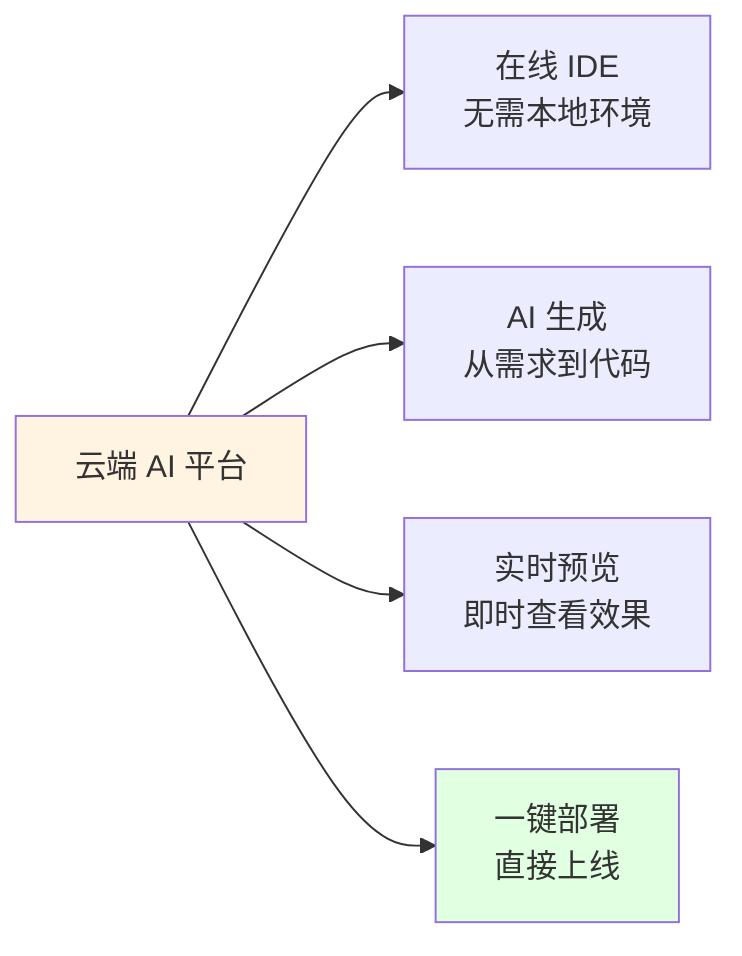

# 5.3 云端 AI 开发 <DifficultyBadge level="beginner" /> <CostBadge cost="$0" />

> 前置知识：无

### 为什么需要它？（Problem）

即使有了强大的 IDE 工具和终端工具,传统开发流程仍有这些痛点：

1. **环境配置地狱**
   - 新项目：安装 Node.js、Python、数据库、依赖包...
   - 版本冲突：项目 A 需要 Python 3.9，项目 B 需要 3.11
   - 花 2 小时配环境，写 5 分钟代码

2. **跨设备协作困难**
   - 在公司写到一半的代码，回家想继续？
   - 需要：推送 Git → 拉取代码 → 重新配环境
   - iPad 上想改个 Bug？抱歉，装不了 IDE

3. **学习成本高**
   - 想尝试 AI 编程，但需要：
     - 学会用 VS Code / 终端
     - 配置 API Key
     - 理解项目结构
   - 初学者门槛太高

4. **快速原型验证**
   - 想测试一个想法："能不能做个 XXX？"
   - 传统流程：创建项目 → 写代码 → 配置部署
   - 花 1 天时间，发现想法不可行

**云端 AI 开发平台的承诺：浏览器里打开，输入需求，几分钟得到可部署的完整应用。**

### 它是什么？（Concept）

**云端 AI 开发平台**将开发环境、AI 编程助手、部署服务整合到浏览器中，实现"零配置开发"。



**核心能力对比：**

| 平台 | 核心场景 | AI 能力 | 部署 | 价格 | 适合人群 |
|-----|---------|---------|------|------|---------|
| **Replit AI** | 全栈应用开发 | 代码生成 + 补全 + Agent | 自动部署 | 免费 / $20/月 | 学习编程、团队协作 |
| **v0 (Vercel)** | UI/前端组件 | Prompt → React 组件 | 导出代码 | 免费（200 积分/月）| 前端开发者、设计师 |
| **bolt.new** | 全栈原型 | Prompt → 完整应用 | 预览 + 导出 | 免费试用 / $20/月 | 快速验证想法 |
| **Lovable** | 全栈 MVP | Prompt → React + Supabase | 一键部署 + 托管 | 免费 / $20/月 | 创业者、MVP 开发 |

---

## Replit AI - 在线全栈开发平台

**浏览器里的完整 Linux 环境 + AI 助手**

### 核心功能

1. **零配置开发环境**


**支持的技术栈：**
- 前端：React、Vue、Next.js、Svelte
- 后端：Python (Flask/Django)、Node.js (Express)、Go
- 数据库：PostgreSQL、SQLite、MongoDB
- 全栈：MERN、PERN、Django + React

**无需安装任何工具，直接在浏览器里运行。**

2. **Replit AI Agent**

```
用户输入：
"创建一个博客系统，包含：
- 用户登录注册
- 发布、编辑、删除文章
- Markdown 编辑器
- 评论功能"

Replit AI 执行：
1. ✅ 创建 Next.js + TypeScript 项目
2. ✅ 配置 Prisma + SQLite 数据库
3. ✅ 生成用户认证（NextAuth.js）
4. ✅ 创建文章 CRUD API
5. ✅ 集成 react-markdown 编辑器
6. ✅ 实现评论系统
7. ✅ 添加 TailwindCSS 样式

完成！点击 Run 预览。
```

3. **实时协作**（类似 Google Docs）

- 多人同时编辑同一个文件
- 实时光标位置显示
- 语音/视频通话（内置）
- 适合结对编程、远程面试

4. **一键部署**

```bash
# Replit 自动提供：
https://your-app-username.replit.app

# 特性：
- 自动 HTTPS
- 自动扩容
- 自定义域名（付费版）
```

### 使用流程

**第 1 步：创建项目**

1. 访问 https://replit.com
2. 点击 "Create Repl"
3. 选择模板（如 "Next.js"）

**第 2 步：使用 AI 生成代码**

```
# 打开 AI Chat（右侧面板）
Prompt: 创建一个 TODO 应用，包含添加、删除、标记完成功能

AI: 我将创建：
- app/page.tsx - 主页面
- components/TodoList.tsx - TODO 列表组件
- app/api/todos/route.ts - API 路由
- lib/db.ts - 数据库操作（SQLite）

[Apply] 按钮点击后，AI 自动创建所有文件
```

**第 3 步：运行和预览**

1. 点击顶部 "Run" 按钮
2. 右侧自动打开预览窗口
3. 修改代码，自动热重载

**第 4 步：部署**

1. 点击 "Deploy" 按钮
2. 选择部署方式：
   - Static：静态网站（免费）
   - Autoscale：自动扩容（$20/月起）
3. 获得公开 URL

### 定价

| 计划 | 价格 | AI 额度 | 私有项目 | 算力 |
|-----|------|---------|---------|------|
| Free | $0 | 基础（100 次/天）| 3 个 | 0.5 vCPU |
| Hacker | $7/月 | 增强（1000 次/天）| 无限 | 2 vCPU |
| Pro | $20/月 | 无限 AI | 无限 | 4 vCPU + 优先支持 |

### 适合场景

✅ **学习编程**：无需配环境，直接写代码
✅ **快速原型**：验证想法，几分钟上线
✅ **远程协作**：团队实时结对编程
✅ **技术面试**：共享编辑器 + 实时运行

❌ **生产环境**：性能、稳定性不如专业云服务
❌ **大型项目**：编辑器功能不如本地 IDE

---

## v0 (Vercel) - AI 生成 UI 组件

**从设计描述到 React 代码，10 秒生成**

### 核心功能

1. **Prompt → UI 生成**

```
用户输入：
"设计一个定价页面，包含 3 个定价方案（Free、Pro、Enterprise），
每个方案显示：价格、功能列表、CTA 按钮。使用现代设计风格。"

v0 输出：
- ✅ React + TypeScript 代码
- ✅ TailwindCSS 样式
- ✅ 响应式设计（移动端适配）
- ✅ 深色模式支持
- ✅ 实时预览

[Copy Code] [Edit in Playground] [Add to Project]
```

**实际生成示例：**

```tsx
// v0 生成的代码（简化版）
import { Check } from 'lucide-react'

export default function PricingPage() {
  const plans = [
    {
      name: 'Free',
      price: '$0',
      features: ['10 projects', 'Basic support', '1 GB storage'],
    },
    {
      name: 'Pro',
      price: '$20',
      features: ['Unlimited projects', 'Priority support', '100 GB storage', 'Advanced analytics'],
      popular: true,
    },
    {
      name: 'Enterprise',
      price: 'Custom',
      features: ['Unlimited everything', '24/7 support', 'Custom integrations', 'SLA'],
    },
  ]

  return (
    <div className="min-h-screen bg-gradient-to-br from-gray-900 to-gray-800 py-12">
      <div className="container mx-auto px-4">
        <h1 className="text-4xl font-bold text-center text-white mb-12">
          Choose Your Plan
        </h1>
        <div className="grid md:grid-cols-3 gap-8">
          {plans.map((plan) => (
            <div
              key={plan.name}
              className={`bg-white rounded-lg p-8 ${
                plan.popular ? 'ring-2 ring-blue-500 scale-105' : ''
              }`}
            >
              {plan.popular && (
                <span className="bg-blue-500 text-white px-3 py-1 rounded-full text-sm">
                  Most Popular
                </span>
              )}
              <h2 className="text-2xl font-bold mt-4">{plan.name}</h2>
              <p className="text-4xl font-bold mt-2">{plan.price}</p>
              <ul className="mt-6 space-y-3">
                {plan.features.map((feature) => (
                  <li key={feature} className="flex items-center">
                    <Check className="w-5 h-5 text-green-500 mr-2" />
                    {feature}
                  </li>
                ))}
              </ul>
              <button className="w-full bg-blue-600 text-white py-2 rounded-lg mt-8 hover:bg-blue-700">
                Get Started
              </button>
            </div>
          ))}
        </div>
      </div>
    </div>
  )
}
```

2. **迭代优化**

```
v0 生成后，你可以继续对话：

You: "把 Pro 方案的按钮改成渐变色，添加悬停动画"
v0: ✅ 已更新代码

You: "添加年付/月付切换"
v0: ✅ 已添加状态管理和切换按钮

You: "移动端显示为单列"
v0: ✅ 已调整响应式断点
```

3. **导出和集成**

```bash
# 方式 1：复制代码
# 点击 "Copy Code" → 粘贴到你的项目

# 方式 2：直接在 Vercel 部署
# 点击 "Deploy" → 授权 GitHub → 自动创建仓库 → 部署上线

# 方式 3：集成到 Next.js 项目
npx v0 add <component-id>
```

### 使用流程

**第 1 步：访问 v0**

https://v0.dev

**第 2 步：描述 UI 需求**

```
示例 Prompt：

"设计一个 Dashboard 页面，包含：
- 顶部导航栏（Logo、搜索框、用户头像）
- 左侧边栏（导航菜单）
- 主内容区显示 4 个统计卡片（用户数、订单数、收入、增长率）
- 使用 Shadcn UI 风格"
```

**第 3 步：实时预览和调整**

- v0 生成 3 个设计变体
- 选择最喜欢的
- 继续对话微调

**第 4 步：导出代码**

```bash
# 安装依赖
npm install lucide-react clsx tailwind-merge

# 复制组件代码到项目
cp generated-component.tsx src/components/
```

### 定价

| 计划 | 价格 | 积分/月 | 约生成次数 |
|-----|------|---------|-----------|
| Free | $0 | 200 | ~40 次生成 |
| Premium | $20 | 5000 | ~1000 次生成 |

**积分消耗规则：**
- 生成新组件：5 积分
- 迭代优化：2 积分
- 生成多变体：+2 积分/个

### 适合场景

✅ **前端开发者**：快速生成 UI 组件，专注业务逻辑
✅ **设计师**：将设计想法转为代码，验证可行性
✅ **产品经理**：快速制作高保真原型
✅ **独立开发者**：无设计师资源，AI 帮你设计

❌ **复杂交互逻辑**：v0 专注 UI，不处理业务逻辑
❌ **非 React 项目**：仅生成 React/Next.js 代码

---

## bolt.new - 全栈应用生成器

**一句话生成完整应用（前端 + 后端 + 数据库）**

### 核心功能

1. **Prompt → 全栈应用**

```
用户输入：
"创建一个在线投票应用：
- 用户可以创建投票主题（标题 + 多个选项）
- 其他人可以投票
- 实时显示投票结果（柱状图）
- 使用 Next.js + Prisma + SQLite"

bolt.new 输出：
- ✅ 完整的 Next.js 项目结构
- ✅ Prisma 数据库模型
- ✅ API 路由（创建投票、投票、查询结果）
- ✅ 前端页面（创建页、投票页、结果页）
- ✅ Chart.js 可视化
- ✅ 响应式设计
- ✅ 可直接运行的预览
```

2. **实时预览环境**


**特点：**
- 修改代码，预览自动刷新
- 支持热重载（HMR）
- 内置终端，可运行命令

3. **下载和部署**

```bash
# 方式 1：下载 ZIP
点击 "Download" → 得到完整项目源码

# 方式 2：推送到 GitHub
点击 "Push to GitHub" → 自动创建仓库

# 方式 3：部署到 Vercel
点击 "Deploy to Vercel" → 一键上线
```

### 使用流程

**第 1 步：访问 bolt.new**

https://bolt.new

**第 2 步：输入应用需求**

```
示例 Prompt：

"创建一个番茄钟应用：
- 25 分钟专注倒计时
- 5 分钟休息倒计时
- 可以暂停/重置
- 记录完成的番茄钟数量
- 使用 React + TypeScript + Vite"
```

**第 3 步：查看生成的代码和预览**

- 左侧：文件树
- 中间：代码编辑器
- 右侧：实时预览

**第 4 步：迭代优化**

```
继续对话：

"添加白噪音播放功能（雨声、咖啡厅、海浪）"
→ bolt.new 自动添加音频播放器

"添加每日统计图表"
→ bolt.new 集成 Chart.js 并实现数据统计
```

**第 5 步：导出或部署**

```bash
# 下载到本地
unzip bolt-new-project.zip
cd bolt-new-project
npm install
npm run dev
```

### 定价

| 计划 | 价格 | AI 生成次数 | 高级功能 |
|-----|------|------------|---------|
| Free | $0 | 5 次/天 | 基础生成 |
| Pro | $20/月 | 无限 | 更复杂应用、优先支持 |

### 适合场景

✅ **快速验证想法**：几分钟得到可工作的原型
✅ **学习全栈开发**：看 AI 如何组织项目结构
✅ **Hackathon**：快速搭建项目基础架构
✅ **内部工具**：快速开发小型管理后台

❌ **生产级应用**：生成的代码需要进一步优化
❌ **复杂业务逻辑**：适合中小型应用（< 20 个页面）

---

## Lovable - 全栈应用构建者（前 GPT Engineer）

**从自然语言到 React + Supabase 全栈应用，MIT 评选的突破性技术**

### 核心功能

1. **Prompt → 生产级应用**

```
用户输入：
"创建一个任务管理应用：
- 用户注册登录（Google OAuth）
- 创建项目和任务
- 任务优先级、截止日期、标签
- 团队协作（分配任务）
- 实时通知
- 移动端响应式"

Lovable 输出：
- ✅ React + TypeScript 前端（Vite）
- ✅ Supabase 后端（PostgreSQL + Auth + Realtime）
- ✅ TailwindCSS + shadcn/ui 组件
- ✅ Google OAuth 集成
- ✅ 实时数据同步（WebSocket）
- ✅ 完整的数据库表结构和权限配置
- ✅ 一键部署到 Lovable 云

完成！应用已上线，获得公开 URL。
```

2. **集成部署 + 协作编辑**


**特点：**
- 无需配置服务器，Lovable 自动托管
- 支持多人协作编辑（类似 Figma）
- 每次修改自动保存历史版本
- 一键回滚到任意历史版本

3. **与 bolt.new 的对比**

| 维度 | Lovable | bolt.new |
|-----|---------|----------|
| **后端方案** | Supabase（生产级）| 简单 API/本地数据 |
| **数据库** | PostgreSQL（云端持久化）| SQLite/内存（非持久化）|
| **认证** | ✅ 内置 Supabase Auth | ❌ 需自行实现 |
| **实时功能** | ✅ Supabase Realtime | ❌ 需手动集成 WebSocket |
| **部署** | ✅ 一键部署到 Lovable 云 | ✅ 导出到 Vercel/Netlify |
| **协作** | ✅ 多人实时编辑 | ❌ 单人开发 |
| **生成质量** | 更注重生产可用性 | 更注重快速原型 |
| **技术栈** | React + Supabase（固定）| 灵活（多种框架）|

**简单说：**
- **bolt.new**：快速验证想法的原型工具（生成代码框架）
- **Lovable**：直接构建可上线应用（生成 + 托管 + 协作）

4. **MIT Technology Review 2026 突破性技术**

Lovable（原 GPT Engineer）被评为 "Generative Coding" 领域的代表性产品，理由：
- 从自然语言到生产级应用的完整闭环
- 降低全栈开发门槛（非技术背景也能创建应用）
- AI 不仅生成代码，还理解业务逻辑

### 使用流程

**第 1 步：访问 Lovable**

https://lovable.dev

**第 2 步：描述应用需求**

```
示例 Prompt：

"创建一个活动报名系统：
- 用户可以浏览活动列表（标题、时间、地点、剩余名额）
- 点击报名，填写姓名、邮箱、手机
- 活动创建者可以查看报名列表，导出 CSV
- 活动满员自动关闭报名
- 使用 Google 登录"
```

**第 3 步：AI 生成 + 实时预览**

- 左侧：聊天界面（与 AI 对话）
- 中间：代码编辑器（可手动调整）
- 右侧：实时预览（即改即看）

**第 4 步：迭代优化**

```
继续对话：

"添加活动分类（技术、设计、商业）和筛选功能"
→ Lovable 更新数据库表、API 和 UI

"报名成功后发送确认邮件"
→ Lovable 集成 Supabase Edge Functions + Resend API

"添加活动分享功能（生成海报）"
→ Lovable 实现分享链接 + Open Graph 标签
```

**第 5 步：一键部署**

```bash
# 点击 "Publish" 按钮
→ 自动部署到 Lovable 云
→ 获得公开 URL：https://your-app.lovable.app

# 特性：
- 自动 HTTPS
- CDN 加速
- Supabase 数据库自动创建
- 自定义域名（付费版）
```

### 定价

| 计划 | 价格 | AI 生成 | 部署 | 协作 | Supabase |
|-----|------|---------|------|------|---------|
| Free | $0 | 20 次生成/月 | ✅ 公开部署 | 1 人 | 500 MB |
| Pro | $20/月 | 无限生成 | ✅ 私有 + 自定义域名 | 3 人 | 8 GB |
| Team | $50/月 | 无限生成 | ✅ 团队工作区 | 10 人 | 100 GB |

### 适合场景

✅ **创业者/产品经理**：快速验证 MVP，无需雇佣全栈工程师
✅ **全栈开发者**：自动生成 Supabase 配置，专注业务逻辑
✅ **非技术背景**：最低学习成本，自然语言描述即可创建应用
✅ **需要实时功能**：聊天、协作、通知等（Supabase Realtime）

❌ **需要自定义后端**：固定使用 Supabase，无法切换其他后端
❌ **复杂业务逻辑**：AI 生成适合标准 CRUD，复杂算法需手动开发
❌ **非 React 项目**：仅支持 React 技术栈

---

## 四大平台对比

### 功能对比

| 功能 | Replit AI | v0 | bolt.new | Lovable |
|-----|----------|----|----|---------|
| **AI 生成能力** | 全栈代码 | UI 组件 | 全栈应用 | 全栈应用 + 后端 |
| **开发环境** | 完整 Linux 环境 | 无（仅生成代码）| 简化环境 | 在线编辑器 |
| **实时预览** | ✅ | ✅ | ✅ | ✅ |
| **协作功能** | ✅ 多人实时 | ❌ | ❌ | ✅ 多人实时 |
| **部署** | ✅ 一键部署 | ✅ 导出到 Vercel | ✅ 导出/部署 | ✅ 一键部署 + 托管 |
| **数据库** | 支持多种 | 无 | SQLite/内存 | PostgreSQL（Supabase）|
| **认证系统** | 需自行实现 | 无 | 需自行实现 | ✅ 内置 Supabase Auth |
| **技术栈** | 任意语言 | React/Next.js | 主要 JavaScript 栈 | React + Supabase（固定）|
| **学习曲线** | 低 | 极低 | 低 | 极低 |

### 选择建议

| 场景 | 推荐平台 | 原因 |
|-----|---------|------|
| **学习编程** | Replit AI | 完整开发环境 + 协作 |
| **快速制作 UI** | v0 | 最快生成 React 组件 |
| **验证全栈想法** | bolt.new / Lovable | bolt.new 适合原型，Lovable 适合 MVP |
| **需要后端 + 数据库** | Lovable | 内置 Supabase，开箱即用 |
| **团队协作** | Replit AI / Lovable | 实时多人编辑 |
| **前端开发者** | v0 | 专注 UI，导出到自己的项目 |
| **无编程基础** | Lovable | 自然语言 → 生产级应用 |
| **需要实时功能** | Lovable | Supabase Realtime 内置支持 |

---

### 动手试试（Practice）

**任务：使用 v0 生成一个产品落地页**

我们将体验云端 AI 平台的完整流程：描述 → 生成 → 预览 → 导出。

**目标：** 为一个虚构的 AI 写作工具 "WriteGPT" 创建落地页。

**第 1 步：访问 v0**

1. 打开 https://v0.dev
2. 使用 Google/GitHub 登录（免费账号即可）

**第 2 步：输入设计需求**

在输入框中粘贴以下 Prompt：

```
设计一个 SaaS 产品落地页，产品名 "WriteGPT"，AI 写作助手。

页面结构：
1. Hero Section
   - 大标题："10 倍速写作，AI 驱动的内容创作平台"
   - 副标题："从灵感到成稿，只需 3 分钟"
   - CTA 按钮："免费试用" + "观看演示"
   - 右侧放产品截图占位图

2. Features Section（3 个特性卡片）
   - 智能续写：AI 自动补全段落
   - 多语言支持：支持 100+ 语言
   - SEO 优化：自动生成关键词

3. Pricing Section（3 个定价方案）
   - Free：$0/月，10 次 AI 生成
   - Pro：$29/月，无限 AI 生成
   - Team：$99/月，5 个席位 + 协作

4. Footer
   - 产品链接、社交媒体图标

设计风格：
- 现代、简洁
- 使用紫色渐变主题色
- 响应式设计
- 深色模式支持
```

**第 3 步：选择设计变体**

v0 会生成 3 个不同的设计方案：

- **Variant 1**：极简风格
- **Variant 2**：渐变背景 + 动画
- **Variant 3**：卡片式布局

点击喜欢的变体，查看实时预览。

**第 4 步：迭代优化**

在聊天框中继续对话：

```
优化 1："把 Hero Section 的 CTA 按钮改大一点，添加悬停动画"
→ v0 更新代码

优化 2："Features Section 的图标改用 lucide-react 图标库"
→ v0 替换图标

优化 3："添加客户评价 Section，显示 3 条虚构评价"
→ v0 添加新 Section
```

**第 5 步：导出代码**

1. 点击右上角 **"Copy Code"**
2. 代码已复制到剪贴板

**第 6 步：本地运行（可选）**

```bash
# 创建 Next.js 项目
npx create-next-app@latest writegpt-landing
cd writegpt-landing

# 安装依赖
npm install lucide-react clsx tailwind-merge

# 创建组件文件
mkdir -p src/components
# 将复制的代码粘贴到 src/components/landing-page.tsx

# 在 app/page.tsx 中引用
# import LandingPage from '@/components/landing-page'
# export default function Page() { return <LandingPage /> }

# 运行
npm run dev
# 访问 http://localhost:3000
```

**第 7 步：部署到 Vercel（可选）**

```bash
# 方式 1：通过 v0 直接部署
点击 v0 界面的 "Deploy to Vercel" 按钮

# 方式 2：手动部署
git init
git add .
git commit -m "Initial commit"
git push -u origin main

# 在 Vercel Dashboard 导入仓库
# 自动部署，获得 URL：https://writegpt-landing.vercel.app
```

**预期结果：**

你应该得到：
- 一个完整的产品落地页（约 300 行 React 代码）
- 响应式设计（手机、平板、桌面都完美显示）
- 可直接部署的生产级代码

**时间对比：**
- **传统开发**（手写 HTML/CSS/JS）：4-6 小时
- **使用 Tailwind 模板**：2-3 小时（需要调整样式）
- **v0 生成**：5 分钟（包括 3 轮迭代）

**成本对比：**
- **雇佣设计师 + 前端开发**：$500-2000
- **购买模板**：$50-200
- **v0 生成**：免费（Free 计划）或 $20/月（无限生成）

---

### 小结（Reflection）

- **解决了什么**：学会用云端 AI 平台实现零配置开发，从想法到上线全程在浏览器完成
- **没解决什么**：工具这么多，到底该选哪个？不同角色的最佳组合是什么？——下一节给出选型指南
- **关键要点**：
  1. **Replit AI** = 完整开发平台（IDE + AI + 部署），适合学习和协作
  2. **v0** = 最快 UI 生成器（Prompt → React 组件），适合前端开发者
  3. **bolt.new** = 全栈应用生成器（Prompt → 完整应用），适合快速验证想法
  4. **Lovable** = 生产级应用构建者（Prompt → React + Supabase 应用 + 托管），适合 MVP 和需要后端的场景
  5. 云端平台优势：零配置、实时预览、一键部署
  6. 云端平台劣势：性能不如本地、功能受限于平台
  7. 选择建议：学习用 Replit，前端用 v0，原型用 bolt.new，MVP 用 Lovable

---

*最后更新：2026-02-20*
