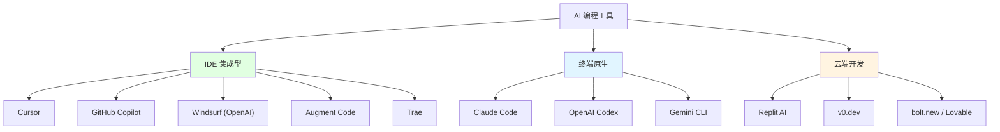
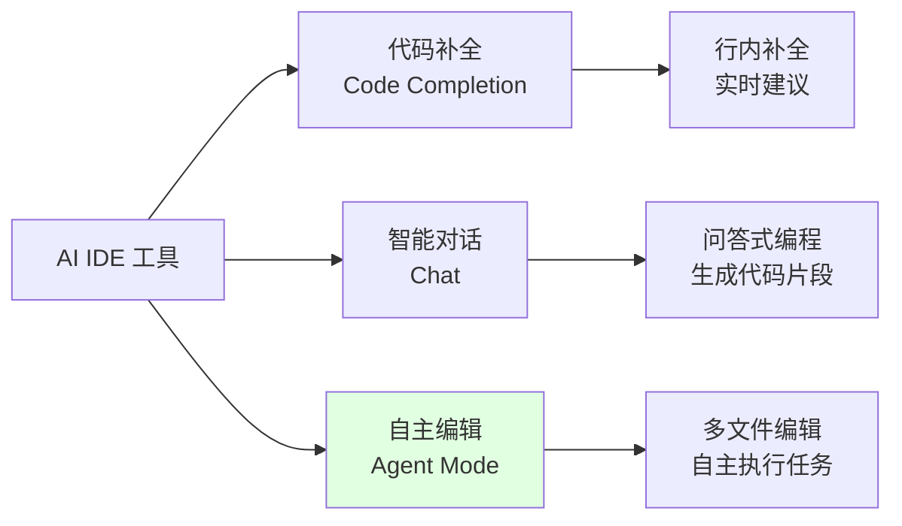

# 第 5 章：AI 编程工具全景

> 学完本章，你能：了解 AI 编程工具生态，选择适合自己角色的工具组合



## 5.1 IDE 集成型工具 <DifficultyBadge level="beginner" /> <CostBadge cost="$0" />

> 前置知识：无

### 为什么需要它？（Problem）

传统编程方式下，开发者需要：

1. **手动编写样板代码**
   - 创建 REST API：定义路由、编写增删改查、处理错误...
   - 一个简单的 CRUD 接口需要 200+ 行代码
   - 重复劳动占据 60% 开发时间

2. **频繁查文档和搜索**
   - 忘记 API 参数？Google → Stack Overflow → 官方文档
   - 一个小问题打断 15 分钟心流
   - 每天在工具切换上浪费 2+ 小时

3. **跨文件重构成本高**
   - 修改数据库字段：改表结构 → 改模型 → 改 API → 改前端
   - 手动修改 20+ 个文件，容易遗漏
   - 一个小改动引发连锁 bug

**AI IDE 集成工具的承诺：用自然语言描述需求，AI 帮你生成、修改、重构代码。**

### 它是什么？（Concept）

**IDE 集成型 AI 工具**将大语言模型直接嵌入到代码编辑器中，提供三种核心能力：



**核心概念：**

| 能力 | 描述 | 典型场景 | 工具示例 |
|-----|------|---------|---------|
| **代码补全** | 输入时实时建议下一行代码 | 写函数、导入库 | GitHub Copilot 行内补全 |
| **智能对话** | 通过聊天生成代码片段 | "写一个验证邮箱的正则" | Cursor Chat |
| **Agent 模式** | AI 自主理解需求、编辑多个文件 | "添加用户认证功能" | Cursor Composer、Windsurf Cascade |

**主流 AI IDE 工具对比：**

| 工具 | 核心特性 | Agent 模式 | 上下文能力 | 价格 | 适合角色 |
|-----|---------|-----------|-----------|------|---------|
| **Cursor** | CLI Plan Mode、Cloud Build、Mermaid 图表渲染 | ✅ 强大 | @符号引用文件/文档 | $20/月（500 次 Premium）| 全栈开发者 |
| **GitHub Copilot** | Agent Mode 增强、Copilot Chat 升级 | ✅ Copilot Edits | GitHub 原生集成 | $10/月（个人）、$19/月（商业）| 企业团队 |
| **Windsurf** | Cascade 流程编排（**被 OpenAI 收购**）| ✅ Cascade | 代码库索引 | $15/月（无限 Premium）| 性价比首选 |
| **Augment Code** | 企业级超大代码库支持（400K+ 文件）| ✅ 企业 Agent | 全代码库深度索引 | 企业定价 | 大型企业团队 |
| **Trae** | 超大免费额度（200 万 token/月）| ✅ 基础 Agent | 基础上下文 | 免费 / $20/月 | 预算有限的学生/个人 |
| **Cline/RooCode** | VS Code 开源扩展、支持本地模型 | ✅ 完整 Agent | 需手动选择文件 | Pay-per-use（API 费用）| 喜欢开源/自定义 |
| **JetBrains Junie** | 原生 IntelliJ 集成、理解项目结构 | ⚠️ 有限 | IDE 原生索引 | $10/月 | JetBrains 用户 |

**重点工具详解：**

### Cursor

**最强 AI IDE（基于 VS Code）**

核心功能：
- **Composer（⌘ I）**：多文件 Agent 编辑模式
  - 一句话描述需求："添加用户登录功能"
  - AI 自动：创建文件 → 编写代码 → 修改配置
  - 支持 Apply 前预览 diff
  
- **CLI Plan Mode（2026 新增）**：命令行计划模式
  - 在终端直接生成执行计划
  - 可将计划交给 Cloud Build 云端执行
  - 适合 CI/CD 集成场景
  
- **Cloud Build（2026 新增）**：云端构建服务
  - 将 CLI 生成的计划提交到云端执行
  - 无需本地资源，适合大规模重构
  - 支持团队协作，共享构建计划

- **Mermaid 图表渲染（2026 新增）**：
  - 编辑器内直接渲染 Mermaid ASCII 图表
  - 流程图、时序图实时预览
  - 技术文档可视化更友好
  
- **Rules（.cursorrules）**：项目级 AI 行为定制
  ```
  - 使用 TypeScript + React + Next.js 14
  - API 路由遵循 RESTful 规范
  - 所有数据库操作使用 Prisma ORM
  - 错误处理统一返回 { error: string }
  ```

- **@ 符号上下文引用**：
  - `@file`: 引用具体文件
  - `@folder`: 引用整个目录
  - `@docs`: 引用在线文档（如 Next.js 官方文档）
  - `@web`: 搜索互联网

- **多模型支持（2026 增强）**：
  - GPT-5、Claude Sonnet 4.6、Gemini 2.5 Pro
  - 可按任务类型切换模型
  - 支持自定义 API endpoint

**定价：**
- Hobby：$0/月（GPT-4.1-mini 无限）
- Pro：$20/月（500 次 Premium 请求/月）
- Business：$40/月（无限 Premium + 统一管理）

### GitHub Copilot

**最成熟的企业级 AI 编程助手**

核心功能：
- **Copilot Chat（2026 升级）**：IDE 内对话式编程
  - 支持多轮上下文对话
  - 代码解释、重构建议更智能
  - 集成 GitHub Issues 和 PR 上下文
  
- **Copilot Edits**：多文件编辑（类似 Cursor Composer）
  - 跨文件重构和批量修改
  - 智能依赖追踪
  
- **Agent Mode（2026 增强）**：自主任务执行
  - 理解复杂需求，自动拆解子任务
  - 支持测试生成、文档更新、代码审查
  - 与 GitHub Actions 深度集成
  
- **Copilot Workspace**：从 GitHub Issue 直接生成 PR
  - Issue → 代码方案 → 实现 → Pull Request
  - 适合开源项目协作
  
- **原生集成**：VS Code、JetBrains、Vim、Neovim

**优势：**
- 最早推出（2021），训练数据最丰富
- 企业级安全：代码不用于训练、SOC 2 认证
- GitHub 生态深度整合：Pull Request、Code Review
- 2026 重点强化：Agent 能力追赶 Cursor/Windsurf

**定价：**
- Individual：$10/月
- Business：$19/月/用户
- Enterprise：$39/月/用户（包含审计日志、IP 保护）

### Windsurf

**被 OpenAI 收购的高性价比 AI IDE（基于 VS Code）**

> **重磅消息（2026 年初）**：OpenAI 正式收购 Windsurf（原 Codeium 旗下产品）。这标志着 AI 编程工具市场的重大整合，OpenAI 从"模型提供商"进化为"完整工具生态"。收购后 Windsurf 仍保持独立运营，定价不变，但未来可能与 ChatGPT Enterprise 深度集成。

核心功能：
- **Cascade**：智能流程编排 Agent
  - 自动拆解任务 → 逐步执行 → 验证结果
  - 示例："重构这个组件，提取公共逻辑"
  - AI 会：分析代码 → 创建新文件 → 移动函数 → 更新引用
  
- **代码库深度索引**：
  - 自动理解项目结构和依赖关系
  - 跨文件符号跳转和引用分析

**定价：**
- Free：GPT-4.1-mini 无限
- Pro：$15/月（无限 Premium 请求）

**性价比分析：** Windsurf Pro $15 vs Cursor Pro $20，同样功能便宜 25%，适合预算敏感用户。收购后未来可能获得 OpenAI 独家模型支持（如 o3-mini 优先接入）。

### Augment Code

**企业级超大代码库 AI 助手**

专为大型企业设计的 AI 编程工具，解决传统工具在超大代码库（400K+ 文件）中的性能瓶颈。

核心功能：
- **超大代码库支持**：
  - 支持 40 万+ 文件的代码库（如 Google/Meta 级别项目）
  - 全代码库深度索引和语义搜索
  - 跨模块依赖分析和影响范围评估
  
- **企业 Agent 模式**：
  - 理解企业内部框架和编码规范
  - 支持自定义知识库（内部文档、API 规范）
  - 多团队协作，共享 AI 上下文

- **安全与合规**：
  - 私有部署支持（on-premise）
  - 代码不离开企业网络
  - SOC 2、ISO 27001 认证
  - 审计日志和访问控制

**适合场景：**
- 超大型单体代码库（百万行+）
- 金融、医疗等强监管行业
- 需要私有部署的企业
- 多团队协同开发（100+ 工程师）

**定价：** 企业定价（按团队规模定制，通常 $50-100/用户/月）

**对比其他工具：** 
- Cursor/Windsurf 在 10 万行以上代码库会变慢，Augment 专门优化了超大规模场景
- 传统工具适合中小项目，Augment 适合"代码库就是护城河"的大企业

### Trae

**最慷慨的免费 AI IDE**

核心功能：
- 免费额度：**200 万 token/月**（相当于 400 次 GPT-5 对话）
- 支持多模型：GPT-5、Claude Sonnet 4.6、Gemini 2.5
- 基础 Agent 模式
- **2026 更新**：新增代码库索引功能，提升大项目支持

**适合场景：**
- 学生、个人开发者
- 不想绑定信用卡的尝试者
- 每月 200 次以内 AI 辅助的轻度用户
- 想尝试 GPT-5/Claude 4.6 但不想订阅的用户（最佳免费试用平台）

### Cline / RooCode

**开源 VS Code 扩展（原名 Claude Dev）**

核心功能：
- 完整 Agent 能力：读写文件、执行命令、浏览器控制
- 支持本地模型：Ollama、LM Studio
- 多模型切换：OpenAI、Anthropic、Google、DeepSeek

**优势：**
- 完全开源，代码透明
- Pay-per-use：只付 API 费用，无订阅
- 可连接自己的 API Key，使用 DeepSeek 等低成本模型

**适合场景：**
- 已有 OpenAI/Anthropic API Key 的用户
- 需要使用本地模型（隐私敏感场景）
- 喜欢自定义配置的 Hacker

### JetBrains Junie

**IntelliJ/PyCharm/WebStorm 原生 AI**

核心功能：
- AI 代码补全（支持 Kotlin、Java、Python 等）
- 项目结构理解（利用 IDE 索引）
- 重构建议、测试生成

**适合场景：**
- 重度 JetBrains 用户（不想换编辑器）
- Java/Kotlin 开发者（补全质量高）

**定价：** $10/月

---

### 动手试试（Practice）

**任务：使用 Cursor Agent 模式生成一个 TODO API**

我们将用自然语言描述需求，让 Cursor 帮我们完成：
1. 创建 Express.js 项目
2. 实现 TODO 的增删改查 API
3. 添加数据持久化（JSON 文件）

**第 1 步：安装 Cursor**

1. 访问 https://cursor.sh
2. 下载并安装（支持 macOS、Windows、Linux）
3. 首次打开会要求登录（支持 GitHub/Google）

**第 2 步：创建项目**

1. 打开终端，创建项目目录：
   ```bash
   mkdir todo-api
   cd todo-api
   npm init -y
   npm install express
   ```

2. 用 Cursor 打开项目：
   ```bash
   cursor .
   ```

**第 3 步：使用 Composer 生成代码**

1. 按 `⌘ I`（Mac）或 `Ctrl I`（Windows/Linux）打开 Composer
2. 输入以下 prompt：

```
创建一个 Express.js TODO API，包含以下功能：

1. GET /todos - 获取所有 TODO
2. POST /todos - 创建新 TODO（需要 title 和 description）
3. PUT /todos/:id - 更新 TODO
4. DELETE /todos/:id - 删除 TODO

数据存储在 todos.json 文件中，格式：
[
  { "id": 1, "title": "学习 AI", "description": "完成第 5 章", "completed": false }
]

要求：
- 使用 ES6+ 语法
- 添加错误处理
- 所有响应返回 JSON
- 启动在 3000 端口
```

3. 点击 **Generate**，Cursor 会：
   - 创建 `server.js`（Express 应用）
   - 创建 `todos.json`（数据文件）
   - 实现所有 CRUD 路由
   - 添加错误处理中间件

**第 4 步：预览和应用更改**

1. Composer 会显示即将创建/修改的文件
2. 逐个查看 diff（红色 = 删除，绿色 = 新增）
3. 确认无误后，点击 **Accept All**

**第 5 步：测试 API**

1. 启动服务器：
   ```bash
   node server.js
   ```

2. 测试 API（新开终端）：
   ```bash
   # 获取所有 TODO
   curl http://localhost:3000/todos
   
   # 创建 TODO
   curl -X POST http://localhost:3000/todos \
     -H "Content-Type: application/json" \
     -d '{"title": "学习 Cursor", "description": "完成动手任务"}'
   
   # 更新 TODO
   curl -X PUT http://localhost:3000/todos/1 \
     -H "Content-Type: application/json" \
     -d '{"completed": true}'
   
   # 删除 TODO
   curl -X DELETE http://localhost:3000/todos/1
   ```

**第 6 步：修改需求（体验 Agent 能力）**

再次打开 Composer（⌘ I），输入：

```
添加用户认证：
1. POST /login - 用户登录（username, password）
2. 所有 /todos 路由需要验证 JWT token
3. 密码使用 bcrypt 加密
```

观察 Cursor 如何：
- 安装新依赖（jsonwebtoken、bcrypt）
- 创建 auth 中间件
- 修改现有路由添加验证
- 更新 package.json

**预期结果：**

你应该得到一个完整的 TODO API 项目，包含：
- `server.js`（约 100 行）
- `todos.json`（数据文件）
- `package.json`（依赖配置）
- 完整的 CRUD 功能 + 错误处理

**对比传统开发：**
- **传统方式**：1-2 小时（手写路由、错误处理、文件 I/O）
- **Cursor Agent**：2 分钟（自然语言描述 → 完整代码）

---

### 小结（Reflection）

- **解决了什么**：通过 AI IDE 工具，从"手写代码"升级到"描述需求"，开发效率提升 5-10 倍
- **没解决什么**：IDE 工具依赖图形界面，不适合服务器环境或纯终端工作流——下一节介绍终端原生工具
- **关键要点**：
  1. **Cursor** = 2026 最强更新（CLI Plan Mode + Cloud Build + Mermaid 渲染），适合专业开发者（$20/月）
  2. **Windsurf** = 被 OpenAI 收购，性价比最高（Cascade），未来可能独享 o3 模型（$15/月）
  3. **GitHub Copilot** = 企业首选，2026 重点强化 Agent Mode 追赶竞争对手
  4. **Augment Code** = 超大代码库杀手锏（400K+ 文件），大企业专属（企业定价）
  5. **Trae** = 最佳免费选项（200 万 token/月），适合学生和轻度用户
  6. **Cline** = 开源 + Pay-per-use，适合 API Key 用户
  7. 选择建议：新手从 Trae 开始，个人开发者选 Windsurf（性价比），专业团队选 Cursor（最全功能），大企业选 Augment（超大规模）

---

*最后更新：2026-02-22*
