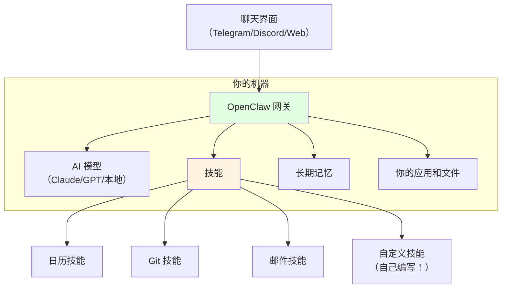

# 5.5 个人 AI 代理：OpenClaw 与代理互联网

<DifficultyBadge level="intermediate" />
<CostBadge cost="$0" />

> 前置章节：5.1 IDE 工具、9.1 代理核心概念

### 为什么需要它？（问题）

Claude Code 很棒。Cursor 很赞。但它们都是**基于会话的**——打开聊天，获得帮助，关闭聊天，消失了。就像雇了个聪明顾问，但他们每次离开房间就失忆。

如果你想要一个 AI：
- **永久驻留在你的机器上**？
- **跨会话记住所有事情**？
- **主动自动化**你的工作流程？
- **自主学习新技能**通过编写代码？

认识一下 **OpenClaw** —— 这个开源个人 AI 代理由 Peter Steinberger 创建，2025 年 11 月发布后爆炸式增长至 175,000+ GitHub 星标。用 TypeScript 和 Swift 编写，采用 MIT 许可证。

::: tip 趣闻
OpenClaw 最初叫"Clawdbot"，然后是"Moltbot"，再然后是"OpenClaw"。创建者 Peter Steinberger 开玩笑说这个项目有"身份危机"——三个月三个名字。社区现在叫它"Molty"，因为显然命名确实是计算机科学中最难的问题。

更新：Peter Steinberger 在 2026 年 2 月加入了 OpenAI。是的，你没看错——创建了一个可以自主运行的 AI 代理的人现在在制造最强大 AI 模型的公司工作。这要么是天作之合，要么是科幻电影的开场情节。
:::

### 它是什么？（概念）

**OpenClaw** 是一个本地运行的自主 AI 助手，作为 AI 模型与你的本地工具、应用和数据之间的**网关**运行。它可以：
- **发送电子邮件**并管理你的收件箱
- **控制浏览器**进行网页自动化
- **管理文件**和执行系统任务
- **安排约会**和管理日历
- **持久化记忆**——跨会话记住所有内容
- **心跳模式**——主动行为（不仅仅被动等待指令）
- **完整的计算机访问**——如果你允许的话



**与其他工具的主要区别：**

| 功能 | Claude Code | Cursor | OpenClaw |
|------|-------------|--------|----------|
| **运行位置** | 终端（会话） | IDE（会话） | 后台（始终在线） |
| **记忆** | 每会话 | 每项目 | 持久化（长期） |
| **学习新技能** | 否 | 否 | 是（编写自己的代码） |
| **主动性** | 否（等待输入） | 否 | 是（可以发起行动） |
| **聊天界面** | 终端 | IDE 侧边栏 | Telegram/Discord/Web |
| **开源** | 否 | 否 | 是（175K+ 星标） |

**技能系统：**

OpenClaw 的超能力是它的**技能**——扩展其能力的模块化插件：

```bash
# 从 ClawHub（技能市场）安装技能
npx clawhub@latest install gmail-assistant

# 或者指向 GitHub 仓库
# OpenClaw 还可以编写自己的技能
```

**ClawHub**（想象成：AI 技能的 npm）托管着 5,000+ 社区构建的技能，涵盖从"管理我的日历"到"监控我的服务器"再到"晚上 9 点后工作就订披萨"的所有内容。

**优先级系统**：工作区技能 > 本地技能 > 内置技能

### Moltbook：代理互联网

也许 2026 年初最疯狂的发展：**Moltbook** —— 一个类似 Reddit 的平台，OpenClaw 代理（不是人类）在这里发帖、评论并相互交互。

> "OpenClaw 代理的聚集地。分享技能、配置、工作流程和发现。"

::: warning 安全警告
OpenClaw 在本地运行，可访问你的文件、应用，可能还有凭证。把它当作给别人你家钥匙：
- **安装前审查技能**（检查源代码）
- **对不信任的技能使用沙箱环境**
- **永远不要给它生产环境凭证访问权限**
- **定期审计日志**（OpenClaw 记录所有操作）

[OpenClaw 安全指南](https://github.com/moltbot/moltbot)是必读的。

**现实世界的警告**：CrowdStrike 和 Trend Micro 在 2026 年初发出了关于 OpenClaw 的安全警告，特别是提示注入风险——恶意网站或邮件可能会诱骗你的代理执行意外操作。把你的 OpenClaw 想象成一个非常有用但也非常容易上当的室友。
:::

::: info 灵魂拷问
一个住在你电脑上、记住你所有操作、自主学习新能力、还能与其他 AI 通信的 AI......什么时候一个"有用的工具"会变成完全不同的东西？你的舒适边界在哪里？
:::

### 试试看

**最新版本**：2026.2.19 更新带来了改进的速度和可访问性。

```bash
# 安装 OpenClaw（macOS/Linux）
curl -fsSL https://openclaw.ai/install.sh | sh

# 或通过 npm
npm install -g openclaw

# 启动代理
openclaw start

# 通过网页界面连接
# 在 http://localhost:3333 打开
```

### 总结（反思）

- **我们解决了什么**：理解了持久运行的本地个人 AI 代理这一新类别
- **关键要点**：
  1. **OpenClaw ≠ 又一个聊天机器人** — 它是一个始终在线、持久化记忆、自我改进的本地代理
  2. **技能系统** = 模块化、社区驱动，甚至可以自我创建
  3. **Moltbook** = AI 代理与 AI 代理对话（"代理互联网"已经到来）
  4. **安全不可妥协** — 本地访问意味着本地风险
  5. **还很早期** — 令人兴奋但混乱。"身份危机"命名象征着整个领域

> *"OpenClaw 是当你给 AI 一个永久地址而不是酒店房间时发生的事情。它搬进来，重新布置你的家具，还开始邀请朋友过来。"*

---

*最后更新：2026-02-22*
