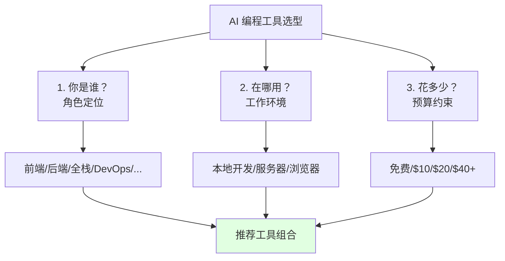
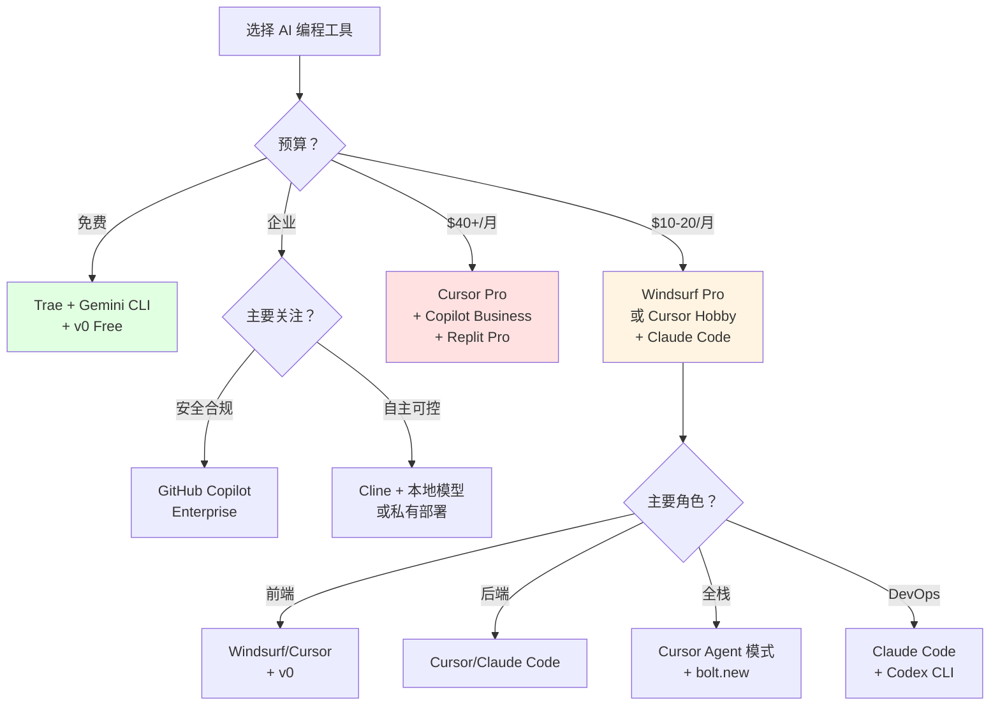

# 5.4 工具选型指南 <DifficultyBadge level="beginner" /> <CostBadge cost="$0" />

> 前置知识：5.1 IDE 集成型工具，5.2 终端原生工具，5.3 云端 AI 开发

### 为什么需要它？（Problem）

现在你已经了解了 10+ 种 AI 编程工具，但面临新的困惑：

1. **选择困难症**
   - Cursor、Windsurf、Copilot 都说自己最好，该信谁？
   - 免费的 Trae 够用吗？还是必须付费？
   - 每个工具都试用一遍，成本太高

2. **工具过多，效率反降**
   - 装了 3 个 IDE 工具，不知道该打开哪个
   - 终端工具和 IDE 工具功能重复
   - 切换工具的时间比用工具的时间还长

3. **角色不同，需求不同**
   - 前端开发者需要快速生成 UI
   - 后端开发者更关注业务逻辑和数据库
   - DevOps 工程师需要在服务器上直接修改代码
   - 产品经理只想快速验证原型

4. **预算限制**
   - 学生/个人：能免费就不付费
   - 小团队：预算有限，要性价比
   - 大企业：关注安全性和合规性

**本节目标：根据你的角色、场景、预算，给出明确的工具组合建议。**

### 它是什么？（Concept）

**工具选型框架：3 个维度 × 2 个决策**



**决策树：**



---

## 按角色选择

### 前端开发者

**核心需求：**
- 快速生成 UI 组件
- 响应式设计和样式调整
- 组件文档自动生成

**推荐组合：**

| 工具 | 用途 | 价格 |
|-----|------|------|
| **Cursor** 或 **Windsurf** | 日常编码、重构 | $20 或 $10/月 |
| **v0** | 快速生成 UI 组件 | 免费 200 积分 |
| **Cline**（可选）| 使用 Claude Sonnet 4.6 处理复杂逻辑 | Pay-per-use |

**工作流示例：**

```
需求：创建用户个人资料页面

第 1 步：用 v0 生成 UI
Prompt: "设计一个用户个人资料页面，包含头像、姓名、个人简介、社交链接"
→ 得到 React 组件代码

第 2 步：在 Cursor 中集成
- 复制 v0 生成的代码
- 使用 Cursor Agent 连接后端 API
- "修改这个组件，从 /api/user 获取数据并显示"

第 3 步：优化细节
- Cursor Chat: "添加骨架屏加载状态"
- Cursor Chat: "添加编辑模式，可以修改个人信息"
```

**成本分析：**
- Windsurf Pro：$10/月
- v0 Free：200 积分/月（够用）
- **总计：$10/月**

---

### 后端开发者

**核心需求：**
- 业务逻辑实现
- 数据库查询优化
- API 文档生成
- 测试用例编写

**推荐组合：**

| 工具 | 用途 | 价格 |
|-----|------|------|
| **Cursor** | 代码编写、重构、测试 | $20/月 |
| **Claude Code** | 服务器上快速修复问题 | $20/月（包含在 Claude Pro）|

**或低成本替代：**

| 工具 | 用途 | 价格 |
|-----|------|------|
| **Cline** | VS Code 中 Agent 编程 | Pay-per-use |
| **Codex CLI** | 终端快速查询 | Pay-per-use |
| **DeepSeek API** | 低成本模型（$0.14/1M tokens）| ~$5/月 |

**工作流示例：**

```
需求：优化订单查询 API 性能

第 1 步：在 Cursor 中分析
"分析 app/api/orders.py 的性能瓶颈"
→ Cursor 指出：N+1 查询问题，未添加索引

第 2 步：让 Cursor 优化
"重构这个 API：
1. 使用 JOIN 替代 N+1 查询
2. 添加数据库索引
3. 添加缓存（Redis）"
→ Cursor 自动修改代码并生成迁移文件

第 3 步：生成测试
"为这个 API 生成单元测试和性能测试"
→ Cursor 创建 tests/test_orders.py
```

**成本分析：**
- 方案 1（Cursor + Claude Code）：$20/月（Claude Pro 同时解锁两个工具）
- 方案 2（Cline + DeepSeek）：~$5/月

---

### 全栈开发者

**核心需求：**
- 前后端同时开发
- 数据库模型和 API 同步修改
- 端到端功能实现

**推荐组合：**

| 工具 | 用途 | 价格 |
|-----|------|------|
| **Cursor**（Agent 模式）| 多文件编辑、全栈重构 | $20/月 |
| **bolt.new**（可选）| 快速生成项目骨架 | 免费/月 |

**工作流示例：**

```
需求：添加用户收藏功能（前端 + 后端 + 数据库）

在 Cursor Composer（⌘ I）中输入：

"添加用户收藏文章功能：
1. 数据库：创建 favorites 表（user_id, article_id, created_at）
2. 后端：添加 POST /favorites 和 DELETE /favorites/:id API
3. 前端：在文章列表添加收藏按钮，点击调用 API
4. 实时更新 UI 状态"

→ Cursor 自动：
- ✅ 创建数据库迁移文件
- ✅ 创建 app/api/favorites/route.ts
- ✅ 修改 components/ArticleCard.tsx 添加收藏按钮
- ✅ 添加状态管理（React Context 或 Zustand）
- ✅ 生成测试用例

完成！一个命令实现端到端功能。
```

**成本分析：**
- Cursor Pro：$20/月
- bolt.new：免费（仅用于快速生成初始项目）
- **总计：$20/月**

---

### DevOps / SRE 工程师

**核心需求：**
- 在服务器上快速修改配置
- 分析日志和排查故障
- 编写自动化脚本
- 优化 CI/CD 流程

**推荐组合：**

| 工具 | 用途 | 价格 |
|-----|------|------|
| **Claude Code** | 服务器上修改代码/配置 | $20/月 |
| **Codex CLI** | 快速查询和脚本生成 | Pay-per-use |
| **MCP 工具**（可选）| 集成 Kubernetes、GitHub、Jira | 免费 |

**工作流示例：**

```bash
# 场景：生产环境 CPU 飙升，需要排查

# 第 1 步：SSH 登录服务器
ssh user@prod-server

# 第 2 步：启动 Claude Code
claude-code

# 第 3 步：让 AI 帮忙分析
You: 分析最近 1 小时的日志，找出 CPU 飙升的原因

Claude: 
我执行了以下分析：
1. ✅ 查看 /var/log/app.log
2. ✅ 发现大量 "Slow query" 警告
3. ✅ 定位到 app/db/queries.py:145 的查询未添加索引

建议：在 users 表的 email 字段添加索引。

You: 创建迁移文件并执行

Claude:
✅ 创建 migrations/add_email_index.sql
✅ 执行迁移：psql -f migrations/add_email_index.sql
✅ 验证：EXPLAIN ANALYZE SELECT * FROM users WHERE email = '...'
✅ CPU 使用率恢复正常

问题已解决！
```

**成本分析：**
- Claude Code（包含在 Claude Pro）：$20/月
- Codex CLI + DeepSeek：~$5/月
- **总计：$20-25/月**

---

### 技术 Leader / 架构师

**核心需求：**
- 代码审查（Code Review）
- 架构设计讨论
- 文档自动生成
- 团队协作和知识共享

**推荐组合：**

| 工具 | 用途 | 价格 |
|-----|------|------|
| **Cursor** | 代码编写、审查 | $20/月 |
| **GitHub Copilot Business** | 团队统一工具 + 审计 | $19/月/人 |
| **AGENTS.md** | 定义团队 AI 编程规范 | 免费 |

**AGENTS.md 示例：**

```markdown
# Team AI Coding Standards

## Architecture Patterns
- Use clean architecture (Controller → Service → Repository)
- Follow SOLID principles
- Prefer composition over inheritance

## Code Style
- TypeScript strict mode enabled
- Use functional components (React)
- Avoid `any` type, always use specific types

## Testing
- Unit test coverage > 80%
- Use Jest + Testing Library
- Mock external APIs

## Documentation
- All public APIs must have JSDoc
- README includes setup instructions and examples
- Architecture diagrams in /docs/architecture

## Security
- Never commit secrets (.env in .gitignore)
- Use environment variables for config
- Validate all user inputs
```

**工作流示例：**

```
场景：Code Review

第 1 步：使用 Cursor Review PR
"分析这个 PR，检查：
1. 是否符合团队编码规范（参考 AGENTS.md）
2. 是否有安全隐患
3. 是否缺少测试
4. 性能是否有问题"

第 2 步：Cursor 生成审查报告
"发现以下问题：
1. ❌ app/api/users.py:23 - 直接拼接 SQL，存在注入风险
2. ❌ 缺少单元测试
3. ⚠️ 函数 process_data() 超过 50 行，建议拆分
4. ✅ 类型提示完整
5. ✅ 文档齐全"

第 3 步：自动生成改进建议
"生成修复代码：
1. 使用 Parameterized Query 替代字符串拼接
2. 生成测试用例模板"
```

**成本分析（10 人团队）：**
- 方案 1（Cursor）：$20/月 × 10 = $200/月
- 方案 2（Copilot Business）：$19/月 × 10 = $190/月
- **推荐 Copilot Business**（统一管理、审计日志、GitHub 原生集成）

---

### 学生 / 预算有限的个人开发者

**核心需求：**
- 尽量免费
- 学习编程
- 快速验证想法

**推荐组合（完全免费）：**

| 工具 | 用途 | 价格 |
|-----|------|------|
| **Trae** | IDE 内 AI 辅助 | 免费（200 万 tokens/月）|
| **Gemini CLI** | 终端快速查询 | 免费（1500 次/天）|
| **v0** | UI 组件生成 | 免费（200 积分/月）|
| **bolt.new** | 全栈原型 | 免费（5 次/天）|

**工作流示例：**

```
项目：开发一个个人博客

第 1 步：用 bolt.new 生成初始项目
"创建一个 Next.js 博客，支持 Markdown 文章、标签分类、搜索"
→ 5 分钟得到完整项目

第 2 步：下载项目到本地
点击 "Download" → 解压

第 3 步：在 VS Code + Trae 中继续开发
- 安装 Trae 扩展
- "添加深色模式切换"
- "添加文章阅读时长估算"
- "优化移动端样式"

第 4 步：需要 UI 组件时用 v0
- "生成一个文章卡片组件，显示标题、摘要、封面图、标签"
- 复制代码到项目

第 5 步：终端快速查询用 Gemini CLI
gemini "如何在 Next.js 中配置 sitemap.xml？"
```

**成本分析：**
- **总计：$0/月**
- 限制：
  - Trae 每月 200 万 tokens（约 400 次 GPT-4o 对话）
  - v0 每月 200 积分（约 40 次生成）
  - bolt.new 每天 5 次生成
  - Gemini CLI 每天 1500 次请求

::: tip 免费额度够用吗？
对于学习和小项目，完全够用！
- Trae 200 万 tokens = 每天 ~13 次复杂对话（按 GPT-4o 计算）
- v0 200 积分 = 每周生成 10 个组件
- 如果不够，升级到 Windsurf Pro（$10/月）性价比最高
:::

---

## 按场景选择

### 场景 1：快速验证产品想法（MVP）

**需求：** 3 天内做出可演示的原型

**推荐工具：**
1. **bolt.new**（生成完整应用）
2. **v0**（优化 UI）
3. **Replit AI**（快速部署）

**流程：**
```
Day 1：用 bolt.new 生成项目骨架（2 小时）
Day 2：在 Replit 中继续开发（6 小时）
Day 3：用 v0 美化 UI + 部署上线（4 小时）

总计：12 小时（vs 传统开发 80+ 小时）
```

---

### 场景 2：维护遗留代码

**需求：** 理解陌生代码库，快速修复 Bug

**推荐工具：**
1. **Cursor**（代码库索引 + Agent 重构）
2. **Claude Code**（终端快速修改）

**流程：**
```
第 1 步：在 Cursor 中打开项目
"分析这个项目的架构和核心模块"

第 2 步：定位 Bug
"这个错误可能在哪里？[粘贴错误日志]"

第 3 步：自动修复
"修复这个 Bug 并生成测试用例"

第 4 步：验证
运行测试，确认修复
```

---

### 场景 3：团队协作开发

**需求：** 5 人团队，统一工具和规范

**推荐工具：**
1. **GitHub Copilot Business**（统一平台 + 审计）
2. **AGENTS.md**（团队规范）
3. **Replit AI**（结对编程/代码审查）

**管理优势：**
- 统一计费（按席位）
- 代码不用于模型训练
- 审计日志（谁用了多少 AI）
- IP 保护（企业版）

---

### 场景 4：开源项目贡献

**需求：** 快速理解项目、提交 PR

**推荐工具：**
1. **Cline**（免费、开源友好）
2. **Gemini CLI**（免费、长上下文理解项目）

**流程：**
```bash
# 第 1 步：克隆项目
git clone https://github.com/xxx/project.git
cd project

# 第 2 步：用 Gemini CLI 理解项目
gemini "总结这个项目的架构" --context "$(find . -name '*.py' | head -50 | xargs cat)"

# 第 3 步：用 Cline 开发新功能
cline "实现 Issue #123：添加用户头像上传功能"

# 第 4 步：提交 PR
git commit -am "feat: add avatar upload"
git push
```

---

## 推荐的"新手入门套装"

**第 1 阶段：免费体验（第 1-2 周）**

```
目标：零成本体验 AI 编程，理解工作流

工具组合：
- Trae（IDE）
- Gemini CLI（终端）
- v0（UI 生成）
- bolt.new（全栈原型）

学习任务：
1. 用 bolt.new 生成一个 TODO 应用
2. 用 v0 生成 5 个不同的 UI 组件
3. 在 Trae 中完成 10 次 AI 对话编程
```

**第 2 阶段：付费升级（第 3-4 周）**

```
目标：深度使用，提升效率 5 倍

工具选择（二选一）：
- 方案 A：Windsurf Pro（$10/月，性价比最高）
- 方案 B：Cursor Hobby + Claude Pro（$20/月，功能最强）

学习任务：
1. 用 Agent 模式开发一个完整的全栈应用
2. 使用 AGENTS.md / .cursorrules 定制 AI 行为
3. 尝试多文件重构、自动生成测试
```

**第 3 阶段：工具组合（第 2 个月+）**

```
目标：根据场景切换工具，达到职业级效率

工具矩阵：
- 日常编码：Cursor / Windsurf
- 服务器运维：Claude Code
- 快速查询：Gemini CLI / Codex CLI
- UI 设计：v0
- 原型验证：bolt.new

进阶学习：
1. 集成 MCP 工具（GitHub、数据库、搜索）
2. 编写自定义 Skills
3. 探索本地模型（Ollama + Cline）
```

---

## 成本优化策略

### 策略 1：分层使用模型

```
简单任务 → 便宜模型（DeepSeek、GPT-4o-mini）
复杂任务 → 贵模型（GPT-4o、Claude Sonnet 4.6）

实现方式：
- Codex CLI：切换 --model 参数
- Cline：配置多个 API Key，手动切换
```

**成本对比：**
```
全部使用 GPT-4o：$50/月
分层使用：$10/月（节省 80%）
```

---

### 策略 2：利用免费额度

| 平台 | 免费额度 | 价值 |
|-----|---------|------|
| Google AI Studio | 1500 次/天（Gemini 2.5 Flash）| $45/月 |
| Trae | 200 万 tokens/月 | $30/月 |
| v0 | 200 积分/月 | $10/月 |
| bolt.new | 5 次/天 | $15/月 |
| **总计** | - | **~$100/月等效价值** |

**策略：** 用完免费额度再考虑付费

---

### 策略 3：团队共享订阅

```
场景：5 人小团队

方案 A（每人独立订阅）：
Cursor Pro × 5 = $100/月

方案 B（共享 + 按需）：
- 2 人订阅 Cursor Pro（核心开发）：$40/月
- 3 人使用 Trae + Gemini CLI（免费）：$0/月
- 共享 Claude Pro 账号（终端工具）：$20/月
总计：$60/月（节省 40%）
```

---

## 最终推荐矩阵

| 角色 | 预算 $0 | 预算 $10-20 | 预算 $40+ | 企业 |
|-----|---------|------------|----------|------|
| **前端** | Trae + v0 | Windsurf + v0 | Cursor Pro + v0 Pro | Copilot Business |
| **后端** | Trae + Gemini CLI | Cursor Hobby + Claude Code | Cursor Pro + Claude Pro | Copilot Enterprise |
| **全栈** | Trae + bolt.new | Cursor Hobby | Cursor Pro + bolt.new Pro | Copilot Business |
| **DevOps** | Gemini CLI + Codex CLI | Claude Code | Claude Code + MCP 工具 | Copilot + 自建 MCP |
| **学生** | Trae + 所有免费工具 | Windsurf Pro | - | - |

---

### 动手试试（Practice）

**任务：根据你的角色，安装并试用推荐工具 15 分钟**

**步骤：**

**1. 识别你的角色**

在下面选择一个最匹配的：
- [ ] 前端开发者（主要写 React/Vue 等）
- [ ] 后端开发者（主要写 API/数据库）
- [ ] 全栈开发者（前后端都做）
- [ ] DevOps/SRE（运维、部署、监控）
- [ ] 学生/初学者（正在学习编程）

**2. 查看你的推荐方案**

根据上面的"最终推荐矩阵"，找到你的角色和预算对应的工具。

**3. 安装第一个工具（5 分钟）**

**如果选择 Cursor：**
```bash
# macOS
下载：https://cursor.sh
安装后登录（Google/GitHub）

# 创建测试项目
mkdir ai-test
cd ai-test
cursor .
```

**如果选择 Windsurf：**
```bash
# 下载：https://windsurf.ai
# 安装并登录

# 创建测试项目
mkdir ai-test
cd ai-test
windsurf .
```

**如果选择 Trae：**
```bash
# 在 VS Code 中安装 Trae 扩展
# 1. 打开 VS Code
# 2. Extensions → 搜索 "Trae"
# 3. Install → Reload

# 创建测试项目
mkdir ai-test
cd ai-test
code .
```

**4. 尝试第一个 AI 任务（10 分钟）**

**任务：让 AI 帮你写一个 HTTP API**

在 AI Chat（Cursor/Windsurf/Trae 都有）中输入：

```
创建一个 Express.js API，包含：
1. GET /health - 健康检查
2. GET /users - 获取用户列表（返回模拟数据）
3. POST /users - 创建用户（接收 name 和 email）

要求：
- 使用 TypeScript
- 添加错误处理
- 添加请求日志
```

观察 AI 的表现：
- ✅ 生成了多少文件？
- ✅ 代码质量如何？
- ✅ 能直接运行吗？

**5. 运行和测试**

```bash
# 安装依赖（AI 可能已经生成了 package.json）
npm install

# 运行
npm run dev

# 测试（新开终端）
curl http://localhost:3000/health
curl http://localhost:3000/users
```

**6. 尝试迭代（如果还有时间）**

继续对话：
```
"添加数据验证：email 必须是有效的邮箱格式"
"添加单元测试"
"添加 Swagger 文档"
```

**7. 记录你的体验**

在笔记本上记录：
- ✅ 哪个功能最有用？
- ❓ 遇到了什么问题？
- 💡 有什么改进建议？
- 💰 是否值得付费？

---

### 小结（Reflection）

- **解决了什么**：不再困惑于"选哪个工具"，根据角色、场景、预算得到明确的答案
- **没解决什么**：知道了工具，但还不知道如何用好它们——需要学习"上下文工程"技巧，让 AI 更准确理解你的需求（第 6 章）
- **关键要点**：
  1. **没有"最好"的工具，只有"最适合"的组合**
  2. **新手推荐**：Trae（免费）→ Windsurf Pro（$10）→ Cursor Pro（$20）
  3. **前端首选**：Cursor/Windsurf + v0
  4. **后端首选**：Cursor + Claude Code
  5. **全栈首选**：Cursor Agent 模式
  6. **DevOps 首选**：Claude Code + Codex CLI
  7. **企业首选**：GitHub Copilot Business/Enterprise
  8. **预算有限**：Trae + Gemini CLI + v0（完全免费）
  9. **成本优化**：分层使用模型、利用免费额度、团队共享订阅
  10. **下一步**：学习如何提供更好的上下文，让 AI 生成质量更高的代码

---

*最后更新：2026-02-20*
