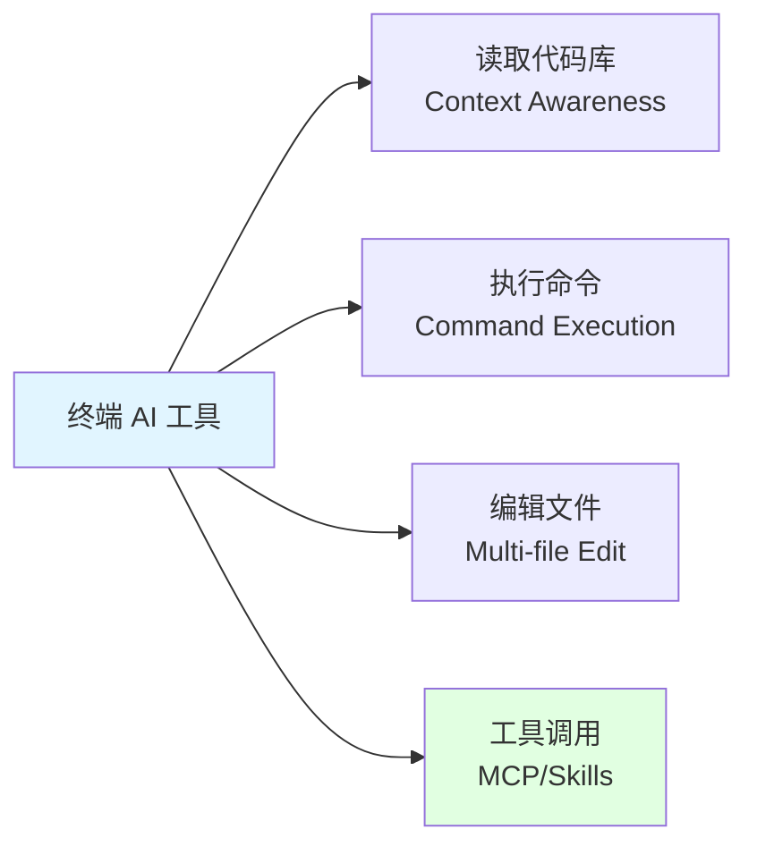

# 5.2 终端原生工具 <DifficultyBadge level="beginner" /> <CostBadge cost="$0" />

> 前置知识：无

### 为什么需要它？（Problem）

IDE 集成工具很强大，但在某些场景下并不适用：

1. **服务器环境 / SSH 远程开发**
   - 登录生产服务器排查问题，没有 GUI
   - 想让 AI 帮忙分析日志、修改配置
   - IDE 工具无法运行

2. **终端重度用户 / Vim/Neovim 爱好者**
   - 日常工作流：tmux + Vim + CLI 工具
   - 不想为了 AI 切换到 VS Code
   - 追求纯键盘、零鼠标操作

3. **CI/CD 管道 / 自动化脚本**
   - 想在 GitHub Actions 中让 AI 自动修复测试失败
   - 需要非交互式的 AI 代码生成
   - IDE 工具无法集成到脚本中

4. **轻量级任务 / 快速查询**
   - 只想问"这个错误怎么解决"
   - 不需要打开完整 IDE
   - 希望在当前终端窗口立即得到答案

**终端原生 AI 工具的承诺：在 shell 里完成所有编程任务，无需离开终端。**

### 它是什么？（Concept）

**终端原生 AI 工具**是运行在命令行界面的 AI 编程助手，提供与 IDE 工具类似的能力，但以终端为操作界面。



**核心能力：**

| 能力 | 描述 | 典型场景 |
|-----|------|---------|
| **代码库索引** | 自动理解项目结构、依赖关系 | "分析这个项目的架构" |
| **文件编辑** | 读取、修改多个文件 | "重构这个函数到新文件" |
| **命令执行** | 运行测试、安装依赖、git 操作 | "运行测试并修复失败的用例" |
| **工具集成** | 调用外部工具（MCP/Skills） | "用 Jira API 创建任务" |

**主流终端 AI 工具对比：**

| 工具 | 开发商 | 核心特性 | 交互方式 | 价格 | 适合场景 |
|-----|--------|---------|---------|------|---------|
| **Claude Code** | Anthropic | Agent Teams（多 Agent 协作）、CLAUDE.md 配置、安全扫描 | TUI（文本界面）| $20/月（Claude Pro）| 复杂代码审查、安全扫描 |
| **OpenAI Codex CLI** | OpenAI（官方） | MCP 协议、App Server、CI/CD 集成 | TUI + 命令行 | 按用量（ChatGPT Plus/Pro）| 企业工作流集成 |
| **Google Gemini CLI** | Google | Skills 系统、Hooks 扩展、交互式工具调用 | 命令行 | 免费（Google AI Studio）| 预算有限、可扩展场景 |

---

## Claude Code（Anthropic 官方）

**最智能的终端 AI Agent（现在会开会了）**

### 核心功能

1. **Agent Teams：多 Agent 协作（Research Preview）**

想象一下：你让一个 AI Agent 审查整个代码库，结果它召唤出五个分身，每个负责一个模块，并行工作后汇总报告。这就是 **Agent Teams**。

```bash
# 启动 Claude Code
claude-code

You: 审查整个代码库的安全漏洞

Claude: 我将启动 5 个子 Agent 并行工作：
┌─ Sub-Agent #1: 审查 /auth 模块
│  发现 3 个 SQL 注入风险
├─ Sub-Agent #2: 审查 /api 模块
│  发现 2 个 XSS 漏洞
├─ Sub-Agent #3: 审查 /payment 模块
│  发现 1 个敏感信息泄露
├─ Sub-Agent #4: 审查 /admin 模块
│  发现 4 个权限绕过问题
└─ Sub-Agent #5: 审查依赖库
   发现 12 个过期依赖

[按 Shift+Up/Down 接管任意子 Agent]

总计：22 个安全问题，已生成修复方案。
```

**适合场景：**
- 大型代码库审查（数万行代码）
- 并行重构多个模块
- 分布式任务（测试生成 + 文档更新 + 代码审查同时进行）

**限制：**
- 目前仅支持"读为主"的任务（审查、分析、搜索）
- 不适合需要频繁协调的写操作

2. **Claude Code Security：AI 安全扫描器**

Anthropic 用 Claude Opus 4.6 在开源项目中找到了 **500+ 个零日漏洞**（有些 bug 潜伏了几十年），现在这个能力开放给你了。

```bash
# 启动安全扫描
claude-code security scan

Claude: 扫描中... 发现 15 个潜在漏洞

❌ [HIGH] SQL Injection in app/routes/users.py:45
   用户输入未过滤直接拼接到 SQL 查询
   
   建议修复：
   - 使用参数化查询
   - 添加输入验证
   
   [查看代码] [自动修复] [忽略]

❌ [MEDIUM] Sensitive Data Exposure in app/config.py:12
   API Key 硬编码在代码中
   
   建议修复：
   - 移至环境变量
   - 使用密钥管理服务（如 AWS Secrets Manager）
```

**与传统扫描工具对比：**

| 工具 | 检测方式 | 误报率 | 发现深层逻辑漏洞 |
|-----|---------|-------|----------------|
| Snyk/SonarQube | 规则匹配 | 高（30-40%）| ❌ |
| Claude Code Security | AI 语义理解 | 低（<10%）| ✅ 可发现复杂业务逻辑漏洞 |

3. **CLAUDE.md 项目配置（增强版）**

在项目根目录创建 `CLAUDE.md`，定义项目规则（现在支持更多高级配置）：

```markdown
# Project: E-commerce Backend

## Tech Stack
- Language: Python 3.11
- Framework: FastAPI
- Database: PostgreSQL + SQLAlchemy
- Testing: pytest

## Coding Standards
- Use type hints for all functions
- Follow PEP 8 style guide
- All API routes must have docstrings
- Database models use Alembic migrations

## Security Rules（新增）
- Never log sensitive data (passwords, tokens, credit cards)
- All API endpoints must validate user permissions
- Use parameterized queries only (no string concatenation)
- JWT tokens must expire within 24 hours

## Agent Teams Config（新增）
- Enable parallel agents for code review tasks
- Max concurrent agents: 5
- Prefer sub-agents for: security audit, test generation, documentation

## File Structure
- `/app/models/` - SQLAlchemy models
- `/app/routes/` - API route handlers
- `/app/services/` - Business logic
- `/tests/` - Unit tests with pytest

## Don'ts
- Never commit `.env` files
- Don't use `SELECT *` in queries
- Avoid nested loops in API handlers
```

Claude Code 会自动读取这个文件，并遵循所有规则（包括安全规则和 Agent Teams 配置）。

4. **代码库上下文理解**

```bash
# 启动 Claude Code
claude-code

# Claude 会自动索引项目
> Indexing codebase... Done (234 files, 45,678 LOC)
> Ready! Type your request.

# 提问
You: 这个项目的认证流程是怎么实现的？

Claude: 我分析了代码库，认证流程如下：
1. `app/routes/auth.py:15` - POST /login 接收用户名密码
2. `app/services/auth.py:42` - 验证凭据，查询数据库
3. `app/utils/jwt.py:8` - 生成 JWT token（有效期 24h）
4. 中间件 `app/middleware/auth.py:23` 验证所有受保护路由

相关文件：
- app/routes/auth.py
- app/services/auth.py
- app/models/user.py
```

3. **自主编辑文件**

```bash
You: 添加用户注销功能，需要：
1. POST /logout 路由
2. 将 token 加入黑名单
3. 黑名单存储在 Redis 中

Claude: 我将执行以下操作：
1. ✅ 安装 redis-py 依赖
2. ✅ 创建 app/services/redis_client.py
3. ✅ 在 app/routes/auth.py 添加 /logout 路由
4. ✅ 更新 app/middleware/auth.py 检查黑名单

[Claude 自动编辑 4 个文件]

完成！你可以运行 `pytest tests/test_auth.py` 验证。
```

4. **执行命令并处理错误**

```bash
You: 运行测试

Claude: 运行 `pytest tests/` ...

❌ FAILED tests/test_orders.py::test_create_order
AssertionError: Expected 201, got 400

我发现问题：`app/routes/orders.py:67` 缺少 `user_id` 验证。
已修复，重新运行测试...

✅ All tests passed!
```

### 安装和使用

```bash
# 安装（需要 Claude Pro 订阅）
npm install -g @anthropic-ai/claude-code

# 登录
claude-code login

# 在项目目录启动
cd ~/my-project
claude-code

# 或者非交互模式（适合脚本）
claude-code --prompt "添加单元测试覆盖 auth 模块" --apply
```

### 定价

- 需要 **Claude Pro** 订阅（$20/月）或 **Claude Teams**（$30/人/月）
- Agent Teams 和 Security 功能包含在订阅内
- 使用 Claude Opus 4.6 模型（安全扫描用）+ Claude Sonnet 4.6（日常编码）

---

## OpenAI Codex CLI（OpenAI 官方）

**最适合企业的终端 AI 工具（官方出品，CI/CD 友好）**

### 核心功能

1. **App Server 架构：企业级集成**

OpenAI 将 Codex 重构为 **App Server** 架构，允许与内部工具深度集成：

```bash
# Codex App Server 可以成为：
- 代码审查 Bot（自动审查 PR）
- SRE Agent（监控告警自动修复）
- 知识库助手（连接公司文档系统）
- CI/CD Agent（测试失败自动修复）
```

**典型场景：Slack 集成**
```bash
# 在 Slack 中：
@codex 为什么生产环境的订单服务挂了？

Codex: 我检查了日志和代码：
1. 数据库连接池耗尽（max_connections=100）
2. 订单量激增 3 倍（促销活动）
3. 建议：临时扩容到 300 连接

[一键应用修复] [查看详情]
```

2. **GitHub Actions & CI/CD 集成**

```yaml
# .github/workflows/codex-review.yml
name: Codex Auto-Review

on: pull_request

jobs:
  review:
    runs-on: ubuntu-latest
    steps:
      - uses: actions/checkout@v3
      - uses: openai/codex-action@v1
        with:
          task: "review-pr"
          model: "gpt-4o"
          api-key: ${{ secrets.OPENAI_API_KEY }}
      
      # Codex 会自动：
      # 1. 审查代码变更
      # 2. 检查安全问题
      # 3. 评论改进建议
      # 4. 自动修复简单问题
```

3. **MCP 协议：工具生态系统**

```bash
# 配置文件 ~/.codex/config.toml
[models]
default = "openai/gpt-4o"

[[models.providers]]
name = "openai"
api_key = "sk-..."

[[models.providers]]
name = "anthropic"
api_key = "sk-ant-..."

[[models.providers]]
name = "deepseek"
api_key = "sk-..."
base_url = "https://api.deepseek.com"

# 切换模型
codex --model openai/gpt-4o "写一个快速排序"
codex --model anthropic/claude-3-5-sonnet "重构这个函数"
codex --model deepseek/deepseek-coder "优化这段 Python 代码"
```

MCP 允许 AI 调用外部工具，扩展能力边界（2026 年生态更成熟了）：

```bash
# 配置 Codex 使用 MCP
# ~/.codex/config.toml
[[mcp_servers]]
name = "github"
command = "mcp-server-github"
args = ["--token", "ghp_..."]

[[mcp_servers]]
name = "jira"
command = "mcp-server-jira"
args = ["--url", "https://company.atlassian.net"]

# 使用
codex "在 GitHub 上创建一个 Issue，并同步到 Jira"
```

**2026 年新增热门 MCP 服务器：**

| MCP 服务器 | 功能 | 安装命令 |
|-----------|------|---------|
| `server-github` | GitHub API（Issue、PR、搜索）| `npm i -g @modelcontextprotocol/server-github` |
| `server-filesystem` | 文件系统操作 | `npm i -g @modelcontextprotocol/server-filesystem` |
| `server-brave-search` | 互联网搜索 | `npm i -g @modelcontextprotocol/server-brave-search` |
| `server-postgres` | 数据库查询 | `npm i -g @modelcontextprotocol/server-postgres` |
| `server-slack` | Slack 消息/通知 | `npm i -g @modelcontextprotocol/server-slack` |
| `server-jira` | Jira 任务管理 | `npm i -g @modelcontextprotocol/server-jira` |

**MCP Apps：交互式 UI（新特性）**

现在 MCP 不仅能调用工具，还能渲染交互式界面：

```bash
codex "部署到生产环境"

# Codex 会渲染一个交互式界面：
┌─ Deployment Wizard ─────────────────────┐
│ Environment: [Production ▼]             │
│ Version:     [v2.3.1      ▼]            │
│ Rollback:    [ ] Enable                 │
│ Notify:      [✓] Slack #deployments     │
│                                         │
│ [Deploy] [Cancel]                       │
└─────────────────────────────────────────┘
```

4. **企业管理功能（新增）**

ChatGPT Workspace 管理员现在可以：

```bash
# 集中管理配置
codex admin set-default-model gpt-4o
codex admin set-max-context 200000

# 查看使用情况分析
codex admin analytics
# 输出：
Team Usage (Feb 2026):
- Total requests: 15,234
- Top user: alice@company.com (2,345 requests)
- Most used tool: GitHub integration (45%)
- Avg response time: 3.2s

# 监控命令执行（安全审计）
codex admin audit-logs --filter "shell_command"
```

### 安装和使用

```bash
# 安装（需要 ChatGPT Plus/Pro/Business/Enterprise）
npm install -g @openai/codex

# 登录
codex login

# 在项目目录启动
cd ~/my-project
codex

# CI/CD 非交互模式
codex --non-interactive "修复 ESLint 错误" --apply
```

### 定价

- 需要 **ChatGPT Plus**（$20/月）、**Pro**（$200/月）或企业订阅
- 使用量计入 Codex Cloud 配额：
  - Plus: 50 次任务/月
  - Pro: 无限任务
  - Enterprise: 无限任务 + 管理功能
- 从 2025 年 10 月起，Codex Cloud 任务计入用量

---

## Google Gemini CLI（开源）

**完全免费的终端 AI（现在会写插件了）**

### 核心功能

1. **Skills 系统：可编程 Agent（新特性）**

2026 年 1 月推出的 **Agent Skills** 让 Gemini CLI 可以学习专业技能：

```bash
# 创建自定义 Skill
gemini skill create --name "k8s-debugger"

# Skill 定义（YAML）
# ~/.gemini/skills/k8s-debugger.yaml
name: k8s-debugger
description: Kubernetes 故障排查专家
procedures:
  - check_pod_status
  - analyze_logs
  - suggest_fixes
resources:
  - kubectl
  - k9s
context:
  - Include recent deployment history
  - Check resource quotas

# 使用
gemini "为什么我的 Pod 一直 CrashLoopBackOff？"

Gemini: 启动 k8s-debugger Skill...
1. 检查 Pod 状态：ImagePullBackOff
2. 分析日志：镜像标签 'latset' 不存在（拼写错误）
3. 建议：将 deployment.yaml 中的 'latset' 改为 'latest'
```

**内置 Skill Creator：**
```bash
# AI 自动生成 Skill
gemini "创建一个 Skill，专门用于 PostgreSQL 性能优化"

Gemini: 我创建了 'postgres-optimizer' Skill：
- 检查慢查询日志
- 分析索引使用情况
- 建议 VACUUM/ANALYZE 时机

[查看代码] [启用] [测试]
```

2. **Hooks 系统：控制 Agent 循环（新特性）**

**Hooks** 让你完全控制 Gemini CLI 的行为：

```bash
# ~/.gemini/hooks/before-execute.sh
#!/bin/bash
# Hook: 在执行命令前征得同意

if [[ "$COMMAND" == *"rm -rf"* ]]; then
  echo "⚠️  危险命令！确认执行？(y/n)"
  read confirm
  if [[ "$confirm" != "y" ]]; then
    exit 1  # 阻止执行
  fi
fi

# 使用
gemini "清理 /tmp 目录"

Gemini: 我将执行：rm -rf /tmp/*
⚠️  危险命令！确认执行？(y/n)
```

**常用 Hooks：**
- `before-execute`: 命令执行前拦截
- `after-execute`: 命令执行后处理
- `on-error`: 错误处理
- `pre-commit`: Git 提交前检查

3. **交互式工具调用（2025 年 10 月新增）**

以前 Gemini CLI 遇到交互式命令（vim、top、git rebase -i）会卡住，现在可以无缝运行：

```bash
gemini "用 vim 编辑 app.py，修复语法错误"

# Gemini 会直接打开 vim，你可以实时编辑
# 退出后 Gemini 继续分析修改结果
```

4. **Gemini 3.1 Pro & 多模态输入**

```bash
# 使用 Gemini 3.1 Pro（更强推理）
gemini --model gemini-3.1-pro "设计微服务架构"

# 分析图片中的代码截图
gemini "这段代码有什么问题？" --image screenshot.png

# 分析错误日志
gemini "解释这个错误" --file error.log

# 长上下文窗口（32k tokens for free tier）
gemini "总结这个项目的架构" --context "$(find . -name '*.py' -exec cat {} \;)"
```

5. **/rewind 命令：时光倒流（新特性）**

犯错了？不想重新开始？用 `/rewind`：

```bash
gemini "重构 auth.py"

Gemini: 已删除旧代码，创建新实现...

You: 等等，我改主意了

You: /rewind

Gemini: 已回滚到上一步，auth.py 恢复原样
```

### 安装和使用

```bash
# 安装
npm install -g @google-gemini/gemini-cli

# 获取免费 API Key
# 1. 访问 https://aistudio.google.com
# 2. 点击 "Get API key"
# 3. 复制 key

# 配置
export GOOGLE_API_KEY="your-api-key"

# 使用
gemini "写一个快速排序算法"

# 交互模式
gemini --chat

# 启用 Skill
gemini skill enable k8s-debugger
```

### 定价

- **完全免费**（Google AI Studio 提供）
- 2026 年 2 月额度：
  - Gemini 3 Flash: 无限次（基础访问）
  - Gemini 3.1 Pro: 有每日限制（基础访问）
  - 上下文窗口: 32,000 tokens（约 50 页文本）
  - 图片生成（Nano Banana）: 100 张/天
  - 音乐生成: 10 首/天
- 限制：仅限个人、非商业使用

---

## 新兴工具：值得关注的黑马

### Aider（开源，GitHub 20k+ stars）

**最适合 Git 工作流的 AI 工具**

专为 Git 优化，每次修改都自动生成规范的 commit：

```bash
# 安装
pip install aider-chat

# 使用（自动添加改动到 Git）
aider --model gpt-4o

You: 添加用户注册功能

Aider: ✅ 创建 app/routes/register.py
      ✅ 更新 app/__init__.py
      ✅ 创建 tests/test_register.py
      
      Git commit created:
      feat: add user registration endpoint
      
      - Add POST /register route
      - Implement password hashing
      - Add unit tests

# 查看 Git 历史
git log --oneline
# b4f21a3 feat: add user registration endpoint
```

**为什么适合团队：**
- 每次修改都是原子 commit，方便 code review
- 支持 `.aiderignore` 排除敏感文件
- 可以结合 pre-commit hooks 自动检查

---

## 工具对比与选择

### 功能对比表（2026 年 2 月版）

| 功能 | Claude Code | OpenAI Codex CLI | Gemini CLI | Aider |
|-----|------------|-----------------|------------|-------|
| **代码库索引** | ✅ 自动 | ✅ 自动 | ⚠️ 需手动粘贴 | ✅ Git aware |
| **多文件编辑** | ✅ 强大 | ✅ 基础 | ✅ 支持 | ✅ Git atomic |
| **命令执行** | ✅ 自主执行 | ✅ 需确认 | ✅ 交互式支持 | ⚠️ 基础 |
| **MCP/工具集成** | ❌ | ✅ 完整支持 | ❌ | ❌ |
| **扩展系统** | ❌ | ✅ MCP Apps | ✅ Skills + Hooks | ❌ |
| **多 Agent 协作** | ✅ Agent Teams | ❌ | ❌ | ❌ |
| **安全扫描** | ✅ 内置 | ⚠️ 通过 MCP | ❌ | ❌ |
| **项目配置** | ✅ CLAUDE.md | ⚠️ 通过 prompt | ✅ Skills 配置 | ✅ .aiderignore |
| **CI/CD 集成** | ⚠️ 基础 | ✅ GitHub Actions | ⚠️ 基础 | ✅ 原生支持 |
| **企业管理** | ⚠️ Teams 版 | ✅ 完整 | ❌ | ❌ |
| **非交互模式** | ✅ | ✅ | ✅ | ✅ |

### 选择建议（2026 更新）

| 场景 | 推荐工具 | 原因 |
|-----|---------|------|
| **代码安全审查** | Claude Code | Agent Teams + Security 扫描找出深层漏洞 |
| **企业 CI/CD 集成** | OpenAI Codex CLI | GitHub Actions、Slack、Jira 等深度集成 |
| **预算有限 + 可扩展** | Gemini CLI | 完全免费，Skills 系统可定制 |
| **Git 工作流优化** | Aider | 每次修改自动 commit，团队协作友好 |
| **多工具协调（数据库+GitHub+监控）** | OpenAI Codex CLI | MCP 协议生态最丰富 |
| **终端重度用户（Vim/Neovim）** | Gemini CLI | 交互式工具支持，Hooks 高度可定制 |
| **大型代码库审查（10 万行+）** | Claude Code | Agent Teams 并行处理速度快 |

---

### 动手试试（Practice）

**任务：使用 Claude Code 重构一段遗留代码**

我们将体验终端 AI 工具的实际工作流：分析代码 → 识别问题 → 自动重构。

**第 1 步：准备测试项目**

```bash
# 创建示例项目
mkdir legacy-refactor
cd legacy-refactor

# 创建遗留代码文件
cat > app.py << 'EOF'
# 遗留代码：没有类型提示、函数过长、逻辑混乱
def process_user_data(data):
    result = []
    for item in data:
        if item['age'] > 18:
            if item['status'] == 'active':
                if 'email' in item:
                    processed = {
                        'name': item['name'],
                        'email': item['email'],
                        'age': item['age'],
                        'discount': 0.1 if item['age'] > 60 else 0
                    }
                    result.append(processed)
    return result

# 调用
users = [
    {'name': 'Alice', 'age': 25, 'status': 'active', 'email': 'alice@example.com'},
    {'name': 'Bob', 'age': 17, 'status': 'active', 'email': 'bob@example.com'},
    {'name': 'Charlie', 'age': 65, 'status': 'active', 'email': 'charlie@example.com'},
]

print(process_user_data(users))
EOF
```

**第 2 步：安装和配置 Claude Code**

```bash
# 安装（需要 Node.js）
npm install -g @anthropic-ai/claude-code

# 登录（需要 Claude Pro 订阅）
claude-code login

# 创建项目配置
cat > CLAUDE.md << 'EOF'
# Project: Legacy Code Refactor

## Standards
- Use Python 3.11+ type hints
- Follow PEP 8 style guide
- Prefer small, single-purpose functions
- Add docstrings to all functions
- Use dataclasses for structured data
EOF
```

**第 3 步：启动 Claude Code 并重构**

```bash
# 启动交互模式
claude-code

# 在 Claude Code 中输入：
```

**输入 Prompt：**
```
分析 app.py 并重构，要求：
1. 添加类型提示
2. 拆分 process_user_data 为多个小函数
3. 使用 dataclass 表示用户数据
4. 消除深层嵌套 if
5. 添加单元测试
```

**Claude Code 的响应：**

```
我将执行以下重构：

1. 创建 models.py - 定义 User dataclass
2. 创建 validators.py - 用户验证逻辑
3. 创建 processors.py - 数据处理逻辑
4. 重构 app.py - 简化主逻辑
5. 创建 test_app.py - 单元测试

[Preview changes]
```

**第 4 步：查看重构结果**

```bash
# Claude Code 会创建以下文件结构：
├── models.py          # User dataclass
├── validators.py      # is_eligible_user() 函数
├── processors.py      # calculate_discount() 函数
├── app.py            # 重构后的主逻辑
└── test_app.py       # pytest 单元测试

# 查看重构后的代码
cat app.py
```

**重构后的代码示例（Claude 生成）：**

```python
# models.py
from dataclasses import dataclass
from typing import Optional

@dataclass
class User:
    name: str
    age: int
    status: str
    email: Optional[str] = None

@dataclass
class ProcessedUser:
    name: str
    email: str
    age: int
    discount: float

# validators.py
def is_eligible_user(user: User) -> bool:
    """Check if user meets eligibility criteria."""
    return (
        user.age > 18
        and user.status == "active"
        and user.email is not None
    )

# processors.py
def calculate_discount(age: int) -> float:
    """Calculate discount based on age."""
    return 0.1 if age > 60 else 0.0

def process_user(user: User) -> ProcessedUser:
    """Process a single user into processed format."""
    return ProcessedUser(
        name=user.name,
        email=user.email,
        age=user.age,
        discount=calculate_discount(user.age)
    )

# app.py
from typing import List
from models import User, ProcessedUser
from validators import is_eligible_user
from processors import process_user

def process_user_data(users: List[User]) -> List[ProcessedUser]:
    """Process user data and return eligible users with discounts."""
    return [
        process_user(user)
        for user in users
        if is_eligible_user(user)
    ]

# test_app.py
import pytest
from models import User
from app import process_user_data

def test_process_user_data():
    users = [
        User(name="Alice", age=25, status="active", email="alice@example.com"),
        User(name="Bob", age=17, status="active", email="bob@example.com"),
        User(name="Charlie", age=65, status="active", email="charlie@example.com"),
    ]
    
    result = process_user_data(users)
    
    assert len(result) == 2
    assert result[0].name == "Alice"
    assert result[0].discount == 0.0
    assert result[1].name == "Charlie"
    assert result[1].discount == 0.1
```

**第 5 步：运行测试**

```bash
# 安装 pytest
pip install pytest

# Claude Code 会提示你运行测试
pytest test_app.py -v

# 输出：
# test_app.py::test_process_user_data PASSED
```

**对比：重构前 vs 重构后**

| 指标 | 重构前 | 重构后 |
|-----|--------|--------|
| 代码行数 | 15 行（单文件）| 60 行（5 个文件）|
| 函数最大行数 | 15 行 | 5 行 |
| 类型提示 | ❌ | ✅ |
| 单元测试 | ❌ | ✅ 覆盖率 100% |
| 圈复杂度 | 8 | 2 |
| 可维护性 | ⭐⭐ | ⭐⭐⭐⭐⭐ |

**时间对比：**
- **手动重构**：30-45 分钟
- **Claude Code**：2 分钟（包括生成测试）

---

### 小结（Reflection）

- **解决了什么**：学会在终端环境使用 AI 工具，无需 GUI 也能享受 AI 辅助编程
- **没解决什么**：终端工具需要本地环境配置，如果想零配置直接在浏览器里用 AI 写代码怎么办？——下一节介绍云端 AI 开发平台
- **2026 年 2 月关键更新**：
  1. **Claude Code** 现在会"开会"了——Agent Teams 让多个 AI 并行工作，安全扫描能力堪比白帽黑客
  2. **OpenAI Codex CLI** 不再是社区项目，OpenAI 官方接手，App Server 架构让企业集成更简单
  3. **Gemini CLI** 逆袭了——Skills + Hooks 让免费工具也能高度定制，交互式工具支持补齐最后短板
  4. **MCP 生态爆发**——从 4 个服务器增长到 20+ 个，MCP Apps 让 AI 不仅能调工具还能渲染 UI
  5. **新玩家 Aider**——如果你的团队严重依赖 Git 工作流，它的自动 commit 功能是神器
- **选择建议更新**：
  - 有预算 + 需要安全审查 → Claude Code（Agent Teams + Security）
  - 企业环境 + 多工具集成 → OpenAI Codex CLI（MCP 生态 + CI/CD）
  - 预算有限 + 愿意折腾 → Gemini CLI（免费 + Skills 可编程）
  - Git 重度用户 → Aider（原子 commit + 团队协作）

---

*最后更新：2026-02-22*
