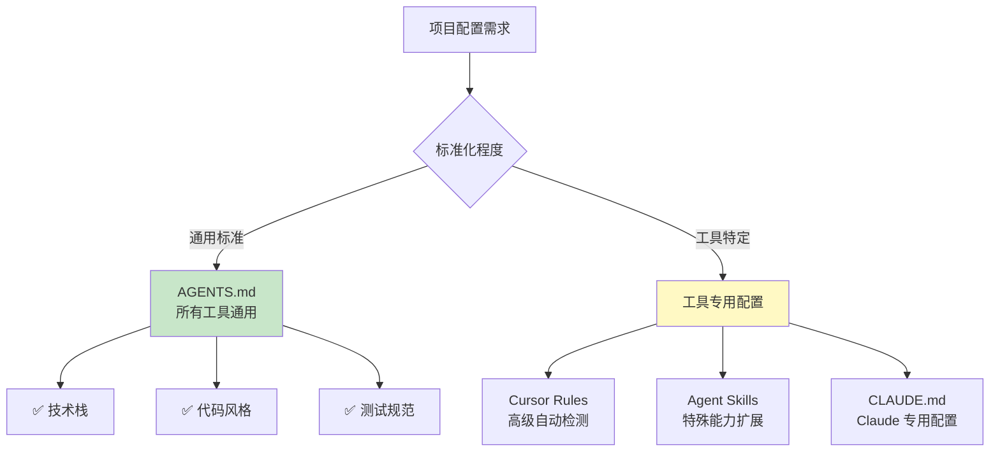

# 6.2 AGENTS.md 标准

<DifficultyBadge level="intermediate" />
<CostBadge cost="$0" />

**前置知识**：[6.1 Context Engineering 概念](./index.md)

> **把 AGENTS.md 想象成 AI 的入职手册**：新来的 AI 同事第一天上班，看这份文档就知道该怎么干活了。

---

### Why：为什么需要 AGENTS.md？

#### 问题场景：配置文件的"军阀混战"

你的团队有 5 个人，但用着 5 种 AI 工具：

- 小王用 **GitHub Copilot**
- 小李用 **Cursor**
- 小张用 **Claude Code**
- 小赵用 **Codex CLI**
- 小孙用 **VS Code + Continue**

每个工具都需要配置"项目规范"：

```
Copilot    → .github/copilot-instructions.md
Cursor     → .cursorrules
Claude     → CLAUDE.md
Codex      → codex.md
Continue   → .continuerc.json
```

**结果**：
- ❌ 同一个规范要写 5 遍
- ❌ 小王更新了 Copilot 配置，小李的 Cursor 不知道
- ❌ 新人入职不知道该看哪个文件

**痛点**：**工具碎片化导致配置重复和不同步**。

::: warning 真实故事
某创业公司，3 个工程师用 3 种 AI 工具，写了 3 份配置。结果代码风格混乱得像"三国志"——每个人的代码都有自己的"国号"。后来 CTO 怒了：统一用 AGENTS.md！
:::

#### 解决方案：AGENTS.md

> **AGENTS.md 是一个开放标准，用一份文件配置所有 AI 编程助手。**

就像：
- `README.md` 是给人类看的项目说明书
- `AGENTS.md` 是给 AI 看的"入职手册"

**特点**：
- ✅ **厂商中立（Vendor-Neutral）**：所有主流 AI 工具都支持
- ✅ **一次编写，到处运行**：一份配置，Copilot、Cursor、Claude 都能读
- ✅ **社区标准**：已被 60,000+ 开源项目采用
- ✅ **版本管理**：随代码一起提交，团队自动同步

::: tip 类比：AI 时代的"宪法"
如果你的项目是一个国家，AGENTS.md 就是宪法——定义了基本规则，所有"公民"（AI 工具）都得遵守。
:::

**类比**：

| 人类工程师 | AI 工程师 |
|-----------|----------|
| README.md | AGENTS.md |
| CONTRIBUTING.md | AGENTS.md |
| 入职文档 | AGENTS.md |
| 代码规范手册 | AGENTS.md |

**一句话总结**：AGENTS.md = AI 的"新员工培训手册"，写一次，全团队受益。

### What：AGENTS.md 是什么？

#### 1. 官方定义

AGENTS.md 是一个 **Markdown 格式的项目配置文件**，告诉 AI：

- 这个项目用什么技术栈
- 代码风格是什么
- 如何运行和测试
- 安全注意事项
- 提交代码的规范

**官方网站**：[agents.md](https://agents.md)

**GitHub 仓库**：[github.com/aisd-gg/agents-md](https://github.com/aisd-gg/agents-md)

#### 2. AGENTS.md 的标准结构

根据官方规范，AGENTS.md 包含以下部分：

::: tip 把 AGENTS.md 想象成"家规"
就像每个家庭都有自己的规矩（"鞋子脱门口"、"晚饭前洗手"），AGENTS.md 定义了你项目的"家规"——AI 来你家干活，得先学会这些规矩。
:::

```markdown
# AGENTS.md

## 项目概述（Overview）
简短介绍项目是做什么的

## 技术栈（Tech Stack）
列出使用的语言、框架、工具

## 开发环境设置（Setup）
如何安装依赖、启动项目

## 代码风格（Code Style）
命名规范、格式化工具、最佳实践

## 测试（Testing）
测试框架、命令、覆盖率要求

## 项目结构（Project Structure）
目录组织、文件命名规则

## 安全（Security）
敏感信息处理、权限控制

## Git 工作流（Git Workflow）
分支策略、提交信息规范

## AI 协作规范（AI Guidelines）
AI 工具的特殊说明和限制
```

**一句话总结**：AGENTS.md 的结构就像一本"员工手册"——从入职到干活，该知道的都在这儿。

#### 3. 支持 AGENTS.md 的工具

| 工具 | 支持状态 | 优先级 |
|-----|---------|-------|
| **Cursor** | ✅ 原生支持 | 高于 .cursorrules |
| **GitHub Copilot** | ✅ 2024 年 11 月起支持 | 高于 .github/copilot-instructions.md |
| **Claude Code** | ✅ 自动读取 | 等同于 CLAUDE.md |
| **Codex CLI** | ✅ 自动读取 | 等同于 codex.md |
| **Continue** | ✅ 通过配置支持 | - |
| **Kilo Code** | ✅ 原生支持 | - |
| **Windsurf** | ✅ 原生支持 | - |

**读取顺序**（以 Cursor 为例）：

```
1. 检查项目根目录是否有 AGENTS.md
2. 如果有，优先使用 AGENTS.md
3. 如果没有，回退到 .cursorrules（已废弃）
```

#### 4. AGENTS.md vs 其他配置文件



**建议策略**：
- **AGENTS.md**：写通用的项目规范（90% 的内容）
- **工具配置**：写工具特有的高级功能（10% 的内容）

### How：编写一个完整的 AGENTS.md

#### 实战：为一个 Next.js 项目编写 AGENTS.md

**项目背景**：
- 技术栈：Next.js 14 + TypeScript + Tailwind CSS
- 数据库：PostgreSQL + Prisma
- 测试：Vitest + Testing Library
- 部署：Vercel

#### 完整的 AGENTS.md 示例

```markdown
# AGENTS.md

## 项目概述

一个基于 Next.js 的全栈博客系统，支持 Markdown 文章发布、评论、标签分类。

**目标用户**：个人博主、技术写作者  
**核心功能**：文章 CRUD、Markdown 渲染、全文搜索、RSS 订阅

---

## 技术栈

### 前端
- **框架**：Next.js 14 (App Router)
- **语言**：TypeScript 5.3
- **样式**：Tailwind CSS 3.4 + shadcn/ui
- **状态管理**：Zustand 4.5
- **表单**：React Hook Form + Zod

### 后端
- **运行时**：Node.js 20 + Next.js Server Actions
- **数据库**：PostgreSQL 16 + Prisma ORM 5.x
- **认证**：NextAuth.js 5
- **文件存储**：Vercel Blob

### 工具链
- **包管理**：pnpm 9.x
- **代码检查**：ESLint + Prettier + TypeScript
- **测试**：Vitest + Testing Library + Playwright
- **CI/CD**：GitHub Actions + Vercel

---

## 开发环境设置

### 前置要求
- Node.js 20+
- pnpm 9+
- PostgreSQL 16+ (本地或 Docker)

### 安装步骤

\`\`\`bash
# 1. 克隆仓库
git clone https://github.com/yourname/blog.git
cd blog

# 2. 安装依赖
pnpm install

# 3. 配置环境变量
cp .env.example .env.local
# 编辑 .env.local，填写数据库 URL 和密钥

# 4. 初始化数据库
pnpm db:push
pnpm db:seed

# 5. 启动开发服务器
pnpm dev
\`\`\`

### 常用命令

| 命令 | 说明 |
|-----|------|
| `pnpm dev` | 启动开发服务器 (http://localhost:3000) |
| `pnpm build` | 构建生产版本 |
| `pnpm start` | 启动生产服务器 |
| `pnpm test` | 运行单元测试 |
| `pnpm test:e2e` | 运行 E2E 测试 |
| `pnpm lint` | 代码检查 |
| `pnpm format` | 代码格式化 |
| `pnpm db:push` | 同步 Prisma schema 到数据库 |
| `pnpm db:studio` | 打开 Prisma Studio |

---

## 代码风格

### 通用规范
- ✅ 使用 **TypeScript**，禁止 `any` 类型
- ✅ 函数优先使用 **箭头函数**
- ✅ 用 **命名导出** 而非默认导出（除了 Next.js 页面）
- ✅ 组件用 **PascalCase**，函数用 **camelCase**
- ✅ 常量用 **UPPER_SNAKE_CASE**

### React 规范
- ✅ 函数组件 + Hooks（禁止 Class 组件）
- ✅ 组件文件名与组件名一致：`UserCard.tsx` → `export function UserCard()`
- ✅ 一个文件一个组件（除非是紧密相关的子组件）
- ✅ Props 类型用 `interface` 定义：`interface UserCardProps { ... }`

### 文件组织
\`\`\`
src/
├── app/              # Next.js App Router 页面
│   ├── (auth)/       # 认证相关页面（路由组）
│   ├── blog/         # 博客页面
│   └── api/          # API 路由
├── components/       # React 组件
│   ├── ui/           # 基础 UI 组件 (shadcn/ui)
│   ├── blog/         # 博客相关组件
│   └── layout/       # 布局组件
├── lib/              # 工具函数、配置
│   ├── db.ts         # Prisma client
│   ├── auth.ts       # NextAuth 配置
│   └── utils.ts      # 通用工具函数
├── hooks/            # 自定义 Hooks
├── types/            # TypeScript 类型定义
└── styles/           # 全局样式
\`\`\`

### 命名规范
- **组件**：`<UserProfile />`, `<BlogPostCard />`
- **页面**：`app/blog/[id]/page.tsx`
- **API**：`app/api/posts/route.ts`
- **工具函数**：`formatDate()`, `calculateReadingTime()`
- **Hooks**：`useUser()`, `useBlogPosts()`
- **类型**：`interface User {}`, `type PostStatus = 'draft' | 'published'`

### Tailwind CSS 规范
- ✅ 使用 Tailwind 类名，避免自定义 CSS（除非必要）
- ✅ 用 `cn()` 工具函数合并类名（来自 `lib/utils.ts`）
- ✅ 复杂样式提取为组件变体（使用 `class-variance-authority`）

示例：
\`\`\`tsx
import { cn } from '@/lib/utils';

export function Button({ className, variant = 'default', ...props }) {
  return (
    <button
      className={cn(
        'rounded-md px-4 py-2 font-medium transition-colors',
        variant === 'default' && 'bg-blue-600 text-white hover:bg-blue-700',
        variant === 'outline' && 'border border-gray-300 hover:bg-gray-100',
        className
      )}
      {...props}
    />
  );
}
\`\`\`

---

## 测试

### 测试策略
- **单元测试**：工具函数、Hooks（Vitest）
- **组件测试**：UI 组件（Testing Library）
- **E2E 测试**：关键用户流程（Playwright）
- **覆盖率目标**：80% 以上

### 测试规范

#### 1. 单元测试（Vitest）
\`\`\`typescript
// lib/utils.test.ts
import { describe, it, expect } from 'vitest';
import { formatDate, calculateReadingTime } from './utils';

describe('formatDate', () => {
  it('formats date correctly', () => {
    const date = new Date('2024-01-15');
    expect(formatDate(date)).toBe('2024年1月15日');
  });

  it('handles invalid date', () => {
    expect(formatDate(new Date('invalid'))).toBe('无效日期');
  });
});
\`\`\`

#### 2. 组件测试（Testing Library）
\`\`\`typescript
// components/Button.test.tsx
import { render, screen } from '@testing-library/react';
import userEvent from '@testing-library/user-event';
import { describe, it, expect, vi } from 'vitest';
import { Button } from './Button';

describe('Button', () => {
  it('renders with text', () => {
    render(<Button>Click me</Button>);
    expect(screen.getByRole('button', { name: /click me/i })).toBeInTheDocument();
  });

  it('calls onClick when clicked', async () => {
    const onClick = vi.fn();
    render(<Button onClick={onClick}>Click me</Button>);
    await userEvent.click(screen.getByRole('button'));
    expect(onClick).toHaveBeenCalledOnce();
  });
});
\`\`\`

#### 3. E2E 测试（Playwright）
\`\`\`typescript
// tests/e2e/blog.spec.ts
import { test, expect } from '@playwright/test';

test('create and publish a blog post', async ({ page }) => {
  // 登录
  await page.goto('/login');
  await page.fill('[name="email"]', 'admin@example.com');
  await page.fill('[name="password"]', 'password123');
  await page.click('button[type="submit"]');

  // 创建文章
  await page.goto('/blog/new');
  await page.fill('[name="title"]', 'Test Post');
  await page.fill('[name="content"]', '# Hello World');
  await page.click('button:has-text("发布")');

  // 验证
  await expect(page).toHaveURL(/\/blog\/.+/);
  await expect(page.locator('h1')).toHaveText('Test Post');
});
\`\`\`

### 运行测试
\`\`\`bash
# 单元测试和组件测试
pnpm test                 # 运行所有测试
pnpm test:watch           # 监听模式
pnpm test:coverage        # 生成覆盖率报告

# E2E 测试
pnpm test:e2e             # 无头模式运行
pnpm test:e2e:ui          # 打开 Playwright UI
\`\`\`

---

## 项目结构

### 目录说明

| 路径 | 说明 |
|-----|------|
| `src/app/` | Next.js 14 App Router 页面和 API |
| `src/components/` | React 组件（可复用） |
| `src/lib/` | 工具函数、配置、Prisma client |
| `src/hooks/` | 自定义 React Hooks |
| `src/types/` | TypeScript 类型定义 |
| `prisma/` | Prisma schema 和迁移文件 |
| `public/` | 静态资源（图片、字体） |
| `tests/` | E2E 测试文件 |

### 重要文件

- **`AGENTS.md`**：本文件，AI 工具配置
- **`README.md`**：项目介绍（给人类看）
- **`package.json`**：依赖和脚本
- **`tsconfig.json`**：TypeScript 配置
- **`next.config.js`**：Next.js 配置
- **`tailwind.config.ts`**：Tailwind CSS 配置
- **`prisma/schema.prisma`**：数据库 schema
- **`.env.example`**：环境变量模板
- **`.eslintrc.js`**：ESLint 规则
- **`.prettierrc`**：Prettier 配置

---

## 安全

### 环境变量管理
- ✅ **所有密钥** 放在 `.env.local`，**不要** 提交到 Git
- ✅ 用 `.env.example` 提供变量模板（值用占位符）
- ✅ 生产环境密钥在 Vercel Dashboard 配置

### 敏感信息检查
\`\`\`bash
# 提交前检查是否泄露密钥
git diff | grep -E "(API_KEY|SECRET|PASSWORD|TOKEN)"
\`\`\`

### 数据库安全
- ✅ 使用 Prisma 的参数化查询（自动防 SQL 注入）
- ✅ 用户输入必须经过 Zod 验证
- ❌ 不要直接在客户端组件中查询数据库（用 Server Actions）

### 认证和授权
- ✅ API 路由和 Server Actions 必须检查 `session`
- ✅ 敏感操作（删除文章、修改用户）需要权限验证

示例：
\`\`\`typescript
// app/api/posts/[id]/route.ts
import { auth } from '@/lib/auth';

export async function DELETE(req: Request, { params }: { params: { id: string } }) {
  const session = await auth();
  if (!session) {
    return new Response('Unauthorized', { status: 401 });
  }

  // 验证用户是否有权限删除这篇文章
  const post = await db.post.findUnique({ where: { id: params.id } });
  if (post.authorId !== session.user.id) {
    return new Response('Forbidden', { status: 403 });
  }

  await db.post.delete({ where: { id: params.id } });
  return new Response(null, { status: 204 });
}
\`\`\`

---

## Git 工作流

### 分支策略
- **`main`**：生产分支，自动部署到 Vercel
- **`dev`**：开发分支，自动部署到预览环境
- **功能分支**：`feature/post-comments`, `fix/auth-bug`

### 提交信息规范（Conventional Commits）

格式：
\`\`\`
<type>(<scope>): <subject>

<body>

<footer>
\`\`\`

**Type 类型**：
- `feat`: 新功能
- `fix`: 修复 bug
- `docs`: 文档更新
- `style`: 代码格式（不影响功能）
- `refactor`: 重构（不修复 bug 也不加功能）
- `test`: 测试相关
- `chore`: 构建工具、依赖更新

**示例**：
\`\`\`
feat(blog): add comment feature

- Add Comment component
- Create API route for posting comments
- Update Post page to display comments

Closes #42
\`\`\`

### Pull Request 规范
1. **标题**：遵循 Conventional Commits
2. **描述**：
   - **What**：做了什么改动
   - **Why**：为什么要改
   - **How**：如何实现的
   - **测试**：如何测试
3. **检查清单**：
   - [ ] 测试通过
   - [ ] 代码检查通过（`pnpm lint`）
   - [ ] 更新了相关文档
   - [ ] 添加了测试用例（如果是新功能）

### 代码审查要点
- 是否符合代码规范？
- 是否有测试覆盖？
- 是否有性能问题？
- 是否有安全隐患？

---

## AI 协作规范

### 对 AI 工具的特殊说明

#### 生成代码时
1. **优先复用现有组件**：查看 `src/components/` 目录，不要重复造轮子
2. **保持风格一致**：参考同类型文件的写法
3. **生成测试**：新功能必须包含测试
4. **更新类型**：修改 API 时同步更新 `src/types/`

#### 修改代码时
1. **最小化改动**：只改必要的部分
2. **保留注释**：除非注释已过时
3. **更新文档**：如果改了 API 或配置

#### 禁止操作
- ❌ 不要修改 `package.json` 中的依赖版本（除非明确要求）
- ❌ 不要删除现有测试
- ❌ 不要提交 `.env.local` 文件
- ❌ 不要在客户端组件中直接查询数据库

#### 推荐流程
\`\`\`
1. 理解需求
2. 检查现有代码（查找类似实现）
3. 生成代码（遵循规范）
4. 编写测试
5. 运行 lint 和测试
6. 提交前检查
\`\`\`

---

## 资源链接

- **官方文档**：[nextjs.org](https://nextjs.org)
- **Prisma 文档**：[prisma.io/docs](https://www.prisma.io/docs)
- **Tailwind CSS**：[tailwindcss.com](https://tailwindcss.com)
- **shadcn/ui**：[ui.shadcn.com](https://ui.shadcn.com)

---

## 更新日志

- **2024-01-15**：创建 AGENTS.md
- **2024-01-20**：添加测试规范
- **2024-02-01**：更新 Git 工作流

---

**维护者**：[@yourname](https://github.com/yourname)  
**最后更新**：2024-02-15
```

### 最佳实践

#### 1. 保持 AGENTS.md 最新

**策略**：
- 每次改代码规范，同步更新 AGENTS.md
- 每次添加新依赖，更新"技术栈"部分
- 每次改 Git 工作流，更新"Git 工作流"部分

**自动化检查**（可选）：

```yaml
# .github/workflows/check-agents-md.yml
name: Check AGENTS.md
on: [pull_request]
jobs:
  check:
    runs-on: ubuntu-latest
    steps:
      - uses: actions/checkout@v4
      - name: Check if AGENTS.md exists
        run: |
          if [ ! -f AGENTS.md ]; then
            echo "❌ AGENTS.md not found"
            exit 1
          fi
      - name: Check if updated recently
        run: |
          # 如果 package.json 变了但 AGENTS.md 没变，警告
          if git diff --name-only HEAD~1 | grep -q "package.json"; then
            if ! git diff --name-only HEAD~1 | grep -q "AGENTS.md"; then
              echo "⚠️ package.json changed but AGENTS.md not updated"
            fi
          fi
```

#### 2. 分层配置策略

```
┌─────────────────────────────────────┐
│ AGENTS.md (90% 的规范)                │  ← 通用、跨工具
│ - 技术栈、代码风格、测试规范          │
│ - 所有 AI 工具都读取                  │
└─────────────────────────────────────┘
              ↓
┌─────────────────────────────────────┐
│ 工具专用配置 (10% 的高级功能)         │  ← 工具特定
│ - Cursor Rules: 自动检测规则          │
│ - Agent Skills: 特殊能力              │
│ - CLAUDE.md: Claude 专用配置          │
└─────────────────────────────────────┘
```

**规则**：
- **AGENTS.md**：写一次，所有人、所有工具都用
- **工具配置**：只写该工具独有的功能

#### 3. 从 .cursorrules 迁移到 AGENTS.md

如果你的项目已经有 `.cursorrules`：

```bash
# 1. 重命名文件
mv .cursorrules AGENTS.md

# 2. 调整格式（添加标准章节标题）
# 3. 提交
git add AGENTS.md .cursorrules
git commit -m "docs: migrate from .cursorrules to AGENTS.md"
```

Cursor 会自动优先读取 AGENTS.md。

#### 4. 团队协作

**入职新人**：
```bash
# 新人 clone 项目后
cat AGENTS.md
# 他的 AI 工具（无论用哪个）会自动读取这个文件
```

**团队同步**：
```bash
# 每次 git pull，所有人的 AI 工具都会用最新的规范
git pull origin main
```

### Reflection：AGENTS.md 的价值

#### 1. 解决了什么问题？

**Before**（没有 AGENTS.md）：
```
Team Member 1 (Copilot)   → 自己的 Prompt
Team Member 2 (Cursor)    → 自己的 .cursorrules
Team Member 3 (Claude)    → 自己的 CLAUDE.md
Team Member 4 (Codex)     → 自己的 codex.md

→ 4 份配置，4 种风格，互相不同步
```

**After**（有 AGENTS.md）：
```
AGENTS.md (一份文件)
   ↓
All tools (Copilot, Cursor, Claude, Codex...)
   ↓
统一风格、自动同步
```

::: tip 一句话总结
AGENTS.md = 配置界的"共同语言"，让所有 AI 工具说同一种"方言"。
:::

#### 2. AGENTS.md 是"AI 时代的 README"

| 传统开发 | AI-First 开发 |
|---------|--------------|
| README.md 告诉人类怎么用 | AGENTS.md 告诉 AI 怎么写代码 |
| CONTRIBUTING.md 告诉人类贡献规范 | AGENTS.md 告诉 AI 代码规范 |
| 人类读文档 → 写代码 | AI 读 AGENTS.md → 写代码 |

::: warning 不要小看这份文件
AGENTS.md 可能是你项目里"投资回报率"最高的文件——花 1 小时写，能省全团队 100 小时的重复解释。
:::

#### 3. 标准化的力量

**AGENTS.md 之前**：
- 每个公司自己发明配置格式
- 换个 AI 工具 = 重写配置

**AGENTS.md 之后**：
- 开源社区统一标准
- 60,000+ 项目采用
- 就像 HTML、JSON 一样，成为事实标准

**一句话总结**：写 AGENTS.md = 给 AI 发"入职 offer"，让它秒懂你的项目。

#### 4. 下一步：工具特定的高级功能

AGENTS.md 解决了 90% 的问题，但还有 10% 是工具特有的：

- **Cursor Rules**：自动检测规则、条件触发
- **Agent Skills**：给 AI 扩展特殊能力
- **CLAUDE.md**：Claude 的专用配置

👉 [下一节：Rules & Skills 体系](./rules-skills.md)

---

## 参考资源

- **官方网站**：[agents.md](https://agents.md)
- **GitHub 仓库**：[aisd-gg/agents-md](https://github.com/aisd-gg/agents-md)
- **示例项目**：[agents-md/examples](https://github.com/aisd-gg/agents-md/tree/main/examples)
- **VS Code 插件**：搜索 "AGENTS.md Validator"

---

*最后更新：2026-02-20*
