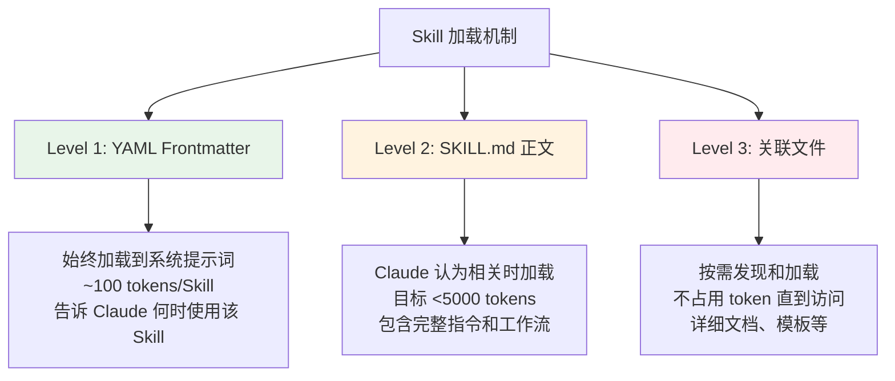
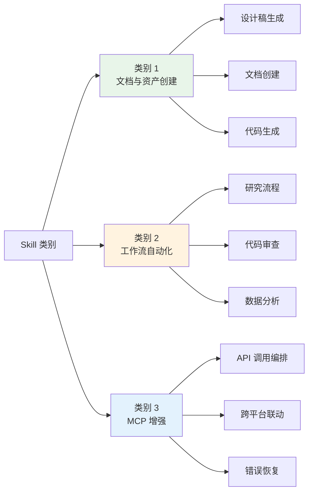

# 6.4 Claude Skills 构建指南

<DifficultyBadge level="intermediate" />
<CostBadge cost="$0" />

**前置知识**：[6.3 Rules & Skills 体系](./rules-skills.md)

> **把 Skill 想象成给 Claude 的"操作手册"**：你写一次，Claude 每次遇到类似任务都自动翻阅——再也不用每次都从头解释。

---

### Why：为什么需要 Claude Skills

#### 问题场景：重复的痛苦

你是不是经常遇到这些情况？

**场景 1**：每次让 Claude 生成文档，都要重复说一遍"用我们公司的格式"。
→ 你需要一种方式，让 Claude "记住"你的格式要求。

**场景 2**：团队 5 个人用 Claude，5 个人得到 5 种不同风格的输出。
→ 你需要统一标准，让所有人的 Claude 行为一致。

**场景 3**：你配置了 MCP 服务器，Claude 能调 API 了，但它不知道"什么时候该调哪个"。
→ 你需要给 Claude 一份"最佳实践指南"。

::: tip 类比：新员工入职
Skill 就像给新员工的 SOP 手册——不是让他变聪明，而是让他知道"我们这里怎么干活"。
:::

**核心价值**：

> **教一次，反复受益。** Skill 让你把专业知识打包成可复用的指令集，Claude 自动在合适的时机加载使用。

---

### What：Claude Skills 核心概念

#### 1. 什么是 Skill

Skill 是一组指令——打包成一个**文件夹**——教会 Claude 处理特定的任务或工作流。

**文件结构**：

```
your-skill-name/
├── SKILL.md          ← 必需：指令文件（YAML frontmatter + Markdown）
├── scripts/          ← 可选：可执行脚本（Python、Bash 等）
├── references/       ← 可选：参考文档（按需加载）
└── assets/           ← 可选：模板、字体、图标等资源
```

| 组件 | 状态 | 说明 |
|------|------|------|
| **SKILL.md** | 必需 | 包含 YAML frontmatter 和 Markdown 指令 |
| **scripts/** | 可选 | 可执行代码（Python、Bash 等） |
| **references/** | 可选 | 按需加载的参考文档 |
| **assets/** | 可选 | 输出中使用的模板、字体、图标 |

::: warning 命名铁律
- 主文件**必须**叫 `SKILL.md`——大小写敏感，不接受任何变体
- 文件夹名用 **kebab-case**（如 `frontend-design`、`meeting-notes-formatter`）
- Skill 文件夹内**不能**放 `README.md`
:::

#### 2. 三大设计原则

##### 渐进式加载（Progressive Disclosure）

Skill 使用三层加载系统，**最大限度减少 token 消耗**：



::: tip 类比：图书馆
Level 1 = 书名和简介（书架标签）→ 帮你决定要不要拿这本书
Level 2 = 目录和正文 → 你拿起来翻阅的内容
Level 3 = 附录和参考文献 → 需要深入时才查
:::

##### 可组合性（Composability）

Claude 可以**同时加载多个 Skill**。你的 Skill 应该能与其他 Skill 协同工作——不要假设它是唯一可用的能力。

##### 可移植性（Portability）

Skill 在 **Claude.ai、Claude Code 和 API** 上表现一致。创建一次，处处可用。

#### 3. Skills 与 MCP 的关系

::: tip 厨房类比
把你的 MCP + Skills 配置想象成一个专业厨房：
- **MCP 服务器** = 厨房——锅碗瓢盆、食材原料
- **Skills** = 菜谱——什么时候用哪个工具、按什么顺序、用什么技巧
:::

| 维度 | MCP（连接层） | Skills（知识层） |
|------|--------------|-----------------|
| **目的** | 工具访问和 API 连接 | 工作流指导和最佳实践 |
| **内容** | 函数定义、Schema | 指令、模式、示例 |
| **范围** | Claude **能做**什么 | Claude **应该怎么做** |
| **Token 消耗** | 工具 Schema 始终加载 | 仅在相关时加载 |

**没有 Skills 的 MCP**：
- 用户连上了 MCP，但不知道下一步干什么
- 每次使用结果不一致
- 产生大量"怎么用"的支持工单

**有 Skills 的 MCP**：
- 预置工作流自动触发
- 最佳实践内嵌其中
- 学习曲线大幅降低
- 输出结果一致且可复现

#### 4. 三大技能类别



| 类别 | 用途 | 典型示例 | 是否需要 MCP |
|------|------|---------|-------------|
| **文档与资产创建** | 生成一致的高质量输出 | 前端设计、PPT、Excel、PDF | 不需要 |
| **工作流自动化** | 多步骤流程的标准化执行 | 研究流程、代码审查、数据分析 | 可选 |
| **MCP 增强** | 在 MCP 工具之上添加工作流指导 | API 编排、跨平台联动、错误恢复 | 需要 |

---

### How：从零构建一个 Claude Skill

#### 实战 1：规划与设计

##### 第一步：定义具体用例

在写任何指令之前，先定义 **2-3 个具体用例**：

- 用户想要完成什么？
- 需要什么多步骤工作流？
- 需要哪些工具（内置或 MCP）？
- 应该内嵌什么领域知识或最佳实践？

**好的用例定义**：

> "开发者想在 ProjectHub 中创建一个新项目。需要创建项目、设置默认任务结构、配置团队权限、链接到 GitHub 仓库。Skill 应该引导 Claude 执行我们公司的标准项目初始化工作流。"

**引导问题**：
1. 用户需要什么具体结果？
2. 最常见的步骤顺序是什么？
3. 用户最常在哪里犯错？
4. 有哪些非显而易见的领域知识？

##### 第二步：制定成功标准

**定量指标**：

| 指标 | 目标 | 测量方式 |
|------|------|---------|
| 触发率 | Skill 在 ≥90% 的相关查询上激活 | 用 10+ 种不同表述测试 |
| 工具调用成功率 | 正常操作中零失败 API 调用 | 监控测试运行中的错误 |
| Token 效率 | 与基线相比使用更少的 token | 对比上下文用量 |

**定性指标**：

| 指标 | 目标 | 评估方式 |
|------|------|---------|
| 用户体验 | 用户无需纠正 Claude | 观察交互质量 |
| 一致性 | 相同输入 → 相同结构的输出 | 5+ 次运行对比 |
| 最小纠正 | 用户无需中途重新指导 | 统计中途纠正次数 |

##### 第三步：技术要求

**文件结构规则**：

```
your-skill-name/          ← kebab-case 文件夹名
├── SKILL.md              ← 必须是这个文件名（大小写敏感）
├── scripts/              ← 可选
│   └── helper.py
├── references/           ← 可选
│   └── api-docs.md
└── assets/               ← 可选
    └── template.docx
```

**关键命名规则**：
- **文件夹名**：仅使用 kebab-case（如 `frontend-design`）
- **主文件**：必须是 `SKILL.md`——大小写敏感
- Skill 文件夹内**不能有** `README.md`
- 文件夹名不能包含空格或特殊字符

**安全限制**：
- YAML frontmatter 中**不能有** XML 尖括号（`<` 或 `>`）
- Skill 名称**不能包含** `claude` 或 `anthropic`
- 不要在 SKILL.md 中直接写可执行代码（放到 `scripts/` 里）

#### 实战 2：编写 SKILL.md

##### YAML Frontmatter

Frontmatter 位于 `SKILL.md` 顶部，**始终加载**到系统提示词中。这是 Skill 最重要的部分。

**最小必需格式**：

```yaml
---
name: your-skill-name
description: What it does. Use when user asks to [specific phrases].
---
```

**完整格式（含所有可选字段）**：

```yaml
---
name: your-skill-name
description: >
  What this skill does in detail. Use when the user asks to [trigger phrase 1],
  [trigger phrase 2], or wants to [trigger phrase 3]. Handles [specific scenarios].
license: MIT
compatibility:
  claude_code: true
  claude_ai: true
  api: true
metadata:
  version: "1.0.0"
  author: "your-name"
  tags: ["category", "tool-name", "use-case"]
---
```

**字段参考表**：

| 字段 | 必需 | 最大长度 | 格式 | 说明 |
|------|------|---------|------|------|
| `name` | 是 | 64 字符 | kebab-case，仅小写字母/数字/连字符 | 不含 XML、不含 "claude"/"anthropic" |
| `description` | 是 | 1,024 字符 | 纯文本，第三人称 | 必须包含**做什么** + **何时使用** |
| `license` | 否 | — | SPDX 标识符 | 如 MIT、Apache-2.0 |
| `compatibility` | 否 | — | 布尔标志 | 声明支持的平台 |
| `metadata` | 否 | — | 自由格式 YAML 对象 | 版本、作者、标签等 |

##### Description 字段——最关键的部分

Description 决定了 **Claude 何时加载你的 Skill**。它必须回答两个问题：
1. 这个 Skill **做什么**？
2. **什么时候**应该使用它？

**结构公式**：
> "[做什么]. Use when [触发条件——短语、上下文、关键词]."

**好的示例**：

```yaml
# 前端设计 Skill
description: >
  Creates distinctive, production-grade frontend interfaces with high design
  quality. Use when building web components, pages, artifacts, posters, or
  applications.

# PDF 处理 Skill
description: >
  Extract text and tables from PDF files, fill forms, merge documents.
  Use when working with PDF files or when the user mentions PDFs, forms,
  or document extraction.

# Git Commit 助手 Skill
description: >
  Generate descriptive commit messages by analyzing git diffs.
  Use when the user asks for help writing commit messages or reviewing
  staged changes.
```

**坏的示例（避免）**：

```yaml
# 太模糊——没有触发条件
description: "Helps with documents and files."

# 人称错误（不是第三人称）
description: "I can help you create documents whenever you need."

# 描述实现而非行为
description: "The ProjectHub skill is a folder containing YAML frontmatter
  and Markdown instructions that calls our MCP server tools."
```

##### 指令正文模板

YAML frontmatter 之后，`SKILL.md` 正文包含实际指令。推荐结构：

```markdown
---
name: your-skill-name
description: What it does. Use when [triggers].
---

## Overview
[1-2 句话说明这个 Skill 做什么]

## When to use this skill
[显式列出应该触发此 Skill 的条件]

## Workflow
[编号的分步指令]

1. [第一步——具体且可执行]
2. [第二步]
3. [第三步——包含错误处理]
   - 如果发生 X，执行 Y
   - 如果发生 Z，执行 W

## Examples
[1-2 个具体示例，展示输入和预期输出]

## Error Handling
[常见失败模式和恢复方法]

## Notes
[边界情况、限制、重要注意事项]
```

##### 编写最佳实践

**DO（推荐）**：
- 具体且可执行——告诉 Claude **做什么**，而非**思考什么**
- 为每个外部调用都包含错误处理
- 用编号步骤表示有序工作流
- 通过 `references/` 引用详细文档（如 `See references/api-docs.md`）
- 保持 SKILL.md 在 **500 行以内**——超出部分放到关联文件中
- 用祈使语气写指令（"创建项目"、"调用 API"、"格式化输出"）

**DON'T（避免）**：
- 解释 Claude 已经知道的东西（什么是 API、什么是 JSON）
- 包含不影响行为的冗长背景
- 在 SKILL.md 和关联文件之间重复内容
- 假设其他 Skill 存在
- 在 frontmatter 中使用 XML 标签
- 在 description 中用第一或第二人称

##### 自由度匹配表

根据任务的脆弱性和变化性匹配指令的具体程度：

| 自由度 | 格式 | 适用场景 |
|--------|------|---------|
| **高** | 自然语言指令 | 存在多种有效方法；适合 Claude 自行判断 |
| **中** | 伪代码 / 参数化模板 | 有首选模式但允许一些变化 |
| **低** | 精确脚本和特定命令序列 | 操作脆弱、易出错或需要完全一致 |

::: tip 类比：桥与旷野
自由度就像一座有悬崖的桥——安全通道越窄，护栏就需要越精确。开阔的旷野只需要一个指南针方向。
:::

#### 实战 3：完整示例

##### 示例 1：会议纪要格式化（独立 Skill，类别 1）

```markdown
---
name: meeting-notes-formatter
description: >
  Formats raw meeting notes into a structured document with action items,
  decisions, and follow-ups clearly organized. Use when the user wants to
  clean up or format meeting notes, action items, or meeting summaries.
license: MIT
compatibility:
  claude_ai: true
  claude_code: true
  api: true
metadata:
  version: "1.0.0"
  tags: ["meetings", "documents", "formatting"]
---

## Overview
Converts raw or bullet-point meeting notes into a structured, professional
document format with clearly delineated sections.

## When to use
- User provides unformatted meeting notes and asks to clean/format them
- User asks to extract action items from meeting notes
- User wants to create a shareable meeting summary

## Workflow

1. **Parse the input** — identify participants, date/time, and topics discussed
2. **Extract structured elements:**
   - Decisions made (marked with [DECISION])
   - Action items (owner + deadline)
   - Open questions / parking lot items
3. **Format the output** using this structure:

   # Meeting Notes: [Title]
   Date: [Date] | Attendees: [Names]

   ## Summary
   [2-3 sentence summary]

   ## Decisions
   - [Decision 1]

   ## Action Items
   | Owner | Action | Due Date |
   |-------|--------|----------|
   | Name  | Task   | Date     |

   ## Open Questions
   - [Question 1]

4. **Ask for clarification** if critical information is missing
5. **Present the formatted output** and offer to refine

## Error Handling
- If no clear decisions exist: include "No formal decisions recorded"
- If no action items exist: include "No action items recorded"
- If notes are very brief: produce best-effort output and note limitations
```

##### 示例 2：GitHub PR 工作流（MCP 增强，类别 3）

```markdown
---
name: github-pr-workflow
description: >
  Manages the complete GitHub pull request workflow including creating PRs,
  requesting reviews, responding to feedback, and merging. Use when the user
  asks to create a PR, open a pull request, request code review, or manage
  GitHub pull requests.
license: MIT
compatibility:
  claude_code: true
metadata:
  version: "1.0.0"
  tags: ["github", "git", "code-review", "workflow"]
---

## Overview
Guides Claude through the complete GitHub PR lifecycle using the GitHub MCP
server tools.

## Prerequisites
- GitHub MCP server must be connected
- User must have write access to the target repository

## When to use
- Creating a new pull request from a feature branch
- Requesting reviews on an existing PR
- Responding to review feedback
- Merging an approved PR

## Workflow: Creating a PR

1. **Gather context:**
   - Confirm the source branch and target branch
   - Ask for PR title if not provided
   - Ask for description if not provided

2. **Generate PR content:**
   - Create a summary of changes (from git diff if available)
   - List key changes in bullet points
   - Note any breaking changes or migration steps

3. **Create the PR** using `create_pull_request` tool:
   - title: user-provided or generated
   - body: formatted description
   - base: target branch
   - head: source branch

4. **Request reviews** if reviewers specified:
   - Use `request_review` tool for each reviewer
   - Confirm success and share PR URL

5. **Confirm completion:**
   - Output PR URL
   - Summarize what was created

## Error Handling
- If `create_pull_request` fails: check branch names; confirm MCP is connected
- If branch not found: ask user to confirm branch name
- If permissions error: note that write access is required
```

#### 实战 4：测试与迭代

##### 三层测试

| 层级 | 环境 | 适用场景 |
|------|------|---------|
| **手动测试** | Claude.ai | 快速迭代，无需配置 |
| **脚本测试** | Claude Code | 跨版本可重复验证 |
| **程序化测试** | API | 系统化评估，CI/CD 集成 |

根据 Skill 的使用范围匹配测试力度：个人使用 → 手动测试即可；团队/企业部署 → 脚本或程序化测试。

##### 触发测试

**目标**：确保 Skill 在正确的时机加载，且**仅**在那些时机加载。

```
应该触发（≥10 种表述）：
- "帮我格式化这份会议纪要"
- "把这些笔记整理成结构化文档"
- "提取会议中的行动项"
- "清理一下这份会议记录"
- ...

不应该触发（≥5 种）：
- "今天天气怎么样？"
- "帮我写 Python 代码"
- "创建一个 Excel 表格"
- ...
```

**通过标准**：≥90% 正向触发率，0% 误触发率。

##### 功能测试

```
测试：创建包含 5 个任务的项目
给定：项目名称 "Q4 Planning"，5 个任务描述
当：  Skill 执行工作流
则：
  - 项目在 ProjectHub 中创建成功
  - 5 个任务创建成功且属性正确
  - 所有任务关联到项目
  - 无 API 错误
  - 输出匹配预期格式
```

##### 性能对比

```
没有 Skill：
  - 用户每次都要提供说明
  - 15 轮来回对话
  - 3 次 API 调用失败需要重试
  - 消耗 12,000 tokens

有 Skill：
  - 自动执行工作流
  - 仅 2 个澄清问题
  - 0 次 API 调用失败
  - 消耗 6,000 tokens
```

##### skill-creator 工具

在 Claude.ai 中可以使用内置的 **skill-creator** 工具：

```
"Use the skill-creator skill to help me build a skill for [你的用例]"
```

**能力**：
- **创建**：从自然语言描述生成 Skill，输出格式化的 `SKILL.md`
- **审查**：标记常见问题（模糊描述、缺失触发词、过度/不足触发风险）
- **迭代**：根据边界情况和失败优化 Skill 内容

::: tip 15-30 分钟搞定
使用 skill-creator，预计 15-30 分钟即可构建并测试你的第一个 Skill。
:::

##### 常见问题迭代策略

**问题 1：欠触发（Skill 不加载）**

| 信号 | 解决方案 |
|------|---------|
| Skill 该触发时没触发 | 在 `description` 中添加更多触发短语和关键词变体 |
| 用户需要手动启用 | 增加技术关键词和用户实际使用的表述 |

**问题 2：过触发（不相关查询也触发）**

| 信号 | 解决方案 |
|------|---------|
| 不相关查询也加载 Skill | 在 description 中添加否定上下文，缩窄触发范围 |
| 用户因此禁用 Skill | 更具体地限定触发短语 |

**问题 3：执行不一致**

| 信号 | 解决方案 |
|------|---------|
| 跨运行结果不一致 | 提高步骤具体性 |
| API 调用失败 | 为每个 API 步骤添加显式错误处理 |
| 用户需要中途纠正 | 优化工作流顺序 |

::: warning 迭代策略
先在一个**有挑战性的任务**上反复迭代，直到 Claude 能稳定成功。然后把成功的方法提取到 Skill 中。这比一开始就写大而全的 Skill 更有效。
:::

#### 实战 5：发布与分享

##### GitHub 发布（推荐）

```
my-skill-repo/
├── README.md          ← 人类文档（在 Skill 文件夹外面）
└── my-skill-name/     ← 实际的 Skill 文件夹
    └── SKILL.md
```

::: warning README 的位置
`README.md` 放在仓库根目录，**不要放在 Skill 文件夹内**——放在里面会导致加载机制出错。
:::

**README.md 应该包含**：
- Skill 的用途（面向用户的描述）
- 前置条件（MCP 服务器、环境配置等）
- 安装说明
- 使用示例
- 许可证信息

##### 与 MCP 捆绑发布

```
my-mcp-server/
├── README.md
├── server/            ← MCP 服务器代码
└── skills/
    └── my-workflow-skill/
        └── SKILL.md
```

##### 版本管理

- 在 YAML frontmatter 的 `metadata.version` 字段中使用语义化版本
- 用 Git tag 标记稳定版本
- 在 README.md 中记录破坏性变更

---

### 进阶：五大设计模式

以下模式来自早期采用者和内部团队的实践经验，代表已验证有效的常见方法。

#### 模式 1：顺序工作流（Sequential Workflow）

**适用场景**：文档创建流水线、入职工作流、有序数据处理

```markdown
## Workflow
1. 收集输入（向用户询问 X、Y、Z）
2. 验证输入（检查完整性）
3. 执行步骤 A
4. 用 A 的输出执行步骤 B
5. 格式化并交付最终输出
6. 向用户确认成功
```

**关键技巧**：让每一步的输出成为下一步的显式输入，每一步都定义"完成"的标准。

#### 模式 2：多 MCP 协调（Multi-MCP Coordination）

**适用场景**：跨平台工作流（如 GitHub + Linear + Slack）

```markdown
## Workflow
1. 从 [MCP Server A] 用 [tool_name] 获取数据
2. 转换数据以匹配 [MCP Server B] 的格式
3. 在 [MCP Server B] 中创建/更新记录
4. 通过 [MCP Server C] 通知相关人员
5. 在 [MCP Server A] 中记录完成状态
```

**关键技巧**：在每一步明确指定调用哪个 MCP 工具，并为任何单个 MCP 不可用时提供回退指令。

#### 模式 3：迭代优化（Iterative Refinement）

**适用场景**：创意生成、质量敏感的输出

```markdown
## Workflow
1. 生成初始输出
2. 对照检查清单评估：
   - [ ] 标准 A 是否满足？
   - [ ] 标准 B 是否满足？
   - [ ] 标准 C 是否满足？
3. 如果标准未满足：修改并从步骤 2 重新开始
4. 所有标准满足后：呈现给用户
5. 吸收用户反馈，必要时再次迭代
```

**关键技巧**：在 Skill 中嵌入明确的质量标准，并定义最大迭代次数以防止无限循环。

#### 模式 4：上下文感知工具选择（Context-Aware Tool Selection）

**适用场景**：跨多个用例的自适应工作流

```markdown
## Decision Logic
If the user provides [signal A]: use [approach 1]
If the user provides [signal B]: use [approach 2]
If context is unclear: ask clarifying question before proceeding

## Tool Selection
- For [input type X]: call [tool_name_1]
- For [input type Y]: call [tool_name_2]
- For [input type Z]: use Claude's built-in capabilities
```

**关键技巧**：明确决策标准。模糊的"自行判断"指令会导致行为不一致。

#### 模式 5：领域专家智能（Domain-Specific Intelligence）

**适用场景**：品牌风格一致性、合规工作流、专业技术领域

```markdown
## Domain Context
[2-3 段 Claude 默认不具备的核心领域知识]

## Standards and Conventions
- 规则 1：[具体、可执行的规则]
- 规则 2：[具体、可执行的规则]
- 规则 3：[具体、可执行的规则]

## Reference Materials
See references/brand-guide.md for complete style specifications.
See references/compliance-checklist.md for regulatory requirements.
```

**关键技巧**：用 `references/` 目录存放深度领域材料。SKILL.md 只写高层原则和指针，让 Claude 在需要时才加载深度内容。

---

### Reflection

#### Quick Checklist

**构建前**：
- [ ] 定义了 2-3 个具体用例
- [ ] 确定了目标用户（个人 / 团队 / 社区）
- [ ] 制定了定量和定性成功标准
- [ ] 选择了 Skill 类别（文档创建 / 工作流自动化 / MCP 增强）

**SKILL.md 结构**：
- [ ] 文件名正好是 `SKILL.md`（大小写敏感）
- [ ] YAML frontmatter 格式正确
- [ ] `name` 字段：kebab-case，≤64 字符，无保留词
- [ ] `description` 字段：≤1,024 字符，包含做什么 + 何时使用，第三人称
- [ ] frontmatter 中无 XML 尖括号
- [ ] 正文控制在 500 行以内；超出部分放到 `references/`
- [ ] 步骤有编号、有顺序
- [ ] 每个外部调用都有错误处理

**文件夹结构**：
- [ ] 文件夹名是 kebab-case
- [ ] Skill 文件夹内没有 `README.md`
- [ ] 可执行代码放在 `scripts/`
- [ ] 详细参考文档放在 `references/`
- [ ] 模板资源放在 `assets/`

**测试**：
- [ ] 测试了 ≥10 种触发短语——确认 ≥90% 激活率
- [ ] 测试了 ≥5 种"不应触发"查询——确认 0% 误触发
- [ ] 核心工作流的功能测试通过
- [ ] 用模拟失败测试了错误处理
- [ ] 与基线（无 Skill）做了性能对比

**发布**：
- [ ] 在 Skill 文件夹外添加了 `README.md`
- [ ] 记录了前置条件
- [ ] 包含安装说明
- [ ] 声明了许可证
- [ ] 用 Git tag 标记了版本

#### 反模式与疑难排查表

| 反模式 | 为什么有问题 | 修复方法 |
|--------|------------|---------|
| 模糊描述（"Helps with documents"） | Skill 永远不触发或过度触发 | 添加具体的 "Use when..." 触发短语 |
| 巨型 SKILL.md（1000+ 行） | 浪费 token；Claude 全部加载 | 把细节移到 `references/`，SKILL.md 保持精简 |
| 假设其他 Skill 存在 | 破坏可组合性 | 每个 Skill 自包含 |
| 在 SKILL.md 中内联脚本 | 无法独立版本控制/更新 | 移到 `scripts/` |
| Skill 文件夹内放 README.md | 破坏加载机制 | 删除；README 放仓库根目录 |
| 第一人称描述（"I can help you..."） | Claude 会混淆身份 | 改写为第三人称 |
| API 调用无错误处理 | Skill 脆弱，静默失败 | 为每个 API 步骤添加 "If X fails, do Y" |
| 跳过测试 | 生产环境静默失败 | 至少跑触发测试 + 功能测试 |

| 症状 | 可能原因 | 修复方法 |
|------|---------|---------|
| Skill 从不触发 | description 太模糊 | 用显式 "Use when..." 重写 description |
| 不相关查询也触发 | description 太宽泛 | 缩窄触发短语；添加否定上下文 |
| Claude 忽略步骤顺序 | 步骤不够明确 | 编号步骤；使用 "first"、"then"、"only after" |
| API 调用间歇性失败 | 无错误处理 | 为每个 API 步骤添加 "If this call fails, do X" |
| 输出格式不一致 | 无格式规范 | 在 SKILL.md 中添加明确的输出格式和示例 |
| Claude.ai 可用但 Claude Code 不行 | 环境依赖 | 检查 `compatibility` 字段；添加环境说明 |
| Skill 太慢（token 太多） | SKILL.md 正文太大 | 把细节移到 `references/`；应用渐进式加载 |

#### 15-30 分钟快速构建路径

| 阶段 | 时间 | 任务 |
|------|------|------|
| 规划 | 1-5 分钟 | 定义 2 个用例、成功标准 |
| Frontmatter | 6-10 分钟 | 编写 YAML frontmatter（重点打磨 description） |
| 正文 | 11-20 分钟 | 编写 SKILL.md 正文（工作流步骤、错误处理） |
| 触发测试 | 21-25 分钟 | 测试触发（10 个正向短语、5 个反向短语） |
| 功能测试 | 26-30 分钟 | 测试功能输出；根据需要迭代 description |

::: tip 一句话总结
Claude Skills 的核心就三步：**定义触发条件**（description）→ **编写工作流**（SKILL.md 正文）→ **测试并迭代**。掌握了这三步，你就能把任何重复性工作变成 Claude 的自动化流程。
:::

👉 [下一节：Vibe Coding 与 AI-First 开发流](./vibe-coding.md)

---

## 参考资源

- **Anthropic 官方指南（PDF）**：[The Complete Guide to Building Skills for Claude](https://resources.anthropic.com/hubfs/The-Complete-Guide-to-Building-Skill-for-Claude.pdf)
- **官方 Skills 仓库**：[github.com/anthropics/skills](https://github.com/anthropics/skills)
- **Skills 概述（API 文档）**：[platform.claude.com/docs/skills/overview](https://platform.claude.com/docs/en/agents-and-tools/agent-skills/overview)
- **Skills 最佳实践**：[platform.claude.com/docs/skills/best-practices](https://platform.claude.com/docs/en/agents-and-tools/agent-skills/best-practices)
- **Skills Cookbook**：[platform.claude.com/cookbook/skills-introduction](https://platform.claude.com/cookbook/skills-notebooks-01-skills-introduction)
- **MCP 协议**：[modelcontextprotocol.io](https://modelcontextprotocol.io)

---

*最后更新：2026-02-28*
