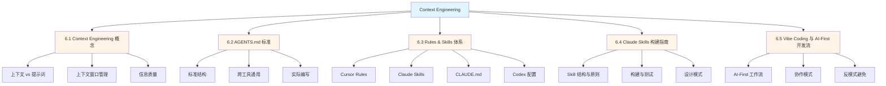
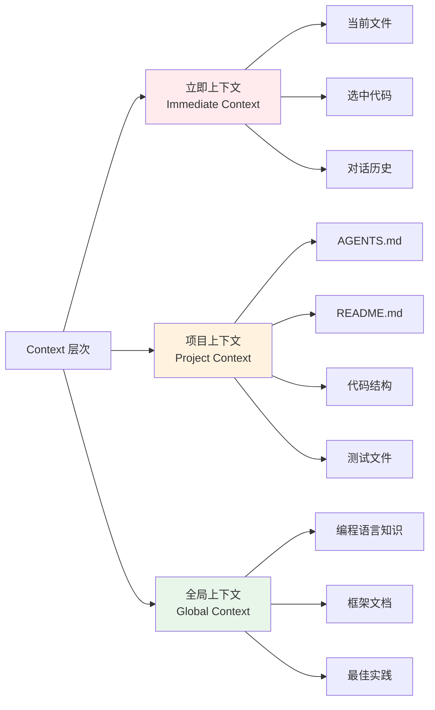
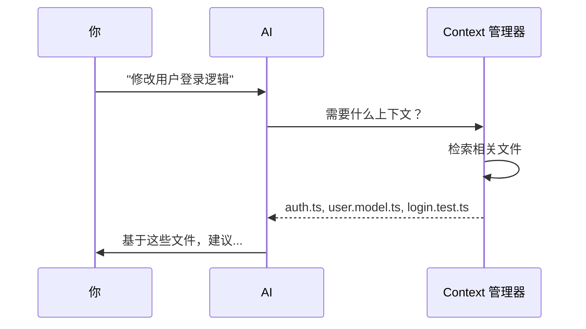

# 第 6 章：Context Engineering

> 学完本章，你能：理解上下文工程，为项目编写 AGENTS.md，配置各工具规则

## 本章概念图



---

## 6.1 Context Engineering 概念

<DifficultyBadge level="intermediate" />
<CostBadge cost="$0.01" />

> **把 Context 想象成给 AI 的工作便签**：上面写着你项目的所有"记不住但很重要"的事情。

### Why：为什么 Context 比 Prompt 更重要？

想象一下你和 AI 的对话像极了这个场景：

```
你："帮我重构这个函数"
AI："请提供函数代码"
你：*复制粘贴 100 行代码*
AI："这个函数依赖什么？"
你：*又复制粘贴依赖*
AI："你们的代码规范是什么？"
你："……算了，我自己改"
```

这不是 AI 笨，而是它像个**失忆症患者**——每次对话都得从头介绍自己。

::: tip 一个残酷的真相
你精心雕琢一个小时的 Prompt，不如花 10 分钟写份好的 Context 文档。就像约会：外表（Prompt）很重要，但内涵（Context）才是长久之道。
:::

**核心矛盾**：Prompt 写得再好，AI 不了解你的代码库也没用。

就像面试一样：
- **Prompt**（提示词）= 面试官的问题："请介绍一下你的项目经验"
- **Context**（上下文）= 候选人的简历、作品集、GitHub 主页

问题问得再巧妙（Prompt 工程），候选人什么背景都不了解（缺乏 Context），也答不出好答案。

**Context 工程比 Prompt 工程更重要**：
- ✅ 好 Context + 简单 Prompt = 准确输出
- ❌ 差 Context + 完美 Prompt = 胡说八道

### What：什么是 Context Engineering？

#### 1. 定义对比

| 维度 | Prompt Engineering | Context Engineering |
|------|-------------------|---------------------|
| **关注点** | 如何问问题 | 提供什么背景信息 |
| **输入** | 单次对话的指令 | 代码库、文档、历史 |
| **时效** | 即时生效 | 持续积累 |
| **范围** | 一个请求 | 整个项目 |
| **类比** | 问题的措辞 | 考试前的复习资料 |

#### 2. Context 的三个层次



**立即上下文（Immediate Context）**：
- 当前文件内容
- 你选中的代码
- 刚才的几轮对话

**项目上下文（Project Context）**：
- 项目配置文件（AGENTS.md, package.json, tsconfig.json）
- README 和文档
- 代码结构和命名规范
- 测试用例

**全局上下文（Global Context）**：
- 编程语言的语法知识
- 框架和库的文档
- 通用的最佳实践

#### 3. Context Window 管理

AI 模型有"记忆容量"限制：

```
GPT-4.1:   1M tokens        (约 750K 字)
Claude 4.6: 200K tokens（Beta 1M）  (约 150K 字)
Gemini:    1M tokens        (约 750K 字)
```

**问题**：一个中型项目就有几万行代码，不可能全部塞进去。

**解决思路**：像人类一样，只记住"相关的"信息。

::: warning AI 的"记忆力"陷阱
就像你不会把整本字典背下来一样，AI 也不需要知道你项目的每一行代码。聪明的做法是**按需加载**——需要什么查什么，就像你用 Google 一样。
:::



**关键技术**：
- **RAG（检索增强生成）**：先搜索相关代码，再生成答案
- **智能切块（Chunking）**：把大文件拆成小块，只加载需要的
- **优先级排序**：AGENTS.md > 当前文件 > 依赖文件

#### 4. 为什么 Context 质量比 Prompt 技巧更重要？

**实验对比**：

```python
# 实验：让 AI 生成一个登录表单

# ❌ 场景 A：完美 Prompt + 零 Context
Prompt: """
请用 React + TypeScript 生成一个登录表单组件，
要求：表单验证、错误提示、可访问性、单元测试
"""
Context: （无）

# ✅ 场景 B：简单 Prompt + 丰富 Context  
Prompt: "生成登录表单"
Context:
  - AGENTS.md（项目用 Ant Design, Zod 验证, Testing Library）
  - components/Button.tsx（了解现有组件风格）
  - utils/validation.ts（知道验证工具函数）
  - tests/Form.test.tsx（明白测试写法）
```

**结果**：
- 场景 A：生成的代码风格不一致，引入新库，测试框架不同
- 场景 B：代码直接可用，风格统一，依赖已有工具

**核心原理**：
> **在正确的时间，喂给 AI 正确的信息**  
> Context Engineering is about feeding the right information at the right time.

::: tip 一句话总结
Context = 给 AI 的"工作便签"，写得越清楚，AI 干活越靠谱。
:::

### How：动手实验 Context 的影响

#### 实验 1：Context 长度的影响

**步骤**：

1. 创建测试文件 `/tmp/context-test.ts`

```typescript
// 一个有 bug 的函数
function calculateDiscount(price: number, userType: string) {
  if (userType === "vip") {
    return price * 0.8;
  }
  return price;
}
```

2. **测试 A：无 Context**

```
Prompt: "这个函数有什么问题？"
```

AI 可能回答："看起来没问题，VIP 打 8 折，普通用户原价"

3. **测试 B：添加业务 Context**

创建 `context.md`：

```markdown
## 业务规则
- VIP 用户：8 折
- 会员用户：9 折  
- 普通用户：原价
- 学生用户：85 折
```

```
Prompt: "根据业务规则，这个函数有什么问题？"
Context: context.md
```

AI 会发现：
- ❌ 缺少"会员"和"学生"用户的处理
- ❌ 没有输入验证（price 可能是负数）
- ❌ 没有类型枚举（userType 是字符串，容易拼错）

4. **测试 C：添加代码库 Context**

创建 `types.ts`：

```typescript
// 现有类型定义
export enum UserType {
  VIP = "VIP",
  MEMBER = "MEMBER", 
  REGULAR = "REGULAR",
  STUDENT = "STUDENT"
}

export const DISCOUNT_RATES: Record<UserType, number> = {
  [UserType.VIP]: 0.8,
  [UserType.MEMBER]: 0.9,
  [UserType.REGULAR]: 1.0,
  [UserType.STUDENT]: 0.85
};
```

```
Prompt: "这个函数有什么问题？"
Context: context.md, types.ts
```

AI 会建议：

```typescript
import { UserType, DISCOUNT_RATES } from './types';

function calculateDiscount(price: number, userType: UserType): number {
  if (price < 0) {
    throw new Error('Price cannot be negative');
  }
  return price * DISCOUNT_RATES[userType];
}
```

**对比结果**：

| Context 级别 | 发现问题数 | 代码质量 | 复用现有代码 |
|-------------|-----------|----------|-------------|
| 无 Context   | 0         | ⭐⭐      | ❌          |
| + 业务文档   | 3         | ⭐⭐⭐    | ❌          |
| + 代码库     | 5         | ⭐⭐⭐⭐⭐ | ✅          |

#### 实验 2：Context 质量的影响

**场景**：让 AI 为 React 组件写测试

**测试 A：模糊 Context**

```markdown
# AGENTS.md
测试框架：Jest
```

AI 可能生成：

```javascript
// 使用 enzyme, 老式写法
import { shallow } from 'enzyme';
test('renders', () => {
  const wrapper = shallow(<LoginForm />);
  expect(wrapper.find('input').length).toBe(2);
});
```

**测试 B：精确 Context**

```markdown
# AGENTS.md
## 测试规范
- 框架：Vitest + Testing Library  
- 命名：describe/it 而非 test
- 查询优先级：ByRole > ByLabelText > ByTestId
- 断言：@testing-library/jest-dom

## 示例
\`\`\`typescript
import { render, screen } from '@testing-library/react';
import userEvent from '@testing-library/user-event';

describe('Button', () => {
  it('handles click', async () => {
    const onClick = vi.fn();
    render(<Button onClick={onClick}>Click me</Button>);
    await userEvent.click(screen.getByRole('button'));
    expect(onClick).toHaveBeenCalledOnce();
  });
});
\`\`\`
```

AI 会生成符合规范的测试：

```typescript
import { render, screen } from '@testing-library/react';
import userEvent from '@testing-library/user-event';
import { describe, it, expect, vi } from 'vitest';
import { LoginForm } from './LoginForm';

describe('LoginForm', () => {
  it('submits with valid credentials', async () => {
    const onSubmit = vi.fn();
    render(<LoginForm onSubmit={onSubmit} />);
    
    await userEvent.type(
      screen.getByLabelText(/email/i),
      'user@example.com'
    );
    await userEvent.type(
      screen.getByLabelText(/password/i),
      'password123'
    );
    await userEvent.click(
      screen.getByRole('button', { name: /sign in/i })
    );
    
    expect(onSubmit).toHaveBeenCalledWith({
      email: 'user@example.com',
      password: 'password123'
    });
  });
});
```

**对比**：Context 质量决定了 AI 生成代码的"风格匹配度"。

#### 实验 3：可视化 Context 的作用

```mermaid
graph LR
    A[你的 Prompt:<br/>"写一个按钮组件"] --> B{Context 检测}
    
    B -->|无 Context| C1[生成<br/>< button >]
    B -->|有 AGENTS.md| C2[导入 Button<br/>from './Button']
    B -->|有 Figma 链接| C3[按照设计稿<br/>生成完整组件]
    
    C1 --> D1[需要你手动调整]
    C2 --> D2[直接复用]
    C3 --> D3[开箱即用]
    
    style C3 fill:#c8e6c9
    style C2 fill:#fff9c4
    style C1 fill:#ffcdd2
```

### Reflection：Context 工程的启示

#### 1. Context 是"喂"给 AI 的简历

把 Context 想象成**给 AI 准备的备忘录**：

- Prompt 是你临时提的问题（"这个 bug 怎么修？"）
- Context 是 AI 桌上的参考手册（项目规范、技术栈、代码风格）
- 背景越完善，回答越精准
- 一次配置（写好 AGENTS.md），到处使用

::: tip 一句话总结
写一次 Context = 省下一千次重复解释。
:::

#### 2. Context 的优先级

```
配置文件（AGENTS.md）> 当前文件 > 相关文件 > 文档 > 通用知识
```

**原因**：越具体的信息，对当前任务越有用。

#### 3. 从 Prompt 工程到 Context 工程的转变

**旧思维**（Prompt 工程）：
```
"你是一个精通 React 的高级工程师，请用 TypeScript 和函数式编程风格，
考虑性能优化和可访问性，生成一个复用性强、可测试的按钮组件……"
```
每次都要重复这一大段。

**新思维**（Context 工程）：
```
// 在 AGENTS.md 里写一次
技术栈：React 18 + TypeScript
代码风格：函数式、Hooks
质量要求：性能优化、a11y、测试覆盖

// 以后只需要简单 Prompt
"生成一个按钮组件"
```

#### 4. 下一步：标准化 Context

问题：5 个人用 5 种 AI 工具，项目约定要写 5 遍？

解决方案：**AGENTS.md**——一份配置，所有 AI 工具通用。

::: warning 不要重复造轮子
如果你团队里有人用 Cursor，有人用 Copilot，有人用 Claude……难道要写三份配置文件吗？不！AGENTS.md 一次搞定所有工具。下一节告诉你怎么做。
:::

**一句话总结**：Context Engineering = 用最少的文字，让 AI 理解最多的事情。

👉 [下一节：AGENTS.md 标准](./agents-md.md)

---

## 过渡：从"管理上下文"到"调用工具"

到目前为止，我们学的都是如何**把信息喂给 AI**——写好 Prompt，管好 Context，让 AI 更准确地理解你的意图。

但你有没有想过：**如果 AI 能自己去查数据库、调 API、发邮件呢？**

打个比方：
- **前 6 章**：你教 AI 读懂了菜谱（Context），还教它根据你的口味调整（Prompt）
- **下一章**：你要给 AI 一把锅铲，让它自己炒菜

这就是 **Function Calling（函数调用）**——AI 从"只会说"变成"会干活"的关键一步。

大致流程长这样（伪代码，下一章会讲真实实现）：

```
你: "北京今天天气怎么样?"

AI 内心: "这个问题我需要查天气数据，我有一个 get_weather 工具可以用"

AI → 你的代码: "请帮我调用 get_weather(city='北京')"

你的代码 → 天气 API: 查询北京天气

天气 API → AI: "15°C，晴"

AI → 你: "北京今天天气晴朗，气温 15°C，适合出门！"
```

**别被"函数调用"四个字吓到**——如果你会写 `def get_weather(city):` 这样的 Python 函数，你就已经具备了理解 Function Calling 的全部基础。

::: tip 下一章预告
第 7 章会从零开始教你实现 Function Calling，包含完整可运行的代码。你只需要会基础 Python + 理解 JSON 格式（就是 `{"key": "value"}` 这种东西）就够了。
:::

---

*最后更新：2026-02-20*
