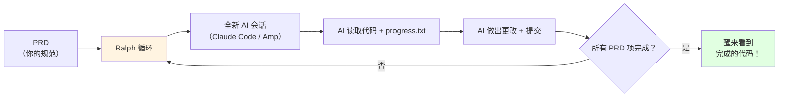

# 6.6 Ralph Wiggum 模式

<DifficultyBadge level="intermediate" />
<CostBadge cost="$0.50-5.00" />

> **前置章节**：6.1 上下文工程概念、5.1 AI 编码工具

> **把 Ralph 想象成"AI 夜班工人"**：你睡前布置任务，醒来代码就写好了——但它可能会"加班加到破产"。

---

### 为什么需要它？（问题）

#### 场景：AI 的"失忆症"

你有过这样的经历：

1. 用 Claude Code / Cursor 开始一个复杂的编码任务
2. 工作 30 分钟，进展顺利
3. 上下文窗口填满，AI 开始"忘记"之前的决策
4. 你关闭会话，去睡觉
5. 醒来，开始新会话......AI 完全不知道你在做什么

::: warning 残酷的真相
AI 的"记忆"是论 token 计费的，不是论天数的。就像《记忆碎片》的主角，每次醒来都得重新"纹身"来记住发生的事。
:::

**根本问题**：AI 编码会话是**短暂的**。会话结束时上下文就死了。你的 AI 短期记忆以 token 计量，而不是天数。

**如果你能设置一个任务，去睡觉，然后醒来发现 AI 一夜之间完成了它呢？**

::: tip 为什么叫"Ralph Wiggum"？
以《辛普森一家》中的 Ralph Wiggum 命名——那个可爱天真、以纯真决心坚持做事的角色。这个模式体现了这种精神：不断尝试、不断循环、永不放弃，偶尔说出令人惊讶的精彩话语。

创建者 Geoffrey Huntley："软件现在是陶器轮上的粘土。如果不对劲，就把它扔回轮子上重新做。"
:::

**一句话总结**：Ralph = 给 AI 装上"永动机"，让它不睡觉地干活——但得小心你的信用卡。

### 它是什么？（概念）

#### Ralph = AI 的"无限循环打工模式"

**Ralph Wiggum 模式** = 一个自主编码循环，其中：

1. 你编写一个 **PRD**（产品需求文档）作为 JSON/Markdown 规范
2. 一个**shell 脚本**反复将 PRD 喂给 AI 编码代理
3. 每次迭代都是一个**全新的上下文**（没有记忆污染）
4. **记忆通过 git 持久化** — 代理读取代码变更，而非对话历史
5. **进度在文件中跟踪**（`progress.txt`），在迭代间持久化

::: tip 类比：AI 版的"土拨鼠之日"
就像电影《土拨鼠之日》，AI 每天醒来都"失忆"了，但世界（代码库）保留了昨天的变化——通过 git 提交记录。
:::



**关键洞察**：Ralph 不维护对话上下文，而是使用 **git 作为记忆**。每次循环迭代都从头开始，但代理读取代码库（包含所有先前工作）和一个跟踪完成内容的 `progress.txt` 文件。

::: warning Git = AI 的"日记本"
就像《记忆碎片》的主角用纹身记事，Ralph 用 git commit 记录每一步——即使 AI "失忆"了，代码库还"记得"。
:::

**一句话总结**：Ralph = AI + 无限循环 + Git 记忆 = 睡前布置任务，醒来收成果。

```bash
# 简化的 Ralph 循环（实际实现）
while true; do
    # 检查是否所有 PRD 项完成
    if all_items_done; then
        echo "全部完成！去检查你的代码。"
        exit 0
    fi
    
    # 用全新上下文运行 AI 代理
    claude-code --message "读取 prd.json 和 progress.txt。\
        完成下一个未勾选的项。\
        完成后更新 progress.txt。\
        提交你的更改。"
    
    # 下一次迭代前等待片刻
    sleep 5
done
```

**Ralph vs 其他模式：**

|| 模式 | 记忆 | 人工参与 | 持续时间 | 最适合 |
||------|------|----------|----------|--------|
|| **手动会话** | 在上下文窗口中 | 持续 | 分钟-小时 | 交互式工作 |
|| **Vibe Coding** | 在上下文中 | 高（提示） | 分钟 | 快速原型 |
|| **Ralph Wiggum** | Git + 进度文件 | 仅设置 | 小时（过夜） | 规范明确的功能 |
|| **代理团队** | 共享记忆 | 无 | 小时-天 | 复杂的多部分项目 |

::: warning 反模式：别踩这些坑
- **不要在没有明确 PRD 的情况下用 Ralph** — 模糊规范 + 自主循环 = 昂贵的混乱
- **不要跳过"观察循环"阶段** — 先手动运行，从失败中学习，然后再自动化
- **不要使用 Anthropic 的 Ralph 插件**（社区建议）— 它将每个循环保持在同一上下文窗口中，违背了初衷
- **不要忘记成本控制** — 一个过夜的 Ralph 循环如果你的 PRD 不明确，可能会烧掉 $50+ 的 API 成本
:::

::: tip 成本预警
就像酒店的 minibar，Ralph 用起来很爽，但账单可能让你"心肌梗塞"。一定要设置 API 消费上限！
:::

**一句话总结**：Ralph = "自动挡"的 AI 编程，但油费（API 费）可能很贵。

### 试试看：设置 Ralph

**步骤 1：安装 Ralph**

```bash
git clone https://github.com/snarktank/ralph.git
cd ralph
```

**步骤 2：创建你的 PRD**

```json
// prd.json
{
  "project": "User Authentication System",
  "items": [
    {"id": 1, "task": "Create User model with email, password hash, created_at", "done": false},
    {"id": 2, "task": "Implement registration endpoint POST /auth/register", "done": false},
    {"id": 3, "task": "Implement login endpoint POST /auth/login with JWT", "done": false},
    {"id": 4, "task": "Add authentication middleware", "done": false},
    {"id": 5, "task": "Write tests for all endpoints", "done": false}
  ]
}
```

**步骤 3：运行 Ralph**

```bash
# 使用 Claude Code 作为 AI 后端
./ralph.sh --agent claude-code --prd prd.json

# 或使用 Amp
./ralph.sh --agent amp --prd prd.json
```

**步骤 4：去睡觉。说真的。**

::: tip 灵魂拷问
如果 AI 可以在你睡觉时一夜之间实现一个完整的功能规范......那么在 2026 年"作为开发者"意味着什么？你是编写规范的架构师、审查输出的 QA，还是排列功能优先级的项目经理？也许三者皆是？
:::

::: warning 睡前检查清单
- ✅ PRD 写清楚了吗？（模糊需求 = 烧钱机器）
- ✅ 设置了 API 消费上限吗？（防止账单爆炸）
- ✅ Git 仓库备份了吗？（万一 AI 乱改代码）
- ✅ 手机开静音了吗？（半夜收到 100 条 commit 通知）
:::

**一句话总结**：Ralph = AI 版的"24 小时便利店"，但别让它把你"买"破产。

---

### 总结（反思）

- **我们解决了什么**：一种自主的、过夜的 AI 编码模式，具有持久化进度
- **关键要点**：
  1. **Git 是记忆** — 每次循环都是全新上下文，代码变更持久化
  2. **PRD 是合同** — 清晰规范 = 良好结果，模糊规范 = 昂贵混乱
  3. **自动化前先观察** — 先手动循环，学习失败模式
  4. **成本意识** — 设置预算限制，无人看管的循环就是无人看管的信用卡

::: tip 一句话总结
Ralph = AI 的"夜班打工模式"——你睡觉时它干活，但记得给它发"工资"（API 费）。
:::

> *"Ralph Wiggum 模式是当你将'设置好就忘记'与'按 token 收费的 AI'结合时发生的事情。令人兴奋？是的。可能很贵？也是的。负责任地使用。"*

::: warning 最后的忠告
Ralph 很酷，但不是魔法——它只是把"你手动循环 100 次"变成了"脚本自动循环 100 次"。PRD 写不好，Ralph 跑得越欢，钱烧得越快。
:::

---

*最后更新：2026-02-22*
