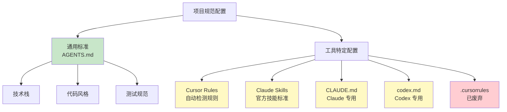

# 6.3 Rules & Skills 体系

<DifficultyBadge level="intermediate" />
<CostBadge cost="$0" />

**前置知识**：[6.2 AGENTS.md 标准](./agents-md.md)

> **把 Rules 想象成"家规"，Skills 想象成"特技"**：家规定义日常行为，特技是解锁高级玩法。

---

### Why：为什么还需要工具特定的配置？

#### 问题场景：AGENTS.md 的"能力边界"

你已经有了 `AGENTS.md`，配置了项目的通用规范。但你发现：

**场景 1**：你希望 Cursor 在打开 `.test.ts` 文件时，自动提示"运行测试的命令是 `pnpm test`"。  
→ AGENTS.md 是静态文档，无法做到"条件触发"。

::: tip 类比：通用规则 vs 场景规则
AGENTS.md = 交通法规（红灯停、绿灯行）  
Cursor Rules = 导航系统（"前方 500 米左转"、"此处限速 60"）
:::

**场景 2**：你希望 AI 能够"自动生成 API 文档"，需要严格遵循特定的步骤和模板。  
→ AGENTS.md 只能写规范，很难定义复杂的"多步工作流"。

**场景 3**：你在用 Claude Code，希望它能连接数据库或使用特定的本地工具。  
→ AGENTS.md 是通用标准，无法覆盖工具独有功能。

**核心矛盾**：  
> **AGENTS.md 是通用的，但每个工具还有自己的高级配置能力。**

::: warning 不要贪心
不要试图把所有功能都塞进 AGENTS.md——那会变成"四不像"。通用规范用 AGENTS.md，工具特技用专用配置。
:::

**一句话总结**：AGENTS.md 是"基础规范"（90% 的内容），工具配置是"高级技能"（10% 的内容）。

**类比**：
- **AGENTS.md** = 汽车的"通用驾驶规则"（红灯停、绿灯行）
- **工具配置** = 特定车型的"高级功能"（特斯拉的自动驾驶、宝马的夜视系统）

### What：工具特定的配置体系

#### 配置系统全景



#### 1. Cursor Rules

**定义**：Cursor 的三层规则系统，支持自动检测、条件触发、手动调用。

**三层架构**：

```
1. User Rules（用户规则）
   位置：~/.cursor/rules/
   作用：跨项目的个人偏好
   示例："我喜欢用 const 而非 let"

2. Project Rules（项目规则）
   位置：<project>/.cursor/rules/
   作用：项目特定的规则
   示例："这个项目用 Ant Design"

3. Team Rules（团队规则）
   位置：团队共享配置（通过 Git 同步）
   作用：团队统一的规范
   示例："我们公司所有项目用 ESLint Airbnb 规范"
```

**规则类型**：

| 类型 | 触发方式 | 使用场景 |
|-----|---------|---------|
| **Always-Apply** | 自动应用到所有对话 | 代码风格、命名规范 |
| **Auto-Detected** | 检测到特定文件类型时自动触发 | `.test.ts` → 提示测试命令 |
| **Manual** | 用户手动调用（`@ruleName`） | 生成 API 文档、代码审查 |

#### 2. Claude Skills (官方标准)

**定义**：Anthropic 官方推出的**技能构建标准**。它将"完成某项任务的指令"打包成独立的文件夹，让 Claude 像安装 APP 一样获得新能力。

**核心理念**：
- **Skills = Instruction Sets**：技能本质上是一组结构化的指令。
- **Packaged as Folders**：每个技能是一个独立的文件夹，包含定义文件和资源。

**标准结构**：

一个标准的 Skill 包含以下文件：

```text
my-skill/
├── SKILL.md          # 核心定义 (必须)
│   ├── YAML Frontmatter (元数据)
│   └── Instructions (具体指令)
├── scripts/          # 可执行脚本 (可选)
│   └── doc-gen.py
├── references/       # 参考文档 (可选)
│   └── api-spec.json
└── assets/           # 静态资源 (可选)
    └── template.md
```

**三大设计原则**：

1.  **渐进式披露 (Progressive Disclosure)**
    - 不要一次性把所有信息塞给 AI。
    - 在 `SKILL.md` 中写明摘要，只有当 AI 决定使用该技能时，才深入读取具体指令。

2.  **可组合性 (Composability)**
    - 技能之间可以互相调用。
    - 例如："代码审查技能" 可以调用 "Git 提交技能"。

3.  **可移植性 (Portability)**
    - 技能不依赖于特定的项目环境。
    - 做成通用的"积木"，在不同项目中复用。

::: tip Agent Skills vs Claude Skills
- **Agent Skills** (github.com/agent-skills)：早期的社区开放标准。
- **Claude Skills**：Anthropic 官方定义的标准，针对 Claude 模型进行了优化。
**推荐遵循官方的 Claude Skills 标准**，它结构更清晰，且未来会得到更好的工具支持。
:::

> **想要深入学习？** Anthropic 发布了完整的《为 Claude 构建技能的完整指南》，我们在 [6.4 Claude Skills 构建指南](./claude-skills.md) 中做了详细解读，包含规划设计、测试迭代、发布分享和五大设计模式。

#### 3. CLAUDE.md

**定义**：Claude Code（Anthropic 的 AI 编程助手）的项目入口配置文件。

**位置**：项目根目录的 `CLAUDE.md`

**作用**：
它是 Claude 了解你项目的"第一站"。它通常包含项目的基本信息，并可以指向具体的 Skills。

**核心功能**：

1.  **MCP 服务器配置**
    配置项目需要的 Model Context Protocol 服务器（如数据库连接、文件系统访问）。

2.  **项目特定指令**
    - 代码风格偏好
    - 常用命令简写
    - 技能索引（列出本项目可用的 Skills）

#### 4. Codex CLI & 其他

- **Codex CLI**：GitHub 的命令行 AI 工具，使用 `codex.md`。
- **.cursorrules**：Cursor 的旧版配置，现已被 `AGENTS.md` 和 `.cursor/rules/` 取代，建议迁移。

#### 配置系统对比表

| 配置系统 | 工具支持 | 作用域 | 核心形态 | 典型用途 |
|---------|---------|-------|---------|---------|
| **AGENTS.md** | 所有工具 | 项目通用 | 单个 Markdown 文件 | 技术栈、代码风格、测试规范 |
| **Cursor Rules** | Cursor | Cursor 专用 | `.cursor/rules/*.md` | 条件触发规则、文件特定助手 |
| **Claude Skills** | Claude | 跨项目复用 | `skills/` 文件夹 | 封装复杂任务（如"生成发布日志"） |
| **CLAUDE.md** | Claude Code | Claude 专用 | 单个 Markdown 文件 | MCP 配置、项目入口、技能索引 |

### How：创建实际的配置体系

#### 实战 1：为项目配置 Cursor Rules

**目标**：创建一套自动化规则，让 Cursor 在打开测试文件时自动提示命令。

**步骤**：
1. 创建目录 `.cursor/rules`
2. 创建文件 `.cursor/rules/testing.md`

```markdown
---
name: Testing Guide
type: auto-detected
trigger: "**/*.test.{ts,tsx,js,jsx}"
---

# 测试指南

## 框架
Vitest + Testing Library

## 常用命令
- `pnpm test` - 运行所有测试
- `pnpm test:watch` - 监听模式

## 模板
\`\`\`typescript
import { describe, it, expect } from 'vitest';
describe('Component', () => {
  it('renders correctly', () => {
    // ...
  });
});
\`\`\`
```

**效果**：打开 `.test.ts` 文件，Cursor 自动加载此规则。

#### 实战 2：构建一个 Claude Skill

**目标**：创建一个"自动生成组件文档"的技能。

**步骤 1**：规划目录结构

在项目根目录（或专门的 `skills/` 目录）下创建：

```bash
skills/
  component-doc/
    ├── SKILL.md
    └── templates/
        └── doc-template.md
```

**步骤 2**：编写 `SKILL.md`

这是技能的"大脑"，告诉 Claude 怎么做。

```markdown
---
name: Generate Component Documentation
description: Generates standardized documentation for React components
version: 1.0.0
author: Team AI
---

# Component Documentation Generator

当用户要求"为组件生成文档"时，请遵循以下步骤：

## 1. 分析组件
读取目标组件的代码，提取以下信息：
- Props 定义（名称、类型、是否必填、注释）
- 导出的子组件
- 关键逻辑

## 2. 读取模板
读取 \`templates/doc-template.md\` 文件作为输出格式参考。

## 3. 生成文档
生成 Markdown 文档，必须包含：
- **组件标题**
- **Props 表格**：列出所有属性
- **使用示例**：至少提供 2 个代码示例（基础用法、高级用法）
- **注意事项**：基于代码逻辑推断的 Edge Case

## 4. 验证
检查生成的文档是否遗漏了任何必填 Prop。
```

**步骤 3**：使用技能

在 Claude 中，你可以通过 Prompt 显式调用：
"使用 component-doc 技能为 `Button.tsx` 生成文档。"

或者，在 `CLAUDE.md` 中注册该技能，让 Claude 自动感知。

#### 实战 3：配置 CLAUDE.md

**目标**：让 Claude Code 能够访问数据库，并了解项目结构。

创建 `CLAUDE.md`：

```markdown
# CLAUDE.md

## 项目概况
这是一个基于 Next.js + Prisma 的博客系统。

## MCP 服务器配置
本项目启用以下 MCP 服务器：

\`\`\`json
{
  "mcpServers": {
    "postgres": {
      "command": "npx",
      "args": ["-y", "mcp-server-postgres", "postgresql://localhost:5432/blog_dev"]
    }
  }
}
\`\`\`

## 技能索引
本项目包含以下自定义技能（位于 `skills/` 目录）：
- `component-doc`: 生成组件文档
- `db-migration`: 辅助编写 Prisma 迁移

## 常用命令
- 启动：`npm run dev`
- 测试：`npm run test`
```

### Reflection：工具配置的最佳实践

#### 1. 分层配置原则

```
┌─────────────────────────────────────┐
│ AGENTS.md (基础层)                   │  ← 90% 的规范
│ - 技术栈、代码风格、测试规范          │
│ - 所有人、所有工具都用                │
└─────────────────────────────────────┘
              ↓
┌─────────────────────────────────────┐
│ 工具配置 (增强层)                     │  ← 10% 的高级功能
│ - Cursor Rules: 编辑器内的自动化       │
│ - Claude Skills: 复杂任务的封装       │
│ - CLAUDE.md: 环境连接 (MCP)          │
└─────────────────────────────────────┘
```

#### 2. Skill 的价值：复用与封装

以前，你可能把"如何写文档"的 Prompt 存在记事本里，每次复制粘贴。
现在，你把它做成 `skills/doc-gen` 文件夹：
- **版本化**：可以用 Git 管理 Prompt 的变更。
- **共享**：同事 `git pull` 下来就能用。
- **模块化**：可以在其他技能里复用这个逻辑。

::: tip 一句话总结
**Rules** 是给 AI 定的"家规"（不要做什么），**Skills** 是给 AI 装的"APP"（学会做什么）。
:::

👉 [下一节：Claude Skills 构建指南](./claude-skills.md)

---

## 参考资源

- **Claude Skills 官方指南（PDF）**：[The Complete Guide to Building Skills for Claude](https://resources.anthropic.com/hubfs/The-Complete-Guide-to-Building-Skill-for-Claude.pdf)
- **官方 Skills 仓库**：[github.com/anthropics/skills](https://github.com/anthropics/skills)
- **Cursor Rules 文档**：[cursor.sh/docs/rules](https://cursor.sh/docs/rules)
- **MCP 协议**：[modelcontextprotocol.io](https://modelcontextprotocol.io)

---

*最后更新：2026-02-28*
