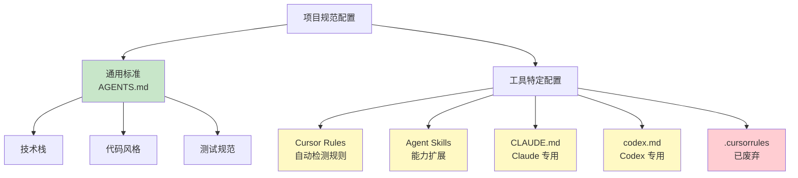

# 6.3 Rules & Skills 体系

<DifficultyBadge level="intermediate" />
<CostBadge cost="$0" />

**前置知识**：[6.2 AGENTS.md 标准](./agents-md.md)

> **把 Rules 想象成"家规"，Skills 想象成"特技"**：家规定义日常行为，特技是解锁高级玩法。

---

### Why：为什么还需要工具特定的配置？

#### 问题场景：AGENTS.md 的"能力边界"

你已经有了 `AGENTS.md`，配置了项目的通用规范。但你发现：

**场景 1**：你希望 Cursor 在打开 `.test.ts` 文件时，自动提示"运行测试的命令是 `pnpm test`"。  
→ AGENTS.md 是静态文档，无法做到"条件触发"。

::: tip 类比：通用规则 vs 场景规则
AGENTS.md = 交通法规（红灯停、绿灯行）  
Cursor Rules = 导航系统（"前方 500 米左转"、"此处限速 60"）
:::

**场景 2**：你希望 AI 能够"自动生成 API 文档"，需要调用自定义脚本。  
→ AGENTS.md 只能写规范，不能扩展 AI 的能力。

**场景 3**：你在用 Claude Code，希望配置它的特定功能（如 MCP 服务器）。  
→ AGENTS.md 是通用标准，无法覆盖工具独有功能。

**核心矛盾**：  
> **AGENTS.md 是通用的，但每个工具还有自己的高级配置能力。**

::: warning 不要贪心
不要试图把所有功能都塞进 AGENTS.md——那会变成"四不像"。通用规范用 AGENTS.md，工具特技用专用配置。
:::

**一句话总结**：AGENTS.md 是"基础规范"（90% 的内容），工具配置是"高级技能"（10% 的内容）。

**类比**：
|- **AGENTS.md** = 汽车的"通用驾驶规则"（红灯停、绿灯行）
- **工具配置** = 特定车型的"高级功能"（特斯拉的自动驾驶、宝马的夜视系统）

::: tip 一句话总结
Rules = 给 AI 定的"家规"（"看到测试文件就提示测试命令"）  
Skills = 给 AI 装的"特技包"（"自动生成 API 文档"）
:::

### What：工具特定的配置体系

#### 配置系统全景



#### 1. Cursor Rules

**定义**：Cursor 的三层规则系统，支持自动检测、条件触发、手动调用。

**三层架构**：

```
1. User Rules（用户规则）
   位置：~/.cursor/rules/
   作用：跨项目的个人偏好
   示例："我喜欢用 const 而非 let"

2. Project Rules（项目规则）
   位置：<project>/.cursor/rules/
   作用：项目特定的规则
   示例："这个项目用 Ant Design"

3. Team Rules（团队规则）
   位置：团队共享配置（通过 Git 同步）
   作用：团队统一的规范
   示例："我们公司所有项目用 ESLint Airbnb 规范"
```

**规则类型**：

| 类型 | 触发方式 | 使用场景 |
|-----|---------|---------|
| **Always-Apply** | 自动应用到所有对话 | 代码风格、命名规范 |
| **Auto-Detected** | 检测到特定文件类型时自动触发 | `.test.ts` → 提示测试命令 |
| **Manual** | 用户手动调用（`@ruleName`） | 生成 API 文档、代码审查 |

**示例：项目规则**

创建 `.cursor/rules/testing.md`：

```markdown
---
name: Testing Rules
type: auto-detected
trigger: "**/*.test.ts"
---

# 测试规则

当用户编辑测试文件时，提供以下指导：

## 测试框架
- 使用 Vitest + Testing Library
- 禁止使用 Jest（项目已迁移）

## 运行命令
\`\`\`bash
pnpm test              # 运行所有测试
pnpm test:watch        # 监听模式
pnpm test:coverage     # 生成覆盖率报告
\`\`\`

## 测试模板
\`\`\`typescript
import { describe, it, expect } from 'vitest';

describe('ComponentName', () => {
  it('should ...', () => {
    // 测试代码
  });
});
\`\`\`

## 提示
- 如果用户问"怎么运行测试"，回答：`pnpm test`
- 如果用户写 `import { test } from 'jest'`，提醒：项目用 Vitest，不是 Jest
```

**效果**：当你打开任何 `.test.ts` 文件，Cursor 会自动加载这个规则，AI 就知道：
- 项目用 Vitest（不是 Jest）
- 运行命令是 `pnpm test`
- 测试模板长什么样

**手动规则示例**

创建 `.cursor/rules/review-code.md`：

```markdown
---
name: Code Review
type: manual
command: "@review"
---

# 代码审查清单

当用户输入 `@review` 时，对当前文件进行全面代码审查：

## 检查项
1. **代码风格**
   - 是否符合 ESLint 规则？
   - 命名是否语义化？
   - 注释是否充分？

2. **类型安全**
   - 是否有 `any` 类型？
   - 是否有潜在的 `null/undefined` 错误？

3. **性能**
   - 是否有不必要的重复计算？
   - 是否可以用 `useMemo` 或 `useCallback` 优化？

4. **安全**
   - 是否有 XSS 风险？
   - 用户输入是否验证？

5. **测试**
   - 是否有对应的测试文件？
   - 测试覆盖率如何？

## 输出格式
\`\`\`
### 代码审查报告

#### ✅ 做得好的地方
- ...

#### ⚠️ 需要改进的地方
- ...

#### 🔴 严重问题
- ...

#### 建议
- ...
\`\`\`
```

**使用**：
```
你：@review
AI：（自动对当前文件进行全面审查，输出结构化报告）
```

#### 2. Agent Skills

**定义**：Agent Skills 是一个**开放标准**，用于给 AI 代理扩展特殊能力。

**官方仓库**：[github.com/agent-skills/agent-skills](https://github.com/agent-skills/agent-skills)

**核心思想**：像给 AI 安装"插件"一样，让它学会新能力。

::: tip 类比：AI 的"技能树"
玩过 RPG 游戏吗？Agent Skills 就像给 AI 点"技能树"：  
- 基础技能（写代码）：天生自带  
- 高级技能（生成文档、代码审查）：需要"学习"Skill 文件
:::

**示例技能**：

```markdown
# Skill: Generate API Documentation

## 描述
自动为 TypeScript API 生成 Markdown 文档。

## 输入
- TypeScript 文件路径
- 要导出的函数/类

## 输出
- Markdown 格式的 API 文档

## 实现
\`\`\`typescript
// 使用 TypeDoc 或 ts-morph 解析 TypeScript AST
// 提取函数签名、参数、返回值、注释
// 生成 Markdown 文档
\`\`\`

## 使用示例
用户：为 `src/lib/api.ts` 生成 API 文档
AI：
1. 读取 `api.ts`
2. 解析所有导出的函数
3. 生成 Markdown 文档
4. 保存到 `docs/api.md`
```

**常见技能包**：
- **代码生成**：生成 CRUD API、数据库模型
- **文档生成**：API 文档、README、Changelog
- **代码审查**：自动检测潜在问题
- **重构**：提取函数、优化性能
- **测试生成**：自动生成单元测试

::: warning 技能不是魔法
装了 Skill 不代表 AI 就"学会"了——它只是多了份"操作手册"。就像给你一本《如何修车》，不代表你立刻就会修车。
:::

**一句话总结**：Agent Skills = 给 AI 装"技能包"，让它从"打字员"升级成"多面手"。

#### 3. CLAUDE.md

**定义**：Claude Code（Anthropic 的 AI 编程助手）的项目配置文件。

**位置**：项目根目录的 `CLAUDE.md`

**与 AGENTS.md 的关系**：
- **AGENTS.md**：通用标准，所有工具都读
- **CLAUDE.md**：Claude 专用，配置 Claude 特有功能

**特有功能**：

1. **MCP 服务器配置**（Model Context Protocol）

```markdown
# CLAUDE.md

## MCP 服务器

本项目使用以下 MCP 服务器：

### 1. Database MCP
连接到 PostgreSQL 数据库，让 Claude 能查询数据库结构。

\`\`\`json
{
  "mcpServers": {
    "database": {
      "command": "mcp-server-postgres",
      "args": ["--connection", "postgresql://localhost/mydb"]
    }
  }
}
\`\`\`

### 2. Filesystem MCP
让 Claude 能读取特定目录的文件。

\`\`\`json
{
  "mcpServers": {
    "filesystem": {
      "command": "mcp-server-filesystem",
      "args": ["--root", "./src"]
    }
  }
}
\`\`\`
```

2. **Claude 特定提示词**

```markdown
## Claude 专用提示

### 代码生成偏好
- 优先使用函数式编程
- 避免过度抽象
- 每个函数不超过 20 行

### 对话风格
- 回答要简洁
- 提供代码示例
- 解释关键决策
```

#### 4. Codex CLI 配置

**Codex CLI**：GitHub 的命令行 AI 工具。

**配置文件**：`codex.md`

**示例**：

```markdown
# codex.md

## 项目信息
名称：AI-First Blog
技术栈：Next.js + TypeScript + Prisma

## 常用命令

### 开发
\`\`\`bash
npm run dev         # 启动开发服务器
npm run build       # 构建生产版本
npm run test        # 运行测试
\`\`\`

### 数据库
\`\`\`bash
npx prisma studio   # 打开数据库管理界面
npx prisma migrate dev   # 运行数据库迁移
\`\`\`

## Codex Skills

### 1. Generate Migration
\`\`\`bash
codex ask "为 User 表添加 email 字段的迁移"
\`\`\`

### 2. Explain Code
\`\`\`bash
codex explain src/lib/auth.ts
\`\`\`

## Codex Connectors
- PostgreSQL: `postgresql://localhost/mydb`
- Redis: `redis://localhost:6379`
```

#### 5. .cursorrules（已废弃）

**状态**：已被 `AGENTS.md` 取代，建议迁移。

**如果你还在用**：
```bash
# 迁移步骤
mv .cursorrules AGENTS.md
# 调整格式，添加标准章节
```

**Cursor 的读取优先级**：
```
1. AGENTS.md（优先）
2. .cursor/rules/（项目规则）
3. .cursorrules（已废弃，向后兼容）
```

#### 配置系统对比表

| 配置系统 | 工具支持 | 作用域 | 触发方式 | 典型用途 |
|---------|---------|-------|---------|---------|
| **AGENTS.md** | 所有工具 | 项目通用 | 自动加载 | 技术栈、代码风格、测试规范 |
| **Cursor Rules** | Cursor | Cursor 专用 | 自动/手动 | 条件触发规则、自定义命令 |
| **Agent Skills** | Cursor, Copilot | 跨工具 | 手动安装 | 扩展 AI 能力（文档生成、审查） |
| **CLAUDE.md** | Claude Code | Claude 专用 | 自动加载 | MCP 服务器、Claude 特定配置 |
| **codex.md** | Codex CLI | Codex 专用 | 自动加载 | Codex 命令、连接器配置 |
| **.cursorrules** | Cursor | Cursor 专用 | 自动加载 | ⚠️ 已废弃，迁移到 AGENTS.md |

### How：创建实际的配置文件

#### 实战 1：为项目配置 Cursor Rules

**目标**：创建一套自动化规则，让 Cursor 在不同文件类型时提供不同的帮助。

**步骤 1**：创建项目规则目录

```bash
mkdir -p .cursor/rules
```

**步骤 2**：创建测试文件规则

`.cursor/rules/testing.md`：

```markdown
---
name: Testing Guide
type: auto-detected
trigger: "**/*.test.{ts,tsx,js,jsx}"
---

# 测试指南

## 框架
Vitest + Testing Library

## 常用命令
- `pnpm test` - 运行所有测试
- `pnpm test:watch` - 监听模式
- `pnpm test <文件名>` - 运行单个测试

## 模板
\`\`\`typescript
import { describe, it, expect } from 'vitest';
import { render, screen } from '@testing-library/react';

describe('Component', () => {
  it('renders correctly', () => {
    render(<Component />);
    expect(screen.getByText('Hello')).toBeInTheDocument();
  });
});
\`\`\`

## 提示
- 测试命名：用 `describe` 和 `it`
- 查询元素：优先用 `ByRole` > `ByLabelText` > `ByTestId`
- 异步操作：用 `waitFor` 或 `findBy*`
```

**步骤 3**：创建 API 路由规则

`.cursor/rules/api-routes.md`：

```markdown
---
name: API Routes Guide
type: auto-detected
trigger: "**/app/api/**/*.ts"
---

# API 路由指南

## Next.js App Router API

### 文件结构
\`\`\`
app/api/
  posts/
    route.ts          # /api/posts
    [id]/
      route.ts        # /api/posts/[id]
\`\`\`

### HTTP 方法
\`\`\`typescript
// app/api/posts/route.ts
export async function GET(request: Request) {
  // 查询列表
}

export async function POST(request: Request) {
  // 创建资源
}
\`\`\`

### 动态路由
\`\`\`typescript
// app/api/posts/[id]/route.ts
export async function GET(
  request: Request,
  { params }: { params: { id: string } }
) {
  const { id } = params;
  // 查询单个资源
}
\`\`\`

## 安全检查清单
- [ ] 验证请求体（用 Zod）
- [ ] 检查用户权限（用 NextAuth session）
- [ ] 处理错误（返回正确的状态码）
- [ ] 防止 SQL 注入（用 Prisma）

## 响应格式
\`\`\`typescript
// 成功
return Response.json({ data: posts }, { status: 200 });

// 错误
return Response.json({ error: 'Not found' }, { status: 404 });
\`\`\`
```

**步骤 4**：创建数据库模型规则

`.cursor/rules/prisma.md`：

```markdown
---
name: Prisma Guide
type: auto-detected
trigger: "**/prisma/schema.prisma"
---

# Prisma Schema 指南

## 模型命名
- 用单数：`model User` (不是 Users)
- 用 PascalCase
- 关系用复数：`posts Post[]`

## 必备字段
\`\`\`prisma
model Post {
  id        String   @id @default(cuid())
  createdAt DateTime @default(now())
  updatedAt DateTime @updatedAt
}
\`\`\`

## 常用类型
\`\`\`prisma
String    # 字符串
Int       # 整数
Float     # 浮点数
Boolean   # 布尔值
DateTime  # 日期时间
Json      # JSON
\`\`\`

## 关系
\`\`\`prisma
model User {
  id    String @id
  posts Post[]
}

model Post {
  id       String @id
  authorId String
  author   User   @relation(fields: [authorId], references: [id])
}
\`\`\`

## 修改 schema 后
\`\`\`bash
npx prisma migrate dev --name add_email_to_user
npx prisma generate
\`\`\`
```

**步骤 5**：创建手动规则（代码审查）

`.cursor/rules/review.md`：

```markdown
---
name: Code Review
type: manual
command: "@review"
---

# 代码审查

对当前文件进行全面审查：

## 检查维度
1. **代码质量**
   - 命名是否清晰？
   - 逻辑是否简洁？
   - 有无重复代码？

2. **类型安全**
   - 有无 `any` 类型？
   - 类型定义是否完整？

3. **性能**
   - 有无不必要的重复渲染？
   - 是否可以优化？

4. **安全**
   - 用户输入是否验证？
   - 敏感信息是否暴露？

5. **测试**
   - 是否有测试覆盖？
   - 边界情况是否考虑？

## 输出格式
\`\`\`markdown
### 代码审查报告

#### ✅ 优点
- ...

#### ⚠️ 建议
- ...

#### 🔴 问题
- ...
\`\`\`
```

**使用效果**：

- 打开 `.test.ts` → Cursor 自动加载测试规则
- 打开 `app/api/*/route.ts` → Cursor 自动加载 API 规则
- 打开 `schema.prisma` → Cursor 自动加载 Prisma 规则
- 输入 `@review` → 触发代码审查

#### 实战 2：创建自定义 Agent Skill

**目标**：创建一个"生成 CRUD API"的技能。

**步骤 1**：创建 Skill 文件

`~/.cursor/skills/generate-crud-api.skill.md`：

```markdown
# Skill: Generate CRUD API

## 描述
自动为 Prisma 模型生成完整的 CRUD API 路由。

## 输入
- Prisma 模型名称（如 `Post`）

## 输出
- `app/api/posts/route.ts`（列表 + 创建）
- `app/api/posts/[id]/route.ts`（查询 + 更新 + 删除）
- 包含：
  - Zod 验证
  - 错误处理
  - TypeScript 类型
  - NextAuth 权限检查

## 实现步骤

### 1. 读取 Prisma Schema
\`\`\`typescript
// 从 prisma/schema.prisma 找到模型定义
model Post {
  id        String   @id @default(cuid())
  title     String
  content   String
  published Boolean  @default(false)
  authorId  String
  author    User     @relation(fields: [authorId], references: [id])
  createdAt DateTime @default(now())
  updatedAt DateTime @updatedAt
}
\`\`\`

### 2. 生成列表和创建路由
\`\`\`typescript
// app/api/posts/route.ts
import { NextRequest } from 'next/server';
import { z } from 'zod';
import { db } from '@/lib/db';
import { auth } from '@/lib/auth';

// 创建 Post 的验证 schema
const createPostSchema = z.object({
  title: z.string().min(1).max(200),
  content: z.string().min(1),
  published: z.boolean().default(false),
});

// GET /api/posts - 查询列表
export async function GET(request: NextRequest) {
  try {
    const { searchParams } = new URL(request.url);
    const page = parseInt(searchParams.get('page') || '1');
    const limit = parseInt(searchParams.get('limit') || '10');
    
    const posts = await db.post.findMany({
      skip: (page - 1) * limit,
      take: limit,
      orderBy: { createdAt: 'desc' },
      include: { author: { select: { id: true, name: true } } },
    });
    
    const total = await db.post.count();
    
    return Response.json({
      data: posts,
      pagination: { page, limit, total },
    });
  } catch (error) {
    return Response.json(
      { error: 'Failed to fetch posts' },
      { status: 500 }
    );
  }
}

// POST /api/posts - 创建
export async function POST(request: NextRequest) {
  try {
    // 权限检查
    const session = await auth();
    if (!session) {
      return Response.json({ error: 'Unauthorized' }, { status: 401 });
    }
    
    // 验证请求体
    const body = await request.json();
    const validated = createPostSchema.parse(body);
    
    // 创建资源
    const post = await db.post.create({
      data: {
        ...validated,
        authorId: session.user.id,
      },
    });
    
    return Response.json({ data: post }, { status: 201 });
  } catch (error) {
    if (error instanceof z.ZodError) {
      return Response.json(
        { error: 'Validation failed', details: error.errors },
        { status: 400 }
      );
    }
    return Response.json(
      { error: 'Failed to create post' },
      { status: 500 }
    );
  }
}
\`\`\`

### 3. 生成单个资源路由
\`\`\`typescript
// app/api/posts/[id]/route.ts
import { NextRequest } from 'next/server';
import { z } from 'zod';
import { db } from '@/lib/db';
import { auth } from '@/lib/auth';

const updatePostSchema = z.object({
  title: z.string().min(1).max(200).optional(),
  content: z.string().min(1).optional(),
  published: z.boolean().optional(),
});

// GET /api/posts/[id] - 查询单个
export async function GET(
  request: NextRequest,
  { params }: { params: { id: string } }
) {
  try {
    const post = await db.post.findUnique({
      where: { id: params.id },
      include: { author: { select: { id: true, name: true } } },
    });
    
    if (!post) {
      return Response.json({ error: 'Post not found' }, { status: 404 });
    }
    
    return Response.json({ data: post });
  } catch (error) {
    return Response.json(
      { error: 'Failed to fetch post' },
      { status: 500 }
    );
  }
}

// PATCH /api/posts/[id] - 更新
export async function PATCH(
  request: NextRequest,
  { params }: { params: { id: string } }
) {
  try {
    const session = await auth();
    if (!session) {
      return Response.json({ error: 'Unauthorized' }, { status: 401 });
    }
    
    // 检查权限
    const post = await db.post.findUnique({ where: { id: params.id } });
    if (!post) {
      return Response.json({ error: 'Post not found' }, { status: 404 });
    }
    if (post.authorId !== session.user.id) {
      return Response.json({ error: 'Forbidden' }, { status: 403 });
    }
    
    // 验证并更新
    const body = await request.json();
    const validated = updatePostSchema.parse(body);
    
    const updated = await db.post.update({
      where: { id: params.id },
      data: validated,
    });
    
    return Response.json({ data: updated });
  } catch (error) {
    if (error instanceof z.ZodError) {
      return Response.json(
        { error: 'Validation failed', details: error.errors },
        { status: 400 }
      );
    }
    return Response.json(
      { error: 'Failed to update post' },
      { status: 500 }
    );
  }
}

// DELETE /api/posts/[id] - 删除
export async function DELETE(
  request: NextRequest,
  { params }: { params: { id: string } }
) {
  try {
    const session = await auth();
    if (!session) {
      return Response.json({ error: 'Unauthorized' }, { status: 401 });
    }
    
    // 检查权限
    const post = await db.post.findUnique({ where: { id: params.id } });
    if (!post) {
      return Response.json({ error: 'Post not found' }, { status: 404 });
    }
    if (post.authorId !== session.user.id) {
      return Response.json({ error: 'Forbidden' }, { status: 403 });
    }
    
    await db.post.delete({ where: { id: params.id } });
    
    return new Response(null, { status: 204 });
  } catch (error) {
    return Response.json(
      { error: 'Failed to delete post' },
      { status: 500 }
    );
  }
}
\`\`\`

## 使用示例

**用户**："为 Post 模型生成 CRUD API"

**AI**：
1. 读取 `prisma/schema.prisma`，找到 `Post` 模型
2. 分析字段类型，生成 Zod schema
3. 创建 `app/api/posts/route.ts`（列表 + 创建）
4. 创建 `app/api/posts/[id]/route.ts`（查询 + 更新 + 删除）
5. 提示："API 已生成，可以访问：
   - GET /api/posts（列表）
   - POST /api/posts（创建）
   - GET /api/posts/[id]（查询）
   - PATCH /api/posts/[id]（更新）
   - DELETE /api/posts/[id]（删除）"
```

**步骤 2**：在 Cursor 中启用

1. 打开 Cursor 设置
2. 找到"Agent Skills"
3. 点击"Add Skill"
4. 选择 `generate-crud-api.skill.md`

**使用**：
```
你："为 Post 模型生成 CRUD API"
AI：*自动执行 Skill 中的步骤，生成所有文件*
```

#### 实战 3：配置 Claude Code（CLAUDE.md）

**场景**：你在用 Claude Code，想让它能访问数据库和文件系统。

**步骤 1**：创建 CLAUDE.md

```markdown
# CLAUDE.md

## 项目概述
Next.js 全栈博客系统

## MCP 服务器

### 1. PostgreSQL 数据库
连接到本地数据库，让 Claude 能查询表结构和数据。

\`\`\`json
{
  "mcpServers": {
    "postgres": {
      "command": "npx",
      "args": [
        "-y",
        "mcp-server-postgres",
        "postgresql://localhost:5432/blog_dev"
      ]
    }
  }
}
\`\`\`

**用途**：
- 查询表结构：`SHOW TABLES`, `DESCRIBE posts`
- 执行只读查询：`SELECT * FROM posts WHERE published = true`
- ⚠️ 禁止：`DROP`, `DELETE`, `UPDATE`（只读模式）

### 2. 文件系统
让 Claude 读取 `src/` 和 `prisma/` 目录。

\`\`\`json
{
  "mcpServers": {
    "filesystem": {
      "command": "npx",
      "args": ["-y", "mcp-server-filesystem", "--root", "./"]
    }
  }
}
\`\`\`

**用途**：
- 读取配置文件
- 分析代码结构
- 查看 Prisma schema

## Claude 专用提示

### 代码风格
- 函数式编程优先
- 每个函数不超过 20 行
- 复杂逻辑要拆分成小函数

### 对话风格
- 先给代码，再解释
- 代码示例要完整可运行
- 关键决策要说明理由

### 特殊能力
Claude 可以：
- 通过 MCP 查询数据库表结构
- 读取项目文件
- 生成复杂的代码（利用长上下文窗口）

Claude 不能：
- 直接修改数据库（只读模式）
- 执行 shell 命令（安全限制）
```

**步骤 2**：安装 MCP 服务器

```bash
# PostgreSQL MCP 服务器
npm install -g mcp-server-postgres

# 文件系统 MCP 服务器
npm install -g mcp-server-filesystem
```

**步骤 3**：Claude Code 自动读取

重启 Claude Code，它会：
1. 读取 `CLAUDE.md`
2. 启动 MCP 服务器
3. 现在 Claude 可以直接查询数据库和文件了

**使用效果**：

```
你："数据库里有哪些表？"
Claude：*通过 MCP 查询* "有 User, Post, Comment, Tag 四张表"

你："Post 表的结构是什么？"
Claude：*执行 DESCRIBE posts*
\`\`\`
id        String
title     String
content   String
...
\`\`\`

你："有多少篇已发布的文章？"
Claude：*执行 SELECT COUNT(*) FROM posts WHERE published = true* "23 篇"
```

### Reflection：工具配置的最佳实践

#### 1. 配置分层原则

```
┌─────────────────────────────────────┐
│ AGENTS.md (基础层)                   │  ← 90% 的规范
│ - 技术栈、代码风格、测试规范          │
│ - 所有人、所有工具都用                │
└─────────────────────────────────────┘
              ↓
┌─────────────────────────────────────┐
│ 工具配置 (增强层)                     │  ← 10% 的高级功能
│ - Cursor Rules: 自动化规则            │
│ - Agent Skills: 特殊能力              │
│ - CLAUDE.md: Claude 专用功能          │
└─────────────────────────────────────┘
```

::: tip 类比：房子的装修
AGENTS.md = 毛坯房（水电、墙面、地板）——基础设施  
工具配置 = 精装修（智能家居、影音系统）——锦上添花
:::

**原则**：
- **AGENTS.md 写通用规范**：所有人都需要知道的
- **工具配置写特殊能力**：只有用该工具的人才需要的

**一句话总结**：不要在 AGENTS.md 里塞太多——基础规范就够了，高级功能交给工具配置。

#### 2. 自动化 vs 手动

| 规则类型 | 使用场景 | 示例 |
|---------|---------|------|
| **Always-Apply** | 代码风格、命名规范 | "用 const 不用 let" |
| **Auto-Detected** | 特定文件类型的帮助 | 打开 `.test.ts` → 提示测试命令 |
| **Manual** | 复杂任务、代码审查 | `@review` 触发全面审查 |

**建议**：
- 90% 用自动规则（减少打扰）
- 10% 用手动规则（复杂任务）

#### 3. 团队协作

**场景 1**：新人入职

```bash
# 新人 clone 项目
git clone <repo>

# 他的 AI 工具自动读取：
# - AGENTS.md（通用规范）
# - .cursor/rules/（项目规则）
# - CLAUDE.md（如果用 Claude）

# 无需额外配置，立即上手
```

**场景 2**：规范更新

```bash
# 团队决定改代码风格
# 1. 更新 AGENTS.md
# 2. git push
# 3. 所有人 git pull
# → 所有人的 AI 工具自动同步
```

#### 4. 工具选择建议

| 你的需求 | 推荐方案 |
|---------|---------|
| 团队统一规范 | **AGENTS.md** |
| Cursor 自动化规则 | **Cursor Rules** |
| 扩展 AI 能力（文档生成、审查） | **Agent Skills** |
| Claude 专用功能（MCP） | **CLAUDE.md** |
| Codex CLI 配置 | **codex.md** |

#### 5. 下一步：从配置到工作流

现在你有了：
- ✅ AGENTS.md（通用规范）
- ✅ Cursor Rules（自动化规则）
- ✅ Agent Skills（特殊能力）
- ✅ CLAUDE.md（工具配置）

**问题**：怎么把这些工具**真正用起来**？

::: warning 配置不等于使用
就像健身房办了卡，不代表你就会瘦。配置写完了，还得学会"怎么用 AI 干活"——这就是 Vibe Coding。
:::

**一句话总结**：Rules 和 Skills 是给 AI 的"操作手册"，但真正高效的秘诀是建立"人机协作"的节奏。

👉 [下一节：Vibe Coding 与 AI-First 开发流](./vibe-coding.md)

---

## 参考资源

- **Cursor Rules 文档**：[cursor.sh/docs/rules](https://cursor.sh/docs/rules)
- **Agent Skills 标准**：[github.com/agent-skills](https://github.com/agent-skills/agent-skills)
- **MCP 协议**：[modelcontextprotocol.io](https://modelcontextprotocol.io)
- **Claude Code 文档**：[docs.anthropic.com/claude-code](https://docs.anthropic.com)

---

*最后更新：2026-02-20*
