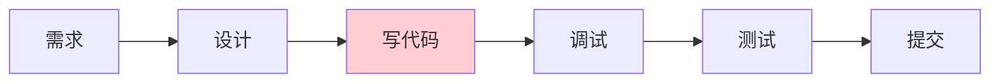
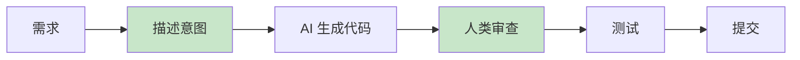
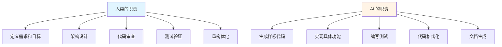
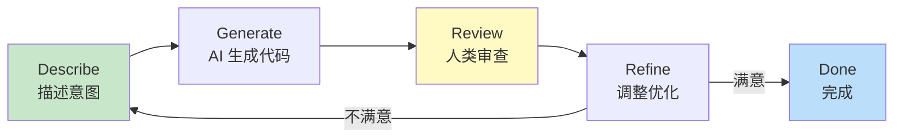
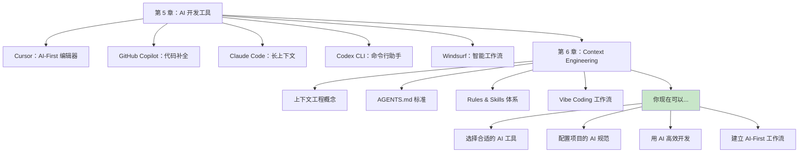

# 6.5 Vibe Coding 与 AI-First 开发流

<DifficultyBadge level="intermediate" />
<CostBadge cost="$0" />

**前置知识**：
- [5.1 IDE 集成型工具](/05-ai-coding-tools/)
- [6.1 Context Engineering 概念](./index.md)
- [6.2 AGENTS.md 标准](./agents-md.md)
- [6.3 Rules & Skills 体系](./rules-skills.md)
- [6.4 Claude Skills 构建指南](./claude-skills.md)

> **Vibe Coding = 用"感觉"写代码**：你不需要记住每一行怎么写，只需要知道"对的代码"长什么样。

---

### Why：为什么需要 AI-First 开发流？

#### 传统开发 vs AI-First 开发：一场革命

**传统开发流程**：



**问题**：
- 写代码占 70% 时间
- 重复劳动（CRUD、样板代码、测试）
- 遇到不熟悉的技术 → 查文档 → 试错

**AI-First 开发流程**：



**改变**：
- 写代码 → **描述意图**
- 调试 → **审查和指导 AI**
- 人类做高价值工作（架构设计、业务逻辑、代码审查）
- AI 做低价值工作（样板代码、重复劳动、格式调整）

::: tip 残酷的真相
未来的"写代码"可能不是敲键盘，而是"和 AI 聊天"——你负责提想法，AI 负责实现。就像导演和摄影师的关系。
:::

#### 核心问题

**怎么把 AI 从"偶尔问一下"变成"全程参与"的开发方式？**

**类比**：
- **传统方式** = 自己开车：你控制方向盘、油门、刹车，累但可控
- **AI-First** = 和司机搭档：你说目的地和路线，司机开车，你负责导航和决策

::: warning 不要完全放手
AI-First 不是"把方向盘交给 AI"，而是"你掌舵，AI 划桨"。你还是船长，但不用自己划船了。
:::

**关键**：
1. 清晰地**表达意图**（不需要精确指令）
2. 有效地**审查和纠正** AI 的输出
3. 建立**人机协作的节奏**

**一句话总结**：AI-First = 你当导演，AI 当演员——你负责剧本，AI 负责演出。

### What：什么是 Vibe Coding？

#### 1. 定义：用"感觉"写代码

**Vibe Coding**：通过自然语言描述"感觉对了"的代码，让 AI 生成实现，人类负责验证和调整。

**术语来源**：Andrej Karpathy（特斯拉 AI 总监、OpenAI 创始成员）在 2023 年提出。

**核心思想**：
> **你不需要记住每一行代码怎么写，只需要知道"对的代码"长什么样。**

::: tip 类比：指挥家 vs 演奏家
传统编程 = 你是演奏家，亲自拉小提琴  
Vibe Coding = 你是指挥家，告诉乐团"这段要激昂一点"
:::

**类比**：
- **传统编程** = 画画：你要控制每一笔
- **Vibe Coding** = 和 AI 画师合作：你说"画一个日落，要有温暖的感觉"，画师画出来，你说"天空再红一点，云彩再柔和一些"

**一句话总结**：Vibe Coding = 你说"我想要个登录页面，要简洁优雅"，AI 就画出来了。

#### 2. Vibe Coding 的特征

| 特征 | 传统编程 | Vibe Coding |
|-----|---------|------------|
| **输入** | 精确的代码 | 模糊的意图 |
| **过程** | 逐行编写 | 对话式生成 |
| **速度** | 慢（需要回忆语法） | 快（直接表达想法） |
| **错误处理** | 调试器、Stack Overflow | 和 AI 对话修正 |
| **学习曲线** | 陡峭（需要记忆） | 平缓（需要理解） |
| **适用场景** | 精细控制、性能优化 | 快速原型、样板代码 |

#### 3. AI-Native 项目结构

**传统项目结构**（给人类看）：

```
my-app/
├── README.md           # 项目说明
├── CONTRIBUTING.md     # 贡献指南
├── docs/               # 文档
├── src/                # 源代码
└── tests/              # 测试
```

**AI-Native 项目结构**（给人类和 AI 看）：

```
my-app/
├── README.md           # 给人类：项目说明
├── AGENTS.md           # 给 AI：项目规范
├── .cursor/
│   └── rules/          # Cursor 规则
├── docs/
│   ├── architecture.md # 架构文档（AI 参考）
│   └── decisions.md    # 设计决策（AI 参考）
├── src/
│   ├── types/          # TypeScript 类型（AI 理解数据结构）
│   └── examples/       # 示例代码（AI 学习风格）
└── tests/
    └── examples/       # 测试示例（AI 学习测试写法）
```

**关键差异**：
- ✅ 添加 `AGENTS.md`（AI 的"入职文档"）
- ✅ 添加 `docs/architecture.md`（AI 理解系统设计）
- ✅ 添加 `src/examples/`（AI 学习代码风格）
- ✅ 添加 `tests/examples/`（AI 学习测试写法）

#### 4. 人机协作的最佳实践



**人类擅长**：
- 战略思考：这个功能应该怎么设计？
- 业务判断：这个逻辑是否符合需求？
- 质量把关：这段代码有没有问题？

**AI 擅长**：
- 执行细节：把这个设计实现出来
- 重复劳动：写测试、写文档、写样板代码
- 知识检索：这个框架的 API 怎么用？

#### 5. 开发循环（The Development Loop）



**详细步骤**：

1. **Describe**（描述）：用自然语言说清楚你想要什么
   ```
   "创建一个登录表单，包含邮箱和密码输入，
   邮箱要验证格式，密码至少 8 位，
   提交时调用 API，显示加载状态和错误提示"
   ```

2. **Generate**（生成）：AI 生成代码
   ```typescript
   // AI 生成完整的 LoginForm.tsx
   ```

3. **Review**（审查）：人类检查代码
   ```
   - 逻辑对不对？
   - 有没有安全问题？
   - 风格是否一致？
   - 有没有遗漏？
   ```

4. **Refine**（调整）：根据审查结果优化
   ```
   "密码输入框要加一个'显示/隐藏密码'的按钮"
   → AI 修改代码 → 再次审查 → 直到满意
   ```

#### 6. Vibe Coding 适用场景

**✅ 适合 Vibe Coding 的场景**：

| 场景 | 原因 |
|-----|------|
| **CRUD API** | 重复性高，AI 擅长 |
| **UI 组件** | 样板代码多，AI 能快速生成 |
| **数据转换** | 逻辑清晰，AI 能准确实现 |
| **测试用例** | 规律性强，AI 能批量生成 |
| **代码重构** | AI 能保持功能不变的前提下优化结构 |
| **文档生成** | AI 能从代码提取信息 |

**❌ 不适合 Vibe Coding 的场景**：

| 场景 | 原因 | 建议 |
|-----|------|------|
| **复杂算法** | AI 可能理解偏差 | 人类设计核心算法，AI 辅助实现 |
| **性能优化** | AI 不理解性能瓶颈 | 人类用 profiler 找问题，AI 辅助优化 |
| **架构设计** | AI 缺乏全局视角 | 人类设计架构，AI 实现细节 |
| **安全关键** | AI 可能引入漏洞 | 人类严格审查安全代码 |

#### 7. 常见反模式（Anti-Patterns）

::: warning 这些坑千万别踩
以下是真实案例中最常见的错误——每一个都会让你的 AI 协作效率"血崩"。
:::

**❌ 反模式 1：完全依赖 AI**

```
错误做法：
1. 让 AI 生成代码
2. 不看不测试直接提交
3. 出 bug 了才发现问题

正确做法：
1. AI 生成代码
2. 仔细审查逻辑和安全
3. 运行测试验证
4. 确认无误后提交
```

**❌ 反模式 2：过度指导 AI**

```
错误做法：
"先定义一个变量叫 count，然后用 useState 初始化为 0，
然后写一个函数叫 increment，用 setCount(count + 1)，
然后在 button 上绑定 onClick..."

正确做法：
"创建一个计数器组件，有加减按钮"
```

::: tip 类比：导航 vs 开车
过度指导 = 坐副驾驶喊"往左打 15 度！加油门 20%！"  
正确做法 = "去星巴克，走最快的路"
:::

**❌ 反模式 3：忽略 Context**

```
错误做法：
每次都详细描述项目的技术栈、代码风格...

正确做法：
写好 AGENTS.md，AI 自动知道项目规范
```

**❌ 反模式 4：不迭代优化**

```
错误做法：
AI 第一次生成的代码不满意 → 放弃 → 自己写

正确做法：
AI 第一次生成 → 指出问题 → AI 修改 → 再指出 → 多轮迭代
```

::: warning AI 不是一次性打火机
第一次不满意很正常——AI 需要"调教"。就像训练狗狗，要有耐心地多次纠正。
:::

**一句话总结**：Vibe Coding 的反面教材 = 要么全信 AI（太天真），要么不信 AI（浪费钱）。

### How：实战 Vibe Coding

#### 实战案例：从零构建一个博客评论功能

**需求**：
- 用户可以对文章发表评论
- 评论可以嵌套回复（最多 3 层）
- 需要登录才能评论
- 评论支持 Markdown 格式
- 可以点赞评论

**技术栈**：Next.js 14 + TypeScript + Prisma + Tailwind CSS

---

#### 第 1 步：描述意图（Describe）

**你的输入**：

```
我要为博客添加评论功能。

功能需求：
1. 用户可以对文章发表评论
2. 评论可以回复（支持嵌套，最多 3 层）
3. 需要登录才能评论
4. 评论支持 Markdown 格式
5. 每条评论可以点赞
6. 按时间倒序显示

技术实现：
- 数据库：Prisma
- UI：React 组件 + Tailwind CSS
- 认证：NextAuth session

请先设计数据库 schema。
```

**AI 的回复**：

```prisma
// prisma/schema.prisma

model Comment {
  id        String   @id @default(cuid())
  content   String   @db.Text
  postId    String
  post      Post     @relation(fields: [postId], references: [id], onDelete: Cascade)
  authorId  String
  author    User     @relation(fields: [authorId], references: [id])
  parentId  String?  // 父评论 ID（null = 顶级评论）
  parent    Comment? @relation("CommentReplies", fields: [parentId], references: [id], onDelete: Cascade)
  replies   Comment[] @relation("CommentReplies")
  likes     CommentLike[]
  createdAt DateTime @default(now())
  updatedAt DateTime @updatedAt

  @@index([postId])
  @@index([authorId])
  @@index([parentId])
}

model CommentLike {
  id        String   @id @default(cuid())
  commentId String
  comment   Comment  @relation(fields: [commentId], references: [id], onDelete: Cascade)
  userId    String
  user      User     @relation(fields: [userId], references: [id])
  createdAt DateTime @default(now())

  @@unique([commentId, userId]) // 每个用户只能点赞一次
  @@index([commentId])
  @@index([userId])
}
```

---

#### 第 2 步：审查（Review）

**你的审查清单**：

- ✅ 用了 `@db.Text`（评论内容可能很长）
- ✅ 用了 `onDelete: Cascade`（删除文章/评论时自动清理）
- ✅ 用了 `@@unique([commentId, userId])`（防止重复点赞）
- ✅ 加了索引（查询性能）
- ⚠️ 问题：没有限制嵌套层数

**你的反馈**：

```
Schema 不错，但缺少嵌套层数限制。

建议添加 depth 字段：
- 顶级评论 depth = 0
- 回复的评论 depth = parent.depth + 1
- 前端限制 depth < 3 时才能回复
```

**AI 的修改**：

```prisma
model Comment {
  id        String   @id @default(cuid())
  content   String   @db.Text
  depth     Int      @default(0)  // 新增：嵌套层数
  postId    String
  post      Post     @relation(fields: [postId], references: [id], onDelete: Cascade)
  authorId  String
  author    User     @relation(fields: [authorId], references: [id])
  parentId  String?
  parent    Comment? @relation("CommentReplies", fields: [parentId], references: [id], onDelete: Cascade)
  replies   Comment[] @relation("CommentReplies")
  likes     CommentLike[]
  createdAt DateTime @default(now())
  updatedAt DateTime @updatedAt

  @@index([postId])
  @@index([authorId])
  @@index([parentId])
}
```

---

#### 第 3 步：调整和迭代（Refine）

**你**：
```
很好！现在生成 API 路由：
- POST /api/posts/[postId]/comments - 创建评论
- POST /api/comments/[id]/like - 点赞评论
- DELETE /api/comments/[id]/like - 取消点赞

要求：
- 验证用户登录
- 检查嵌套深度
- 返回完整的评论数据（包含作者信息和点赞数）
```

**AI 生成**（示例：创建评论）：

```typescript
// app/api/posts/[postId]/comments/route.ts
import { NextRequest } from 'next/server';
import { z } from 'zod';
import { auth } from '@/lib/auth';
import { db } from '@/lib/db';

const createCommentSchema = z.object({
  content: z.string().min(1).max(5000),
  parentId: z.string().optional(),
});

export async function POST(
  request: NextRequest,
  { params }: { params: { postId: string } }
) {
  try {
    // 1. 验证登录
    const session = await auth();
    if (!session) {
      return Response.json({ error: 'Unauthorized' }, { status: 401 });
    }

    // 2. 验证请求体
    const body = await request.json();
    const { content, parentId } = createCommentSchema.parse(body);

    // 3. 检查文章是否存在
    const post = await db.post.findUnique({
      where: { id: params.postId },
    });
    if (!post) {
      return Response.json({ error: 'Post not found' }, { status: 404 });
    }

    // 4. 如果是回复，检查父评论和深度
    let depth = 0;
    if (parentId) {
      const parent = await db.comment.findUnique({
        where: { id: parentId },
      });
      if (!parent) {
        return Response.json({ error: 'Parent comment not found' }, { status: 404 });
      }
      if (parent.postId !== params.postId) {
        return Response.json({ error: 'Parent comment not in this post' }, { status: 400 });
      }
      depth = parent.depth + 1;
      if (depth > 2) {
        return Response.json(
          { error: 'Maximum nesting depth (3 levels) exceeded' },
          { status: 400 }
        );
      }
    }

    // 5. 创建评论
    const comment = await db.comment.create({
      data: {
        content,
        postId: params.postId,
        authorId: session.user.id,
        parentId: parentId || null,
        depth,
      },
      include: {
        author: {
          select: {
            id: true,
            name: true,
            image: true,
          },
        },
        _count: {
          select: {
            likes: true,
            replies: true,
          },
        },
      },
    });

    return Response.json({ data: comment }, { status: 201 });
  } catch (error) {
    if (error instanceof z.ZodError) {
      return Response.json(
        { error: 'Validation failed', details: error.errors },
        { status: 400 }
      );
    }
    console.error('Create comment error:', error);
    return Response.json(
      { error: 'Failed to create comment' },
      { status: 500 }
    );
  }
}
```

**你的审查**：

- ✅ 验证登录
- ✅ 检查深度限制
- ✅ 返回作者信息和统计数据
- ✅ 错误处理完善
- 👌 代码清晰，逻辑正确

**你**：
```
完美！继续生成前端组件：
- CommentList：评论列表
- CommentItem：单条评论（递归渲染嵌套回复）
- CommentForm：评论输入框

要求：
- 用 Tailwind CSS
- Markdown 渲染用 react-markdown
- 点赞按钮要有动画效果
- 回复按钮点击后显示回复框
```

**AI 生成**（示例：CommentItem）：

```typescript
// components/CommentItem.tsx
'use client';

import { useState } from 'react';
import { formatDistanceToNow } from 'date-fns';
import { zhCN } from 'date-fns/locale';
import ReactMarkdown from 'react-markdown';
import { Heart, Reply, Trash2 } from 'lucide-react';
import { CommentForm } from './CommentForm';
import { Avatar } from './ui/Avatar';
import { Button } from './ui/Button';
import { useSession } from 'next-auth/react';
import { cn } from '@/lib/utils';

interface CommentItemProps {
  comment: {
    id: string;
    content: string;
    depth: number;
    createdAt: string;
    author: {
      id: string;
      name: string;
      image: string | null;
    };
    _count: {
      likes: number;
      replies: number;
    };
    isLiked?: boolean;
    replies?: CommentItemProps['comment'][];
  };
  postId: string;
  onReply?: (commentId: string, content: string) => void;
  onLike?: (commentId: string) => void;
  onDelete?: (commentId: string) => void;
}

export function CommentItem({
  comment,
  postId,
  onReply,
  onLike,
  onDelete,
}: CommentItemProps) {
  const { data: session } = useSession();
  const [showReplyForm, setShowReplyForm] = useState(false);
  const [isLiking, setIsLiking] = useState(false);

  const isAuthor = session?.user?.id === comment.author.id;
  const canReply = comment.depth < 2; // 最多 3 层（0, 1, 2）

  const handleLike = async () => {
    if (!session) {
      alert('请先登录');
      return;
    }
    setIsLiking(true);
    await onLike?.(comment.id);
    setIsLiking(false);
  };

  const handleReply = async (content: string) => {
    await onReply?.(comment.id, content);
    setShowReplyForm(false);
  };

  return (
    <div className="group">
      {/* 评论主体 */}
      <div className="flex gap-3">
        <Avatar src={comment.author.image} name={comment.author.name} />

        <div className="flex-1 min-w-0">
          {/* 作者和时间 */}
          <div className="flex items-center gap-2 mb-1">
            <span className="font-medium text-sm">{comment.author.name}</span>
            <span className="text-xs text-gray-500">
              {formatDistanceToNow(new Date(comment.createdAt), {
                addSuffix: true,
                locale: zhCN,
              })}
            </span>
          </div>

          {/* 评论内容 */}
          <div className="prose prose-sm max-w-none mb-2">
            <ReactMarkdown>{comment.content}</ReactMarkdown>
          </div>

          {/* 操作按钮 */}
          <div className="flex items-center gap-4">
            {/* 点赞按钮 */}
            <button
              onClick={handleLike}
              disabled={isLiking}
              className={cn(
                'flex items-center gap-1 text-sm transition-colors',
                comment.isLiked
                  ? 'text-red-500'
                  : 'text-gray-500 hover:text-red-500'
              )}
            >
              <Heart
                className={cn(
                  'w-4 h-4 transition-all',
                  comment.isLiked && 'fill-current',
                  isLiking && 'scale-125'
                )}
              />
              <span>{comment._count.likes || 0}</span>
            </button>

            {/* 回复按钮 */}
            {canReply && session && (
              <button
                onClick={() => setShowReplyForm(!showReplyForm)}
                className="flex items-center gap-1 text-sm text-gray-500 hover:text-blue-500 transition-colors"
              >
                <Reply className="w-4 h-4" />
                <span>回复</span>
              </button>
            )}

            {/* 删除按钮（仅作者可见） */}
            {isAuthor && (
              <button
                onClick={() => onDelete?.(comment.id)}
                className="flex items-center gap-1 text-sm text-gray-500 hover:text-red-500 transition-colors opacity-0 group-hover:opacity-100"
              >
                <Trash2 className="w-4 h-4" />
                <span>删除</span>
              </button>
            )}
          </div>

          {/* 回复表单 */}
          {showReplyForm && (
            <div className="mt-3">
              <CommentForm
                postId={postId}
                parentId={comment.id}
                onSubmit={handleReply}
                onCancel={() => setShowReplyForm(false)}
                placeholder={`回复 @${comment.author.name}`}
              />
            </div>
          )}

          {/* 嵌套回复 */}
          {comment.replies && comment.replies.length > 0 && (
            <div className="mt-4 space-y-4 border-l-2 border-gray-100 pl-4">
              {comment.replies.map((reply) => (
                <CommentItem
                  key={reply.id}
                  comment={reply}
                  postId={postId}
                  onReply={onReply}
                  onLike={onLike}
                  onDelete={onDelete}
                />
              ))}
            </div>
          )}
        </div>
      </div>
    </div>
  );
}
```

---

#### 第 4 步：测试验证（Verify）

**你**：
```
生成测试用例：
1. 单元测试：API 路由
2. 组件测试：CommentItem
3. E2E 测试：完整的评论流程
```

**AI 生成测试**（示例）：

```typescript
// app/api/posts/[postId]/comments/route.test.ts
import { describe, it, expect, vi, beforeEach } from 'vitest';
import { POST } from './route';

// Mock auth 和 db
vi.mock('@/lib/auth', () => ({
  auth: vi.fn(),
}));
vi.mock('@/lib/db', () => ({
  db: {
    post: { findUnique: vi.fn() },
    comment: { findUnique: vi.fn(), create: vi.fn() },
  },
}));

describe('POST /api/posts/[postId]/comments', () => {
  beforeEach(() => {
    vi.clearAllMocks();
  });

  it('returns 401 if not logged in', async () => {
    const { auth } = await import('@/lib/auth');
    vi.mocked(auth).mockResolvedValue(null);

    const request = new Request('http://localhost/api/posts/1/comments', {
      method: 'POST',
      body: JSON.stringify({ content: 'Test' }),
    });

    const response = await POST(request, { params: { postId: '1' } });
    const data = await response.json();

    expect(response.status).toBe(401);
    expect(data.error).toBe('Unauthorized');
  });

  it('returns 404 if post not found', async () => {
    const { auth } = await import('@/lib/auth');
    const { db } = await import('@/lib/db');

    vi.mocked(auth).mockResolvedValue({ user: { id: 'user1' } } as any);
    vi.mocked(db.post.findUnique).mockResolvedValue(null);

    const request = new Request('http://localhost/api/posts/1/comments', {
      method: 'POST',
      body: JSON.stringify({ content: 'Test' }),
    });

    const response = await POST(request, { params: { postId: '1' } });
    const data = await response.json();

    expect(response.status).toBe(404);
    expect(data.error).toBe('Post not found');
  });

  it('returns 400 if nesting depth exceeds limit', async () => {
    const { auth } = await import('@/lib/auth');
    const { db } = await import('@/lib/db');

    vi.mocked(auth).mockResolvedValue({ user: { id: 'user1' } } as any);
    vi.mocked(db.post.findUnique).mockResolvedValue({ id: '1' } as any);
    vi.mocked(db.comment.findUnique).mockResolvedValue({
      id: 'parent1',
      depth: 2, // 已经是第 3 层
      postId: '1',
    } as any);

    const request = new Request('http://localhost/api/posts/1/comments', {
      method: 'POST',
      body: JSON.stringify({ content: 'Test', parentId: 'parent1' }),
    });

    const response = await POST(request, { params: { postId: '1' } });
    const data = await response.json();

    expect(response.status).toBe(400);
    expect(data.error).toContain('Maximum nesting depth');
  });

  it('creates comment successfully', async () => {
    const { auth } = await import('@/lib/auth');
    const { db } = await import('@/lib/db');

    vi.mocked(auth).mockResolvedValue({ user: { id: 'user1' } } as any);
    vi.mocked(db.post.findUnique).mockResolvedValue({ id: '1' } as any);
    vi.mocked(db.comment.create).mockResolvedValue({
      id: 'comment1',
      content: 'Test comment',
      depth: 0,
      postId: '1',
      authorId: 'user1',
      author: { id: 'user1', name: 'Test User', image: null },
      _count: { likes: 0, replies: 0 },
    } as any);

    const request = new Request('http://localhost/api/posts/1/comments', {
      method: 'POST',
      body: JSON.stringify({ content: 'Test comment' }),
    });

    const response = await POST(request, { params: { postId: '1' } });
    const data = await response.json();

    expect(response.status).toBe(201);
    expect(data.data.content).toBe('Test comment');
    expect(data.data.depth).toBe(0);
  });
});
```

**运行测试**：

```bash
pnpm test
```

**结果**：
```
✓ app/api/posts/[postId]/comments/route.test.ts (4)
  ✓ POST /api/posts/[postId]/comments (4)
    ✓ returns 401 if not logged in
    ✓ returns 404 if post not found
    ✓ returns 400 if nesting depth exceeds limit
    ✓ creates comment successfully

Test Files  1 passed (1)
     Tests  4 passed (4)
```

---

#### 第 5 步：集成和优化（Integrate & Optimize）

**你**：
```
现在集成到文章详情页：
- 在 app/blog/[id]/page.tsx 中添加评论区
- 实现实时更新（新评论自动显示）
- 添加加载状态和错误提示
```

**AI 生成完整页面**（简化版）：

```typescript
// app/blog/[id]/page.tsx
import { CommentSection } from '@/components/CommentSection';
import { db } from '@/lib/db';
import { notFound } from 'next/navigation';

export default async function BlogPost({ params }: { params: { id: string } }) {
  const post = await db.post.findUnique({
    where: { id: params.id },
    include: {
      author: true,
      _count: { select: { comments: true } },
    },
  });

  if (!post) {
    notFound();
  }

  return (
    <article>
      {/* 文章内容 */}
      <header>
        <h1>{post.title}</h1>
        <p>{post.author.name}</p>
      </header>
      <div dangerouslySetInnerHTML={ { __html: post.content } } />

      {/* 评论区 */}
      <section className="mt-12">
        <h2 className="text-2xl font-bold mb-6">
          评论 ({post._count.comments})
        </h2>
        <CommentSection postId={post.id} />
      </section>
    </article>
  );
}
```

**最终审查**：

```bash
# 运行代码检查
pnpm lint

# 运行所有测试
pnpm test

# 本地测试功能
pnpm dev
# 访问 http://localhost:3000/blog/[id]
# 测试：登录 → 发表评论 → 回复 → 点赞 → 删除
```

**完成**！整个功能从零到完成，用 AI 完成了：
- ✅ 数据库设计
- ✅ API 实现
- ✅ 前端组件
- ✅ 测试用例
- ✅ 集成到页面

::: tip 效率对比
**传统开发时间**：2-3 天  
**Vibe Coding 时间**：2-3 小时  
**节省时间**：90%
:::

**传统开发时间**：2-3 天  
**Vibe Coding 时间**：2-3 小时

**一句话总结**：Vibe Coding 把"两天的活"变成"两小时的聊天"——但前提是你得会"聊"。

---

### Vibe Coding 的实战技巧

#### 技巧 1：逐步推进，不要一次要求太多

**❌ 不好**：
```
"帮我做一个完整的博客系统，包括文章管理、评论、标签、搜索、用户管理、权限控制……"
```

**✅ 好**：
```
第 1 步："设计评论功能的数据库 schema"
第 2 步："生成创建评论的 API"
第 3 步："生成评论列表组件"
第 4 步："集成到文章详情页"
```

**原因**：分步执行，每一步都可以审查和调整，避免大返工。

#### 技巧 2：提供示例和参考

**❌ 不好**：
```
"写一个按钮组件"
```

**✅ 好**：
```
"写一个按钮组件，参考 components/ui/Button.tsx 的风格，
但要支持 loading 状态，参考 Ant Design 的 Button API"
```

**原因**：AI 有了参考，能更准确地匹配你的期望。

#### 技巧 3：明确约束和要求

**❌ 不好**：
```
"优化这个函数"
```

**✅ 好**：
```
"优化这个函数：
- 减少数据库查询次数（用 Prisma 的 include）
- 添加缓存（用 React Query）
- 保持功能不变
- 添加注释说明优化点"
```

**原因**：明确的约束，AI 才知道"好"的标准是什么。

#### 技巧 4：利用 AGENTS.md 避免重复说明

**❌ 不好**：
```
每次都说："用 TypeScript, Tailwind CSS, Vitest 测试, 遵循 Airbnb 规范……"
```

**✅ 好**：
```
在 AGENTS.md 里写一次项目规范，以后只需要说：
"生成登录组件"
AI 自动知道用什么技术栈和代码风格
```

#### 技巧 5：审查重点

**代码审查清单**：

```markdown
## 逻辑正确性
- [ ] 功能是否符合需求？
- [ ] 边界情况是否处理？（空值、错误、异常）

## 安全性
- [ ] 用户输入是否验证？
- [ ] 是否有 SQL 注入、XSS 风险？
- [ ] 敏感信息是否泄露？

## 性能
- [ ] 是否有不必要的重复计算？
- [ ] 数据库查询是否优化？
- [ ] 是否需要缓存？

## 可维护性
- [ ] 代码是否清晰易懂？
- [ ] 命名是否语义化？
- [ ] 是否有足够的注释？

## 测试
- [ ] 是否有测试覆盖？
- [ ] 测试是否全面？（正常流程 + 异常流程）
```

---

### Reflection：从工具到工作流

#### 工具篇检查点

**恭喜！你已经完成了"工具篇"的学习。**

让我们回顾一下你学到的内容：



::: tip 你的"AI 工具箱"已解锁
就像游戏里集齐了装备，现在你有：  
- 武器（AI 工具）  
- 技能（Context 工程）  
- 心法（Vibe Coding）  
接下来该去打 Boss 了！
:::

#### 你现在掌握的技能

**✅ 工具选择**：
- 知道 Cursor、Copilot、Claude Code 的区别
- 会根据场景选择合适的工具
- 了解各工具的优缺点和定价

**✅ Context 工程**：
- 理解 Context 比 Prompt 更重要
- 会编写 AGENTS.md 配置项目规范
- 会创建 Cursor Rules 实现自动化
- 会使用 Agent Skills 扩展 AI 能力

**✅ Vibe Coding**：
- 掌握 Describe → Generate → Review → Refine 循环
- 知道何时适合用 AI，何时需要人类介入
- 能够有效审查和优化 AI 生成的代码
- 建立了 AI-First 的开发习惯

**一句话总结**：你现在不只是"会用 AI"，而是"会和 AI 协作"——这是两回事。

#### 从这里往哪走？

**第 7 章：Function Calling**  
→ 让 AI 不只是生成代码，还能**执行任务**：调用 API、操作数据库、运行命令

**第 8 章：Agent 实战**  
→ 构建自己的 AI Agent：自动化测试、代码审查、部署流水线

**第 9 章：MCP 协议**  
→ 深入理解 AI 工具的通信协议，打造自己的 AI 工具集成

---

### 最佳实践总结

#### 1. 人机分工

**人类负责**：
- ✅ 战略决策（这个功能怎么设计？）
- ✅ 业务逻辑（这个判断是否正确？）
- ✅ 代码审查（这段代码有没有问题？）
- ✅ 架构设计（系统怎么拆分？）

**AI 负责**：
- ✅ 代码生成（把设计实现出来）
- ✅ 重复劳动（CRUD、测试、文档）
- ✅ 知识检索（这个 API 怎么用？）
- ✅ 格式调整（代码格式化、重命名）

#### 2. 协作节奏

```
快速迭代：Describe → Generate → Review → Refine
         ↓              ↓           ↓          ↓
        30s          10-30s        1-2min     30s
```

**关键**：保持快速反馈循环，不要让 AI "跑偏"太久。

#### 3. 质量保证

**不要盲目信任 AI**：
- ❌ 生成代码后直接提交
- ✅ 生成代码 → 审查 → 测试 → 确认后提交

**自动化测试**：
```bash
# 提交前的检查清单
pnpm lint           # 代码规范
pnpm type-check     # 类型检查
pnpm test           # 运行测试
pnpm build          # 构建验证
```

#### 4. 持续优化

**定期更新 AGENTS.md**：
- 技术栈变化 → 更新配置
- 代码规范调整 → 更新文档
- 团队决策 → 记录到 AGENTS.md

**收集反馈**：
- AI 经常犯什么错误？ → 在 AGENTS.md 里明确禁止
- 哪些场景 AI 做得不好？ → 人类接管
- 哪些场景 AI 很高效？ → 多用 AI

---

### 下一步：Function Calling

**问题**：现在 AI 能生成代码，但如果我想让 AI **自动执行任务** 呢？

**场景**：
- "帮我部署这个项目到 Vercel"
- "查询数据库，找出最活跃的 10 个用户"
- "运行测试，并把失败的用例发给我"

**解决方案**：**Function Calling**——让 AI 不只是回答问题，还能调用工具、执行操作。

👉 [下一章：Function Calling](../07-function-calling/index.md)

---

## 参考资源

- **Vibe Coding** (Andrej Karpathy): [tweet](https://twitter.com/karpathy/status/1617979122625712128)
- **AI-First Development**: [blog.replit.com](https://blog.replit.com/ai-first-development)
- **Cursor 文档**: [cursor.sh/docs](https://cursor.sh/docs)
- **AGENTS.md 标准**: [agents.md](https://agents.md)
- **Agent Skills**: [github.com/agent-skills](https://github.com/agent-skills/agent-skills)

---

*最后更新：2026-02-20*
