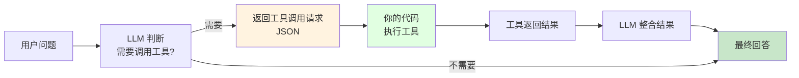
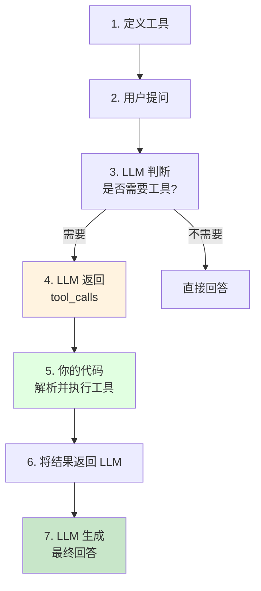

# 第 7 章：Function Calling & Tool Use

> 学完本章,你能:让 LLM 调用外部工具,实现从"聊天"到"干活"的跨越

**开场白:**

想象一下,你的 AI 助手就像一个刚入职的实习生——能说会道,但啥活儿都干不了。你问它:"今天北京天气怎么样?",它只能尴尬地回:"我不知道,我只是个语言模型..."

但如果给它一个**工具箱**呢?就像给实习生配上电脑、电话和数据库权限,它立刻就能查天气、发邮件、订会议室!这就是 **Function Calling** 的魔法——把 AI 从"只会说"变成"会干活"的超级助手。



**章节导览:**

- **7.1 Function Calling 原理**:理解 FC 工作流程,实现天气查询示例
- **7.2 Tool Use 实战**:对比 OpenAI 和 Anthropic 的工具调用方式
- **7.3 工具编排与回退**:多工具组合、自动选择、失败重试策略

---

::: tip 运行环境
本章代码需要安装以下依赖：
```bash
pip install openai python-dotenv
```
确保已在 `.env` 文件中配置 `OPENAI_API_KEY`（参见第 1 章环境准备）。
:::

::: info 前置知识自检
开始本章前，确认你已掌握以下内容（都是前面章节讲过的）：
- ✅ 能写基础 Python 函数（`def xxx()`）
- ✅ 知道什么是 API Key（第 1 章配过了）
- ✅ 理解 JSON 格式（就是 `{"key": "value"}` 这种结构）

如果 JSON 不太熟，花 2 分钟看下面这个速览就够了：
:::

::: details JSON Schema 30 秒速览（点击展开）
Function Calling 需要用 **JSON Schema** 来描述工具的参数格式。别被名字吓到，它就是一个"参数说明书"：

```json
{
  "type": "object",
  "properties": {
    "city": {
      "type": "string",
      "description": "城市名称"
    },
    "unit": {
      "type": "string",
      "enum": ["celsius", "fahrenheit"]
    }
  },
  "required": ["city"]
}
```

翻译成人话就是：
- 参数是一个对象（`object`）
- 里面有 `city`（字符串，必填）和 `unit`（字符串，选填，只能是 celsius 或 fahrenheit）

**就这么简单。** 下面的代码里你会看到完整的例子。
:::

## 7.1 Function Calling 原理 <DifficultyBadge level="intermediate" /> <CostBadge cost="$0.01" />

> 前置知识:4.3 结构化输出

### 为什么需要它?(Problem)

**问题:纯文本 LLM 无法"干活"**

假设你在做一个客服机器人,用户问:

> "今天北京天气怎么样?"

**用普通 LLM:**

```python
response = client.chat.completions.create(
    model="gpt-4.1-mini",
    messages=[{"role": "user", "content": "今天北京天气怎么样?"}]
)
print(response.choices[0].message.content)
```

**AI 回复:**
> "抱歉,我无法访问实时天气数据。建议你查看天气预报网站或使用天气 App。"

::: warning LLM 的三大无能
- **无法联网**:训练数据之后的实时信息一概不知(GPT-4.1: 2024年6月, Claude Sonnet 4.6: 2026年1月)
- **无法执行代码**:不能查数据库、调 API、发邮件
- **无法读写文件**:所有"干活"的需求都无法满足

就像一个有知识但没有手脚的大脑!
:::

**真实场景需要 AI 能够:**
1. 查询数据库(用户订单、库存)
2. 调用外部 API(天气、地图、支付)
3. 执行本地操作(文件读写、计算)
4. 发送通知(邮件、短信)

**Function Calling(函数调用)是解决方案:**让 LLM 告诉你"需要调用哪个工具,传什么参数",你的代码执行工具并返回结果,LLM 再整合成最终回答。

::: tip 类比:给 AI 一个工具箱
想象你是装修工人:
- **没有工具**:只能用嘴说"你需要打个洞"(普通 LLM)
- **有了工具箱**:拿出电钻,咔咔几下搞定(Function Calling)

LLM 不直接"拿工具",而是告诉你"我需要电钻,在墙上这个位置打洞",你来执行!
:::

### 它是什么?(Concept)

**Function Calling 是一种"协作模式":**

LLM 不直接执行工具,而是:
1. 分析用户问题
2. 判断是否需要调用工具
3. 生成工具调用的 JSON 请求
4. 你的代码执行工具
5. 工具结果返回给 LLM
6. LLM 生成最终回答

```mermaid
sequenceDiagram
    participant User as 用户
    participant LLM as LLM
    participant Code as 你的代码
    participant Tool as 外部工具/API
    
    User->>LLM: "北京今天天气怎么样?"
    LLM->>LLM: 分析:需要查天气
    LLM->>Code: tool_call:<br/>{name: "get_weather",<br/>args: {city: "北京"}}
    Code->>Tool: 调用天气 API
    Tool->>Code: 返回:{"temp": 15, "desc": "晴"}
    Code->>LLM: 工具结果:15°C,晴
    LLM->>User: "北京今天天气晴,温度15°C,<br/>适合出门。"
    
    style LLM fill:#e1f5fe
    style Code fill:#fff3e0
    style Tool fill:#c8e6c9
```

**核心组件:**

| 组件 | 作用 | 示例 |
|-----|------|------|
| **Tool Definition** | 用 JSON Schema 描述工具 | 函数名、参数、类型、说明 |
| **Tool Call** | LLM 返回的调用请求 | `{"name": "get_weather", "arguments": {...}}` |
| **Tool Result** | 你的代码执行后的返回值 | `{"temperature": 15, "weather": "sunny"}` |
| **Final Response** | LLM 整合工具结果的回答 | "北京今天天气晴,温度 15°C" |

**工具定义格式(JSON Schema):**

```python
tools = [
    {
        "type": "function",
        "function": {
            "name": "get_weather",
            "description": "获取指定城市的实时天气信息",
            "parameters": {
                "type": "object",
                "properties": {
                    "city": {
                        "type": "string",
                        "description": "城市名称,如:北京、上海"
                    },
                    "unit": {
                        "type": "string",
                        "enum": ["celsius", "fahrenheit"],
                        "description": "温度单位"
                    }
                },
                "required": ["city"],
                "additionalProperties": False
            }
        }
    }
]
```

**关键字段:**
- `name`:工具的唯一标识符
- `description`:描述工具的功能(LLM 用这个判断是否调用)
- `parameters`:JSON Schema 格式的参数定义
- `required`:必填参数列表

::: warning 翻车现场:糟糕的工具描述
```python
# ❌ 错误示范
{
    "name": "func1",
    "description": "一个函数",  # 描述太模糊!
    "parameters": {...}
}
```

**结果:**
- 用户:"北京天气怎么样?"
- LLM:"我不知道该用哪个工具..." ❌

```python
# ✅ 正确示范
{
    "name": "get_weather",
    "description": "获取指定城市的实时天气信息,包括温度、天气状况",
    "parameters": {...}
}
```

**一句话总结:** 工具描述就像招聘广告,写得越清楚,AI 就越知道什么时候该"应聘"这个工具!
:::

**工作流程:**



**完整代码示例:**

```python
from openai import OpenAI
import json

client = OpenAI()

# 1. 定义工具
tools = [
    {
        "type": "function",
        "function": {
            "name": "get_weather",
            "description": "获取指定城市的实时天气",
            "parameters": {
                "type": "object",
                "properties": {
                    "city": {
                        "type": "string",
                        "description": "城市名称"
                    }
                },
                "required": ["city"]
            }
        }
    }
]

# 2. 实现工具函数(模拟)
def get_weather(city: str):
    # 实际应用中调用真实的天气 API
    fake_data = {
        "北京": {"temperature": 15, "weather": "晴"},
        "上海": {"temperature": 22, "weather": "多云"}
    }
    return fake_data.get(city, {"temperature": 20, "weather": "未知"})

# 3. 第一次调用:LLM 判断需要调用工具
messages = [{"role": "user", "content": "北京今天天气怎么样?"}]

response = client.chat.completions.create(
    model="gpt-4.1-mini",
    messages=messages,
    tools=tools,
    tool_choice="auto"  # 自动判断是否调用工具
)

# 4. 检查是否需要调用工具
message = response.choices[0].message
if message.tool_calls:
    # 5. 执行工具
    tool_call = message.tool_calls[0]
    function_name = tool_call.function.name
    function_args = json.loads(tool_call.function.arguments)
    
    print(f"LLM 要求调用: {function_name}({function_args})")
    
    # 调用本地函数
    result = get_weather(**function_args)
    print(f"工具返回: {result}")
    
    # 6. 将结果返回给 LLM
    messages.append(message)  # 添加 LLM 的工具调用请求
    messages.append({
        "role": "tool",
        "tool_call_id": tool_call.id,
        "content": json.dumps(result, ensure_ascii=False)
    })
    
    # 7. LLM 生成最终回答
    final_response = client.chat.completions.create(
        model="gpt-4.1-mini",
        messages=messages
    )
    
    print(f"最终回答: {final_response.choices[0].message.content}")
else:
    print(f"直接回答: {message.content}")
```

**输出:**
```
LLM 要求调用: get_weather({'city': '北京'})
工具返回: {'temperature': 15, 'weather': '晴'}
最终回答: 北京今天天气晴,温度15°C,适合出门活动。
```

**流式响应(SSE):**

Function Calling 也支持流式输出:

```python
stream = client.chat.completions.create(
    model="gpt-4.1-mini",
    messages=messages,
    tools=tools,
    stream=True
)

for chunk in stream:
    if chunk.choices[0].delta.tool_calls:
        # 流式返回工具调用信息
        print(chunk.choices[0].delta.tool_calls)
```

::: tip 一句话总结
Function Calling 的核心流程:**用户提问 → LLM 返回工具调用请求(JSON) → 你的代码执行工具 → 结果返回 LLM → LLM 生成最终回答**

就像你在餐厅点菜:你告诉服务员(LLM)想吃什么,服务员把订单发给厨房(工具),厨房做好后服务员端上来(整合结果)!
:::

### 动手试试(Practice)

完整的天气查询示例,支持多城市和流式输出。

<ColabBadge path="demos/07-function-calling/function_calling.ipynb" />

### 小结(Reflection)

- **解决了什么**:让 LLM 能够调用外部工具,从"聊天"变成"干活"
- **没解决什么**:OpenAI 和 Anthropic 的工具调用方式不同?多个工具怎么组合?——下一节介绍
- **关键要点**:
  1. **Function Calling 是协作模式**:LLM 提出调用请求,你的代码执行
  2. **工具定义用 JSON Schema**:描述清楚参数类型和说明
  3. **工作流程**:用户问题 → LLM 返回 tool_call → 执行工具 → 返回结果 → LLM 生成回答
  4. **支持流式输出**:实时返回工具调用信息
  5. **描述很重要**:LLM 根据 description 判断是否调用,写清楚工具的功能

---

*最后更新:2026-02-20*
