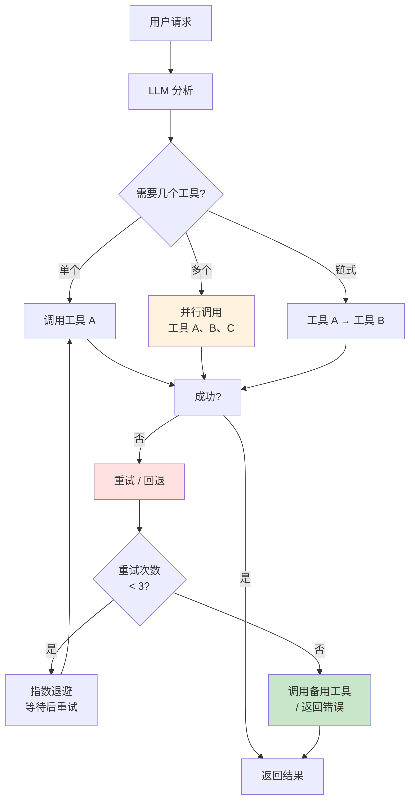

# 7.3 工具编排与回退 <DifficultyBadge level="advanced" /> <CostBadge cost="$0.03" />

> 前置知识:7.1 Function Calling 原理,7.2 Tool Use 实战

**开场白:**

你以为学会了工具调用就万事大吉?Too young too simple!现实世界就像墨菲定律——**凡是可能出错的,一定会出错**:

- 天气 API 突然挂了怎么办?
- LLM 选错工具了怎么办?
- 需要先查天气再推荐穿衣,怎么让工具"排队"?

欢迎来到**工具编排(Orchestration)**的世界——就像当乐队指挥,让多个"乐手"(工具)和谐演奏,还要有 Plan B 应对跑调的情况!

### 为什么需要它?(Problem)

**问题:现实场景中工具调用会失败**

你已经实现了基础的工具调用,但在生产环境中会遇到这些问题:

**场景 1:工具调用失败**

```python
# 用户:"帮我查一下火星的天气"
# LLM 调用: get_weather(city="火星")
# 工具返回: {"error": "城市不存在"}
# ❌ 如何让 LLM 知道失败了并给出合理回复?
```

**场景 2:需要调用多个工具**

```python
# 用户:"查一下北京和上海的天气,告诉我哪个更暖和"
# 需要:
# 1. get_weather(city="北京")
# 2. get_weather(city="上海")
# 3. 比较结果
# ❌ 如何编排多个工具调用?
```

**场景 3:工具超时或不可用**

```python
# 主工具:天气 API (超时)
# 备用方案:使用缓存数据 / 调用备用 API
# ❌ 如何实现自动回退(fallback)?
```

**场景 4:工具选择错误**

```python
# 用户:"帮我算一下 2+3"
# LLM 错误地调用了 get_weather
# ❌ 如何验证工具选择的正确性?
```

**本节解决:**工具编排、自动选择、失败重试、回退策略。

::: tip 类比:Orchestration = 乐队指挥
想象你在指挥交响乐团:
- **顺序演奏**:小提琴先拉,然后大提琴接上(工具链)
- **和弦齐奏**:所有乐器同时发声(并行调用)
- **即兴应变**:主音歌手感冒,立刻换替补(回退策略)
- **节奏控制**:某段重复三遍,如果还不对就跳过(重试机制)

AI 工具编排就是让你成为"代码指挥家"!
:::

### 它是什么?(Concept)

**工具编排(Tool Orchestration)是管理多个工具协作的机制:**



**核心模式:**

| 模式 | 说明 | 适用场景 |
|-----|------|---------|
| **顺序调用** | 工具 A → 工具 B → 工具 C | 后续工具依赖前面的结果 |
| **并行调用** | 同时调用多个工具 | 独立的查询任务 |
| **条件调用** | 根据结果决定下一步 | 多步推理场景 |
| **回退策略** | 主工具失败后调用备用工具 | 提高可用性 |
| **重试机制** | 失败后自动重试(指数退避) | 临时性错误 |

---

## 1. 工具链(Tool Chain)

**场景:后续工具依赖前面的结果**

示例:查天气 → 根据天气推荐穿衣

```python
from openai import OpenAI
import json
import time

client = OpenAI()

# 定义工具
tools = [
    {
        "type": "function",
        "function": {
            "name": "get_weather",
            "description": "获取城市天气",
            "parameters": {
                "type": "object",
                "properties": {
                    "city": {"type": "string", "description": "城市名"}
                },
                "required": ["city"]
            }
        }
    },
    {
        "type": "function",
        "function": {
            "name": "suggest_clothing",
            "description": "根据温度推荐穿衣",
            "parameters": {
                "type": "object",
                "properties": {
                    "temperature": {"type": "number", "description": "温度(°C)"}
                },
                "required": ["temperature"]
            }
        }
    }
]

# 实现工具
def get_weather(city: str):
    weather_data = {
        "北京": {"temperature": 5, "weather": "晴"},
        "上海": {"temperature": 18, "weather": "多云"}
    }
    return weather_data.get(city, {"error": "城市不存在"})

def suggest_clothing(temperature: float):
    if temperature < 10:
        return {"suggestion": "羽绒服、厚外套"}
    elif temperature < 20:
        return {"suggestion": "毛衣、外套"}
    else:
        return {"suggestion": "T恤、短袖"}

available_functions = {
    "get_weather": get_weather,
    "suggest_clothing": suggest_clothing
}

# 自动执行工具链
def run_tool_chain(user_query: str, max_iterations: int = 5):
    messages = [{"role": "user", "content": user_query}]
    
    for i in range(max_iterations):
        print(f"\n=== 迭代 {i+1} ===")
        
        response = client.chat.completions.create(
            model="gpt-4.1-mini",
            messages=messages,
            tools=tools,
            tool_choice="auto"
        )
        
        message = response.choices[0].message
        messages.append(message)
        
        # 检查是否需要调用工具
        if not message.tool_calls:
            print(f"最终回答: {message.content}")
            return message.content
        
        # 执行所有工具调用
        for tool_call in message.tool_calls:
            function_name = tool_call.function.name
            function_args = json.loads(tool_call.function.arguments)
            
            print(f"调用工具: {function_name}({function_args})")
            
            function_to_call = available_functions[function_name]
            result = function_to_call(**function_args)
            
            print(f"工具返回: {result}")
            
            messages.append({
                "role": "tool",
                "tool_call_id": tool_call.id,
                "content": json.dumps(result, ensure_ascii=False)
            })
    
    return "达到最大迭代次数"

# 测试
run_tool_chain("北京今天天气怎么样?应该穿什么衣服?")
```

**输出:**
```
=== 迭代 1 ===
调用工具: get_weather({'city': '北京'})
工具返回: {'temperature': 5, 'weather': '晴'}

=== 迭代 2 ===
调用工具: suggest_clothing({'temperature': 5})
工具返回: {'suggestion': '羽绒服、厚外套'}

=== 迭代 3 ===
最终回答: 北京今天天气晴,温度5°C,建议穿羽绒服或厚外套保暖。
```

::: tip 一句话总结
工具链(Tool Chain)让工具像"接力赛"一样工作:**上一棒的输出 = 下一棒的输入**。用 `max_iterations` 防止无限循环,就像给接力赛设定"最多跑 5 圈"!
:::

---

## 2. 并行工具调用

**场景:同时查询多个城市的天气**

OpenAI 和 Anthropic 都支持一次返回多个工具调用:

```python
from openai import OpenAI
import json

client = OpenAI()

tools = [
    {
        "type": "function",
        "function": {
            "name": "get_weather",
            "description": "获取城市天气",
            "parameters": {
                "type": "object",
                "properties": {
                    "city": {"type": "string"}
                },
                "required": ["city"]
            }
        }
    }
]

def get_weather(city: str):
    weather_data = {
        "北京": {"temperature": 5, "weather": "晴"},
        "上海": {"temperature": 18, "weather": "多云"},
        "广州": {"temperature": 25, "weather": "晴"}
    }
    return weather_data.get(city, {"error": "城市不存在"})

# 用户问题:涉及多个城市
messages = [{"role": "user", "content": "北京、上海、广州今天天气如何?哪个最暖和?"}]

response = client.chat.completions.create(
    model="gpt-4.1-mini",
    messages=messages,
    tools=tools
)

message = response.choices[0].message
messages.append(message)

# LLM 会返回多个 tool_calls
print(f"LLM 调用了 {len(message.tool_calls)} 个工具")

for tool_call in message.tool_calls:
    function_args = json.loads(tool_call.function.arguments)
    result = get_weather(**function_args)
    
    print(f"get_weather({function_args}) = {result}")
    
    messages.append({
        "role": "tool",
        "tool_call_id": tool_call.id,
        "content": json.dumps(result, ensure_ascii=False)
    })

# 最终回答
final_response = client.chat.completions.create(
    model="gpt-4.1-mini",
    messages=messages
)

print(f"\n最终回答: {final_response.choices[0].message.content}")
```

::: warning 翻车现场:以为工具总会并行调用
```python
# 用户:"北京、上海、广州今天天气如何?"
# 你期望:LLM 返回 3 个 tool_calls (并行)
# 实际:有时 LLM 会依次调用 3 次(串行),浪费时间!
```

**为什么?**
- LLM 不保证一定并行返回多个 `tool_calls`
- 受模型训练、prompt 影响

**解决办法:**
```python
# 在 description 里明确提示
{
    "name": "get_weather",
    "description": "获取城市天气。支持批量查询,可同时查询多个城市"
}
```

**一句话总结:** 并行调用是"看 LLM 心情"的,想要可靠并行?用 `asyncio` 自己实现批处理!
:::

---

## 3. 错误处理与回退

**场景:工具调用失败后的处理策略**

```python
from openai import OpenAI
import json
import time
from typing import Dict, Any, Callable

client = OpenAI()

class ToolExecutor:
    """带重试和回退的工具执行器"""
    
    def __init__(self, max_retries: int = 3, backoff_factor: float = 2.0):
        self.max_retries = max_retries
        self.backoff_factor = backoff_factor
    
    def execute_with_retry(
        self, 
        func: Callable, 
        args: Dict[str, Any],
        fallback_func: Callable = None
    ) -> Dict[str, Any]:
        """
        执行工具,支持重试和回退
        
        Args:
            func: 主工具函数
            args: 参数
            fallback_func: 备用工具函数
        
        Returns:
            工具执行结果
        """
        last_error = None
        
        # 重试主工具
        for attempt in range(self.max_retries):
            try:
                result = func(**args)
                
                # 检查结果是否包含错误
                if isinstance(result, dict) and "error" in result:
                    raise Exception(result["error"])
                
                return {
                    "success": True,
                    "data": result,
                    "attempts": attempt + 1
                }
            
            except Exception as e:
                last_error = e
                wait_time = self.backoff_factor ** attempt
                
                print(f"工具调用失败(第 {attempt+1} 次): {e}")
                
                if attempt < self.max_retries - 1:
                    print(f"等待 {wait_time}s 后重试...")
                    time.sleep(wait_time)
        
        # 主工具失败,尝试备用工具
        if fallback_func:
            print(f"主工具失败,切换到备用工具")
            try:
                result = fallback_func(**args)
                return {
                    "success": True,
                    "data": result,
                    "fallback": True
                }
            except Exception as e:
                print(f"备用工具也失败: {e}")
        
        # 所有方案都失败
        return {
            "success": False,
            "error": str(last_error),
            "attempts": self.max_retries
        }

# 定义主工具和备用工具
def get_weather_api(city: str):
    """主工具:调用真实 API(模拟)"""
    import random
    
    # 模拟 30% 失败率
    if random.random() < 0.3:
        raise Exception("API 超时")
    
    weather_data = {
        "北京": {"temperature": 5, "weather": "晴", "source": "API"},
        "上海": {"temperature": 18, "weather": "多云", "source": "API"}
    }
    
    if city not in weather_data:
        raise Exception(f"城市 {city} 不存在")
    
    return weather_data[city]

def get_weather_cache(city: str):
    """备用工具:使用缓存数据"""
    cache_data = {
        "北京": {"temperature": 5, "weather": "晴(缓存)", "source": "cache"},
        "上海": {"temperature": 18, "weather": "多云(缓存)", "source": "cache"}
    }
    
    if city not in cache_data:
        raise Exception(f"缓存中没有 {city} 的数据")
    
    return cache_data[city]

# 测试
executor = ToolExecutor(max_retries=3, backoff_factor=1.5)

print("=== 测试 1: 正常调用 ===")
result = executor.execute_with_retry(
    func=get_weather_api,
    args={"city": "北京"},
    fallback_func=get_weather_cache
)
print(f"结果: {result}\n")

print("=== 测试 2: 不存在的城市(会触发回退) ===")
result = executor.execute_with_retry(
    func=get_weather_api,
    args={"city": "火星"},
    fallback_func=get_weather_cache
)
print(f"结果: {result}\n")
```

::: tip 一句话总结
**错误处理三板斧:**
1. **重试(Retry)**:用指数退避(exponential backoff),等 1s → 2s → 4s,避免"疯狂敲门"
2. **回退(Fallback)**:主工具挂了就用备胎,就像主播掉线立刻切备用直播间
3. **快速失败(Fail Fast)**:重试 3 次还不行就认输,别让用户等到天荒地老

**记住:** 网络请求都可能失败,永远准备 Plan B!
:::

---

## 4. 智能工具选择

**场景:验证 LLM 选择的工具是否正确**

```python
from openai import OpenAI
import json
from typing import List, Dict

client = OpenAI()

# 定义工具及其适用场景
tools_with_metadata = [
    {
        "tool": {
            "type": "function",
            "function": {
                "name": "get_weather",
                "description": "获取城市的实时天气信息",
                "parameters": {
                    "type": "object",
                    "properties": {
                        "city": {"type": "string", "description": "城市名"}
                    },
                    "required": ["city"]
                }
            }
        },
        "keywords": ["天气", "温度", "下雨", "晴天", "气温"],
        "required_params": ["city"]
    },
    {
        "tool": {
            "type": "function",
            "function": {
                "name": "calculator",
                "description": "执行数学计算",
                "parameters": {
                    "type": "object",
                    "properties": {
                        "expression": {"type": "string", "description": "数学表达式"}
                    },
                    "required": ["expression"]
                }
            }
        },
        "keywords": ["计算", "加", "减", "乘", "除", "等于"],
        "required_params": ["expression"]
    }
]

def validate_tool_call(tool_name: str, args: Dict, user_query: str) -> bool:
    """
    验证工具调用是否合理
    
    Returns:
        True: 合理
        False: 不合理
    """
    # 找到工具元数据
    tool_meta = None
    for meta in tools_with_metadata:
        if meta["tool"]["function"]["name"] == tool_name:
            tool_meta = meta
            break
    
    if not tool_meta:
        print(f"警告: 未知工具 {tool_name}")
        return False
    
    # 检查关键词匹配
    keywords = tool_meta["keywords"]
    query_lower = user_query.lower()
    
    has_keyword = any(kw in query_lower for kw in keywords)
    if not has_keyword:
        print(f"警告: 用户问题中没有工具 {tool_name} 的关键词")
        return False
    
    # 检查必填参数
    required_params = tool_meta["required_params"]
    missing_params = [p for p in required_params if p not in args]
    
    if missing_params:
        print(f"警告: 缺少必填参数: {missing_params}")
        return False
    
    return True

# 测试
user_query = "北京天气怎么样?"
messages = [{"role": "user", "content": user_query}]

tools = [meta["tool"] for meta in tools_with_metadata]

response = client.chat.completions.create(
    model="gpt-4.1-mini",
    messages=messages,
    tools=tools
)

message = response.choices[0].message

if message.tool_calls:
    for tool_call in message.tool_calls:
        function_name = tool_call.function.name
        function_args = json.loads(tool_call.function.arguments)
        
        print(f"LLM 选择了工具: {function_name}({function_args})")
        
        # 验证工具选择
        is_valid = validate_tool_call(function_name, function_args, user_query)
        
        if is_valid:
            print("✅ 工具选择合理")
        else:
            print("❌ 工具选择不合理,拒绝执行")
```

::: warning 翻车现场:盲目信任 LLM 的工具选择
```python
# 用户:"帮我算一下 2+3"
# LLM 脑抽了,调用: get_weather(city="2+3")
# 你的代码:无脑执行,返回 "城市不存在"
# 用户:???
```

**问题:**
- LLM 不是 100% 可靠,会选错工具
- 恶意用户可能故意诱导 LLM 调用危险工具(如 `delete_database`)

**防御策略:**
1. **关键词验证**:问题里没有"天气"相关词?那就别调 `get_weather`
2. **参数类型检查**:传给数学函数的参数竟然是城市名?拒绝!
3. **白名单机制**:只允许调用明确授权的工具
4. **人工确认**:危险操作(删除、支付)必须用户二次确认

**一句话总结:** 把 LLM 当作"不太靠谱的实习生",永远验证它的决定后再执行!
:::

---

## 5. 完整的工具编排框架

**整合所有功能:**

```python
from openai import OpenAI
import json
import time
from typing import List, Dict, Any, Callable, Optional

class ToolOrchestrator:
    """工具编排框架"""
    
    def __init__(
        self, 
        client: OpenAI,
        model: str = "gpt-4.1-mini",
        max_iterations: int = 10,
        max_retries: int = 3
    ):
        self.client = client
        self.model = model
        self.max_iterations = max_iterations
        self.max_retries = max_retries
        self.functions: Dict[str, Dict] = {}
    
    def register_tool(
        self, 
        name: str, 
        func: Callable,
        fallback_func: Optional[Callable] = None,
        schema: Dict = None
    ):
        """注册工具"""
        self.functions[name] = {
            "func": func,
            "fallback": fallback_func,
            "schema": schema
        }
    
    def execute_tool(self, name: str, args: Dict[str, Any]) -> Dict[str, Any]:
        """执行工具(带重试和回退)"""
        tool_info = self.functions.get(name)
        
        if not tool_info:
            return {"success": False, "error": f"工具 {name} 未注册"}
        
        # 重试机制
        for attempt in range(self.max_retries):
            try:
                result = tool_info["func"](**args)
                return {"success": True, "data": result}
            
            except Exception as e:
                if attempt < self.max_retries - 1:
                    wait_time = 2 ** attempt
                    print(f"工具 {name} 失败,{wait_time}s 后重试")
                    time.sleep(wait_time)
                else:
                    # 尝试回退
                    if tool_info["fallback"]:
                        try:
                            result = tool_info["fallback"](**args)
                            return {"success": True, "data": result, "fallback": True}
                        except:
                            pass
                    
                    return {"success": False, "error": str(e)}
    
    def run(self, user_query: str, tools: List[Dict]) -> str:
        """运行工具编排"""
        messages = [{"role": "user", "content": user_query}]
        
        for i in range(self.max_iterations):
            response = self.client.chat.completions.create(
                model=self.model,
                messages=messages,
                tools=tools,
                tool_choice="auto"
            )
            
            message = response.choices[0].message
            messages.append(message)
            
            if not message.tool_calls:
                return message.content
            
            # 执行所有工具
            for tool_call in message.tool_calls:
                name = tool_call.function.name
                args = json.loads(tool_call.function.arguments)
                
                print(f"[迭代 {i+1}] 调用工具: {name}({args})")
                
                result = self.execute_tool(name, args)
                
                messages.append({
                    "role": "tool",
                    "tool_call_id": tool_call.id,
                    "content": json.dumps(result, ensure_ascii=False)
                })
        
        return "达到最大迭代次数"

# 使用示例
orchestrator = ToolOrchestrator(client=OpenAI())

# 注册工具
orchestrator.register_tool(
    name="get_weather",
    func=lambda city: {"temperature": 15, "weather": "晴"},
    fallback_func=lambda city: {"temperature": 0, "weather": "未知(缓存)"}
)

# 运行
result = orchestrator.run(
    user_query="北京天气怎么样?",
    tools=[...]  # 工具定义
)
```

::: tip 最佳实践:生产环境的工具编排
1. **日志记录**:每次工具调用都记录(请求、结果、耗时)
2. **监控告警**:工具失败率超过 10%?立即通知
3. **超时控制**:单个工具最多执行 30s,别让用户等太久
4. **成本控制**:记录每次调用的 token 消耗,避免预算爆炸
5. **限流保护**:同一用户 1 分钟最多调用 10 次工具

**一句话总结:** 工具编排框架把"重试、回退、日志、限流"全包了,就像给工具调用加了一套"安全气囊"!
:::

### 动手试试(Practice)

完整示例:多工具编排、自动重试、回退策略。

<ColabBadge path="demos/07-function-calling/orchestration.ipynb" />

### 小结(Reflection)

- **解决了什么**:工具链编排、并行调用、失败重试、回退策略、智能选择
- **没解决什么**:文本之外的媒体类型(图像、语音)怎么处理?——下一章介绍多模态 AI
- **关键要点**:
  1. **工具链**:通过多轮对话实现工具的顺序调用
  2. **并行调用**:LLM 可以一次返回多个 tool_calls
  3. **重试机制**:指数退避(exponential backoff)
  4. **回退策略**:主工具失败后自动切换备用工具
  5. **工具验证**:检查 LLM 选择的工具是否合理
  6. **max_iterations 防止死循环**:限制最大工具调用轮数
  7. **生产环境建议**:日志记录、监控、超时控制、成本控制

::: tip 本章终极总结
**Function Calling 三部曲:**
1. **第一步(7.1)**:学会"给 AI 一个工具箱"——定义工具、执行调用
2. **第二步(7.2)**:掌握"两种遥控器"——OpenAI 和 Anthropic 的不同按法
3. **第三步(7.3)**:成为"乐队指挥"——编排工具、处理失败、优雅回退

**记住核心原则:**
- 永远验证 LLM 的工具选择
- 永远准备 Plan B
- 永远设置超时和重试上限

现在你已经从"能说会道"的 AI 升级到"能干活"的 AI 了!下一章我们让它学会"看图说话"!
:::

---

*最后更新:2026-02-20*
