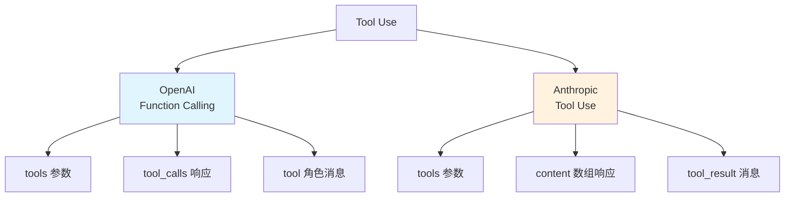

# 7.2 Tool Use 实战 <DifficultyBadge level="intermediate" /> <CostBadge cost="$0.02" />

> 前置知识:7.1 Function Calling 原理

**开场白:**

刚学会 OpenAI 的 Function Calling,兴高采烈地切换到 Claude,结果... 代码全挂了!就像你学会了开手动挡汽车,换了辆自动挡却不知道怎么挂档。

欢迎来到 AI 工具调用的"**方言世界**"——每家都说"我支持 Tool Use",但每家的"口音"都不一样。本节带你成为**双语程序员**,玩转 OpenAI 和 Anthropic 两大阵营!

### 为什么需要它?(Problem)

**问题:不同厂商的工具调用方式不一样**

你已经掌握了 OpenAI 的 Function Calling,但当你尝试用 Anthropic 的 Claude 时:

```python
# ❌ OpenAI 的方式在 Claude 上不工作
response = client.messages.create(
    model="claude-3-5-sonnet-20241022",
    tools=tools,  # Claude 的格式不同!
    # ...
)
```

**现实挑战:**
1. **API 格式不同**:OpenAI 用 `tools`,Anthropic 用 `tools` 但结构不同
2. **返回格式不同**:OpenAI 返回 `tool_calls`,Anthropic 返回 `content` 数组
3. **并行调用**:一次对话中需要调用多个工具怎么办?
4. **错误处理**:工具调用失败、参数错误、超时等问题如何处理?

**本节解决:**掌握 OpenAI 和 Anthropic 两大主流范式,实现统一的工具调用接口。

::: tip 类比:Tool = 遥控器按钮
把每个工具想象成遥控器上的按钮:
- **OpenAI 遥控器**:按钮标记是 `tool_calls`,结果从 `tool` 频道返回
- **Anthropic 遥控器**:按钮标记是 `content[type=tool_use]`,结果从 `user` 频道的 `tool_result` 返回

按钮功能一样,但按法不同!我们需要学会两种"手势"。
:::

### 它是什么?(Concept)

**两大工具调用范式:**



**关键差异对比:**

| 维度 | OpenAI | Anthropic |
|-----|--------|-----------|
| **工具定义** | `tools` 列表 | `tools` 列表(格式略有不同) |
| **工具调用控制** | `tool_choice` | `tool_choice` |
| **响应结构** | `message.tool_calls` | `content` 数组,类型为 `tool_use` |
| **工具结果返回** | `role: "tool"` | `role: "user"`,`content` 包含 `tool_result` |
| **并行调用** | 支持,返回多个 `tool_calls` | 支持,返回多个 `tool_use` 块 |
| **流式输出** | 支持 | 支持 |

---

## OpenAI Function Calling 详解

**完整工作流程:**

```python
from openai import OpenAI
import json

client = OpenAI()

# 1. 定义多个工具
tools = [
    {
        "type": "function",
        "function": {
            "name": "get_weather",
            "description": "获取指定城市的天气",
            "parameters": {
                "type": "object",
                "properties": {
                    "city": {"type": "string", "description": "城市名"}
                },
                "required": ["city"]
            }
        }
    },
    {
        "type": "function",
        "function": {
            "name": "calculator",
            "description": "执行数学计算",
            "parameters": {
                "type": "object",
                "properties": {
                    "expression": {
                        "type": "string",
                        "description": "数学表达式,如 '2+3*4'"
                    }
                },
                "required": ["expression"]
            }
        }
    }
]

# 2. 实现工具函数
def get_weather(city: str):
    return {"city": city, "temperature": 15, "weather": "晴"}

def calculator(expression: str):
    try:
        result = eval(expression)  # 生产环境使用 ast.literal_eval
        return {"expression": expression, "result": result}
    except:
        return {"error": "计算错误"}

# 3. 工具路由
available_functions = {
    "get_weather": get_weather,
    "calculator": calculator
}

# 4. 调用 LLM
messages = [{"role": "user", "content": "北京天气如何?顺便帮我算一下 15*7"}]

response = client.chat.completions.create(
    model="gpt-4.1-mini",
    messages=messages,
    tools=tools,
    tool_choice="auto"  # auto | required | none | {"type": "function", "function": {"name": "xxx"}}
)

# 5. 处理工具调用(可能是多个)
message = response.choices[0].message
messages.append(message)

if message.tool_calls:
    for tool_call in message.tool_calls:
        function_name = tool_call.function.name
        function_args = json.loads(tool_call.function.arguments)
        
        print(f"调用工具: {function_name}({function_args})")
        
        # 执行工具
        function_to_call = available_functions[function_name]
        result = function_to_call(**function_args)
        
        # 添加工具结果
        messages.append({
            "role": "tool",
            "tool_call_id": tool_call.id,
            "content": json.dumps(result, ensure_ascii=False)
        })

    # 6. LLM 生成最终回答
    final_response = client.chat.completions.create(
        model="gpt-4.1-mini",
        messages=messages
    )
    
    print(f"\n最终回答: {final_response.choices[0].message.content}")
```

**tool_choice 参数详解:**

| 值 | 行为 |
|---|------|
| `"auto"` | LLM 自动判断是否调用工具(默认) |
| `"none"` | 强制不调用工具,只生成文本 |
| `"required"` | 强制调用至少一个工具 |
| `{"type": "function", "function": {"name": "get_weather"}}` | 强制调用指定工具 |

::: warning 翻车现场:忘记处理并行调用
```python
# ❌ 错误:只处理了第一个工具调用
tool_call = message.tool_calls[0]  # 如果 LLM 返回多个怎么办?
result = get_weather(**json.loads(tool_call.function.arguments))
```

**用户问:** "北京和上海今天天气怎么样?"

**结果:**
- LLM 返回了 2 个 `tool_calls` (北京 + 上海)
- 你的代码只处理了第一个
- 最终回答只包含北京天气,上海被忽略了!

**正确做法:**
```python
# ✅ 遍历所有 tool_calls
for tool_call in message.tool_calls:
    # 处理每个工具调用
    ...
```

**一句话总结:** `tool_calls` 是列表,永远用 `for` 循环处理,别偷懒只拿第一个!
:::

---

## Anthropic Tool Use 详解

**Anthropic 的实现方式:**

```python
from anthropic import Anthropic
import json

client = Anthropic()

# 1. 定义工具(格式略有不同)
tools = [
    {
        "name": "get_weather",
        "description": "获取指定城市的天气信息",
        "input_schema": {
            "type": "object",
            "properties": {
                "city": {
                    "type": "string",
                    "description": "城市名称"
                }
            },
            "required": ["city"]
        }
    },
    {
        "name": "calculator",
        "description": "执行数学计算",
        "input_schema": {
            "type": "object",
            "properties": {
                "expression": {
                    "type": "string",
                    "description": "数学表达式"
                }
            },
            "required": ["expression"]
        }
    }
]

# 2. 实现工具函数(同上)
def get_weather(city: str):
    return {"city": city, "temperature": 15, "weather": "晴"}

def calculator(expression: str):
    try:
        return {"result": eval(expression)}
    except:
        return {"error": "计算错误"}

available_functions = {
    "get_weather": get_weather,
    "calculator": calculator
}

# 3. 调用 LLM
messages = [{"role": "user", "content": "北京天气如何?顺便帮我算一下 15*7"}]

response = client.messages.create(
    model="claude-3-5-sonnet-20241022",
    max_tokens=1024,
    tools=tools,
    messages=messages
)

# 4. 处理工具调用
print(f"Stop reason: {response.stop_reason}")  # tool_use

# Anthropic 的响应结构: content 是一个数组
tool_results = []
for content_block in response.content:
    if content_block.type == "tool_use":
        tool_name = content_block.name
        tool_input = content_block.input
        tool_use_id = content_block.id
        
        print(f"调用工具: {tool_name}({tool_input})")
        
        # 执行工具
        function_to_call = available_functions[tool_name]
        result = function_to_call(**tool_input)
        
        # 收集工具结果
        tool_results.append({
            "type": "tool_result",
            "tool_use_id": tool_use_id,
            "content": json.dumps(result, ensure_ascii=False)
        })

# 5. 返回工具结果给 LLM
messages.append({"role": "assistant", "content": response.content})
messages.append({
    "role": "user",
    "content": tool_results
})

final_response = client.messages.create(
    model="claude-3-5-sonnet-20241022",
    max_tokens=1024,
    tools=tools,
    messages=messages
)

print(f"\n最终回答: {final_response.content[0].text}")
```

**关键差异:**

1. **工具定义**:Anthropic 用 `input_schema` 而不是 `parameters`
2. **响应结构**:Anthropic 的 `content` 是数组,可能包含多个 `tool_use` 和 `text` 块
3. **工具结果**:Anthropic 用 `tool_result` 类型,放在 `user` 角色消息中

::: tip 一句话总结
**OpenAI vs Anthropic 的关键区别:**
- OpenAI:工具调用在 `message.tool_calls`,结果用 `role="tool"`
- Anthropic:工具调用在 `content[type="tool_use"]`,结果放在 `user` 消息的 `content[type="tool_result"]`

就像点外卖:OpenAI 是"骑手直接送到你手里",Anthropic 是"骑手放在门口,你自己拿进来"!
:::

---

## 统一的工具调用接口

**实现一个抽象层,屏蔽差异:**

```python
from abc import ABC, abstractmethod
from typing import List, Dict, Any, Callable
import json

class ToolUseAdapter(ABC):
    """工具调用适配器基类"""
    
    @abstractmethod
    def call_with_tools(self, messages: List[Dict], tools: List[Dict]) -> Any:
        """调用 LLM 并处理工具"""
        pass
    
    @abstractmethod
    def execute_tools(self, response: Any, functions: Dict[str, Callable]) -> List[Dict]:
        """执行工具并返回结果"""
        pass

class OpenAIAdapter(ToolUseAdapter):
    def __init__(self, client):
        self.client = client
    
    def call_with_tools(self, messages: List[Dict], tools: List[Dict]) -> Any:
        return self.client.chat.completions.create(
            model="gpt-4.1-mini",
            messages=messages,
            tools=tools,
            tool_choice="auto"
        )
    
    def execute_tools(self, response: Any, functions: Dict[str, Callable]) -> List[Dict]:
        results = []
        message = response.choices[0].message
        
        if message.tool_calls:
            for tool_call in message.tool_calls:
                func = functions[tool_call.function.name]
                args = json.loads(tool_call.function.arguments)
                result = func(**args)
                
                results.append({
                    "role": "tool",
                    "tool_call_id": tool_call.id,
                    "content": json.dumps(result, ensure_ascii=False)
                })
        
        return results

class AnthropicAdapter(ToolUseAdapter):
    def __init__(self, client):
        self.client = client
    
    def call_with_tools(self, messages: List[Dict], tools: List[Dict]) -> Any:
        return self.client.messages.create(
            model="claude-3-5-sonnet-20241022",
            max_tokens=1024,
            tools=tools,
            messages=messages
        )
    
    def execute_tools(self, response: Any, functions: Dict[str, Callable]) -> List[Dict]:
        results = []
        
        for block in response.content:
            if block.type == "tool_use":
                func = functions[block.name]
                result = func(**block.input)
                
                results.append({
                    "type": "tool_result",
                    "tool_use_id": block.id,
                    "content": json.dumps(result, ensure_ascii=False)
                })
        
        return results

# 使用统一接口
def run_with_tools(adapter: ToolUseAdapter, messages: List[Dict], tools: List[Dict], functions: Dict[str, Callable]):
    # 第一次调用
    response = adapter.call_with_tools(messages, tools)
    
    # 执行工具
    tool_results = adapter.execute_tools(response, functions)
    
    if tool_results:
        # 将结果返回 LLM
        # (具体实现根据不同适配器调整)
        pass
    
    return response
```

::: warning 翻车现场:不看文档直接抄代码
```python
# ❌ 把 OpenAI 的代码直接用在 Anthropic 上
response = anthropic_client.messages.create(...)

# 尝试访问 tool_calls
if response.message.tool_calls:  # AttributeError!
    ...
```

**错误原因:**
- Anthropic 没有 `message.tool_calls` 属性!
- 需要遍历 `response.content` 找 `type="tool_use"` 的块

**一句话总结:** 别想当然!不同厂商的 API 就像不同品牌的遥控器,按钮位置不一样,看说明书再用!
:::

### 动手试试(Practice)

完整示例:对比 OpenAI 和 Anthropic 的工具调用,实现天气+计算器组合。

<ColabBadge path="demos/07-function-calling/tool_use.ipynb" />

### 小结(Reflection)

- **解决了什么**:掌握 OpenAI 和 Anthropic 两大工具调用范式,能够处理并行工具调用
- **没解决什么**:多个工具怎么编排?调用失败怎么办?——下一节介绍
- **关键要点**:
  1. **OpenAI 用 `tool_calls`**,Anthropic 用 `content` 数组
  2. **工具定义格式略有不同**:OpenAI 用 `parameters`,Anthropic 用 `input_schema`
  3. **并行调用**:两者都支持一次返回多个工具调用
  4. **统一接口**:通过适配器模式屏蔽差异
  5. **tool_choice 控制调用策略**:auto / required / none / 指定工具

---

*最后更新:2026-02-20*
