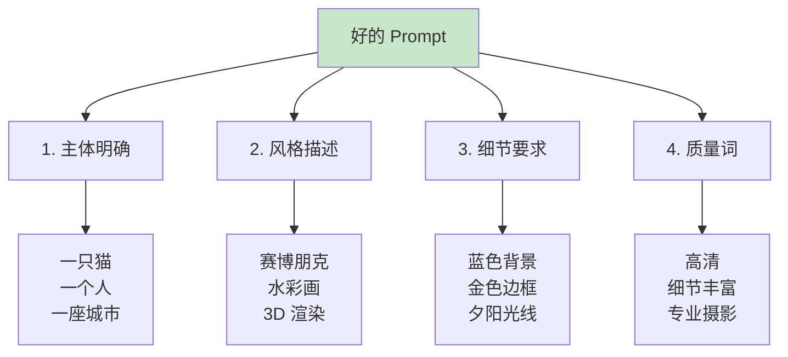

# 8.2 Image Generation <DifficultyBadge level="intermediate" /> <CostBadge cost="$0.04" />

> 前置知识:8.1 Vision(图像理解)

::: tip 冷知识
DALL-E 的名字来自超现实主义画家"达利(Dalí)"和机器人"瓦力(WALL-E)"的组合。就像瓦力捡垃圾一样,DALL-E 也在互联网上"捡"了无数图片来学习画画。
:::

### 为什么需要它?(Problem)

**问题:需要图像但没有设计师**

你是不是也遇到过这种情况:写了个技术博客,想配个图,但是...

- 找设计师?太贵,而且设计师听不懂"赛博朋克风格的代码雨"是啥
- 去素材网站?要么版权有问题,要么图片和内容八杆子打不着
- 自己用 PS?好不容易打开 PS,然后盯着一堆工具栏发呆半小时...

**AI 画画(Image Generation)来了!** 你只需要**动动嘴**,AI 就能帮你画出来。

真实场景:

**场景 1:内容创作**

> "我在写技术博客,需要一张配图:一个开发者在电脑前写代码,赛博朋克风格"

**传统方式:**
1. 找设计师沟通需求(成本高、周期长)
2. 去素材网站找图(版权问题、不够贴合)
3. 自己用 PS 做(技术门槛高)

**场景 2:产品设计**

> "帮我设计一个极简风格的 Logo,主题是'AI 驱动的教育'"

**场景 3:广告素材**

> "生成一张促销海报,内容:双 11 大促,科技感风格,3D 渲染"

**场景 4:UI 原型**

> "生成一个移动 App 的登录页面,深色主题,包含邮箱和密码输入框"

**AI 图像生成解决了这些问题**,让你用自然语言描述需求,AI 几秒钟生成图片。

**一句话总结:给 AI 一支画笔,从此告别"甲方爸爸"和"改到天荒地老"。** 🎨

::: warning 翻车现场
我:"生成一只穿西装的猫,在办公室工作"  
DALL-E:生成了一只猫,穿着人类大小的西装,四肢无处安放,诡异至极  
我:"这是恐怖片吧..."  
教训:**描述要详细,否则 AI 的"理解偏差"会让你笑出猪叫。**
:::

### 它是什么?(Concept)

**Image Generation(图像生成)是"文本到图像"的 AI 技术**,用自然语言描述画面,AI 生成对应的图片。简单来说,就是**让 AI 成为你的专属画师**!

**主流图像生成模型:**

| 模型 | 公司 | 价格 | 特点 | 适用场景 |
|-----|------|------|------|---------|
| **DALL-E 3** | OpenAI | $0.04/张(1024x1024)<br/>$0.08/张(1024x1792) | 质量高、理解复杂 Prompt | 商业设计、内容创作 |
| **DALL-E 2** | OpenAI | $0.02/张(1024x1024) | 性价比高、速度快 | 快速原型、草图 |
| **Stable Diffusion** | Stability AI | 开源免费(自部署)<br/>API $0.002/张 | 可控性强、风格多 | 艺术创作、定制化 |
| **Midjourney** | Midjourney | $10/月(200 张) | 艺术感强、美术风格 | 插画、概念设计 |
| **Imagen** | Google | 暂未公开 | 照片级真实感 | 商业广告、产品图 |

::: tip DALL-E 3 vs Stable Diffusion
- **DALL-E 3**:傻瓜式,Prompt 简单也能出好图,但价格较贵(就像苹果手机)
- **Stable Diffusion**:需要学习 Prompt 技巧,但可以精细控制,开源免费(就像安卓手机)

**一句话:有钱图方便选 DALL-E,有时间爱折腾选 SD。**
:::

**DALL-E 3 工作原理:**

```mermaid
sequenceDiagram
    participant User as 用户
    participant App as 你的应用
    participant API as DALL-E API
    
    User->>App: 文字描述<br/>"一只猫在编程"
    App->>API: 发送生成请求<br/>prompt + size + quality
    API->>API: 文本理解<br/>图像生成
    API->>App: 返回图片 URL
    App->>App: 下载图片(可选)
    App->>User: 展示图片
    
    style API fill:#fff3e0
```

**基础代码示例:**

```python
from openai import OpenAI

client = OpenAI()

response = client.images.generate(
    model="dall-e-3",
    prompt="一只橙色的猫在写代码,赛博朋克风格,高清,细节丰富",
    size="1024x1024",  # 1024x1024 | 1024x1792 | 1792x1024
    quality="standard",  # standard | hd
    n=1  # 生成图片数量(DALL-E 3 只支持 1)
)

image_url = response.data[0].url
print(f"图片 URL: {image_url}")
```

**参数详解:**

| 参数 | 说明 | 可选值 |
|-----|------|--------|
| `model` | 模型版本 | `dall-e-3` | `dall-e-2` |
| `prompt` | 文字描述(英文效果更好) | 最多 4000 字符 |
| `size` | 图片尺寸 | `1024x1024`(方形)<br/>`1024x1792`(竖版)<br/>`1792x1024`(横版) |
| `quality` | 图片质量 | `standard`(标准,更快)<br/>`hd`(高清,2 倍价格) |
| `style` | 艺术风格 | `vivid`(鲜艳,默认)<br/>`natural`(自然) |
| `n` | 生成数量 | DALL-E 3: 1<br/>DALL-E 2: 1-10 |

**Prompt 写作技巧:**



**Prompt 公式:**

```
[主体] + [动作/状态] + [风格] + [环境/背景] + [细节] + [质量词]
```

**简单记忆法:谁在哪里干什么,什么风格什么样。** 记住这个公式,你的 Prompt 质量能提升 80%!

**示例:**

| 场景 | Prompt | 解析 |
|-----|--------|------|
| **技术博客配图** | `A developer coding on laptop, cyberpunk style, neon lights, dark room, high quality, digital art` | 主体:开发者<br/>动作:写代码<br/>风格:赛博朋克<br/>环境:黑暗房间、霓虹灯<br/>质量:高清、数字艺术 |
| **产品 Logo** | `Minimalist logo design for AI education, blue and white, geometric shapes, modern, professional` | 主体:Logo<br/>风格:极简<br/>颜色:蓝白<br/>元素:几何图形<br/>质量:现代、专业 |
| **UI 原型** | `Mobile app login screen, dark theme, email and password input fields, rounded buttons, gradient background, modern UI design` | 主体:登录页面<br/>平台:移动 App<br/>主题:深色<br/>元素:邮箱、密码、圆角按钮<br/>风格:现代 UI |

::: warning 内容政策
DALL-E 3 会拒绝生成:
- 暴力、血腥、色情内容
- 真实公众人物(比如你让它画"马斯克骑火箭",它会拒绝)
- 版权保护的角色(如迪士尼角色——米老鼠也不行!)
- 误导性、欺诈性内容

违规请求会返回错误:`content_policy_violation`

**一句话:想画啥都行,但别想"搞事情"。** OpenAI 的审查机制比你妈还严格。
:::

**图像编辑(DALL-E 2):**

DALL-E 2 支持图像编辑和变体生成:

```python
from openai import OpenAI

client = OpenAI()

# 图像编辑(需要原图 + mask)
response = client.images.edit(
    model="dall-e-2",
    image=open("original.png", "rb"),
    mask=open("mask.png", "rb"),  # 白色区域会被重新生成
    prompt="在白色区域添加一只猫",
    n=1,
    size="1024x1024"
)

# 图像变体(基于原图生成相似图片)
response = client.images.create_variation(
    model="dall-e-2",
    image=open("original.png", "rb"),
    n=2,  # 生成 2 个变体
    size="1024x1024"
)
```

**图片 URL vs Base64:**

API 默认返回图片 URL(1 小时后过期),也可以返回 base64:

```python
response = client.images.generate(
    model="dall-e-3",
    prompt="一只猫",
    response_format="b64_json"  # url | b64_json
)

import base64
image_base64 = response.data[0].b64_json

# 保存到本地
with open("cat.png", "wb") as f:
    f.write(base64.b64decode(image_base64))
```

### 动手试试(Practice)

**实验 1:基础图像生成**

```python
from openai import OpenAI
import requests
from PIL import Image
from io import BytesIO

client = OpenAI()

# 生成图片
response = client.images.generate(
    model="dall-e-3",
    prompt="A futuristic city with flying cars, neon lights, cyberpunk style, high quality, digital art",
    size="1024x1024",
    quality="standard",
    n=1
)

image_url = response.data[0].url
print(f"图片 URL: {image_url}")

# 下载并显示图片
image_response = requests.get(image_url)
img = Image.open(BytesIO(image_response.content))
img.show()

# 保存到本地
img.save("generated_city.png")
```

**实验 2:批量生成(DALL-E 2)**

```python
from openai import OpenAI

client = OpenAI()

# DALL-E 2 支持一次生成多张
response = client.images.generate(
    model="dall-e-2",
    prompt="A cute robot mascot, friendly, colorful, 3D render",
    n=4,  # 生成 4 张
    size="512x512"
)

for i, image_data in enumerate(response.data):
    print(f"图片 {i+1}: {image_data.url}")
```

**实验 3:不同风格对比**

```python
from openai import OpenAI

client = OpenAI()

prompt_base = "A mountain landscape at sunset"

styles = [
    "photorealistic, professional photography",
    "oil painting, impressionist style",
    "watercolor, soft colors",
    "digital art, cyberpunk style",
    "3D render, unreal engine"
]

for style in styles:
    full_prompt = f"{prompt_base}, {style}"
    
    response = client.images.generate(
        model="dall-e-3",
        prompt=full_prompt,
        size="1024x1024"
    )
    
    print(f"{style}:")
    print(f"  URL: {response.data[0].url}")
    print(f"  修订后的 Prompt: {response.data[0].revised_prompt}\n")
```

::: tip DALL-E 3 会修改 Prompt
DALL-E 3 会自动优化你的 Prompt,添加更多细节。查看 `revised_prompt` 可以学习如何写更好的 Prompt。

**举个例子:**
- 你写:"一只猫"
- DALL-E 3 理解成:"一只橙色的虎斑猫,坐在木质地板上,阳光从窗户洒进来,温暖的色调,高清,专业摄影"

**一句话:AI 比你更懂 AI 想要什么!** 多看看它的改写,能学到不少 Prompt 技巧。
:::

**实验 4:高清 vs 标准质量**

```python
from openai import OpenAI

client = OpenAI()

prompt = "A detailed portrait of a robot, professional photography, studio lighting"

# 标准质量
response_standard = client.images.generate(
    model="dall-e-3",
    prompt=prompt,
    quality="standard"  # $0.04
)

# 高清质量
response_hd = client.images.generate(
    model="dall-e-3",
    prompt=prompt,
    quality="hd"  # $0.08
)

print("标准质量:", response_standard.data[0].url)
print("高清质量:", response_hd.data[0].url)
```

**实验 5:图像编辑(DALL-E 2)**

```python
from openai import OpenAI
from PIL import Image
import io

client = OpenAI()

# 创建一个简单的原图和 mask(演示)
# 实际使用中,你应该用真实图片

# 生成原图
original_response = client.images.generate(
    model="dall-e-2",
    prompt="A living room with a sofa",
    size="1024x1024"
)

# 下载原图
import requests
original_img = requests.get(original_response.data[0].url).content

# 创建 mask(白色部分会被重新生成)
# 这里省略 mask 创建过程,实际使用时用图像编辑软件创建

# 编辑图像
response = client.images.edit(
    model="dall-e-2",
    image=original_img,
    # mask=mask_img,  # 需要提供 mask
    prompt="在沙发旁边添加一只猫",
    n=1,
    size="1024x1024"
)

print("编辑后的图片:", response.data[0].url)
```

**实验 6:保存图片到本地**

```python
from openai import OpenAI
import requests
from pathlib import Path

client = OpenAI()

def generate_and_save(prompt: str, filename: str):
    """生成图片并保存到本地"""
    response = client.images.generate(
        model="dall-e-3",
        prompt=prompt,
        size="1024x1024"
    )
    
    image_url = response.data[0].url
    
    # 下载图片
    image_data = requests.get(image_url).content
    
    # 保存到本地
    output_path = Path(filename)
    output_path.parent.mkdir(parents=True, exist_ok=True)
    
    with open(output_path, "wb") as f:
        f.write(image_data)
    
    print(f"图片已保存到: {output_path}")
    return output_path

# 测试
generate_and_save(
    prompt="A modern office space with plants, natural light, minimalist design",
    filename="output/office.png"
)
```

<ColabBadge path="demos/08-multimodal/image_generation.ipynb" />

### 小结(Reflection)

**一句话总结:我们给 AI 发了画笔,现在它能帮你"画大饼"了!(不过这次是真的大饼)**

- **解决了什么**:用自然语言生成图片,无需设计师和 PS 技能
- **没解决什么**:只有视觉,没有声音——下一节介绍语音处理
- **关键要点**:
  1. **DALL-E 3 质量最高**:理解复杂 Prompt,但价格较贵($0.04/张)
  2. **Prompt 公式**:主体 + 动作 + 风格 + 环境 + 细节 + 质量词
  3. **英文 Prompt 效果更好**:模型训练数据以英文为主
  4. **DALL-E 3 会自动优化 Prompt**:查看 `revised_prompt` 学习技巧
  5. **图片 URL 1 小时后过期**:需要长期保存请下载到本地
  6. **内容政策限制**:不能生成暴力、色情、名人等内容
  7. **DALL-E 2 支持编辑和变体**:可以修改现有图片

::: tip 冷知识
为什么 DALL-E 生成的图片里,文字总是乱码?因为它"不识字"!AI 图像生成模型把文字当成"花纹"来画,所以你看到的"COFFEE"可能会变成"CQFFEE"。想要正确的文字?还得后期 PS 加上去。
:::

---

*最后更新:2026-02-20*
