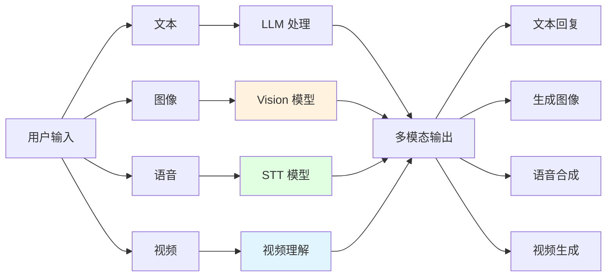
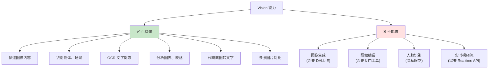

# 第 8 章:多模态 AI

> 学完本章,你能:使用 AI 处理图像、语音、视频等多种媒体类型

**给 AI 装上眼睛、耳朵和嘴巴** —— 是时候让你的 AI 不再"五感不全"了!之前我们的 AI 只能"说话",现在我们要教它"看图""听音""说话",甚至"拍视频"。



**章节导览:**

- **8.1 Vision(图像理解)**:用 GPT-5/Claude Sonnet 4.6 分析图像、OCR、截图理解
- **8.2 Image Generation**:用 DALL-E 生成图像
- **8.3 Speech & Audio**:Whisper 语音转文字、TTS 文字转语音
- **8.4 Video & Realtime**:Gemini 3 视频生成、实时语音对话

---

## 8.1 Vision(图像理解) <DifficultyBadge level="intermediate" /> <CostBadge cost="$0.02" />

> 前置知识:3.1 Token 与分词

::: tip 冷知识
Vision 模型其实不是真的"看"图片,而是把图片切成一块块的"小方格"(patches),然后像读文字一样分析。所以从某种意义上说,AI 是在"盲文阅读"你的图片! 📖
:::

### 为什么需要它?(Problem)

**问题:纯文本 LLM 无法"看"图**

想象一下,你给朋友发了一张图,结果朋友眼睛突然瞎了,只能听你描述图片内容。这就是传统 LLM 的日常。我们来看看真实场景中,用户经常发来图片:

**场景 1:用户发来一张截图**

> "这个报错是什么意思?怎么解决?"  
> [附件: error_screenshot.png]

**用纯文本 LLM:**

```python
response = client.chat.completions.create(
    model="gpt-4.1-mini",
    messages=[{"role": "user", "content": "这个报错是什么意思?"}]
)
```

**❌ 问题:**
- LLM 看不到图片内容
- 用户需要手动打字描述,效率低且容易遗漏信息

**场景 2:产品设计评审**

> "帮我看看这个界面设计有什么问题"  
> [附件: ui_design.png]

**场景 3:文档 OCR**

> "提取这张发票的金额、日期、项目"  
> [附件: invoice.jpg]

**场景 4:数据图表分析**

> "这个趋势图说明了什么?"  
> [附件: sales_chart.png]

**Vision(视觉)模型解决了这些问题**,让 AI 能够:
1. 理解图像内容(物体识别、场景理解)
2. 提取文字(OCR)
3. 分析图表、表格
4. 回答关于图片的问题

**一句话总结:给 AI 装上眼睛,让它不再对用户的截图两眼一抹黑。** 👀

::: warning 翻车现场
我:上传了一张手写笔记的图片  
我:"帮我整理这些笔记"  
GPT:"这张图片显示了一系列蚯蚓在地上扭动的痕迹..."  
我:"..." (原来我字真的这么丑)
:::

### 它是什么?(Concept)

**Vision 是多模态 LLM 的"视觉能力"**,能够接收图像作为输入并理解其内容。简单来说,就是**给 AI 装眼睛**!

**主流 Vision 模型:**

| 模型 | 能力 | 价格(每 1M tokens) | 适用场景 |
|-----|------|-------------------|---------|
| **GPT-5** | 图像理解、OCR、图表分析 | 输入 $1.25 / 输出 $10.00 | 通用图像理解 |
| **GPT-4.1-mini** | 基础图像理解 | 输入 $0.40 / 输出 $1.60 | 简单图像任务 |
| **Claude Sonnet 4.6** | 图像理解、代码截图 | 输入 $3.00 / 输出 $15.00 | 技术文档、代码 |
| **Gemini 2.5 Flash** | 视频、长文档 | 输入 $0.30 / 输出 $2.50 | 多帧图像、视频 |

::: tip 图像如何计价?
Vision 模型对图像的计费基于"图像分辨率"转换成 token:
- 低分辨率(512x512 以下):约 85 tokens(就像看马赛克)
- 高分辨率(2048x2048):约 765 tokens(能看清毛孔)
- 详细模式:会将图像切分成多个 512x512 块,每块 170 tokens

示例:一张 1024x1024 的图片 ≈ 255 tokens

**简单来说:图越大越清晰,AI 看得越仔细,你的钱包瘦得越快。** 💸
:::

**Vision API 工作原理:**

```mermaid
sequenceDiagram
    participant User as 用户
    participant App as 你的应用
    participant API as Vision API
    
    User->>App: 上传图片 + 文字问题
    App->>App: 将图片编码为 base64<br/>或提供 URL
    App->>API: 发送请求:<br/>messages=[{<br/> "role": "user",<br/> "content": [<br/>  {"type": "text", "text": "..."},<br/>  {"type": "image_url", "image_url": "..."}]<br/>}]
    API->>API: 图像理解
    API->>App: 返回分析结果
    App->>User: 显示回答
    
    style API fill:#fff3e0
```

**发送图像的两种方式:**

| 方式 | 说明 | 优点 | 缺点 |
|-----|------|------|------|
| **URL** | 提供图片的公网 URL | 简单、不占用请求体积 | 需要图片可公开访问 |
| **Base64** | 将图片编码为 base64 字符串 | 支持本地图片、私密图片 | 请求体积大 |

**基础代码示例(URL 方式):**

```python
from openai import OpenAI

client = OpenAI()

response = client.chat.completions.create(
    model="gpt-4.1-mini",
    messages=[
        {
            "role": "user",
            "content": [
                {
                    "type": "text",
                    "text": "这张图片里有什么?"
                },
                {
                    "type": "image_url",
                    "image_url": {
                        "url": "https://example.com/image.jpg"
                    }
                }
            ]
        }
    ],
    max_tokens=300
)

print(response.choices[0].message.content)
```

**Base64 方式:**

```python
import base64
from openai import OpenAI

client = OpenAI()

# 读取本地图片并编码
def encode_image(image_path):
    with open(image_path, "rb") as image_file:
        return base64.b64encode(image_file.read()).decode("utf-8")

image_base64 = encode_image("path/to/image.jpg")

response = client.chat.completions.create(
    model="gpt-4.1-mini",
    messages=[
        {
            "role": "user",
            "content": [
                {"type": "text", "text": "分析这张图片"},
                {
                    "type": "image_url",
                    "image_url": {
                        "url": f"data:image/jpeg;base64,{image_base64}"
                    }
                }
            ]
        }
    ],
    max_tokens=300
)

print(response.choices[0].message.content)
```

**Vision 模型的能力边界:**



**常见应用场景:**

| 场景 | 输入 | 输出 | 示例 |
|-----|------|------|------|
| **技术支持** | 报错截图 | 问题诊断+解决方案 | "这是数据库连接错误,检查连接字符串" |
| **文档 OCR** | 发票、收据图片 | 结构化数据(JSON) | `{"金额": 128.5, "日期": "2026-02-20"}` |
| **UI 审查** | 界面设计图 | 设计建议 | "按钮对比度不够,建议改为深色" |
| **图表分析** | 数据趋势图 | 趋势解读 | "销量在 Q4 增长了 35%" |
| **教育辅助** | 数学题照片 | 解题步骤 | "这是二次方程,先移项..." |

### 动手试试(Practice)

**实验 1:基础图像理解**

让我们先让 AI 看看风景照,测试一下它的"视力"如何:

```python
from openai import OpenAI

client = OpenAI()

# 测试图片 URL(可以换成你自己的图片)
image_url = "https://upload.wikimedia.org/wikipedia/commons/thumb/d/dd/Gfp-wisconsin-madison-the-nature-boardwalk.jpg/2560px-Gfp-wisconsin-madison-the-nature-boardwalk.jpg"

response = client.chat.completions.create(
    model="gpt-4.1-mini",
    messages=[
        {
            "role": "user",
            "content": [
                {"type": "text", "text": "请详细描述这张图片的内容,包括场景、颜色、氛围等。"},
                {"type": "image_url", "image_url": {"url": image_url}}
            ]
        }
    ],
    max_tokens=500
)

print(response.choices[0].message.content)
```

**实验 2:OCR 文字提取**

```python
from openai import OpenAI
import base64

client = OpenAI()

def encode_image(image_path):
    with open(image_path, "rb") as f:
        return base64.b64encode(f.read()).decode("utf-8")

# 假设你有一张包含文字的图片
image_base64 = encode_image("screenshot.png")

response = client.chat.completions.create(
    model="gpt-4.1-mini",
    messages=[
        {
            "role": "user",
            "content": [
                {"type": "text", "text": "提取图片中的所有文字,保持原有格式。"},
                {
                    "type": "image_url",
                    "image_url": {"url": f"data:image/png;base64,{image_base64}"}
                }
            ]
        }
    ],
    max_tokens=1000
)

print(response.choices[0].message.content)
```

**实验 3:代码截图理解**

```python
from openai import OpenAI

client = OpenAI()

# 代码截图 URL
code_screenshot_url = "https://example.com/code_screenshot.png"

response = client.chat.completions.create(
    model="gpt-4.1",  # 推荐用 GPT-4.1 处理代码
    messages=[
        {
            "role": "user",
            "content": [
                {
                    "type": "text",
                    "text": "这段代码有什么问题?如何优化?"
                },
                {"type": "image_url", "image_url": {"url": code_screenshot_url}}
            ]
        }
    ],
    max_tokens=800
)

print(response.choices[0].message.content)
```

**实验 4:多张图片对比**

```python
from openai import OpenAI

client = OpenAI()

response = client.chat.completions.create(
    model="gpt-4.1-mini",
    messages=[
        {
            "role": "user",
            "content": [
                {"type": "text", "text": "对比这两张图片的差异:"},
                {"type": "image_url", "image_url": {"url": "https://example.com/image1.jpg"}},
                {"type": "image_url", "image_url": {"url": "https://example.com/image2.jpg"}},
            ]
        }
    ],
    max_tokens=500
)

print(response.choices[0].message.content)
```

**实验 5:结构化数据提取**

```python
from openai import OpenAI
import json

client = OpenAI()

# 发票图片
invoice_url = "https://example.com/invoice.jpg"

response = client.chat.completions.create(
    model="gpt-4.1-mini",
    messages=[
        {
            "role": "user",
            "content": [
                {
                    "type": "text",
                    "text": """提取发票信息,以 JSON 格式返回:
{
  "invoice_number": "发票号",
  "date": "日期",
  "amount": 金额,
  "items": [{"name": "项目名", "price": 价格}]
}"""
                },
                {"type": "image_url", "image_url": {"url": invoice_url}}
            ]
        }
    ],
    response_format={"type": "json_object"}  # 强制 JSON 输出
)

data = json.loads(response.choices[0].message.content)
print(json.dumps(data, indent=2, ensure_ascii=False))
```

**实验 6:图像细节控制**

```python
from openai import OpenAI

client = OpenAI()

image_url = "https://example.com/detailed_image.jpg"

# 低细节模式(更快、更便宜)
response_low = client.chat.completions.create(
    model="gpt-4.1-mini",
    messages=[
        {
            "role": "user",
            "content": [
                {"type": "text", "text": "这是什么?"},
                {
                    "type": "image_url",
                    "image_url": {
                        "url": image_url,
                        "detail": "low"  # low | high | auto
                    }
                }
            ]
        }
    ]
)

# 高细节模式(更准确、更贵)
response_high = client.chat.completions.create(
    model="gpt-4.1-mini",
    messages=[
        {
            "role": "user",
            "content": [
                {"type": "text", "text": "描述图片中的所有细节"},
                {
                    "type": "image_url",
                    "image_url": {
                        "url": image_url,
                        "detail": "high"
                    }
                }
            ]
        }
    ]
)

print("低细节:", response_low.choices[0].message.content)
print("\n高细节:", response_high.choices[0].message.content)
```

<ColabBadge path="demos/08-multimodal/vision.ipynb" />

### 小结(Reflection)

**一句话总结:我们给 AI 装了眼睛,现在它能"看图说话"了!**

- **解决了什么**:让 AI 能够理解图像,支持 OCR、图表分析、多图对比
- **没解决什么**:只能"看图",不能"生成图"——下一节介绍图像生成
- **关键要点**:
  1. **Vision 模型可以"看"图**:GPT-5、Claude Sonnet 4.6、Gemini 2.5 Flash
  2. **两种输入方式**:URL(公开图片) 或 Base64(本地图片)
  3. **图像计费基于分辨率**:高分辨率图片消耗更多 tokens
  4. **detail 参数控制精度**:low(快速) vs high(准确)
  5. **支持多张图片**:可以在一个请求中发送多张图片对比
  6. **结合 JSON Mode**:提取结构化数据(发票、表格)
  7. **隐私限制**:不支持人脸识别、身份验证等敏感任务

::: tip 冷知识
为什么 Vision 模型不能识别名人脸?因为如果能识别,就会被用来做各种坏事(假新闻、换脸诈骗)。所以 OpenAI 直接把这功能"阉割"了,眼不见为净。
:::

---

*最后更新:2026-02-20*
