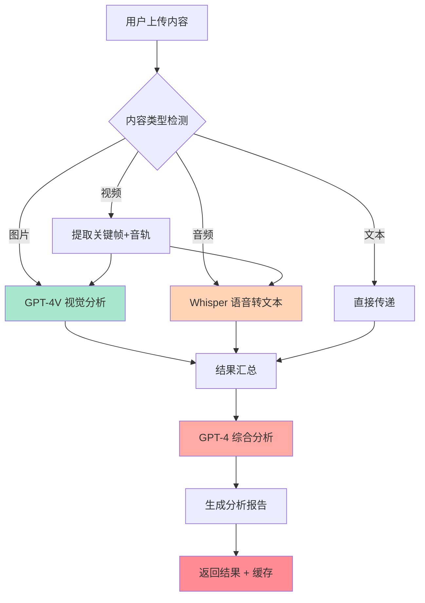

---
prev:
  text: '8.4 Video & Realtime'
  link: '/zh/08-multimodal/video-realtime'
next:
  text: '9.1 Agent 核心概念'
  link: '/zh/09-ai-agents/'
---

# 8.5 多模态应用实战

## 准备好了吗?是时候做点真东西了

前面几节我们学了图片、音频、视频——就像学武功一样,拳法学了、腿法学了、内功心法也学了。但师父说得好:**光练不打,等于白练**。

今天我们要把这些技能串起来,做一个真正能用的多模态内容分析流水线。这就像开餐厅,你会做菜(单个API)是一回事,能开起餐厅接待客人(完整应用)是另一回事。

想象一下这个场景:你是个内容审核员,每天要处理海量用户上传的内容——有图片、有音频、有视频。老板说:"用AI帮我自动分析这些内容,提取关键信息,标记潜在问题。" 这就是我们今天要解决的问题。

::: tip 为什么要做多模态流水线?
因为现实世界的数据**从来不是单一格式**的。用户不会只发文字、或只发图片。他们会发:
- 带配音的产品介绍视频
- 图文并茂的社交媒体帖子  
- 音频+图片的播客节目

如果你的AI系统只会处理其中一种,那就像只会用筷子不会用刀叉——出国就尴尬了。
:::

## 项目架构:我们要建什么?

我们要构建一个**多模态内容分析管道**(Multimodal Content Analysis Pipeline),它能:

1. **接收多种输入**:图片、音频、视频、文本
2. **分别处理**:用最适合的AI模型处理每种数据
3. **综合分析**:把所有结果汇总,生成一份智能报告

就像体检中心:抽血、拍X光、量血压各自进行,最后医生综合所有结果给你一份报告。

### 架构图



这个架构的巧妙之处在于:**解耦 + 聚合**。每个模型专注做自己擅长的事,最后用一个"大脑"把所有信息整合。

## 步骤1:用GPT-4V分析图片

首先,我们需要一个函数来处理图片。假设用户上传了一张产品图片,我们要提取:
- 物体识别(这是什么?)
- 场景理解(在哪里拍的?)
- 潜在问题(有没有不合适的内容?)

```python
import openai
from pathlib import Path
import base64

def analyze_image(image_path: str) -> dict:
    """
    使用 GPT-4V 分析图片内容
    
    就像给AI一双眼睛,让它告诉你图片里有什么
    """
    # 读取图片并转换为base64
    with open(image_path, "rb") as image_file:
        image_data = base64.b64encode(image_file.read()).decode("utf-8")
    
    # 判断图片格式
    suffix = Path(image_path).suffix.lower()
    mime_type = {
        ".jpg": "image/jpeg",
        ".jpeg": "image/jpeg", 
        ".png": "image/png",
        ".gif": "image/gif",
        ".webp": "image/webp"
    }.get(suffix, "image/jpeg")
    
    response = openai.chat.completions.create(
        model="gpt-4o",  # 或者 gpt-4-turbo
        messages=[
            {
                "role": "user",
                "content": [
                    {
                        "type": "text",
                        "text": """请详细分析这张图片,包括:
                        1. 主要内容(人物/物体/场景)
                        2. 视觉风格(色调、构图、氛围)
                        3. 潜在问题(暴力、色情、违禁品等)
                        4. 情感倾向(正面/负面/中性)
                        
                        请用JSON格式返回结果。"""
                    },
                    {
                        "type": "image_url",
                        "image_url": {
                            "url": f"data:{mime_type};base64,{image_data}"
                        }
                    }
                ]
            }
        ],
        max_tokens=500
    )
    
    result = response.choices[0].message.content
    
    return {
        "type": "image",
        "analysis": result,
        "tokens_used": response.usage.total_tokens
    }
```

::: warning 注意图片大小
GPT-4V对图片大小有限制(通常20MB以内)。如果图片太大,记得先压缩:

```python
from PIL import Image

def compress_image(input_path: str, max_size_mb: float = 5.0):
    img = Image.open(input_path)
    
    # 如果图片太大,等比缩放
    max_dimension = 2048
    if max(img.size) > max_dimension:
        img.thumbnail((max_dimension, max_dimension), Image.Resampling.LANCZOS)
    
    # 保存为压缩后的JPEG
    output_path = input_path.replace(Path(input_path).suffix, "_compressed.jpg")
    img.save(output_path, "JPEG", quality=85, optimize=True)
    
    return output_path
```
:::

## 步骤2:用Whisper转录音频

接下来处理音频。用户可能上传了一段语音留言、播客片段、或者视频的音轨。

```python
def transcribe_audio(audio_path: str) -> dict:
    """
    使用 Whisper 将音频转为文本
    
    这就像给AI一双耳朵,让它听懂说了什么
    """
    with open(audio_path, "rb") as audio_file:
        transcript = openai.audio.transcriptions.create(
            model="whisper-1",
            file=audio_file,
            response_format="verbose_json",  # 获取更多元数据
            language="zh"  # 指定中文可以提高准确率
        )
    
    # Whisper 的 verbose_json 会返回分段信息和时间戳
    return {
        "type": "audio",
        "text": transcript.text,
        "language": transcript.language,
        "duration": transcript.duration,
        "segments": transcript.segments if hasattr(transcript, 'segments') else []
    }
```

::: tip Whisper的小技巧
如果音频很长(>25MB),需要先切割:

```python
from pydub import AudioSegment

def split_audio(audio_path: str, chunk_length_ms: int = 600000):  # 10分钟
    audio = AudioSegment.from_file(audio_path)
    chunks = []
    
    for i in range(0, len(audio), chunk_length_ms):
        chunk = audio[i:i + chunk_length_ms]
        chunk_path = f"/tmp/chunk_{i//chunk_length_ms}.mp3"
        chunk.export(chunk_path, format="mp3")
        chunks.append(chunk_path)
    
    return chunks
```
:::

## 步骤3:综合分析——召唤终极大脑

现在我们有了图片分析结果和音频转录文本,是时候把它们喂给一个"综合分析大脑"了。

```python
def comprehensive_analysis(image_result: dict, audio_result: dict, text_input: str = "") -> dict:
    """
    使用 GPT-4 对所有模态的结果进行综合分析
    
    这就像把所有检查报告给医生,让他做最终诊断
    """
    # 构建提示词,整合所有信息
    prompt = f"""你是一个专业的内容分析师。现在有一份多模态内容需要综合分析:

【图片分析结果】
{image_result.get('analysis', '无图片')}

【音频转录文本】
{audio_result.get('text', '无音频')}

【附加文本内容】
{text_input if text_input else '无额外文本'}

请综合以上所有信息,生成一份结构化的分析报告,包括:
1. **内容摘要**(50字以内)
2. **关键主题**
3. **情感倾向**(正面/负面/中性,并说明理由)
4. **风险评估**(是否包含不当内容,风险等级:低/中/高)
5. **建议标签**(3-5个关键词)
6. **处理建议**(通过/需要人工审核/拒绝)

请用JSON格式返回。"""
    
    response = openai.chat.completions.create(
        model="gpt-4o",
        messages=[
            {"role": "system", "content": "你是一个专业的内容审核和分析专家。"},
            {"role": "user", "content": prompt}
        ],
        temperature=0.3,  # 降低温度,让分析更稳定
        response_format={"type": "json_object"}
    )
    
    return {
        "final_report": response.choices[0].message.content,
        "total_tokens": (
            image_result.get('tokens_used', 0) + 
            response.usage.total_tokens
        )
    }
```

## 完整流水线代码

现在把所有步骤组装起来:

```python
import openai
import json
from pathlib import Path
from typing import Optional
import logging

# 配置日志
logging.basicConfig(level=logging.INFO)
logger = logging.getLogger(__name__)

class MultimodalPipeline:
    """
    多模态内容分析流水线
    
    用法:
        pipeline = MultimodalPipeline(api_key="your-key")
        result = pipeline.process(
            image_path="photo.jpg",
            audio_path="audio.mp3",
            text="用户评论文本"
        )
    """
    
    def __init__(self, api_key: str):
        openai.api_key = api_key
        self.results = {}
    
    def process(
        self,
        image_path: Optional[str] = None,
        audio_path: Optional[str] = None,
        text: Optional[str] = None
    ) -> dict:
        """
        处理多模态输入,返回综合分析结果
        """
        logger.info("🚀 开始多模态分析流水线")
        
        # 步骤1: 处理图片
        if image_path and Path(image_path).exists():
            logger.info(f"📸 分析图片: {image_path}")
            self.results['image'] = analyze_image(image_path)
        else:
            self.results['image'] = {"type": "image", "analysis": "无图片输入"}
        
        # 步骤2: 处理音频
        if audio_path and Path(audio_path).exists():
            logger.info(f"🎵 转录音频: {audio_path}")
            self.results['audio'] = transcribe_audio(audio_path)
        else:
            self.results['audio'] = {"type": "audio", "text": "无音频输入"}
        
        # 步骤3: 综合分析
        logger.info("🧠 执行综合分析")
        self.results['final'] = comprehensive_analysis(
            self.results['image'],
            self.results['audio'],
            text or ""
        )
        
        # 步骤4: 格式化输出
        final_report = json.loads(self.results['final']['final_report'])
        
        logger.info("✅ 分析完成")
        
        return {
            "success": True,
            "report": final_report,
            "metadata": {
                "total_tokens": self.results['final']['total_tokens'],
                "has_image": image_path is not None,
                "has_audio": audio_path is not None,
                "has_text": text is not None
            },
            "raw_results": self.results  # 保留原始结果供调试
        }

# 使用示例
if __name__ == "__main__":
    pipeline = MultimodalPipeline(api_key="sk-...")
    
    result = pipeline.process(
        image_path="./samples/product.jpg",
        audio_path="./samples/review.mp3",
        text="这是用户在社交媒体上发布的产品评测"
    )
    
    print(json.dumps(result['report'], indent=2, ensure_ascii=False))
```

::: details 点击查看输出示例

```json
{
  "内容摘要": "用户对某电子产品进行图文音频评测,整体评价正面",
  "关键主题": ["产品评测", "使用体验", "性价比分析"],
  "情感倾向": {
    "结果": "正面",
    "理由": "音频中使用'非常满意'、'值得推荐'等积极词汇,图片展示产品完好"
  },
  "风险评估": {
    "等级": "低",
    "说明": "未发现违规内容,为正常用户生成内容"
  },
  "建议标签": ["产品评测", "3C数码", "用户好评", "真实体验", "推荐购买"],
  "处理建议": "通过"
}
```
:::

## 生产部署的实战建议

理论讲完了,现在说说**真正上线**要注意什么(这些都是血泪教训):

### 1. 成本控制:别让API账单吓死你

多模态API很贵!尤其是GPT-4V和长音频。必须做好成本管理:

```python
class CostAwareMultimodalPipeline(MultimodalPipeline):
    """带成本控制的流水线"""
    
    MAX_COST_PER_REQUEST = 0.5  # 单次请求最高$0.5
    
    def estimate_cost(self, image_path, audio_path, text):
        """预估成本"""
        cost = 0.0
        
        # GPT-4V: ~$0.01 / image
        if image_path:
            cost += 0.01
        
        # Whisper: $0.006 / minute
        if audio_path:
            from pydub import AudioSegment
            audio = AudioSegment.from_file(audio_path)
            minutes = len(audio) / 1000 / 60
            cost += 0.006 * minutes
        
        # GPT-4 综合分析: ~$0.03 / 1K tokens (假设2K tokens)
        cost += 0.06
        
        return cost
    
    def process(self, image_path=None, audio_path=None, text=None):
        # 先预估成本
        estimated_cost = self.estimate_cost(image_path, audio_path, text)
        
        if estimated_cost > self.MAX_COST_PER_REQUEST:
            logger.warning(f"⚠️ 预估成本${estimated_cost:.3f}超过限制,跳过处理")
            return {"success": False, "reason": "cost_limit_exceeded"}
        
        logger.info(f"💰 预估成本: ${estimated_cost:.3f}")
        return super().process(image_path, audio_path, text)
```

### 2. 缓存策略:同一内容别分析两遍

用户可能重复上传相同内容,用缓存省钱:

```python
import hashlib
import redis

class CachedPipeline(MultimodalPipeline):
    def __init__(self, api_key: str, redis_url: str = "redis://localhost"):
        super().__init__(api_key)
        self.cache = redis.from_url(redis_url)
    
    def _get_content_hash(self, image_path, audio_path, text):
        """生成内容哈希作为缓存键"""
        hash_input = ""
        
        if image_path:
            with open(image_path, "rb") as f:
                hash_input += hashlib.md5(f.read()).hexdigest()
        
        if audio_path:
            with open(audio_path, "rb") as f:
                hash_input += hashlib.md5(f.read()).hexdigest()
        
        if text:
            hash_input += text
        
        return hashlib.sha256(hash_input.encode()).hexdigest()
    
    def process(self, image_path=None, audio_path=None, text=None):
        # 检查缓存
        cache_key = self._get_content_hash(image_path, audio_path, text)
        cached = self.cache.get(cache_key)
        
        if cached:
            logger.info("✨ 命中缓存,直接返回")
            return json.loads(cached)
        
        # 没有缓存,正常处理
        result = super().process(image_path, audio_path, text)
        
        # 保存到缓存(24小时过期)
        self.cache.setex(cache_key, 86400, json.dumps(result))
        
        return result
```

### 3. 错误处理:API会挂,你的系统不能挂

```python
from tenacity import retry, stop_after_attempt, wait_exponential

class RobustPipeline(MultimodalPipeline):
    @retry(
        stop=stop_after_attempt(3),
        wait=wait_exponential(multiplier=1, min=2, max=10)
    )
    def _call_openai_with_retry(self, func, *args, **kwargs):
        """带重试的API调用"""
        try:
            return func(*args, **kwargs)
        except openai.RateLimitError as e:
            logger.warning(f"⏳ 触发速率限制,等待重试")
            raise  # 重试装饰器会处理
        except openai.APIError as e:
            logger.error(f"❌ API错误: {e}")
            raise
        except Exception as e:
            logger.error(f"💥 未知错误: {e}")
            # 返回降级结果而不是崩溃
            return {"error": str(e), "fallback": True}
```

### 4. 异步处理:别让用户等太久

多模态分析很慢,用异步任务队列:

```python
from celery import Celery

app = Celery('multimodal', broker='redis://localhost:6379/0')

@app.task
def async_analyze(image_path, audio_path, text):
    """后台异步分析任务"""
    pipeline = MultimodalPipeline(api_key=os.getenv("OPENAI_API_KEY"))
    result = pipeline.process(image_path, audio_path, text)
    
    # 将结果存储到数据库或通知用户
    save_result_to_db(result)
    notify_user(result)
    
    return result

# API端点立即返回任务ID
@app.route('/analyze', methods=['POST'])
def analyze_endpoint():
    files = request.files
    text = request.form.get('text', '')
    
    # 保存上传的文件
    image_path = save_uploaded_file(files.get('image'))
    audio_path = save_uploaded_file(files.get('audio'))
    
    # 提交异步任务
    task = async_analyze.delay(image_path, audio_path, text)
    
    return jsonify({
        "task_id": task.id,
        "status": "processing",
        "message": "分析中,请稍后查询结果"
    })
```

### 5. 监控和日志:出了问题要能追溯

```python
import sentry_sdk
from prometheus_client import Counter, Histogram

# Sentry 错误追踪
sentry_sdk.init(dsn="your-sentry-dsn")

# Prometheus 指标
analysis_counter = Counter('multimodal_analysis_total', 'Total analyses')
analysis_duration = Histogram('multimodal_analysis_duration_seconds', 'Analysis duration')
analysis_cost = Histogram('multimodal_analysis_cost_dollars', 'Analysis cost')

class MonitoredPipeline(MultimodalPipeline):
    @analysis_duration.time()
    def process(self, image_path=None, audio_path=None, text=None):
        analysis_counter.inc()
        
        try:
            result = super().process(image_path, audio_path, text)
            
            # 记录成本
            cost = self.estimate_cost(image_path, audio_path, text)
            analysis_cost.observe(cost)
            
            return result
        except Exception as e:
            sentry_sdk.capture_exception(e)
            raise
```

## 一句话总结

> **多模态应用 = 各司其职的专家团队 + 一个能综合判断的项目经理。让视觉模型看、语音模型听、文本模型读,最后汇总给GPT-4当大脑——这就是多模态AI的终极奥义。**

::: tip 下一步
恭喜你!现在你已经掌握了多模态AI的完整技能树。接下来我们要进入更高阶的领域——**AI Agents**(智能体)。

如果说多模态是让AI有了"五感",那么Agent就是让AI有了"自主行动能力"。准备好了吗?让我们继续前进! 🚀
:::
