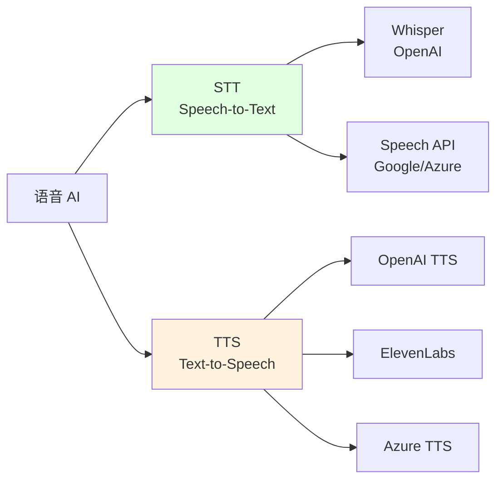

# 8.3 Speech & Audio <DifficultyBadge level="intermediate" /> <CostBadge cost="$0.01" />

> 前置知识:8.1 Vision(图像理解)

::: tip 冷知识
Whisper 这个名字来自"窃窃私语",暗示它能听懂最细微的声音。但实际上,你对着它大吼"HELP!!!"它也能淡定地转录出来,不会因为你音量大就多收钱。
:::

### 为什么需要它?(Problem)

**问题:语音内容难以处理和生成**

想象一下:你开了 2 小时的会,散会后老板说"把会议纪要整理一下发我"。你内心:???

- 手动听录音逐字记录?太累了,而且容易打瞌睡
- 只记关键点?老板说:"你怎么把我说的重点都漏了?"

或者,你想做个语音客服,但是:
- 录固定话术?用户问的千奇百怪,话术根本不够用
- 找真人客服?成本高,而且半夜没人值班

**AI 的耳朵和嘴巴(Speech & Audio)来救场了!** 它能听懂人话(STT),也能说人话(TTS)。

真实场景:

**场景 1:会议记录**

> "刚开了 2 小时的会,需要整理会议纪要"

**传统方式:**
1. 人工听录音逐字记录(耗时、易出错)
2. 只能记关键点(遗漏细节)

**场景 2:客服语音回复**

> "用户打电话咨询,需要自动语音回复"

**传统方式:**
1. 录制固定话术(不灵活)
2. 真人客服(成本高)

**场景 3:播客/视频字幕**

> "视频需要添加字幕,支持多语言"

**传统方式:**
1. 专业字幕组制作(周期长、贵)
2. 自动字幕工具(准确率低)

**场景 4:无障碍访问**

> "视障用户需要听网页内容"

**AI 语音技术解决了这些问题:**
1. **STT(Speech-to-Text)**:语音转文字,自动生成字幕、会议记录
2. **TTS(Text-to-Speech)**:文字转语音,生成自然的语音回复

**一句话总结:给 AI 装上耳朵和嘴巴,让它能听能说,再也不用担心老板的"灵魂拷问"了。** 🎧

::: warning 翻车现场
我:用 Whisper 转录老板的语音消息  
Whisper:"嗯...那个...就是...然后...所以..."  
我:"原来老板说话这么多废话!"  
老板(看到转录文本):"..."  
教训:**Whisper 会忠实记录每一个"嗯""啊",包括你不想让别人看到的口头禅。**
:::

### 它是什么?(Concept)

**Speech & Audio 处理包括两大方向:**



---

## 1. Speech-to-Text(语音转文字)

**主流 STT 模型:**

| 模型 | 公司 | 价格 | 特点 | 适用场景 |
|-----|------|------|------|---------|
| **Whisper** | OpenAI | $0.006/分钟 | 多语言、准确率高 | 会议记录、字幕生成 |
| **Azure Speech** | Microsoft | $1/小时 | 实时流式、支持方言 | 客服、实时翻译 |
| **Google Speech** | Google | $0.006/15 秒 | 自动标点、说话人识别 | 播客、采访 |
| **AssemblyAI** | AssemblyAI | $0.00025/秒 | 自动摘要、实体识别 | 内容分析 |

::: tip Whisper 的优势
- **多语言**:支持 99 种语言(中文、英文、日文...)——比你的外语老师还厉害
- **无需训练**:开箱即用,不用像以前的语音识别那样"训练半天才认识你"
- **格式丰富**:支持 JSON、SRT、VTT 等多种输出格式——想要啥格式就给啥格式
- **开源版本**:可以本地部署(需要 GPU)——不想花钱?自己搭!

**一句话:Whisper 就是语音转文字界的"六边形战士",啥都能干。**
:::

**Whisper 工作原理:**

```mermaid
sequenceDiagram
    participant User as 用户
    participant App as 你的应用
    participant API as Whisper API
    
    User->>App: 上传音频文件<br/>(mp3/wav/m4a...)
    App->>API: 发送转录请求<br/>file + language + format
    API->>API: 语音识别<br/>+标点+时间戳
    API->>App: 返回文字<br/>(JSON/SRT/VTT)
    App->>User: 显示转录结果
    
    style API fill:#e1ffe1
```

**基础代码示例:**

```python
from openai import OpenAI

client = OpenAI()

# 打开音频文件
audio_file = open("meeting.mp3", "rb")

# 转录
transcript = client.audio.transcriptions.create(
    model="whisper-1",
    file=audio_file,
    response_format="text"  # text | json | srt | vtt | verbose_json
)

print(transcript)
```

**参数详解:**

| 参数 | 说明 | 可选值 |
|-----|------|--------|
| `model` | 模型版本 | `whisper-1` |
| `file` | 音频文件 | 支持 mp3, mp4, mpeg, mpga, m4a, wav, webm<br/>最大 25MB |
| `language` | 源语言(可选,提高准确率) | `zh`(中文), `en`(英文), `ja`(日文)... |
| `response_format` | 输出格式 | `text` | `json` | `srt` | `vtt` | `verbose_json` |
| `temperature` | 采样温度 | 0-1,默认 0(更确定) |
| `prompt` | 提示词(引导风格和术语) | 字符串 |
| `timestamp_granularities` | 时间戳粒度 | `segment` | `word` |

**支持的输出格式:**

```python
# 纯文本
response_text = client.audio.transcriptions.create(
    model="whisper-1",
    file=audio_file,
    response_format="text"
)
print(response_text)  # "你好,今天我们讨论..."

# JSON(包含语言信息)
response_json = client.audio.transcriptions.create(
    model="whisper-1",
    file=audio_file,
    response_format="json"
)
print(response_json)
# {"text": "你好,今天我们讨论..."}

# SRT 字幕格式
response_srt = client.audio.transcriptions.create(
    model="whisper-1",
    file=audio_file,
    response_format="srt"
)
print(response_srt)
# 1
# 00:00:00,000 --> 00:00:03,000
# 你好,今天我们讨论...

# Verbose JSON(详细信息:时间戳、置信度)
response_verbose = client.audio.transcriptions.create(
    model="whisper-1",
    file=audio_file,
    response_format="verbose_json",
    timestamp_granularities=["word", "segment"]
)
print(response_verbose)
```

**翻译功能(Translations):**

Whisper 还支持将任意语言翻译成英文:

```python
# 将中文音频翻译成英文
translation = client.audio.translations.create(
    model="whisper-1",
    file=open("chinese_audio.mp3", "rb")
)

print(translation.text)  # 输出英文翻译
```

**一句话总结:Whisper 不仅能听懂 99 种语言,还能帮你"翻译"成英文。外语听力考试?交给它!** 🌍

---

## 2. Text-to-Speech(文字转语音)

**主流 TTS 模型:**

| 模型 | 公司 | 价格 | 特点 | 适用场景 |
|-----|------|------|------|---------|
| **OpenAI TTS** | OpenAI | $15/1M 字符(tts-1)<br/>$30/1M 字符(tts-1-hd) | 自然、多音色 | 内容播报、有声书 |
| **ElevenLabs** | ElevenLabs | $5/月(30k 字符) | 情感丰富、克隆声音 | 广告配音、游戏 |
| **Azure TTS** | Microsoft | $16/1M 字符 | 支持 SSML、神经语音 | 企业应用 |
| **Google TTS** | Google | $16/1M 字符 | 多语言、WaveNet | 多语言应用 |

::: tip 冷知识
OpenAI TTS 的音色名字都很有意思:
- **alloy**(合金):中性,像是"钢铁侠的 AI 助手 Jarvis"
- **echo**(回声):男性,沉稳,适合讲"恐怖故事"
- **nova**(新星):女性,活泼,像是"邻家女孩"
- **shimmer**(微光):女性,温柔,适合讲"睡前故事"

**一句话:选音色就像选演员,找对了能加分,找错了就翻车。**
:::

**OpenAI TTS 音色:**

| 音色 | 特点 | 适用场景 |
|-----|------|---------|
| `alloy` | 中性、清晰 | 新闻播报、教程 |
| `echo` | 男性、沉稳 | 有声书、讲解 |
| `fable` | 英式、优雅 | 文学作品、广告 |
| `onyx` | 深沉、磁性 | 品牌介绍、纪录片 |
| `nova` | 女性、活泼 | 客服、轻松内容 |
| `shimmer` | 女性、温柔 | 故事、引导 |

**TTS 工作原理:**

```mermaid
sequenceDiagram
    participant User as 用户
    participant App as 你的应用
    participant API as TTS API
    
    User->>App: 输入文字
    App->>API: 发送 TTS 请求<br/>text + voice + model
    API->>API: 文字分析<br/>语音合成
    API->>App: 返回音频流<br/>(mp3/opus/aac/flac)
    App->>User: 播放语音
    
    style API fill:#fff3e0
```

**基础代码示例:**

```python
from openai import OpenAI
from pathlib import Path

client = OpenAI()

# 生成语音
response = client.audio.speech.create(
    model="tts-1",  # tts-1 | tts-1-hd
    voice="alloy",  # alloy | echo | fable | onyx | nova | shimmer
    input="欢迎使用 AI 语音助手。今天我将为您介绍如何使用 OpenAI 的 TTS 功能。"
)

# 保存到文件
speech_file_path = Path("output.mp3")
response.stream_to_file(speech_file_path)

print(f"语音已生成: {speech_file_path}")
```

**参数详解:**

| 参数 | 说明 | 可选值 |
|-----|------|--------|
| `model` | 模型版本 | `tts-1`(快速)<br/>`tts-1-hd`(高质量,2 倍价格) |
| `voice` | 音色 | `alloy` | `echo` | `fable` | `onyx` | `nova` | `shimmer` |
| `input` | 输入文字 | 最多 4096 字符 |
| `response_format` | 音频格式 | `mp3`(默认) | `opus` | `aac` | `flac` | `wav` | `pcm` |
| `speed` | 语速 | 0.25-4.0,默认 1.0 |

**流式输出(实时生成):**

```python
from openai import OpenAI

client = OpenAI()

response = client.audio.speech.create(
    model="tts-1",
    voice="alloy",
    input="这是一段需要实时播放的文字。",
    response_format="opus"  # opus 适合流式传输
)

# 流式写入文件
with open("speech_stream.opus", "wb") as f:
    for chunk in response.iter_bytes(chunk_size=1024):
        f.write(chunk)
```

**调节语速:**

```python
from openai import OpenAI

client = OpenAI()

text = "这是一段测试语音,用于对比不同语速的效果。"

# 慢速(0.5x)
response_slow = client.audio.speech.create(
    model="tts-1",
    voice="alloy",
    input=text,
    speed=0.5
)
response_slow.stream_to_file("slow.mp3")

# 正常速度(1.0x)
response_normal = client.audio.speech.create(
    model="tts-1",
    voice="alloy",
    input=text,
    speed=1.0
)
response_normal.stream_to_file("normal.mp3")

# 快速(1.5x)
response_fast = client.audio.speech.create(
    model="tts-1",
    voice="alloy",
    input=text,
    speed=1.5
)
response_fast.stream_to_file("fast.mp3")
```

---

## 3. 完整应用场景

**场景 1:会议记录系统**

```python
from openai import OpenAI

client = OpenAI()

def transcribe_meeting(audio_path: str) -> dict:
    """
    转录会议音频并生成摘要
    """
    # 1. 语音转文字
    with open(audio_path, "rb") as audio_file:
        transcript = client.audio.transcriptions.create(
            model="whisper-1",
            file=audio_file,
            response_format="verbose_json",
            timestamp_granularities=["segment"]
        )
    
    # 2. 用 LLM 生成摘要和待办事项
    summary_response = client.chat.completions.create(
        model="gpt-4.1-mini",
        messages=[
            {
                "role": "user",
                "content": f"""
请分析这段会议记录,输出:
1. 会议主题
2. 核心讨论点(3-5 条)
3. 待办事项(TODO)
4. 关键决策

会议记录:
{transcript.text}
"""
            }
        ]
    )
    
    return {
        "transcript": transcript.text,
        "segments": transcript.segments,
        "summary": summary_response.choices[0].message.content
    }

# 使用
result = transcribe_meeting("meeting.mp3")
print("转录:", result["transcript"])
print("\n摘要:", result["summary"])
```

**场景 2:多语言客服**

```python
from openai import OpenAI

client = OpenAI()

def voice_customer_service(audio_path: str, language: str = "zh"):
    """
    语音客服:识别客户问题 → LLM 回答 → 语音回复
    """
    # 1. 语音转文字
    with open(audio_path, "rb") as audio_file:
        question = client.audio.transcriptions.create(
            model="whisper-1",
            file=audio_file,
            language=language
        ).text
    
    print(f"客户问题: {question}")
    
    # 2. LLM 生成回答
    answer = client.chat.completions.create(
        model="gpt-4.1-mini",
        messages=[
            {"role": "system", "content": "你是一个专业的客服,回答要简洁友好。"},
            {"role": "user", "content": question}
        ]
    ).choices[0].message.content
    
    print(f"回答: {answer}")
    
    # 3. 文字转语音
    response = client.audio.speech.create(
        model="tts-1",
        voice="nova",  # 女性、活泼
        input=answer
    )
    
    response.stream_to_file("customer_reply.mp3")
    
    return {
        "question": question,
        "answer": answer,
        "audio_path": "customer_reply.mp3"
    }

# 使用
result = voice_customer_service("customer_question.mp3")
```

**场景 3:视频字幕生成**

```python
from openai import OpenAI

client = OpenAI()

def generate_subtitles(video_audio_path: str, output_srt: str = "subtitles.srt"):
    """
    从视频音频提取字幕(SRT 格式)
    """
    with open(video_audio_path, "rb") as audio_file:
        transcript = client.audio.transcriptions.create(
            model="whisper-1",
            file=audio_file,
            response_format="srt"  # 直接输出 SRT 格式
        )
    
    # 保存 SRT 文件
    with open(output_srt, "w", encoding="utf-8") as f:
        f.write(transcript)
    
    print(f"字幕已生成: {output_srt}")
    return transcript

# 使用
srt_content = generate_subtitles("video.mp3", "output.srt")
print(srt_content)
```

**场景 4:有声书生成**

```python
from openai import OpenAI
from pathlib import Path

client = OpenAI()

def text_to_audiobook(text_file: str, output_dir: str = "audiobook"):
    """
    将长文本转换为有声书(分章节)
    """
    # 读取文本
    with open(text_file, "r", encoding="utf-8") as f:
        content = f.read()
    
    # 按章节分割(假设用 "## 第 X 章" 分割)
    chapters = content.split("##")
    chapters = [ch.strip() for ch in chapters if ch.strip()]
    
    # 创建输出目录
    output_path = Path(output_dir)
    output_path.mkdir(exist_ok=True)
    
    # 为每章生成语音
    for i, chapter_text in enumerate(chapters, 1):
        print(f"生成第 {i} 章...")
        
        # 限制长度(TTS 最多 4096 字符)
        if len(chapter_text) > 4000:
            chapter_text = chapter_text[:4000] + "..."
        
        response = client.audio.speech.create(
            model="tts-1-hd",  # 高质量
            voice="echo",  # 男性、沉稳
            input=chapter_text,
            speed=0.9  # 略慢,更适合听书
        )
        
        response.stream_to_file(output_path / f"chapter_{i:02d}.mp3")
    
    print(f"有声书已生成到: {output_path}")

# 使用
text_to_audiobook("book.txt", "my_audiobook")
```

### 动手试试(Practice)

完整示例:会议转录、客服语音、字幕生成、有声书。

<ColabBadge path="demos/08-multimodal/speech_audio.ipynb" />

### 小结(Reflection)

**一句话总结:我们给 AI 装了耳朵和嘴巴,现在它能"听说读写"了!(就差闻和摸了)**

- **解决了什么**:语音转文字(Whisper)、文字转语音(TTS),支持多语言和多种输出格式
- **没解决什么**:都是单向的"录音 → 处理 → 输出",不能实时语音对话——下一节介绍
- **关键要点**:
  1. **Whisper 转录准确率高**:支持 99 种语言,价格 $0.006/分钟
  2. **多种输出格式**:text | json | srt | vtt | verbose_json
  3. **TTS 音色丰富**:6 种音色,覆盖男女、不同风格
  4. **语速可调节**:0.25-4.0 倍速
  5. **流式输出**:适合实时播放
  6. **文件大小限制**:Whisper 最大 25MB
  7. **组合 STT + LLM + TTS**:实现智能语音助手

::: warning 翻车现场
我:用 TTS 生成有声书,选了最快的 4.0 倍速  
结果:听起来像"打了兴奋剂的机关枪"  
朋友:"这是说唱吗?"  
教训:**语速太快会让人听不清,1.0-1.2 倍速最自然。**
:::

::: tip 冷知识
为什么 TTS 生成的中文有时候"怪怪的"?因为中文有四个声调,TTS 模型容易把"妈妈骑马,马慢,妈妈骂马"念成"平平平平平平平平"。想要自然的中文语音?试试 Azure TTS 的中文神经语音,专门训练过。
:::

---

*最后更新:2026-02-20*
