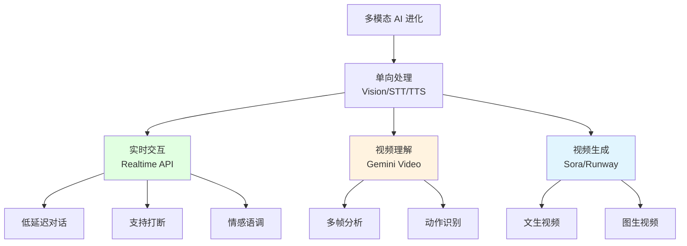

# 8.4 Video & Realtime <DifficultyBadge level="advanced" /> <CostBadge cost="$0.10" />

> 前置知识:8.1 Vision、8.3 Speech & Audio

::: tip 冷知识
Realtime API 的延迟只有 320ms,比你眨一次眼(300-400ms)还快!所以理论上,AI 的反应速度比你"眨眼之间"还快。下次吵架记得带上它当辩友。
:::

### 为什么需要它?(Problem)

**问题:需要实时交互和视频生成**

前面的技术都是"单向处理"——你问一句,等半天,AI 回一句。就像:

- **Vision**:你发图 → AI 看图 → 回复(就像"发邮件")
- **STT/TTS**:你说话 → AI 转文字 → AI 回复 → 转语音(就像"写信")

但真实场景需要**实时双向交互**(就像"打电话"):

你:"今天天气..."  
AI:"今天天气不错!要不要..."  
你(打断):"等等,我还没说完!"  
AI:"抱歉,你继续。"

**传统 STT + LLM + TTS 方式的问题:**
- 延迟高:3 个 API 串行调用,等到花儿都谢了
- 无法打断:AI 说话时你插不进去嘴(就像遇到话痨朋友)
- 没有情感:AI 说啥都是一个调,像"读课文"

**本节介绍的"黑科技":**

**场景 1:实时语音对话**

> "我需要一个语音助手,能像打电话一样对话,不是'我说完 → 你回复',而是随时打断、自然交流"

**传统 STT + LLM + TTS 方式的问题:**
- 延迟高(3 个 API 串行调用)
- 无法打断
- 不支持情感语调

**场景 2:视频内容理解**

> "分析这段 5 分钟的产品演示视频,提取关键功能点"

**传统方式:**
- 手动截图 + Vision API(费时费力)
- 提取音频 + Whisper(只有文字,丢失视觉信息)

**场景 3:视频生成**

> "根据剧本自动生成短视频"

**传统方式:**
- 需要专业视频制作团队
- 周期长、成本高

**本节介绍的技术:**
1. **OpenAI Realtime API**:实时语音对话,低延迟、支持打断
2. **Video Understanding**:AI 理解视频内容(Gemini)
3. **Video Generation**:AI 生成视频(Sora、Runway、Kling)

**一句话总结:让 AI 能实时对话、看视频、拍视频,堪称"多模态 AI 的终极形态"!** 🚀

::: warning 翻车现场
我:用 Realtime API 做语音助手,忘了加"打断检测"  
结果:AI 说了 5 分钟,我根本插不上嘴  
我:"停!停!停!"  
AI(继续说):"...综上所述..."  
教训:**没有打断机制的语音助手 = 话痨朋友,惹不起!**
:::

### 它是什么?(Concept)

**Realtime & Video 是多模态 AI 的"高级形态":**



---

## 1. OpenAI Realtime API(实时语音对话)

**OpenAI Realtime API(实时语音对话)是什么?**

OpenAI 在 2024 年底推出的实时语音对话 API,特点:
- **低延迟**:平均 320ms 响应时间(比 STT + LLM + TTS 快 10 倍)——眨眼之间就回复你
- **支持打断**:用户可以随时打断 AI 说话——终于不用被"话痨 AI"折磨了
- **情感语调**:AI 能理解和生成带情感的语音——不再是"机器人念课文"
- **WebSocket 连接**:持久化连接,实时双向通信——就像打电话一样顺畅

**一句话:Realtime API = 给 AI 装了"电话功能",让它能像真人一样对话。**

**工作原理:**

```mermaid
sequenceDiagram
    participant User as 用户
    participant App as 你的应用
    participant API as Realtime API<br/>(WebSocket)
    
    User->>App: 建立 WebSocket 连接
    App->>API: session.create
    
    loop 实时对话
        User->>App: 语音输入(流式)
        App->>API: input_audio_buffer.append
        API->>API: 实时识别<br/>+推理<br/>+生成语音
        API->>App: response.audio.delta(流式)
        App->>User: 实时播放语音
        
        Note over User,App: 用户可随时打断
        User->>App: 打断信号
        App->>API: response.cancel
        API->>API: 停止当前回复
    end
    
    style API fill:#e1ffe1
```

**关键特性:**

| 特性 | 说明 |
|-----|------|
| **低延迟** | 平均 320ms,最快 250ms |
| **流式双向** | 同时支持输入和输出流式传输 |
| **打断机制** | 用户说话时自动停止 AI 回复 |
| **多模态输入** | 支持音频 + 文本混合输入 |
| **Function Calling** | 支持实时调用工具 |
| **会话管理** | 自动管理上下文历史 |

**基础代码示例(简化版):**

::: warning 注意
Realtime API 使用 WebSocket 连接,代码较复杂。这里展示简化版概念,完整实现见 Notebook。
:::

```python
import asyncio
import websockets
import json
import base64

async def realtime_voice_assistant():
    """
    实时语音助手(简化示例)
    """
    url = "wss://api.openai.com/v1/realtime?model=gpt-4o-realtime-preview-2024-10-01"
    
    headers = {
        "Authorization": f"Bearer {OPENAI_API_KEY}",
        "OpenAI-Beta": "realtime=v1"
    }
    
    async with websockets.connect(url, extra_headers=headers) as ws:
        # 1. 配置会话
        session_config = {
            "type": "session.update",
            "session": {
                "modalities": ["text", "audio"],
                "instructions": "你是一个友好的助手",
                "voice": "alloy",
                "input_audio_format": "pcm16",
                "output_audio_format": "pcm16",
                "turn_detection": {
                    "type": "server_vad"  # 服务端语音活动检测
                }
            }
        }
        await ws.send(json.dumps(session_config))
        
        # 2. 发送音频输入
        audio_data = b"..."  # 从麦克风获取的音频数据
        audio_message = {
            "type": "input_audio_buffer.append",
            "audio": base64.b64encode(audio_data).decode()
        }
        await ws.send(json.dumps(audio_message))
        
        # 3. 接收响应
        async for message in ws:
            event = json.loads(message)
            
            if event["type"] == "response.audio.delta":
                # 实时接收音频片段
                audio_chunk = base64.b64decode(event["delta"])
                # 播放音频...
            
            elif event["type"] == "response.audio.done":
                print("回复完成")
            
            elif event["type"] == "response.text.delta":
                # 同时也有文字版本
                print(event["delta"], end="")

# 运行
asyncio.run(realtime_voice_assistant())
```

**核心概念:**

| 概念 | 说明 |
|-----|------|
| **Session** | 会话配置,包含模型、音色、指令 |
| **Turn** | 一个对话轮次(用户说话 → AI 回复) |
| **VAD** | 语音活动检测,判断用户是否在说话 |
| **Input Audio Buffer** | 输入音频缓冲区,累积用户音频 |
| **Response** | AI 的回复,包含音频和文字 |

**支持的事件类型:**

| 客户端发送 | 服务端返回 |
|-----------|----------|
| `session.update` | `session.created` |
| `input_audio_buffer.append` | `input_audio_buffer.speech_started` |
| `input_audio_buffer.commit` | `input_audio_buffer.speech_stopped` |
| `response.create` | `response.audio.delta` |
| `response.cancel` | `response.audio.done` |
| `conversation.item.create` | `response.text.delta` |

**适用场景:**

| 场景 | 为什么适合 Realtime API |
|-----|----------------------|
| **语音客服** | 低延迟、自然对话 |
| **语音助手** | 打断机制、持续交互 |
| **电话机器人** | 实时响应、情感语调 |
| **语音教学** | 互动问答、即时反馈 |
| **实时翻译** | 低延迟、流式输出 |

**成本:**

Realtime API 价格较高:
- **音频输入**:$100 / 1M tokens
- **音频输出**:$200 / 1M tokens
- **文本输入**:$5 / 1M tokens
- **文本输出**:$20 / 1M tokens

示例:1 分钟语音对话约 $0.12-0.20

**一句话总结:Realtime API 虽然贵(是普通 API 的 10-20 倍),但能实时对话,适合语音助手、电话机器人等场景。**

::: warning 翻车现场
我:用 Realtime API 做了个"AI 电话客服"  
客户:打电话来闲聊了半小时  
我(看账单):这一通电话花了 $6...  
教训:**Realtime API 按时长计费,遇到话多的客户就是"烧钱机器"!记得设置超时断开。**
:::

---

## 2. Video Understanding(视频理解)

**Gemini 2.5 Flash 支持视频理解:**

```python
# 注意:这是概念示例,实际使用需要 Google AI SDK
import google.generativeai as genai

genai.configure(api_key="YOUR_GOOGLE_API_KEY")

model = genai.GenerativeModel("gemini-2.0-flash-exp")

# 上传视频文件
video_file = genai.upload_file(path="product_demo.mp4")

# 分析视频
response = model.generate_content([
    "请分析这段视频,提取以下信息:\n"
    "1. 视频主题\n"
    "2. 出现的主要物体和场景\n"
    "3. 关键动作和事件\n"
    "4. 视频时长和节奏\n",
    video_file
])

print(response.text)
```

**视频理解能力:**

| 能力 | 说明 |
|-----|------|
| **场景识别** | 识别视频中的环境、地点 |
| **物体检测** | 识别出现的物体 |
| **动作识别** | 理解人物动作(走、跑、跳) |
| **时序分析** | 理解事件发生的先后顺序 |
| **多模态融合** | 结合视觉 + 音频信息 |

**适用场景:**

- 视频内容审核(检测违规内容)
- 智能视频摘要(5 分钟视频 → 1 分钟文字)
- 体育赛事分析(识别进球、犯规)
- 监控视频分析(异常行为检测)
- 教学视频拆解(提取知识点)

**一句话总结:Video Understanding 让 AI 能"看懂"视频,就像给它装了一双"能看动态图的眼睛"。**

::: tip 冷知识
为什么 Video Understanding 比 Vision 贵这么多?因为视频是"连续的图片",一个 10 秒的 30fps 视频 = 300 张图片!AI 要逐帧分析,计算量是 Vision 的几百倍。所以能省就省,别动不动就丢视频给 AI。
:::

---

## 3. Video Generation(视频生成)

**主流视频生成模型:**

| 模型 | 公司 | 状态 | 特点 | 价格 |
|-----|------|------|------|------|
| **Sora** | OpenAI | 内测 | 最高质量,最长 60 秒 | 未公开 |
| **Runway Gen-3** | Runway | 可用 | 商用级,5-10 秒 | $0.05/秒 |
| **Pika** | Pika Labs | 可用 | 易用,3-4 秒 | $8/月(250 视频) |
| **Kling** | 快手 | 可用 | 高质量,中文支持 | ¥0.2/秒 |

**Sora(概念,暂未公开 API):**

```python
# 假设的 API 调用方式(实际未公开)
from openai import OpenAI

client = OpenAI()

response = client.videos.generate(
    model="sora-1.0",
    prompt="一只金毛犬在海滩上奔跑,夕阳西下,4K 高清,电影级画质",
    duration=10,  # 10 秒
    resolution="1920x1080",
    fps=24
)

video_url = response.data[0].url
print(f"视频 URL: {video_url}")
```

**Runway Gen-3(实际可用):**

```python
# 使用 Runway API(需要 API Key)
import requests

api_key = "YOUR_RUNWAY_API_KEY"
url = "https://api.runwayml.com/v1/generate"

payload = {
    "model": "gen3",
    "prompt": "一只橙色的猫在键盘上打字,特写镜头,柔和光线",
    "duration": 5,
    "aspect_ratio": "16:9"
}

headers = {
    "Authorization": f"Bearer {api_key}",
    "Content-Type": "application/json"
}

response = requests.post(url, json=payload, headers=headers)
result = response.json()

print(f"任务 ID: {result['id']}")
print(f"状态: {result['status']}")
```

**视频生成的挑战:**

| 挑战 | 说明 |
|-----|------|
| **成本高** | 1 秒视频成本 $0.05-0.20(一个 10 秒视频够买一杯咖啡) |
| **时间长** | 生成 10 秒视频需要 5-10 分钟(等得你怀疑人生) |
| **可控性** | 难以精确控制细节(AI 说了算,你只能祈祷) |
| **一致性** | 多个镜头风格难以统一(前一秒晴天,后一秒下雨) |

**适用场景:**

- 广告制作(省钱省时间)
- 社交媒体短视频(15 秒以内)
- 概念演示(产品原型)
- 动画原型(测试创意)
- 教育内容(简单动画)

**一句话总结:Video Generation 能"拍视频",但成本高、时间长,目前只适合短视频和原型制作。**

::: warning 翻车现场
我:用 AI 生成一段"猫咪在键盘上打字"的视频  
AI:生成了一只猫,坐在键盘上,爪子在空中挥舞,键盘纹丝不动  
我:"这猫是在跳舞还是在打字?"  
教训:**AI 视频生成还很"蠢",复杂动作容易翻车,简单场景效果最好。**
:::

---

## 4. 综合应用案例

**案例:智能视频客服系统**

```python
import asyncio
import websockets
import json

async def video_customer_service():
    """
    视频客服:实时语音 + 屏幕共享分析
    """
    # 1. 建立 Realtime API 连接
    realtime_ws = await websockets.connect("wss://api.openai.com/v1/realtime")
    
    # 2. 配置会话
    await realtime_ws.send(json.dumps({
        "type": "session.update",
        "session": {
            "instructions": "你是一个技术支持客服,帮助用户解决软件问题",
            "voice": "nova"
        }
    }))
    
    # 3. 用户实时语音输入
    # (省略音频采集代码)
    
    # 4. 如果用户共享屏幕,发送截图分析
    screenshot_base64 = capture_screenshot()
    
    # 使用 Vision API 分析截图
    vision_response = await analyze_screenshot(screenshot_base64)
    
    # 5. 将分析结果注入对话
    await realtime_ws.send(json.dumps({
        "type": "conversation.item.create",
        "item": {
            "type": "message",
            "role": "user",
            "content": [
                {"type": "text", "text": f"我看到屏幕上显示:{vision_response}"}
            ]
        }
    }))
    
    # 6. AI 结合语音 + 视觉信息回复
    async for message in realtime_ws:
        event = json.loads(message)
        if event["type"] == "response.audio.delta":
            # 实时播放语音回复
            pass

async def analyze_screenshot(screenshot_base64):
    """分析屏幕截图"""
    from openai import OpenAI
    client = OpenAI()
    
    response = client.chat.completions.create(
        model="gpt-4.1-mini",
        messages=[{
            "role": "user",
            "content": [
                {"type": "text", "text": "这个屏幕显示了什么问题?"},
                {"type": "image_url", "image_url": {"url": f"data:image/png;base64,{screenshot_base64}"}}
            ]
        }]
    )
    
    return response.choices[0].message.content
```

### 动手试试(Practice)

::: warning 实验说明
- **Realtime API** 需要 WebSocket 编程,代码较复杂,Notebook 提供简化版
- **视频生成** API 大多处于内测或付费状态,Notebook 提供概念代码
- 本节重点是**理解技术能力和应用场景**,而非完整实现
:::

<ColabBadge path="demos/08-multimodal/realtime.ipynb" />

### 小结(Reflection)

**一句话总结:我们给 AI 装了"电话功能"、"看视频的眼睛"、"拍视频的相机",现在它几乎无所不能了!(除了做饭)**

- **解决了什么**:实时语音对话、视频理解、视频生成,多模态 AI 的最高级形态
- **没解决什么**:这些都是"用 AI",还没涉及"管理 AI"——下一章介绍 AI Agent
- **关键要点**:
  1. **Realtime API 低延迟**:平均 320ms,支持打断
  2. **WebSocket 连接**:持久化双向通信
  3. **视频理解**:Gemini 2.5 Flash 支持多帧视频分析
  4. **视频生成**:Sora(内测)、Runway(可用)、Kling(中文)
  5. **成本高**:Realtime API 是普通 API 的 10-20 倍,视频生成更贵
  6. **技术前沿**:部分功能处于实验阶段,API 可能变化
  7. **适用场景**:语音客服、实时翻译、视频内容生产

::: tip 冷知识
OpenAI 的 Sora 视频生成模型为什么一直"内测"不公开?据说是因为:
1. 成本太高,公开了会被薅羊毛
2. 怕被滥用,生成假新闻视频
3. 技术还不够稳定,容易翻车

**一句话:Sora 就像"深藏不露的武林高手",不是不出山,是时机未到。**
:::

**多模态 AI 能力总结:**

| 能力 | 输入 | 输出 | 代表技术 | 成本 |
|-----|------|------|---------|------|
| **Vision** | 图像 | 文本 | GPT-4o | 低 |
| **Image Gen** | 文本 | 图像 | DALL-E 3 | 中 |
| **STT** | 语音 | 文本 | Whisper | 低 |
| **TTS** | 文本 | 语音 | OpenAI TTS | 低 |
| **Realtime** | 语音 | 语音 | Realtime API | 高 |
| **Video** | 视频 | 文本 | Gemini 2.5 | 中 |
| **Video Gen** | 文本 | 视频 | Sora/Runway | 极高 |

**终极总结:从"只能打字"到"能看能听能说能拍",我们的 AI 终于从"文字工具"进化成了"多模态全能选手"!**

---

*最后更新:2026-02-20*
