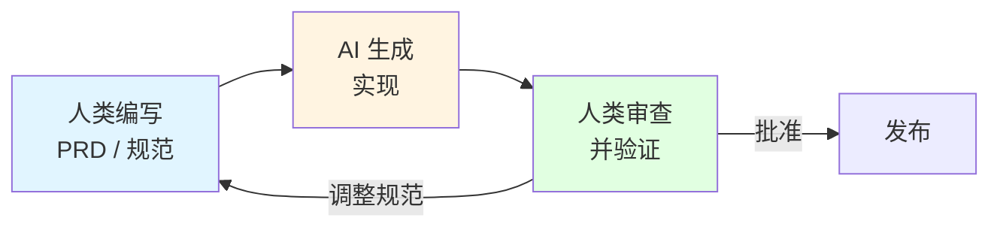

# 9.5 AI 原生开发模式

<DifficultyBadge level="intermediate" />
<CostBadge cost="$0" />

> 前置章节：9.1 代理核心概念

2026 年了，如果你还在"写代码"，可能就 out 了——因为现在流行"写规范"！AI 负责写代码，你负责告诉它"我要什么"。这就是 **AI 原生开发模式**，一种颠覆传统的开发方式。

::: tip 从码农到规划师
想象一下：
- **过去**：你是建筑工人，搬砖、砌墙、刷漆，累死累活。
- **现在**：你是建筑设计师，画图纸、定标准，AI 帮你盖房子。

AI 原生开发就是这样——你写"设计图"（规范），AI 写"代码"。
:::

### 为什么需要它？（问题）

现在是 2026 年，数据已经出来了：
- **微软 30% 的代码**由 AI 编写
- **谷歌 25%+** 的新代码是 AI 生成的
- **85% 的开发者**经常使用 AI 编码工具
- GitHub Copilot 跨越了 **2000 万用户**

然而，大多数团队仍在用"旧方式"使用 AI——像一个高级自动补全。他们没有改变开发方式，只是把 AI 作为附加组件。

::: info 灵魂拷问
如果你仍在手工编写详细的实现代码，只用 AI"建议下一行"......你是在用喷气发动机驱动自行车。如果软件开发从一开始就是为 AI 设计的，会是什么样子？
:::

::: warning 但别走极端
看到"AI 写代码"就以为自己不用学编程了？别做梦！你得懂代码才能**审查** AI 写的代码，就像你得懂建筑才能看懂设计图有没有问题。AI 不是让你偷懒，而是让你**从码农升级成架构师**。
:::

**一句话总结：** AI 原生开发 = 你写"要什么"（规范），AI 写"怎么做"（代码），你审查"对不对"。

### 它是什么？（概念）

**AI 原生开发** = 围绕 AI 能力设计整个开发工作流程，而不仅仅是在现有流程上撒点 AI。

**三个关键模式：**

#### 1. 规范驱动开发（SDD）

不是编写代码，而是编写**规范**。AI 编写代码。



**旧方式：**
```
开发者 → 写代码 → 测试 → 修 bug → 发布
```

**AI 原生方式：**
```
开发者 → 写规范 → AI 编码 → 审查 → 调整规范 → AI 修复 → 发布
```

::: tip 类比：从厨师到美食评论家
- **传统开发**：你是厨师，自己做菜（写代码）
- **AI 原生开发**：你是美食评论家，告诉 AI"我要粤菜、清淡、三个菜一个汤"（写规范），AI 做菜（写代码），你尝一口（审查），说"太咸了，改！"（调整规范）

你的角色从"做菜的"变成了"定标准的"。
:::

**一句话总结：** 规范驱动开发 = 不写 how（怎么做），只写 what（要什么）。

::: tip 趣闻
Anthropic 的 2026 年代理编码报告预测"销售、营销、法律和运营的非技术团队将能够在没有工程干预的情况下自动化工作流程和构建工具。"规范就是代码。
:::

#### 2. 目标验证协议（OVP）

Vibe Coding 的进化版。不是"提示并祈祷"，而是：

1. **定义目标**（成功是什么样子）
2. **让代理自主执行**
3. **在检查点验证**（人类批准关键决策）

```
旧：人在环中（持续监督）
新：目标验证（定义目标 → 代理执行 → 人类验证）
```

正如 IBM 的 Ismael Faro 所说："用户定义目标并验证，而代理集合自主执行。"

#### 3. AI 开发模式

一套经过实战检验的实践（来自 [ai-development-patterns](https://github.com/PaulDuvall/ai-development-patterns)）：

**问题生成模式：**
```
错误：  "修复登录页面"
错误：  "让仪表板更好"

正确： "AUTH-002: 密码验证服务
        - 文件：src/auth/validators.py, tests/test_validators.py
        - 覆盖率：95%，单元 + 集成测试
        - CI：lint、test、security-scan 必须通过
        - AI 辅助：使用 AI 进行实现和测试生成"
```

**上下文预处理模式：**
- AGENTS.md / CLAUDE.md 包含项目约定
- 架构决策记录（ADR）
- 明确的技术栈约束

**审查循环模式：**
```
AI 写代码 → 自动化测试 → AI 审查自己的代码 → 
人类审查 AI 的审查 → 合并
```

::: warning 常见误区
"AI 写的，所以一定好"— 不对。AI 生成的代码需要更多审查，而不是更少。AI 非常自信，即使它错了。它就像一个从不说"我不知道"的初级开发者。
:::

::: tip AI = 自信的实习生
AI 写代码就像一个超级自信的实习生：
- ✅ 写得快
- ✅ 不抱怨
- ❌ 有时候瞎写
- ❌ 错了也不知道

所以你得像带实习生一样——让他干活，但必须认真审查！
:::

**一句话总结：** AI 开发模式 = 让 AI 干活 + 自己审查，别盲目信任。

### AI 原生实践的现状

**有效的（2026）：**
- 规范 → CRUD / 样板代码生成（80%+ 准确率）
- AI 辅助代码审查捕获真实 bug
- 从规范生成测试
- 从代码生成文档

**仍然困难的：**
- 架构决策（AI 建议，人类决定）
- 性能优化（AI 过度工程或优化不足）
- 安全审查（AI 遗漏细微漏洞）
- 跨系统集成（AI 不了解你的基础设施）

**新的开发者技能栈：**

| 角色 | 旧方式 | AI 原生方式 |
|------|--------|-------------|
| **架构师** | 画图 → 写设计文档 | 写规范 → 审查 AI 输出 |
| **开发者** | 写代码 → 调试 → 测试 | 写规范 → 审查 AI 代码 → 引导 AI 调试 |
| **QA** | 手动测试 → 编写测试用例 | 审查 AI 生成的测试 → 专注于边缘情况 |
| **PM** | 写工单 → 等待开发 | 写规范 → AI 估算 + 实现 |

### 总结（反思）

- **我们解决了什么**：理解当开发工作流程围绕 AI 能力构建时如何变化
- **关键要点**：
  1. **规范驱动开发** = 写你想要什么，而不是如何构建
  2. **目标验证协议** = 从持续监督到基于检查点的验证
  3. **AI 开发模式** = AI 辅助工作流程的实战检验实践
  4. **审查更重要**而不是更不重要 — AI 自信但易错
  5. **开发者角色转变**从"代码编写者"到"规范编写者 + 代码审查者"

::: tip 最后的建议
AI 原生开发听起来很酷，但别一股脑全用上：
- **简单项目**：还是直接写代码快
- **复杂项目**：AI 帮你写样板代码、测试，你专注架构和业务逻辑
- **关键模块**：安全、性能相关的，自己写更靠谱

记住：**AI 是工具，不是替代品。**
:::

> *"在 2026 年，最优秀的开发者不是打字最快的人——而是规范写得最清楚的人。事实证明，真正的 10 倍工程师是那些一直以来就能解释清楚他们想要什么的人。"*

**一句话总结：** AI 原生开发 = 你当架构师（定标准），AI 当码农（写代码），但你必须会审查（懂代码）。

---

*最后更新：2026-02-22*
