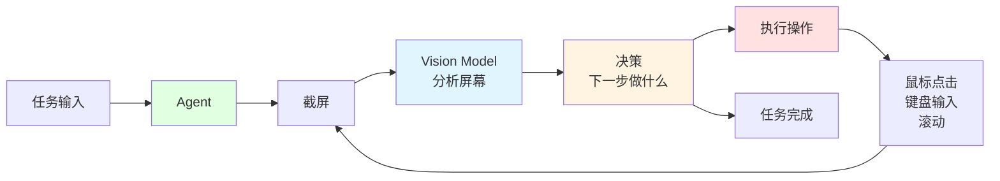
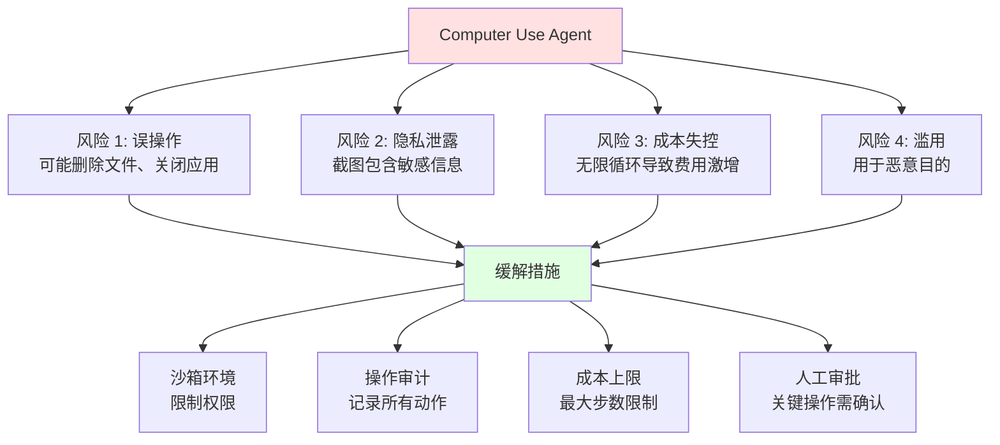

# 9.4 Computer Use <DifficultyBadge level="advanced" /> <CostBadge cost="$0.10" />

> 前置知识：9.1 Agent 核心概念

想象一下，如果 AI 不只是调 API，还能像你一样"看屏幕、点鼠标、敲键盘"——这听起来是不是有点科幻？但这就是 **Computer Use（计算机使用）**，让 AI 真的能操控电脑！

::: tip AI 也会用鼠标了
还记得《终结者》里天网控制所有电脑的场景吗？虽然没那么夸张，但 Computer Use 确实让 AI 学会了"用电脑"——它能看懂屏幕、知道按钮在哪、自己点击操作。就像给 AI 装了一双"眼睛"和一双"手"。
:::

### 为什么需要它？（Problem）

到目前为止，我们的 Agent 只能调用 API 和函数——但人类工作时，很多操作是**通过界面完成的**。

**传统 Agent 的局限：**

```python
# Agent 能做的：
- 调用天气 API ✅
- 查询数据库 ✅
- 执行 Python 代码 ✅

# Agent 不能做的：
- 打开浏览器搜索信息 ❌
- 填写网页表单 ❌
- 点击按钮下载文件 ❌
- 操作桌面应用 ❌
```

**真实场景的挑战：**

**场景 1：市场调研**

任务："去竞品网站看看他们的定价策略"

```
传统方式：
1. 需要为每个网站写爬虫 → 成本高
2. 网站更新就失效 → 维护难
3. 反爬虫机制 → 成功率低

理想方式：
Agent 自己打开浏览器，像人一样浏览网页、点击、截图
```

**场景 2：自动化办公**

任务："帮我整理收件箱，将重要邮件标记为星标"

```
传统方式：
需要邮件服务商提供 API → 不是所有服务都有 API

理想方式：
Agent 打开邮件客户端，像人一样点击、拖拽、标记
```

**场景 3：软件测试**

任务："测试这个网页的登录流程"

```
传统方式：
Selenium 脚本 → 需要写代码，维护复杂

理想方式：
告诉 Agent "测试登录功能"，它自己操作浏览器完成测试
```

**核心问题：如何让 AI 像人一样操控电脑？**

这就是 **Computer Use（计算机使用）** 要解决的问题。

::: warning 别激动太早
Computer Use 听起来很酷，但它慢（每个操作 2-5 秒）、贵（每次都要截图 + Vision Model）、还不太稳定。所以别指望它能帮你打游戏或者剪视频——它更适合**简单重复的任务**，比如填表单、点按钮、截图。
:::

**一句话总结：** Computer Use = 给 AI 装上眼睛（看屏幕）和手（操控鼠标键盘）。

### 它是什么？（Concept）

**Computer Use 是什么？**

Computer Use 让 AI Agent 能够：
1. **看屏幕**：通过截图"看到"屏幕内容
2. **做决策**：分析屏幕，决定下一步操作
3. **控制电脑**：鼠标点击、键盘输入、滚动页面

::: tip 类比：AI 实习生在用你的电脑
想象你雇了一个实习生，但他在远程办公，只能通过截图看你的屏幕，然后告诉你"点这里、输入那个"。Computer Use 就是这样，只不过 AI 能直接操控，不用你动手。
:::

**一句话总结：** Computer Use = AI 看截图 → 决定点哪 → 执行操作 → 再截图看结果 → 循环。



**工作原理：**

```
1. 截屏 → 2. AI 分析 → 3. 生成操作指令 → 4. 执行 → 5. 再截屏 → 循环...
```

**两大实现方案：**

### 1. Anthropic Computer Use

**特点：**
- 首个公开的 Computer Use API（2024 年 10 月）
- 基于 Claude Sonnet 4.6
- 提供完整的 Docker 环境

**API 示例：**

```python
import anthropic

client = anthropic.Anthropic()

# 启用 Computer Use
response = client.messages.create(
    model="claude-3-5-sonnet-20241022",
    max_tokens=1024,
    tools=[
        {
            "type": "computer_20241022",
            "name": "computer",
            "display_width_px": 1920,
            "display_height_px": 1080,
        }
    ],
    messages=[
        {
            "role": "user",
            "content": "Go to google.com and search for 'Anthropic AI'"
        }
    ],
)
```

**支持的操作：**

| 操作类型 | 说明 | 示例 |
|---------|------|------|
| **key** | 按键 | `{"type": "key", "text": "Enter"}` |
| **type** | 输入文本 | `{"type": "type", "text": "Hello"}` |
| **mouse_move** | 移动鼠标 | `{"type": "mouse_move", "coordinate": [100, 200]}` |
| **left_click** | 左键点击 | `{"type": "left_click"}` |
| **left_click_drag** | 拖拽 | `{"type": "left_click_drag", "coordinate": [300, 400]}` |
| **screenshot** | 截屏 | `{"type": "screenshot"}` |

### 2. OpenAI Computer Use

**特点：**
- 2025 年 1 月发布
- 基于 GPT-4o
- 更简洁的 API 设计

**API 示例：**

```python
from openai import OpenAI

client = OpenAI()

# 创建支持 Computer Use 的 Agent
agent = client.beta.assistants.create(
    model="gpt-4.1",
    tools=[{"type": "computer_use"}],
    instructions="You can control the computer to complete tasks."
)

# 运行任务
thread = client.beta.threads.create()
client.beta.threads.messages.create(
    thread_id=thread.id,
    role="user",
    content="Open Chrome and search for OpenAI"
)

run = client.beta.threads.runs.create(
    thread_id=thread.id,
    assistant_id=agent.id
)
```

**对比：Anthropic vs OpenAI**

| 对比项 | Anthropic Computer Use | OpenAI Computer Use |
|-------|------------------------|---------------------|
| **发布时间** | 2024 年 10 月 | 2025 年 1 月 |
| **模型** | Claude Sonnet 4.6 | GPT-4o |
| **API 复杂度** | 较复杂（需要手动处理截图） | 简洁（自动处理） |
| **环境** | 提供 Docker 镜像 | 云端托管 |
| **定价** | 按 token 计费 + 截图成本 | 按操作计费 |
| **可用性** | 公开测试 | 私有测试 |
| **适合场景** | 研究、复杂任务 | 生产、简单任务 |

**Computer Use 的能力边界**

✅ **擅长的任务：**
1. **网页操作**：搜索、填表、点击
2. **浏览和导航**：查找信息、截图
3. **简单的桌面操作**：打开应用、复制粘贴
4. **视觉识别**：识别按钮、输入框位置

❌ **不擅长的任务：**
1. **复杂交互**：游戏、视频编辑
2. **实时性任务**：每个操作需要 2-5 秒
3. **精确操作**：像素级定位不稳定
4. **隐私操作**：不应用于处理敏感信息

**安全和隐私考虑**



**最佳实践：**

1. **使用沙箱环境**
   - Docker 容器或虚拟机
   - 限制网络访问和文件权限

2. **操作前确认**
   - 关键操作（如删除文件）需人工确认
   - 显示操作预览

3. **成本控制**
   - 设置最大步数（如 50 步）
   - 监控 token 使用

4. **隐私保护**
   - 截图自动模糊敏感信息
   - 不在生产数据上测试

### 动手试试（Practice）

由于 Computer Use 需要特殊环境，我们这里展示**概念性代码**和**设置流程**。

**Anthropic Computer Use 完整示例**

**第 1 步：启动 Docker 环境**

```bash
# 下载官方 Docker 镜像
docker pull anthropic/computer-use-demo

# 运行容器
docker run -p 5900:5900 -p 6080:6080 anthropic/computer-use-demo
```

**第 2 步：编写控制脚本**

```python
import anthropic
import base64
import os
from anthropic.types.beta import BetaToolComputerUse20241022Param

client = anthropic.Anthropic(api_key=os.environ.get("ANTHROPIC_API_KEY"))

def computer_use_agent(task: str, max_steps: int = 20):
    """
    Computer Use Agent 主循环
    """
    messages = [
        {
            "role": "user",
            "content": task,
        }
    ]
    
    # 定义 Computer Use 工具
    tools = [
        {
            "type": "computer_20241022",
            "name": "computer",
            "display_width_px": 1920,
            "display_height_px": 1080,
            "display_number": 1,
        }
    ]
    
    print(f"Task: {task}\n")
    print("=" * 80)
    
    for step in range(1, max_steps + 1):
        print(f"\nStep {step}:")
        
        # 调用 Claude
        response = client.messages.create(
            model="claude-3-5-sonnet-20241022",
            max_tokens=1024,
            tools=tools,
            messages=messages,
        )
        
        print(f"Stop reason: {response.stop_reason}")
        
        # 完成
        if response.stop_reason == "end_turn":
            final_text = next(
                (block.text for block in response.content if hasattr(block, "text")),
                "Task completed"
            )
            print(f"\nFinal answer: {final_text}")
            return final_text
        
        # 需要执行工具
        if response.stop_reason == "tool_use":
            # 添加 Assistant 消息
            messages.append({"role": "assistant", "content": response.content})
            
            tool_results = []
            
            for block in response.content:
                if block.type == "tool_use":
                    print(f"  Tool: {block.name}")
                    print(f"  Action: {block.input.get('action')}")
                    
                    # 这里是伪代码，实际需要连接到 Docker 容器
                    # 执行操作并获取截图
                    result = execute_computer_action(block.input)
                    
                    tool_results.append({
                        "type": "tool_result",
                        "tool_use_id": block.id,
                        "content": result,
                    })
            
            # 添加工具结果
            messages.append({"role": "user", "content": tool_results})
    
    return "Max steps reached"

def execute_computer_action(action_input: dict) -> str:
    """
    执行计算机操作（伪代码）
    实际实现需要连接到 Docker 容器的 VNC
    """
    action_type = action_input.get("action")
    
    if action_type == "screenshot":
        # 截图并返回 base64
        screenshot_base64 = take_screenshot()
        return f"data:image/png;base64,{screenshot_base64}"
    
    elif action_type == "mouse_move":
        coordinate = action_input.get("coordinate")
        move_mouse(coordinate[0], coordinate[1])
        return "Mouse moved"
    
    elif action_type == "left_click":
        click_mouse()
        return "Clicked"
    
    elif action_type == "type":
        text = action_input.get("text")
        type_text(text)
        return f"Typed: {text}"
    
    elif action_type == "key":
        key = action_input.get("text")
        press_key(key)
        return f"Pressed: {key}"
    
    return "Unknown action"
```

**第 3 步：运行任务**

```python
# 示例任务 1：网页搜索
result1 = computer_use_agent(
    "Open Chrome, go to google.com, and search for 'Anthropic AI'. Take a screenshot of the results."
)

# 示例任务 2：填写表单
result2 = computer_use_agent(
    "Go to example.com/contact, fill in the name 'John Doe' and email 'john@example.com', then click Submit."
)

# 示例任务 3：文件操作
result3 = computer_use_agent(
    "Open the file 'data.csv' in the Downloads folder and tell me how many rows it has."
)
```

**OpenAI Computer Use 示例（简化）**

```python
from openai import OpenAI

client = OpenAI()

def openai_computer_use(task: str):
    """
    OpenAI Computer Use（概念代码）
    """
    # 创建 Agent
    agent = client.beta.assistants.create(
        model="gpt-4.1",
        tools=[{"type": "computer_use"}],
        instructions="""You can control the computer to complete tasks.
        
Available actions:
- Click on UI elements
- Type text
- Press keys
- Take screenshots
- Navigate web pages

Always explain what you're doing and why."""
    )
    
    # 创建线程
    thread = client.beta.threads.create()
    
    # 发送任务
    client.beta.threads.messages.create(
        thread_id=thread.id,
        role="user",
        content=task
    )
    
    # 运行
    run = client.beta.threads.runs.create(
        thread_id=thread.id,
        assistant_id=agent.id
    )
    
    # 等待完成（实际需要轮询）
    # ...
    
    return "Task completed"
```

**Computer Use 的现实应用**

| 领域 | 应用 | 价值 |
|-----|------|------|
| **测试自动化** | UI 测试、回归测试 | 减少 90% 测试脚本维护成本 |
| **数据采集** | 网页数据提取 | 无需写爬虫代码 |
| **办公自动化** | 邮件整理、表格填写 | 节省重复劳动 |
| **客服培训** | 模拟客户操作 | 自动生成培训案例 |
| **竞品分析** | 监控竞品网站 | 实时市场洞察 |

**局限性和未来**

**当前局限：**
1. **速度慢**：每个操作 2-5 秒
2. **成本高**：截图 + Vision Model 成本较高
3. **不稳定**：UI 变化可能导致失败
4. **安全风险**：需要沙箱环境

**未来方向：**
1. **更快的推理**：实时操作
2. **更准确的定位**：像素级精度
3. **更好的理解**：理解复杂 UI
4. **多模态融合**：结合 OCR、语音

<ColabBadge path="demos/09-ai-agents/computer_use.ipynb" />

### 小结（Reflection）

- **解决了什么**：理解了 Computer Use 的原理和应用场景，知道如何让 AI 操控电脑
- **没解决什么**：单个 Agent 能力有限——下一章介绍多 Agent 协作
- **关键要点**：
  1. **Computer Use 让 AI 像人一样操控电脑**：看屏幕、点鼠标、敲键盘
  2. **工作原理**：截屏 → Vision Model 分析 → 生成操作 → 执行 → 循环
  3. **两大方案**：Anthropic（先行者）、OpenAI（更简洁）
  4. **适合场景**：网页操作、自动化测试、数据采集
  5. **安全第一**：必须在沙箱环境中使用，设置操作上限

**能力篇检查点 ✅**

到此为止，你已经掌握了 AI 的核心能力：
- ✅ 第 7 章：Function Calling - 让 AI 使用工具
- ✅ 第 8 章：Structured Outputs - 让 AI 输出结构化数据
- ✅ 第 9 章：AI Agent - 让 AI 自主推理和行动
  - 9.1 Agent 核心概念
  - 9.2 ReAct 模式
  - 9.3 Agent 框架
  - 9.4 Computer Use

**下一步：第 10 章 - Multi-Agent（多 Agent 协作）**

单个 Agent 处理复杂任务时会"顾此失彼"，多个 Agent 协作才能解决系统级问题。

---

*最后更新：2026-02-20*
