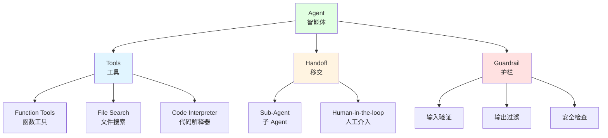

# 9.3 Agent 框架实战 <DifficultyBadge level="advanced" /> <CostBadge cost="$0.05" />

> 前置知识：9.2 ReAct 模式

### 为什么需要它？（Problem）

::: tip 运行环境
本节代码需要安装：
```bash
pip install openai python-dotenv
```
如果想尝试 LangGraph：
```bash
pip install langgraph langchain-openai
```
:::

上一节我们手写了一个 ReAct Agent，虽然能工作，但有很多问题：

**问题 1：代码量大，易出错**
```python
# 手写 Agent 需要处理的细节：
- 构建提示词模板
- 解析 Action 格式（正则表达式）
- 工具注册和调用
- 错误处理
- 对话历史管理
- Token 统计
- 超时控制
# 总共 ~150 行代码，容易出 bug
```

**问题 2：缺少高级特性**
- ❌ 没有长期记忆
- ❌ 不支持多轮对话
- ❌ 没有流式输出
- ❌ 无法集成向量数据库
- ❌ 不支持多 Agent 协作

**问题 3：维护成本高**
- 每次 OpenAI 更新 API，需要手动适配
- 添加新工具需要修改多处代码
- 难以复用和分享

**我们需要一个成熟的框架，专注业务逻辑，而不是底层实现。**

### 它是什么？（Concept）

**主流 Agent 框架对比（2026 版）**

**🏆 Tier 1：生产级王者**

| 框架 | 开发者 | 版本 | 核心优势 | 劣势 | 适合场景 |
|-----|--------|------|---------|------|---------|
| **LangGraph** | LangChain | v0.2+ | 状态图建模最成熟、可视化调试、精确流程控制 | 学习曲线陡峭、代码较复杂 | 复杂流程、多步推理、需要精确控制 |
| **OpenAI Agents SDK** | OpenAI | v2.0+ | 官方框架、Handoff 原语、内置 Guardrails、稳定 | 仅支持 OpenAI 模型、灵活性较低 | 生产环境、简单到中等复杂度 Agent |

**🚀 Tier 2：快速崛起**

| 框架 | 开发者 | 版本 | 核心优势 | 劣势 | 适合场景 |
|-----|--------|------|---------|------|---------|
| **CrewAI** | CrewAI | v2.0+ | 基于角色的多 Agent、最容易上手、协作模式直观 | 灵活性有限、黑盒抽象较多 | 多 Agent 协作、快速原型 |
| **Anthropic Claude Tool Use** | Anthropic | Native | 原生工具调用、Claude Opus 4 擅长 Agentic 任务 | 框架功能较少、需自己封装 | Claude 用户、需要顶级推理能力 |
| **AutoGen 0.4** | Microsoft | v0.4+ | 完全重写、async-first、性能大幅提升 | 生态迁移中、文档更新慢 | 异步场景、多 Agent 对话 |

**🔧 Tier 3：垂直专精**

| 框架 | 开发者 | 版本 | 核心优势 | 劣势 | 适合场景 |
|-----|--------|------|---------|------|---------|
| **Semantic Kernel** | Microsoft | v1.5+ | 企业级、支持 .NET/Java、插件生态 | Python 支持较弱、微软生态绑定 | 企业 .NET/Java 项目 |
| **Haystack** | deepset | v2.0+ | RAG 专精、检索管道强大、文档处理优秀 | 非 RAG 场景不适合 | RAG 应用、文档问答系统 |
| **DSPy** | Stanford | v2.5+ | 声明式编程、自动优化提示词、学术前沿 | 抽象层高、调试困难、生产案例少 | 研究实验、提示词优化 |

**2026 框架选型建议**

🥇 **首选 LangGraph**（生产环境第一选择）
- 最成熟的状态图建模框架
- 精确控制执行流程，适合复杂业务逻辑
- 可视化调试工具完善
- 社区最活跃，案例最多

🥈 **次选 OpenAI Agents SDK**（快速开发首选）
- 官方支持，稳定可靠
- API 设计简洁，15 分钟上手
- 内置 Handoff 和 Guardrails
- 适合简单到中等复杂度场景

**本节重点学习：OpenAI Agents SDK**

为什么先学 OpenAI SDK？
1. **学习曲线友好**：适合入门，理解 Agent 核心概念
2. **快速见效**：15 行代码就能跑起来
3. **官方维护**：OpenAI 官方支持，稳定可靠
4. **打好基础**：学会后再学 LangGraph 会更容易

**OpenAI Agents SDK 核心概念**



**1. Agent（智能体）**

Agent 是核心执行单元，包含：
- **Instructions（指令）**：Agent 的"人设"和行为准则
- **Model（模型）**：使用的 LLM 模型
- **Tools（工具）**：可调用的功能

```python
from openai import OpenAI

client = OpenAI()

agent = client.beta.assistants.create(
    name="Math Tutor",
    instructions="You are a helpful math tutor. Use the calculator when needed.",
    model="gpt-4o",
    tools=[{"type": "code_interpreter"}],
)
```

**2. Tools（工具）**

三类工具：

**a) Function Tools（函数工具）**
- 自定义 Python 函数
- 与 Function Calling 相同

```python
tools = [
    {
        "type": "function",
        "function": {
            "name": "get_weather",
            "description": "Get current weather in a location",
            "parameters": {
                "type": "object",
                "properties": {
                    "location": {"type": "string"},
                },
                "required": ["location"],
            },
        },
    }
]
```

**b) File Search（文件搜索）**
- 上传文档，Agent 自动检索
- 内置向量数据库

```python
tools = [{"type": "file_search"}]

# 上传文件
file = client.files.create(
    file=open("document.pdf", "rb"),
    purpose="assistants",
)
```

**c) Code Interpreter（代码解释器）**
- Agent 可以写代码并执行
- 适合数据分析、可视化

```python
tools = [{"type": "code_interpreter"}]
```

**3. Handoff（移交）**

当任务超出当前 Agent 能力时，移交给其他 Agent 或人类。

```python
# 主 Agent 可以移交给专业 Agent
main_agent = create_agent(
    name="Receptionist",
    handoffs=["billing_agent", "tech_support_agent"]
)
```

**4. Guardrail（护栏）**

安全检查和限制：
- 输入验证（防止注入攻击）
- 输出过滤（防止敏感信息泄露）
- 成本控制（限制 token 使用）

**OpenAI Agents SDK vs 手写 Agent**

| 对比项 | 手写 Agent | OpenAI Agents SDK |
|-------|-----------|-------------------|
| 代码量 | ~150 行 | ~15 行 |
| 错误处理 | 手动实现 | 自动处理 |
| 对话历史 | 手动管理 | 自动管理 |
| 工具注册 | 字典映射 | 声明式配置 |
| 流式输出 | 需手动实现 | 原生支持 |
| 多轮对话 | 需手动实现 | 原生支持 |
| 文件处理 | 需手动实现 | 内置支持 |
| 部署 | 需自建服务 | 云端托管 |

### 动手试试（Practice）

我们用 OpenAI Agents SDK 重写之前的 ReAct Agent。

**第 1 步：创建 Agent**

```python
import os
from openai import OpenAI

client = OpenAI()

# 定义工具
tools = [
    {
        "type": "function",
        "function": {
            "name": "calculator",
            "description": "Calculate a mathematical expression",
            "parameters": {
                "type": "object",
                "properties": {
                    "expression": {
                        "type": "string",
                        "description": "Mathematical expression to evaluate, e.g. '2 + 2' or '(123 + 456) * 789'",
                    }
                },
                "required": ["expression"],
            },
        },
    },
    {
        "type": "function",
        "function": {
            "name": "search",
            "description": "Search Wikipedia for information",
            "parameters": {
                "type": "object",
                "properties": {
                    "query": {
                        "type": "string",
                        "description": "Search query",
                    }
                },
                "required": ["query"],
            },
        },
    },
]

# 创建 Agent
agent = client.beta.assistants.create(
    name="Research Assistant",
    instructions="""You are a helpful research assistant.
    
When asked a question:
1. Break it down into steps
2. Use the calculator tool for math problems
3. Use the search tool to find factual information
4. Provide clear, well-reasoned answers

Always explain your reasoning process.""",
    model="gpt-4o",
    tools=tools,
)

print(f"Agent created: {agent.id}")
```

**第 2 步：实现工具函数**

```python
import requests

def calculator(expression: str) -> str:
    """计算数学表达式"""
    try:
        result = eval(expression, {"__builtins__": {}}, {})
        return str(result)
    except Exception as e:
        return f"Error: {str(e)}"

def search(query: str) -> str:
    """搜索维基百科"""
    try:
        url = f"https://en.wikipedia.org/api/rest_v1/page/summary/{query}"
        response = requests.get(url)
        if response.status_code == 200:
            data = response.json()
            return data.get("extract", "No summary found")
        return "Not found"
    except Exception as e:
        return f"Error: {str(e)}"

# 工具映射
TOOL_MAP = {
    "calculator": calculator,
    "search": search,
}
```

**第 3 步：运行 Agent**

```python
def run_agent(agent_id: str, user_message: str, verbose: bool = True):
    """
    运行 Agent 并处理工具调用
    """
    # 创建对话线程
    thread = client.beta.threads.create()
    
    # 添加用户消息
    client.beta.threads.messages.create(
        thread_id=thread.id,
        role="user",
        content=user_message,
    )
    
    if verbose:
        print(f"\n{'='*80}")
        print(f"User: {user_message}")
        print(f"{'='*80}\n")
    
    # 运行 Agent
    run = client.beta.threads.runs.create(
        thread_id=thread.id,
        assistant_id=agent_id,
    )
    
    # 轮询直到完成
    while True:
        run_status = client.beta.threads.runs.retrieve(
            thread_id=thread.id,
            run_id=run.id,
        )
        
        if verbose:
            print(f"Status: {run_status.status}")
        
        # 需要执行工具
        if run_status.status == "requires_action":
            tool_calls = run_status.required_action.submit_tool_outputs.tool_calls
            tool_outputs = []
            
            for tool_call in tool_calls:
                function_name = tool_call.function.name
                function_args = eval(tool_call.function.arguments)
                
                if verbose:
                    print(f"\n🔧 Calling: {function_name}({function_args})")
                
                # 执行工具
                result = TOOL_MAP[function_name](**function_args)
                
                if verbose:
                    print(f"📊 Result: {result}")
                
                tool_outputs.append({
                    "tool_call_id": tool_call.id,
                    "output": result,
                })
            
            # 提交工具输出
            client.beta.threads.runs.submit_tool_outputs(
                thread_id=thread.id,
                run_id=run.id,
                tool_outputs=tool_outputs,
            )
        
        # 完成
        elif run_status.status == "completed":
            break
        
        # 失败
        elif run_status.status in ["failed", "cancelled", "expired"]:
            print(f"❌ Run {run_status.status}")
            return None
        
        # 等待
        import time
        time.sleep(1)
    
    # 获取最终回答
    messages = client.beta.threads.messages.list(thread_id=thread.id)
    final_message = messages.data[0].content[0].text.value
    
    if verbose:
        print(f"\n{'='*80}")
        print(f"Assistant: {final_message}")
        print(f"{'='*80}\n")
    
    return final_message
```

**第 4 步：测试 Agent**

```python
# 测试 1：需要计算
result1 = run_agent(
    agent.id,
    "What is (123 + 456) * 789?"
)

# 测试 2：需要搜索
result2 = run_agent(
    agent.id,
    "Who created the Python programming language?"
)

# 测试 3：需要多步推理
result3 = run_agent(
    agent.id,
    "What is the population of the birthplace of Python's creator?"
)
```

**运行结果：**

```
================================================================================
User: What is the population of the birthplace of Python's creator?
================================================================================

Status: in_progress

🔧 Calling: search({'query': 'Python creator'})
📊 Result: Python was created by Guido van Rossum in 1991.

Status: in_progress

🔧 Calling: search({'query': 'Guido van Rossum birthplace'})
📊 Result: Guido van Rossum was born in Haarlem, Netherlands.

Status: in_progress

🔧 Calling: search({'query': 'Haarlem Netherlands population'})
📊 Result: As of 2023, Haarlem has a population of approximately 162,000.

Status: completed

================================================================================
Assistant: The creator of Python is Guido van Rossum, who was born in Haarlem, Netherlands. 
The population of Haarlem is approximately 162,000 as of 2023.
================================================================================
```

**第 5 步：添加流式输出**

```python
def run_agent_streaming(agent_id: str, user_message: str):
    """
    支持流式输出的 Agent
    """
    thread = client.beta.threads.create()
    
    client.beta.threads.messages.create(
        thread_id=thread.id,
        role="user",
        content=user_message,
    )
    
    # 流式运行
    with client.beta.threads.runs.stream(
        thread_id=thread.id,
        assistant_id=agent_id,
    ) as stream:
        for event in stream:
            # 文本输出
            if event.event == "thread.message.delta":
                delta = event.data.delta.content[0].text.value
                print(delta, end="", flush=True)
            
            # 工具调用
            elif event.event == "thread.run.requires_action":
                # 处理工具调用...
                pass
    
    print()  # 换行
```

**与 LangGraph 的对比**

让我们用 LangGraph 实现同样的功能，对比一下：

```python
from langgraph.graph import StateGraph, END
from langgraph.prebuilt import ToolNode

# 定义状态
class AgentState(TypedDict):
    messages: list
    
# 定义工具节点
tool_node = ToolNode(tools=[calculator, search])

# 构建图
workflow = StateGraph(AgentState)

# 添加节点
workflow.add_node("agent", call_model)
workflow.add_node("tools", tool_node)

# 添加边
workflow.add_edge("agent", "tools")
workflow.add_conditional_edges(
    "tools",
    should_continue,
    {
        "continue": "agent",
        "end": END,
    },
)

# 编译
app = workflow.compile()

# 运行
result = app.invoke({"messages": [("user", "Your question")]})
```

**框架对比总结（2026 版）：**

| 特性 | OpenAI Agents SDK | LangGraph | CrewAI |
|-----|-------------------|-----------|--------|
| 代码量 | ⭐⭐⭐ 极少（~15 行） | ⭐⭐ 中等（~50 行） | ⭐⭐⭐ 少（~30 行） |
| 学习曲线 | ⭐⭐⭐ 最简单 | ⭐ 较陡峭 | ⭐⭐⭐ 简单 |
| 灵活性 | ⭐⭐ 中等 | ⭐⭐⭐ 极高 | ⭐⭐ 中等 |
| 可视化 | ⭐ 无 | ⭐⭐⭐ 优秀 | ⭐⭐ 基础 |
| 流程控制 | ⭐⭐ 自动 | ⭐⭐⭐ 精确 | ⭐⭐ 自动 |
| 生产就绪 | ⭐⭐⭐ 是 | ⭐⭐⭐ 是（2026） | ⭐⭐ 接近 |
| 多 Agent | ⭐⭐ Handoff | ⭐⭐⭐ 原生支持 | ⭐⭐⭐ 专精 |
| 社区生态 | ⭐⭐ 官方 | ⭐⭐⭐ 最活跃 | ⭐⭐ 快速增长 |

**2026 选择建议：**

✅ **选择 LangGraph 当：**
- 复杂的业务流程和条件分支
- 需要精确控制每一步执行
- 需要可视化调试和监控
- 生产环境的关键业务（首选！）
- 多 LLM 支持

✅ **选择 OpenAI Agents SDK 当：**
- 快速原型和 MVP
- 简单到中等复杂度的 Agent
- 团队对 AI 不太熟悉
- 主要使用 GPT 模型
- 需要快速开发和部署

✅ **选择 CrewAI 当：**
- 多个 Agent 角色协作
- 需要最快上手（几分钟即可）
- 模拟团队工作流程
- 教学和演示场景

<ColabBadge path="demos/09-ai-agents/frameworks.ipynb" />

### 小结（Reflection）

- **解决了什么**：从手写 150 行代码到用框架 15 行代码，效率提升 10 倍
- **没解决什么**：Agent 还只能调用 API，不能像人一样操作电脑——下一节介绍 Computer Use
- **关键要点**：
  1. **2026 框架格局**：LangGraph 成为生产环境首选，OpenAI SDK 适合快速开发
  2. **三大梯队**：Tier 1（生产级）、Tier 2（快速崛起）、Tier 3（垂直专精）
  3. **OpenAI SDK 核心**：Function Tools、File Search、Code Interpreter
  4. **LangGraph 优势**：状态图建模、精确控制、可视化调试
  5. **Handoff 支持协作**：Agent 可以移交任务给其他 Agent
  6. **选框架看需求**：简单任务用 OpenAI SDK，复杂流程用 LangGraph，多角色用 CrewAI

**框架不是银弹：**
- 理解底层原理（ReAct）才能用好框架
- 框架有学习成本和抽象开销
- 简单任务可能不需要框架
- AutoGen 0.4 异步重写值得关注
- Claude Opus 4 在 Agentic 任务上表现出色

**2026 趋势：**
- LangGraph 地位进一步巩固
- 原生工具调用（Claude、Gemini）成熟
- 多 Agent 协作成为标配
- RAG 与 Agent 深度融合（Haystack）
- 声明式编程探索（DSPy）

---

*最后更新：2026-02-22*
